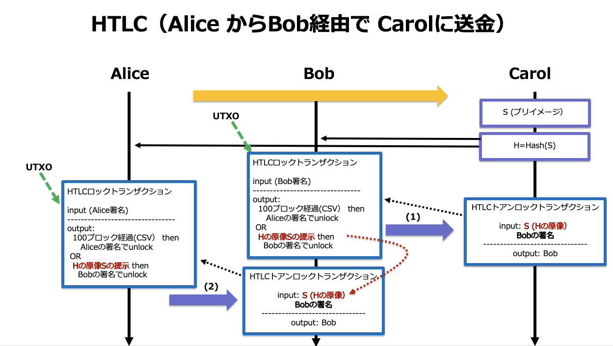

# HTLCの作成
2021/11/20


## Alice からBobに送金する


## Alice からBob経由で Calolに送金する




### redeem script (一般化したロックスクリプト)

注意!:　(`OP_CSV`は，初期のビットコインスクリプトの仕様ではリザーブされていたオペコードを使用しているので，旧仕様のノードにリジェクトされないように `OP_DROP`でスタックから取り除いています)

```
OP_IF
    OP_SHA256 <Sのハッシュ値> OP_EQUALVERIFY 
    <Bobの公開鍵>
OP_ELSE
    <ロックするブロック数> OP_CSV 
    OP_DROP  
    <Aliceの公開鍵>
OP_ENDIF
OP_CHECKSIG
```

### unlocking script (Bobによるアンロックの場合）

```
<Bobの署名> 
<S> 
OP_1
```

### unlocking script と redeem scriptの連接結果 (witness)

```
<Bobの署名> 
<S> 
OP_1
------------連接--------------
OP_IF
    OP_SHA256 <Sのハッシュ値> OP_EQUALVERIFY 
    <Bobの公開鍵>
OP_ELSE
    <ロックするブロック数> OP_CSV 
    OP_DROP  
    <Aliceの公開鍵>
OP_ENDIF
OP_CHECKSIG
```

1. スタックに， `<Bobの署名>` ，`<S>`，`OP_1`　が順に積まれます
2. `OP_1`(true) が適用され，`OP_IF` 側の処理が実行されます
3. `<S>` の`OP_SHA256` の結果と `<Sのハッシュ値>` が`OP_EQUALVERIFY` で比較されます
4. 等しければ，Bobの公開鍵による Bobの署名が検証され，成功すればロックが解除されます


### AliceとBobのアドレスを生成する

AliceとBobは異なるワレットで操作するとよいでしょう

```
bitcoin-core.cli getnewaddress Alice
tb1q92v4dxsz47zxs5rdu42q7nl4xsdlncmvswxr5f
```

```
bitcoin-core.cli getnewaddress Bob
tb1q9vml26m9vgm5nk3fk9v7cfkad7tlfgsgnahkfu
```

### AliceとBobの秘密鍵

```
bitcoin-core.cli dumpprivkey tb1q92v4dxsz47zxs5rdu42q7nl4xsdlncmvswxr5f
cVkvmDQ2TvRg1L1eLCfoAhYZpWAiaJyesyF2owMA9kUJj6mczJQP
```

```
bitcoin-core.cli dumpprivkey tb1q9vml26m9vgm5nk3fk9v7cfkad7tlfgsgnahkfu
cUpy2Z19AC22MnGLNBfrNMZqrbz7v7rtL9UByzMoxqGC4v9SKtFf
```

### AliceのUTXOの確認

Alice に 0.1 btc 送金する

```bash
bitcoin-core.cli send '{"tb1q92v4dxsz47zxs5rdu42q7nl4xsdlncmvswxr5f": 0.1}'

{
  "txid": "243f497b5452d0810522cdc53d36b9f1f99bbe4ff07c5d6d12bb5ff1760e8817",
  "complete": true
}

bitcoin-core.cli getrawtransaction 243f497b5452d0810522cdc53d36b9f1f99bbe4ff07c5d6d12bb5ff1760e8817

02000000000102e2963966f127b78006fb67a5a8b9d1662b3086c3b916c52ec9e141cb6cf94adc0100000000feffffffa1565e6097789c42843cf4b0eafaa6480542828daa34d8218bad6311250307ca0100000000feffffff02d2ab680000000000160014661fe0da3bea105d7f934ca978437b8a190bfeb280969800000000001600142a99569a02af8468506de5540f4ff5341bf9e36c0247304402200a42ca1de97830a203e2da163a08f04fab83d4c982789d32f3cb85115532b26e022005d42b3fe00ae0dec31d35c200d55df23cd91997503a2237b2cabe89794a1bf4012103760b5a28bb264ca5b310d766ad3a095c9f866fe9a0b38b8079ca350c6a3e334702473044022019298d970a2414ed153ea132f903119f11e5a473a3a444ee21d330018bc5186b022069f3db1f33d566425b7549c056a87a8c23dbf419ce6e25d01b8dbe6a6b6f03db012103760b5a28bb264ca5b310d766ad3a095c9f866fe9a0b38b8079ca350c6a3e334700000000

```

## bitcoinrb を使ったバイナリデータの処理

### OpenSSL::BNクラス

OpenSSL内で利用される暗号学的に利用される多倍長整数クラスです。
通常の通常多倍長整数の計算ではInteger クラスを使えばよいです。

ハッシュ値などのデータはOpenSSL::BNクラスのオブジェクトになります。

```ruby
# 10進数
2**18
=> 262144

# 16進数に変換
(2**18).to_s(16)
=> "40000"

# 整数とBNクラスに変換
(2**18).to_bn
=> #<OpenSSL::BN 262144>

# BNクラスのオブジェクトを ビッグエンディアンの符号無し整数のバイナリ列に変換
(2**18).to_bn.to_s(2)
=> "\x04\x00\x00"

# バイトオーダーを反転（リトルエンディアンにする）
(2**18).to_bn.to_s(2).reverse
=> "\x00\x00\x04"
```

### 16進数文字列と文字列や整数の pack unpack

* packメソッドは配列クラスのメソッドで，テンプレート文字列にしたがってバイナリ表現を文字列に変換する
* unpack メソットは文字列クラスのメソッドで，テンプレート文字列に従ってアンパックした配列に変換する
* テンプレート文字列の '*' は任意の長さを意味する

```ruby
# 16進数の配列を（上位ニブル（4ビットのこと）が先）の16進数表現に変換(テンプレート文字列 H)
 ["400000"].pack("H*")
=> "\x00\x00\x04"

# 16進数文字列を16進数に変換する（上位ニブル（4ビットのこと）が先）(テンプレート文字列 H)
"\x00\x00\x04".unpack("H*")
=> ["000004"]
```

```ruby
# 10進数の整数を多倍長整数にして16進数リトルエンディアン表現にする
1440.to_bn.to_s(2).reverse.unpack("H*")[0]
=> "a005"
```

```ruby
# 8ビット符号なし整数に変換　(テンプレート文字列 C)
[1, 255].pack("C*") 
=> "\x01\xFF"

# 8ビット符号なし整数に変換　(テンプレート文字列 C)
"\x01\xFE".unpack("C*")
=> [1, 254]
```


### 便利な bitcoinrb のメソッド

* bth　メソッド

bitcoinrb では Stringクラスに16進数文字列で表現されたバイナリ表現から16進数に変換するメソッドが追加されています。

```ruby
# 16進数文字列で表現されたバイナリ表現
Bitcoin::sha256("hello")
=> ",\xF2M\xBA_\xB0\xA3\x0E&\xE8;*\xC5\xB9\xE2\x9E\e\x16\x1E\\\x1F\xA7B^s\x043b\x93\x8B\x98$"

 # bthメソッドで16進数に変換
 Bitcoin::sha256("hello").bth
=> "2cf24dba5fb0a30e26e83b2ac5b9e29e1b161e5c1fa7425e73043362938b9824"

# 整数をリトルエンディアンの16進数に変換する
1440.to_bn.to_s(2).reverse.bth
=> "a005"
```

* htbメソッド

bitcoinrb では Stringクラスに16進数から16進数文字列で表現されたバイナリ表現に変換するメソッドが追加されています。

```ruby
 "2cf24dba5fb0a30e26e83b2ac5b9e29e1b161e5c1fa7425e73043362938b9824".htb
=> ",\xF2M\xBA_\xB0\xA3\x0E&\xE8;*\xC5\xB9\xE2\x9E\e\x16\x1E\\\x1F\xA7B^s\x043b\x93\x8B\x98$"
```

## bitcoinrb でHTLCを実装する

```ruby
require 'bitcoin'
require 'net/http'
require 'json'
include Bitcoin::Opcodes

Bitcoin.chain_params = :signet

HOST="localhost"
PORT=38332          # mainnetの場合は 8332
RPCUSER="hoge"      # bitcoin core RPCユーザ名
RPCPASSWORD="hoge"  # bitcoin core パスワード

# bitcoin core RPC を利用するメソッド
def bitcoinRPC(method, params)
    http = Net::HTTP.new(HOST, PORT)
    request = Net::HTTP::Post.new('/')
    request.basic_auth(RPCUSER, RPCPASSWORD)
    request.content_type = 'application/json'
    request.body = { method: method, params: params, id: 'jsonrpc' }.to_json
    JSON.parse(http.request(request).body)["result"]
end

# AliceとBobのアドレス
addrAlice="tb1q92v4dxsz47zxs5rdu42q7nl4xsdlncmvswxr5f"
addrBob="tb1q9vml26m9vgm5nk3fk9v7cfkad7tlfgsgnahkfu"

# 秘密鍵（WIF形式）
privAlice='cVkvmDQ2TvRg1L1eLCfoAhYZpWAiaJyesyF2owMA9kUJj6mczJQP'
privBob='cUpy2Z19AC22MnGLNBfrNMZqrbz7v7rtL9UByzMoxqGC4v9SKtFf'

# 鍵オブジェクト(WIF形式の秘密鍵から生成）
keyAlice=Bitcoin::Key.from_wif(privAlice)
keyBob=Bitcoin::Key.from_wif(privBob)

# AliceのUTXOと残高を確認（とりあえず最初の Alice宛のUTXOを利用することにする）
utxos=bitcoinRPC('listunspent',[]).select{|x| x["address"]==addrAlice}
utxoAmount = utxos[0]["amount"]
utxoVout = utxos[0]["vout"]
utxoTxid = utxos[0]["txid"]
utxoScriptPubKey = utxos[0]["scriptPubKey"]
```

### 秘密情報はCarolが生成するものとします。

`<S>` ：秘密情報　

この説明では　"HTLC_test"　とします。

```ruby
secret='HTLC_test'
secret_hash=Bitcoin.sha256(secret)

```

#### script処理のテスト(OP_SHA256の検証)

```ruby
# <Sの OP_SHA256 ハッシュ値>
secret='HTLC_test'
secret_hash=Bitcoin.sha256(secret)

# scriptのテスト
ts=Bitcoin::Script.new << secret.bth << OP_SHA256 << secret_hash << OP_EQUAL
ts.run

# => true
```

#### redeem script

```ruby
# <ロックするブロック数> 10日間のブロック数（リトルエンディアン）
locktime = (6*24*10).to_bn.to_s(2).reverse.bth
# => "a005"

# redeem script
redeem_script = Bitcoin::Script.new << OP_IF << OP_SHA256 << secret_hash << OP_EQUALVERIFY << keyBob.pubkey.htb << OP_ELSE << locktime << OP_CSV << OP_DROP << keyAlice.pubkey.htb << OP_ENDIF << OP_CHECKSIG

# redeem scriptの内容の確認
redeem_script.to_h

=> 
{:asm=>
  "OP_IF OP_SHA256 996bf59473947d9906275f427ecb318371514db2ffb8e9d8517b5e45cb65e357 OP_EQUALVERIFY 03d66199f0dd6bbd161cd4a854cd238a4dbebf2d0cf1133180797e1270dac3e528 OP_ELSE 1440 OP_CSV OP_DROP 02f51aea0586248f9528b96d13fd155d06c394fb6dc5d790568537be68c75eaff7 OP_ENDIF OP_CHECKSIG",
 :hex=>
  "63a820996bf59473947d9906275f427ecb318371514db2ffb8e9d8517b5e45cb65e357882103d66199f0dd6bbd161cd4a854cd238a4dbebf2d0cf1133180797e1270dac3e5286702a005b2752102f51aea0586248f9528b96d13fd155d06c394fb6dc5d790568537be68c75eaff768ac",
 :type=>"nonstandard"}
 
# 秘密情報 Sのハッシュ値(16進数形式)
secret_hash.bth

# => "996bf59473947d9906275f427ecb318371514db2ffb8e9d8517b5e45cb65e357"

```

### HTLCロックトランザクションの scriptPubKey

P2WSHのscriptPubKeyは，以下の形式になる

```
0 <redeem scriptの SHA256ハッシュ>
```

Bitcoin::Script オブジェクトの to_payload メソッドでバイナリを得ることができるので，そのSHA256ハッシュをとる

```ruby
scriptPubKey_p2wsh = Bitcoin::Script.from_string("0 #{redeem_script.to_sha256}")

scriptPubKey_p2wsh.to_h

=> 
{:asm=>"0 1f607171e9d99056ca0c574ae258cc48e397066130d844754d2954afa6603d9c",
 :hex=>"00201f607171e9d99056ca0c574ae258cc48e397066130d844754d2954afa6603d9c",
 :type=>"witness_v0_scripthash",
 :req_sigs=>1,
 :addresses=>["tb1qras8zu0fmxg9djsv2a9wykxvfr3ewpnpxrvyga2d9922lfnq8kwqanhe8n"]}
```

### P2WSH アドレスの生成

```ruby
p2wshaddr = scriptPubKey_p2wsh.to_addr

=> "tb1qras8zu0fmxg9djsv2a9wykxvfr3ewpnpxrvyga2d9922lfnq8kwqanhe8n"
```

## AliceがHTLCロックトランザクションを作成

### AliceはBobからBobの公開鍵を得る

```ruby
pubkeyBob = keyBob.pubkey

=> "03d66199f0dd6bbd161cd4a854cd238a4dbebf2d0cf1133180797e1270dac3e528"
```

### AliceはCarolから秘密情報 `<S>` の OP_SHA256 ハッシュ値を得る

```ruby
secret_hash

=> "\x99k\xF5\x94s\x94}\x99\x06'_B~\xCB1\x83qQM\xB2\xFF\xB8\xE9\xD8Q{^E\xCBe\xE3W"
```

### HTLCロック・トランザクションの資金の確認

output (デポジット金額：0.01,手数料 0.0002)

```ruby
# 使用するUTXOの金額
utxoAmount
# HTLCでデポジットする金額
deposit =0.01
# 手数料
fee=0.0002
# お釣り
change= utxoAmount-deposit-fee

# それぞれの金額をSatoshiに変換
utxoAmount_satoshi = (utxoAmount * 100000000).to_i
deposit_satoshi = (deposit * 100000000).to_i
change_satoshi = (change * 100000000).to_i
```

### 未署名のHTLCロック・トランザクションの作成

```ruby
# トランザクションテンプレートの生成
tx = Bitcoin::Tx.new
# inputの作成
tx.in << Bitcoin::TxIn.new(out_point: Bitcoin::OutPoint.from_txid(utxoTxid, utxoVout))
# デポジット用　P2WSH outputの作成
tx.out << Bitcoin::TxOut.new(value: deposit_satoshi, script_pubkey:  Bitcoin::Script.parse_from_addr(p2wshaddr))
# おつり用のP2WPKH outputの作成
tx.out << Bitcoin::TxOut.new(value: change_satoshi , script_pubkey:  Bitcoin::Script.parse_from_addr(addrAlice))
```


### Alice によるHTLCロックトランザクションへのデジタル署名


#### 署名対象のsighashを計算

```ruby
# UTXOのロックを解除するために、UTXOのScript Public key を取得
utxo_scriptPubKey = Bitcoin::Script.parse_from_payload(utxoScriptPubKey.htb)

# sighashを作成
sighash = tx.sighash_for_input(0, utxo_scriptPubKey, sig_version: :witness_v0, amount: utxoAmount_satoshi)

```

####  Aliceの秘密鍵でHTLCロックトランザクションの署名を作成する

 最後に　SHIGHASH_TYPE を追加して指定することを忘れないようにする。SHIGHASH_TYPE はALL
 
```ruby
signature = keyAlice.sign(sighash) + [Bitcoin::SIGHASH_TYPE[:all]].pack('C')

signature.bth

=> "304402203e7545159094f33ad439771d50e6564c8a4098223fc570e86c0612f04fbfa1fd02203b81e0e4614032c27b7e3a1fdc4a904a2f716800255bce40a074597b4e51ccb401"
```

#### witness script の追加

witness script はスタックとして追加していく
`
<Aliceの署名>
<Aliceの公開鍵>
`

```ruby
# witness にAliceのsighash へ署名をプッシュする
tx.in[0].script_witness.stack << signature

# witness にAliceの公開鍵（バイナリ形式）をプッシュする
tx.in[0].script_witness.stack <<  keyAlice.pubkey.htb
```

#### 完成したHTLCロックトランザクション

```ruby
bitcoinRPC('decoderawtransaction',[tx.to_hex])

=> 
{"txid"=>"521682bd3a3a485c7825d0652bac0b9c9faec5695f0c969b9c4e8ecfc8597270",
 "hash"=>"30cfcbfa315484dbd9a370eb29dac2438d632600bfcb8b749a78dfa4381ebccd",
 "version"=>1,
 "size"=>234,
 "vsize"=>153,
 "weight"=>609,
 "locktime"=>0,
 "vin"=>
  [{"txid"=>"292e2badf9f8c6a453db38d3a38ecc039b56b5a78d3dddd7a8963f67446a5604",
    "vout"=>1,
    "scriptSig"=>{"asm"=>"", "hex"=>""},
    "txinwitness"=>
     ["304402203e7545159094f33ad439771d50e6564c8a4098223fc570e86c0612f04fbfa1fd02203b81e0e4614032c27b7e3a1fdc4a904a2f716800255bce40a074597b4e51ccb401",
      "02f51aea0586248f9528b96d13fd155d06c394fb6dc5d790568537be68c75eaff7"],
    "sequence"=>4294967295}],
 "vout"=>
  [{"value"=>0.01,
    "n"=>0,
    "scriptPubKey"=>
     {"asm"=>"0 1f607171e9d99056ca0c574ae258cc48e397066130d844754d2954afa6603d9c",
      "hex"=>"00201f607171e9d99056ca0c574ae258cc48e397066130d844754d2954afa6603d9c",
      "address"=>"tb1qras8zu0fmxg9djsv2a9wykxvfr3ewpnpxrvyga2d9922lfnq8kwqanhe8n",
      "type"=>"witness_v0_scripthash"}},
   {"value"=>0.0694,
    "n"=>1,
    "scriptPubKey"=>
     {"asm"=>"0 2a99569a02af8468506de5540f4ff5341bf9e36c",
      "hex"=>"00142a99569a02af8468506de5540f4ff5341bf9e36c",
      "address"=>"tb1q92v4dxsz47zxs5rdu42q7nl4xsdlncmvswxr5f",
      "type"=>"witness_v0_keyhash"}}]}
```


#### AliceによるHTLCロックトランザクションのブロードキャスト

```ruby
htcl_lockTx_txid = bitcoinRPC('sendrawtransaction',[tx.to_hex])


htcl_lockTx_txid

=> "521682bd3a3a485c7825d0652bac0b9c9faec5695f0c969b9c4e8ecfc8597270"
```

---------------------------------

## Bob によるHTCLアンロックトランザクションの作成

### Bob側のマシンの環境セットアップ

```ruby
require 'bitcoin'
require 'net/http'
require 'json'
include Bitcoin::Opcodes

Bitcoin.chain_params = :signet

HOST="localhost"
PORT=38332          # mainnetの場合は 8332
RPCUSER="hoge"      # bitcoin core RPCユーザ名
RPCPASSWORD="hoge"  # bitcoin core パスワード

# bitcoin core RPC を利用するメソッド
def bitcoinRPC(method, params)
    http = Net::HTTP.new(HOST, PORT)
    request = Net::HTTP::Post.new('/')
    request.basic_auth(RPCUSER, RPCPASSWORD)
    request.content_type = 'application/json'
    request.body = { method: method, params: params, id: 'jsonrpc' }.to_json
    JSON.parse(http.request(request).body)["result"]
end

# AliceとBobのアドレス
addrAlice="tb1q92v4dxsz47zxs5rdu42q7nl4xsdlncmvswxr5f"
addrBob="tb1q9vml26m9vgm5nk3fk9v7cfkad7tlfgsgnahkfu"

# 秘密鍵（WIF形式）
privAlice='cVkvmDQ2TvRg1L1eLCfoAhYZpWAiaJyesyF2owMA9kUJj6mczJQP'
privBob='cUpy2Z19AC22MnGLNBfrNMZqrbz7v7rtL9UByzMoxqGC4v9SKtFf'

# 鍵オブジェクト(WIF形式の秘密鍵から生成）
keyAlice=Bitcoin::Key.from_wif(privAlice)
keyBob=Bitcoin::Key.from_wif(privBob)

```


### アンロックのためにBobが知っている（べき）情報

* Aliceの公開鍵
* Bobの公開鍵
* 秘密情報 `<S>` (Carolから開示される）
* redeem script (Aliceからもらう）
* HTLCロックトランザクションの トランザクションID (Aliceからもらう）
    * HTLCロックトランザクションの scriptPubKey
    * HTLCロックトランザクションのP2WSHアドレス
    * アンロックの対象となるUTXO のvout
    * アンロックの対象となるUTXO の金額


```ruby
# 秘密情報
secret='HTLC_test'
# 秘密情報のハッシュ値
secret_hash=Bitcoin.sha256(secret)
# <ロックするブロック数> 10日間（リトルエンディアン）
locktime = (6*24*10).to_bn.to_s(2).reverse.bth
# redeem script
redeem_script = Bitcoin::Script.new << OP_IF << OP_SHA256 << secret_hash << OP_EQUALVERIFY << keyBob.pubkey.htb << OP_ELSE << locktime << OP_CSV << OP_DROP << keyAlice.pubkey.htb << OP_ENDIF << OP_CHECKSIG

# HTLCロックトランザクションの トランザクションID
htcl_lockTx_txid = "521682bd3a3a485c7825d0652bac0b9c9faec5695f0c969b9c4e8ecfc8597270"
# HTLCロックトランザクション
htlc_tx = bitcoinRPC('decoderawtransaction',[ bitcoinRPC('getrawtransaction',[htcl_lockTx_txid])])
# HTLCロックトランザクションの scriptPubKey
scriptPubKey_p2wsh = Bitcoin::Script.from_string("0 #{redeem_script.to_sha256}")
# HTLCロックトランザクションのP2WSHアドレス
p2wshaddr = scriptPubKey_p2wsh.to_addr
# アンロックの対象となるUTXO のvout
htcl_lockTx_vout=0
# アンロックの対象となるUTXO へのデポジット金額
deposit=0.01
# 手数料
fee=0.0002
# 報酬金額
reward = deposit-fee
# satoshi 変換
deposit_satoshi = (deposit * (10**8)).to_i
reward_satoshi = (reward* (10**8)).to_i
```

### HTLCをアンロックする未署名トランザクションの作成

```ruby
# トランザクションテンプレートの生成
tx = Bitcoin::Tx.new
# inputの作成
tx.in << Bitcoin::TxIn.new(out_point: Bitcoin::OutPoint.from_txid(htcl_lockTx_txid, htcl_lockTx_vout))
# 報酬用のP2WPKH outputの作成
tx.out << Bitcoin::TxOut.new(value: reward_satoshi, script_pubkey: Bitcoin::Script.parse_from_addr(addrBob))
```

### 署名対象のsighashを計算

```ruby
# sighashを作成
sighash = tx.sighash_for_input(0, redeem_script, sig_version: :witness_v0, amount: deposit_satoshi, hash_type: Bitcoin::SIGHASH_TYPE[:all])
```

### Bobの秘密鍵でHTLCロックトランザクションをアンロックするための署名を作成する

```ruby
# SHIGHASH_TYPE ALL
sigBob = keyBob.sign(sighash) + [Bitcoin::SIGHASH_TYPE[:all]].pack('C')
```

### witness scriptの追加

```ruby
tx.in[0].script_witness.stack << sigBob
tx.in[0].script_witness.stack << secret
tx.in[0].script_witness.stack << [1].pack("C")
tx.in[0].script_witness.stack << redeem_script.to_payload
```

### 完成したトランザクションの確認

```ruby
bitcoinRPC('decoderawtransaction',[tx.to_payload.bth])

=> 
{"txid"=>"87843211117d6b54eebffb1e5ef696a17c1d2fe1d25ea10b13e311b503d58a66",
 "hash"=>"bdefad7bb646f0c95d56d6b01377e22c51eacbc6f8a73a089cc9bfd8d81f9e8f",
 "version"=>1,
 "size"=>283,
 "vsize"=>133,
 "weight"=>529,
 "locktime"=>0,
 "vin"=>
  [{"txid"=>"521682bd3a3a485c7825d0652bac0b9c9faec5695f0c969b9c4e8ecfc8597270",
    "vout"=>0,
    "scriptSig"=>{"asm"=>"", "hex"=>""},
    "txinwitness"=>
     ["",
      "304402207fb3523ce4d57836c273a7e7b89e1cb28b9c46ca97cceafb9074db8a1b78a22c02206dbb7aeb1b29de3a78d2913211782d9f7f3b8cad3bf3687deddbaa19a91e17a701",
      "48544c435f74657374",
      "51",
      "63a820996bf59473947d9906275f427ecb318371514db2ffb8e9d8517b5e45cb65e357882103d66199f0dd6bbd161cd4a854cd238a4dbebf2d0cf1133180797e1270dac3e5286702a005b2752102f51aea0586248f9528b96d13fd155d06c394fb6dc5d790568537be68c75eaff768ac"],
    "sequence"=>4294967295}],
 "vout"=>
  [{"value"=>0.0098,
    "n"=>0,
    "scriptPubKey"=>
     {"asm"=>"0 2b37f56b65623749da29b159ec26dd6f97f4a208",
      "hex"=>"00142b37f56b65623749da29b159ec26dd6f97f4a208",
      "address"=>"tb1q9vml26m9vgm5nk3fk9v7cfkad7tlfgsgnahkfu",
      "type"=>"witness_v0_keyhash"}}]}

```

## HTLC アンロックトランザクションのブロードキャスト

```ruby
tx.to_payload.bth
=> "01000000000101707259c8cf8e4e9c9b960c5f69c5ae9f9c0bac2b65d025785c483a3abd8216520000000000ffffffff0120f40e00000000001600142b37f56b65623749da29b159ec26dd6f97f4a2080447304402201f79915fcb5bbe7f3a3e695fe9fe15b12306279f6ef8d5e6aa7144ed8edceaa702205504a13316ee367f87fca6380772a59598473bd243a6bee2afb1052d947ee038010948544c435f7465737401017063a820996bf59473947d9906275f427ecb318371514db2ffb8e9d8517b5e45cb65e357882103d66199f0dd6bbd161cd4a854cd238a4dbebf2d0cf1133180797e1270dac3e5286702a005b2752102f51aea0586248f9528b96d13fd155d06c394fb6dc5d790568537be68c75eaff768ac00000000"

htcl_unlockTx_txid = bitcoinRPC('sendrawtransaction',[tx.to_payload.bth])
htcl_unlockTx_txid

=> "87843211117d6b54eebffb1e5ef696a17c1d2fe1d25ea10b13e311b503d58a66"
```

