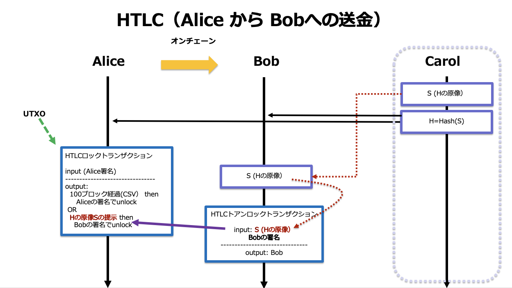

# HTLCの作成
2021/10/29


# Alice からBobに送金する


* Aliceのアドレス：tb1qa20gy39as4qgce353fegq4cl7ss2jcsqu0e6w0
* Bobのアドレス：tb1q9vml26m9vgm5nk3fk9v7cfkad7tlfgsgnahkfu



# Alice からBob経由で Calolに送金する


## 秘密情報はCarolが生成するものとします。

`<S>` ：秘密情報　

この説明では　babe0000beef0000cafe　とします。

## AliceのUTXOの確認

```bash
bitcoin-core.cli listunspent

[
  {
    "txid": "14ae127ea86891d4ee1756e36610b66b3dad908b82bdf3504d2bab90bbbaa485",
    "vout": 1,
    "address": "tb1qa20gy39as4qgce353fegq4cl7ss2jcsqu0e6w0",
    "label": "",
    "scriptPubKey": "0014ea9e8244bd85408c66348a7280571ff420a96200",
    "amount": 0.08900000,
    "confirmations": 51,
    "spendable": true,
    "solvable": true,
    "desc": "wpkh([ea9e8244]03760b5a28bb264ca5b310d766ad3a095c9f866fe9a0b38b8079ca350c6a3e3347)#xzhz90z4",
    "safe": true
  }
]
```

## Alice の公開鍵の情報

```bash
bitcoin-core.cli getaddressinfo tb1qa20gy39as4qgce353fegq4cl7ss2jcsqu0e6w0
{
  "address": "tb1qa20gy39as4qgce353fegq4cl7ss2jcsqu0e6w0",
  "scriptPubKey": "0014ea9e8244bd85408c66348a7280571ff420a96200",
  "ismine": true,
  "solvable": true,
  "desc": "wpkh([ea9e8244]03760b5a28bb264ca5b310d766ad3a095c9f866fe9a0b38b8079ca350c6a3e3347)#xzhz90z4",
  "iswatchonly": false,
  "isscript": false,
  "iswitness": true,
  "witness_version": 0,
  "witness_program": "ea9e8244bd85408c66348a7280571ff420a96200",
  "pubkey": "03760b5a28bb264ca5b310d766ad3a095c9f866fe9a0b38b8079ca350c6a3e3347",
  "ischange": false,
  "timestamp": 1634103859,
  "hdkeypath": "m",
  "hdseedid": "996145f9a9559745d1a132f74a31088ee18178af",
  "hdmasterfingerprint": "ea9e8244",
  "labels": [
    ""
  ]
}
```

### Aliceの公開鍵　(  "pubkey":  の値）

03760b5a28bb264ca5b310d766ad3a095c9f866fe9a0b38b8079ca350c6a3e3347

### Alice の公開鍵のハッシュ値（HASH_160)　（ `"witness_program"`:　の値）

ea9e8244bd85408c66348a7280571ff420a96200

## Bob の公開鍵の情報

```bash
bitcoin-core.cli getaddressinfo tb1q9vml26m9vgm5nk3fk9v7cfkad7tlfgsgnahkfu

{
  "address": "tb1q9vml26m9vgm5nk3fk9v7cfkad7tlfgsgnahkfu",
  "scriptPubKey": "00142b37f56b65623749da29b159ec26dd6f97f4a208",
  "ismine": true,
  "solvable": true,
  "desc": "wpkh([2b37f56b]03d66199f0dd6bbd161cd4a854cd238a4dbebf2d0cf1133180797e1270dac3e528)#d3uczf0g",
  "iswatchonly": false,
  "isscript": false,
  "iswitness": true,
  "witness_version": 0,
  "witness_program": "2b37f56b65623749da29b159ec26dd6f97f4a208",
  "pubkey": "03d66199f0dd6bbd161cd4a854cd238a4dbebf2d0cf1133180797e1270dac3e528",
  "ischange": false,
  "timestamp": 1634099655,
  "hdkeypath": "m",
  "hdseedid": "1131dbe1dd22375906ef16f4d5651aedf8aba325",
  "hdmasterfingerprint": "2b37f56b",
  "labels": [
    ""
  ]
}

```

### Bobの公開鍵　(  "pubkey":  の値）

03d66199f0dd6bbd161cd4a854cd238a4dbebf2d0cf1133180797e1270dac3e528

### Bob の公開鍵のハッシュ値（HASH_160)　（ `"witness_program"`:　の値）

2b37f56b65623749da29b159ec26dd6f97f4a208

## Bob の公開鍵の情報


### OP_HASH160の openssl による計算方法

```bash
# Aliceの公開鍵ハッシュ (SHA-256 の結果をさらに  RIPMD160 する）

echo -n 03760b5a28bb264ca5b310d766ad3a095c9f866fe9a0b38b8079ca350c6a3e3347 | xxd -r -p | openssl dgst -sha256 -binary | openssl dgst -rmd160
(stdin)= ea9e8244bd85408c66348a7280571ff420a96200
```

### OP_HASH256の openssl による計算方法

```bash
# Bobの秘密情報 babe0000beef0000cafe の場合　(SHA-256 の結果をさらに SHA-256 する）

echo -n babe0000beef0000cafe | xxd -r -p | openssl dgst -sha256 -binary | openssl dgst  -sha256
(stdin)= d5c91f1deccd50ae0a384b9b1ec44140af96a972ffc1ab8863a1e607b838885a
```


# 事前準備

## bitcoinrb を使ったスクリプトの検証

```ruby
require 'bitcoin'

script=Bitcoin::Script.from_string("2 4 OP_ADD 6 OP_EQUAL")
script.run

=> true

script=Bitcoin::Script.from_string("2 4 OP_ADD 5 OP_EQUAL")
script.run

=> false
```

検証するスクリプト

```bash
<S> OP_HASH160 <Sのハッシュ値> OP_EQUAL 
```
 
```ruby
script=Bitcoin::Script.from_string("03760b5a28bb264ca5b310d766ad3a095c9f866fe9a0b38b8079ca350c6a3e3347 OP_HASH160 ea9e8244bd85408c66348a7280571ff420a96200 OP_EQUAL")

script.run
=> true
```

検証するスクリプト

```bash
<S> OP_HASH256 <Sのハッシュ値> OP_EQUAL 
```

```ruby
script=Bitcoin::Script.from_string("babe0000beef0000cafe OP_HASH256 d5c91f1deccd50ae0a384b9b1ec44140af96a972ffc1ab8863a1e607b838885a OP_EQUAL")

script.run
=> true

```

### OP_EQUALと OP_EQUALVERIFYの違い

OP_ADD は，加算した結果をスタックにプッシュします。多くのオペコードは処理結果の返り値をスタックにプッシュしますが，スタックトップを取り出すだけで返り値を返さないオペコードもあります。

例えば，OP_EQUAL はスタックトップの2つのデータが等しいとき 1，そうでないとき0 を処理結果として返し結果をスタックにプッシュしますが，O P_EQUALVERIFY はスタックトップの2つのデータが等しくないときには0 をスタックに プッシュしますが，等しいときには何も返しません。結果として引数となったスタックトップの2要素を削除するという効果をもちます。


## HTCLの典型例


### redeem script

注意!:　(`OP_CSV`は，初期のビットコインスクリプトの仕様ではリザーブされていたオペコードを使用しているので，旧仕様のノードにリジェクトされないように `OP_DROP`でスタックから取り除いています)

```
OP_IF
    OP_HASH256 <Sのハッシュ値> OP_EQUALVERIFY 
    <Bobの公開鍵>
OP_ELSE
    <ロックするブロック数> OP_CSV 
    OP_DROP  
    <Aliceの公開鍵>
OP_ENDIF
OP_CHECKSIG
```


### unlocking script (Bobによる）

```
<Bobの署名> 
<S> 
OP_1
```

### unlocking script と redeem scriptの連接結果

```
<Bobの署名> 
<S> 
OP_1
------------連接--------------
OP_IF
    OP_HASH256 <Sのハッシュ値> OP_EQUALVERIFY 
    <Bobの公開鍵>
OP_ELSE
    <ロックするブロック数> OP_CSV 
    OP_DROP  
    <Aliceの公開鍵>
OP_ENDIF
OP_CHECKSIG
```

1. スタックに， `<Bobの署名>` ，`<S>`，`OP_1`　が順に積まれます
2. `OP_1`(true) が適用され，`OP_IF` 側の処理が実行されます
3. `<S>` の`OP_HASH256` の結果と `<Sのハッシュ値>` が`OP_EQUALVERIFY` で比較されます
4. 等しければ，Bobの公開鍵による Bobの署名が検証され，成功すればロックが解除されます


### 実例

* 秘密の情報を `<S>`：babe0000beef0000cafe とします。
* `<Sの OP_HASH256 ハッシュ値>`：d5c91f1deccd50ae0a384b9b1ec44140af96a972ffc1ab8863a1e607b838885a
* Bobの公開鍵：03d66199f0dd6bbd161cd4a854cd238a4dbebf2d0cf1133180797e1270dac3e528
* `<ロックするブロック数>`：100
* Aliceの公開鍵：03760b5a28bb264ca5b310d766ad3a095c9f866fe9a0b38b8079ca350c6a3e3347

### redeem script


```ruby
OP_IF
    OP_HASH256 d5c91f1deccd50ae0a384b9b1ec44140af96a972ffc1ab8863a1e607b838885a OP_EQUALVERIFY 
    03d66199f0dd6bbd161cd4a854cd238a4dbebf2d0cf1133180797e1270dac3e528
OP_ELSE
    100 OP_CSV 
    OP_DROP  
    03760b5a28bb264ca5b310d766ad3a095c9f866fe9a0b38b8079ca350c6a3e3347
OP_ENDIF
OP_CHECKSIG
```

### bitcoinrbで  redeem script をエンコードする

```ruby
require 'bitcoin'

script = Bitcoin::Script.from_string('OP_IF
    OP_HASH256 d5c91f1deccd50ae0a384b9b1ec44140af96a972ffc1ab8863a1e607b838885a OP_EQUALVERIFY 
    03d66199f0dd6bbd161cd4a854cd238a4dbebf2d0cf1133180797e1270dac3e528
OP_ELSE
    10 OP_CSV 
    OP_DROP  
    03760b5a28bb264ca5b310d766ad3a095c9f866fe9a0b38b8079ca350c6a3e3347
OP_ENDIF
OP_CHECKSIG
')

script.to_h
=> 
{:asm=>
  "OP_IF OP_HASH256 d5c91f1deccd50ae0a384b9b1ec44140af96a972ffc1ab8863a1e607b838885a OP_EQUALVERIFY 03d66199f0dd6bbd161cd4a854cd238a4dbebf2d0cf1133180797e1270dac3e528 OP_ELSE 10 OP_CSV OP_DROP 03760b5a28bb264ca5b310d766ad3a095c9f866fe9a0b38b8079ca350c6a3e3347 OP_ENDIF OP_CHECKSIG",
 :hex=>
  "63aa20d5c91f1deccd50ae0a384b9b1ec44140af96a972ffc1ab8863a1e607b838885a882103d66199f0dd6bbd161cd4a854cd238a4dbebf2d0cf1133180797e1270dac3e528675ab2752103760b5a28bb264ca5b310d766ad3a095c9f866fe9a0b38b8079ca350c6a3e334768ac",
 :type=>"nonstandard"}
```

エンコードされた redeem script は，:hex=>　の値

## P2WSH アドレスの生成

bitcoin core APIの decodescript コマンドで エンコードされたredeem script をデコードすると，P2SHアドレスと P2WSHアドレスを得ることができる

```bash
 bitcoin-core.cli decodescript 63aa20d5c91f1deccd50ae0a384b9b1ec44140af96a972ffc1ab8863a1e607b838885a882103d66199f0dd6bbd161cd4a854cd238a4dbebf2d0cf1133180797e1270dac3e528675ab2752103760b5a28bb264ca5b310d766ad3a095c9f866fe9a0b38b8079ca350c6a3e334768ac

{
  "asm": "OP_IF OP_HASH256 d5c91f1deccd50ae0a384b9b1ec44140af96a972ffc1ab8863a1e607b838885a OP_EQUALVERIFY 03d66199f0dd6bbd161cd4a854cd238a4dbebf2d0cf1133180797e1270dac3e528 OP_ELSE 10 OP_CHECKSEQUENCEVERIFY OP_DROP 03760b5a28bb264ca5b310d766ad3a095c9f866fe9a0b38b8079ca350c6a3e3347 OP_ENDIF OP_CHECKSIG",
  "type": "nonstandard",
  "p2sh": "2N6JDe6QMzk2eMMrFrDvzbpbL2z5nU9vsPy",
  "segwit": {
    "asm": "0 b643cda12f82884ba4dd8c834a638f11e5afbef415b885808686cbea2fdc5c49",
    "hex": "0020b643cda12f82884ba4dd8c834a638f11e5afbef415b885808686cbea2fdc5c49",
    "address": "tb1qkepumgf0s2yyhfxa3jp55cu0z8j6l0h5zkugtqyxsm975t7ut3ysymx70l",
    "type": "witness_v0_scripthash",
    "p2sh-segwit": "2N3jAsJhZXBheumeUWric3RjziGND292BnC"
  }
}
```

P2WSHアドレス：tb1qkepumgf0s2yyhfxa3jp55cu0z8j6l0h5zkugtqyxsm975t7ut3ysymx70l


## AliceがHTLCロックトランザクションを作成

### AliceはBobからBobの公開鍵を得る

### AliceはCarolから秘密情報 `<S>` のハッシュ値を得る

* inputのJSON

このUTXOは，"amount": 0.08900000

```json
'[{"txid":"14ae127ea86891d4ee1756e36610b66b3dad908b82bdf3504d2bab90bbbaa485","vout":1}]' 
```

* output のJSON形式 (送金額：0.01, お釣り(Alice) 0.0788，手数料 0.0002)：

```json
'[{"tb1qkepumgf0s2yyhfxa3jp55cu0z8j6l0h5zkugtqyxsm975t7ut3ysymx70l":0.01},{"tb1qa20gy39as4qgce353fegq4cl7ss2jcsqu0e6w0":0.0788}]'
```

* 未署名トランザクションの作成

```bash
bitcoin-core.cli createrawtransaction  '[{"txid":"14ae127ea86891d4ee1756e36610b66b3dad908b82bdf3504d2bab90bbbaa485","vout":1}]' '[{"tb1qkepumgf0s2yyhfxa3jp55cu0z8j6l0h5zkugtqyxsm975t7ut3ysymx70l":0.01},{"tb1qa20gy39as4qgce353fegq4cl7ss2jcsqu0e6w0":0.0788}]'


020000000185a4babb90ab2b4d50f3bd828b90ad3d6bb61066e35617eed49168a87e12ae140100000000ffffffff0240420f0000000000220020b643cda12f82884ba4dd8c834a638f11e5afbef415b885808686cbea2fdc5c49403d780000000000160014ea9e8244bd85408c66348a7280571ff420a9620000000000
```

トランザクションの内容の確認

```bash
bitcoin-core.cli decoderawtransaction 020000000185a4babb90ab2b4d50f3bd828b90ad3d6bb61066e35617eed49168a87e12ae140100000000ffffffff0240420f0000000000220020b643cda12f82884ba4dd8c834a638f11e5afbef415b885808686cbea2fdc5c49403d780000000000160014ea9e8244bd85408c66348a7280571ff420a9620000000000

{
  "txid": "27a0ed782436dc23cf9be696e1c4f6b708ed1321ac41c491ec213596cc95105b",
  "hash": "27a0ed782436dc23cf9be696e1c4f6b708ed1321ac41c491ec213596cc95105b",
  "version": 2,
  "size": 125,
  "vsize": 125,
  "weight": 500,
  "locktime": 0,
  "vin": [
    {
      "txid": "14ae127ea86891d4ee1756e36610b66b3dad908b82bdf3504d2bab90bbbaa485",
      "vout": 1,
      "scriptSig": {
        "asm": "",
        "hex": ""
      },
      "sequence": 4294967295
    }
  ],
  "vout": [
    {
      "value": 0.01000000,
      "n": 0,
      "scriptPubKey": {
        "asm": "0 b643cda12f82884ba4dd8c834a638f11e5afbef415b885808686cbea2fdc5c49",
        "hex": "0020b643cda12f82884ba4dd8c834a638f11e5afbef415b885808686cbea2fdc5c49",
        "address": "tb1qkepumgf0s2yyhfxa3jp55cu0z8j6l0h5zkugtqyxsm975t7ut3ysymx70l",
        "type": "witness_v0_scripthash"
      }
    },
    {
      "value": 0.07880000,
      "n": 1,
      "scriptPubKey": {
        "asm": "0 ea9e8244bd85408c66348a7280571ff420a96200",
        "hex": "0014ea9e8244bd85408c66348a7280571ff420a96200",
        "address": "tb1qa20gy39as4qgce353fegq4cl7ss2jcsqu0e6w0",
        "type": "witness_v0_keyhash"
      }
    }
  ]
}
```


### Alice がトランザクションへのデジタル署名（ワレットの秘密鍵を利用）

```bash
bitcoin-core.cli signrawtransactionwithwallet 020000000185a4babb90ab2b4d50f3bd828b90ad3d6bb61066e35617eed49168a87e12ae140100000000ffffffff0240420f0000000000220020b643cda12f82884ba4dd8c834a638f11e5afbef415b885808686cbea2fdc5c49403d780000000000160014ea9e8244bd85408c66348a7280571ff420a9620000000000

{
  "hex": "0200000000010185a4babb90ab2b4d50f3bd828b90ad3d6bb61066e35617eed49168a87e12ae140100000000ffffffff0240420f0000000000220020b643cda12f82884ba4dd8c834a638f11e5afbef415b885808686cbea2fdc5c49403d780000000000160014ea9e8244bd85408c66348a7280571ff420a962000247304402203721bf416d277df5d8c32fc69881227008f2b508856f4fb602719558ccd19ca802201442d87efca83397067b1d698fbce5b89f4f39e26b0bff7d435f6e055fe84f84012103760b5a28bb264ca5b310d766ad3a095c9f866fe9a0b38b8079ca350c6a3e334700000000",
  "complete": true
}
```

トランザクション内容の確認

```bash
bitcoin-core.cli decoderawtransaction 0200000000010185a4babb90ab2b4d50f3bd828b90ad3d6bb61066e35617eed49168a87e12ae140100000000ffffffff0240420f0000000000220020b643cda12f82884ba4dd8c834a638f11e5afbef415b885808686cbea2fdc5c49403d780000000000160014ea9e8244bd85408c66348a7280571ff420a962000247304402203721bf416d277df5d8c32fc69881227008f2b508856f4fb602719558ccd19ca802201442d87efca83397067b1d698fbce5b89f4f39e26b0bff7d435f6e055fe84f84012103760b5a28bb264ca5b310d766ad3a095c9f866fe9a0b38b8079ca350c6a3e334700000000

{
  "txid": "27a0ed782436dc23cf9be696e1c4f6b708ed1321ac41c491ec213596cc95105b",
  "hash": "064b136aada15a9608fbf9db9cfb510c2a3c042ab2e81927a96de1744c7d0cff",
  "version": 2,
  "size": 234,
  "vsize": 153,
  "weight": 609,
  "locktime": 0,
  "vin": [
    {
      "txid": "14ae127ea86891d4ee1756e36610b66b3dad908b82bdf3504d2bab90bbbaa485",
      "vout": 1,
      "scriptSig": {
        "asm": "",
        "hex": ""
      },
      "txinwitness": [
        "304402203721bf416d277df5d8c32fc69881227008f2b508856f4fb602719558ccd19ca802201442d87efca83397067b1d698fbce5b89f4f39e26b0bff7d435f6e055fe84f8401",
        "03760b5a28bb264ca5b310d766ad3a095c9f866fe9a0b38b8079ca350c6a3e3347"
      ],
      "sequence": 4294967295
    }
  ],
  "vout": [
    {
      "value": 0.01000000,
      "n": 0,
      "scriptPubKey": {
        "asm": "0 b643cda12f82884ba4dd8c834a638f11e5afbef415b885808686cbea2fdc5c49",
        "hex": "0020b643cda12f82884ba4dd8c834a638f11e5afbef415b885808686cbea2fdc5c49",
        "address": "tb1qkepumgf0s2yyhfxa3jp55cu0z8j6l0h5zkugtqyxsm975t7ut3ysymx70l",
        "type": "witness_v0_scripthash"
      }
    },
    {
      "value": 0.07880000,
      "n": 1,
      "scriptPubKey": {
        "asm": "0 ea9e8244bd85408c66348a7280571ff420a96200",
        "hex": "0014ea9e8244bd85408c66348a7280571ff420a96200",
        "address": "tb1qa20gy39as4qgce353fegq4cl7ss2jcsqu0e6w0",
        "type": "witness_v0_keyhash"
      }
    }
  ]
}
```

## AliceによるHTLCロックトランザクションのブロードキャスト

```bash
bitcoin-core.cli sendrawtransaction 0200000000010185a4babb90ab2b4d50f3bd828b90ad3d6bb61066e35617eed49168a87e12ae140100000000ffffffff0240420f0000000000220020b643cda12f82884ba4dd8c834a638f11e5afbef415b885808686cbea2fdc5c49403d780000000000160014ea9e8244bd85408c66348a7280571ff420a962000247304402203721bf416d277df5d8c32fc69881227008f2b508856f4fb602719558ccd19ca802201442d87efca83397067b1d698fbce5b89f4f39e26b0bff7d435f6e055fe84f84012103760b5a28bb264ca5b310d766ad3a095c9f866fe9a0b38b8079ca350c6a3e334700000000

27a0ed782436dc23cf9be696e1c4f6b708ed1321ac41c491ec213596cc95105b
```

### HTLCロックトランザクションのトランザクションID

27a0ed782436dc23cf9be696e1c4f6b708ed1321ac41c491ec213596cc95105b


## Bob によるHTCLアンロックトランザクションの作成

HTLCロックトランザクションがブロックに入った時間経過後，トランザクションIDでHTCLロックトランザクションを検索する

```bash
bitcoin-core.cli getrawtransaction 27a0ed782436dc23cf9be696e1c4f6b708ed1321ac41c491ec213596cc95105b

0200000000010185a4babb90ab2b4d50f3bd828b90ad3d6bb61066e35617eed49168a87e12ae140100000000ffffffff0240420f0000000000220020b643cda12f82884ba4dd8c834a638f11e5afbef415b885808686cbea2fdc5c49403d780000000000160014ea9e8244bd85408c66348a7280571ff420a962000247304402203721bf416d277df5d8c32fc69881227008f2b508856f4fb602719558ccd19ca802201442d87efca83397067b1d698fbce5b89f4f39e26b0bff7d435f6e055fe84f84012103760b5a28bb264ca5b310d766ad3a095c9f866fe9a0b38b8079ca350c6a3e334700000000
```

#### HTLCトランザクションのUTXO

トランザクションID:　27a0ed782436dc23cf9be696e1c4f6b708ed1321ac41c491ec213596cc95105b
vout: 0
 "value": 0.01000000
 
### HTLCアンロックトランザクションの input
 
 ```json
'[{"txid":"27a0ed782436dc23cf9be696e1c4f6b708ed1321ac41c491ec213596cc95105b","vout":0}]' 
 ```

### Bobのoutput

```json
'[{"tb1q9vml26m9vgm5nk3fk9v7cfkad7tlfgsgnahkfu":0.0098}]'
```

### 未署名のトランザクション

```bash
bitcoin-core.cli createrawtransaction  '[{"txid":"27a0ed782436dc23cf9be696e1c4f6b708ed1321ac41c491ec213596cc95105b","vout":0}]'  '[{"tb1q9vml26m9vgm5nk3fk9v7cfkad7tlfgsgnahkfu":0.0098}]'

02000000015b1095cc963521ec91c441ac2113ed08b7f6c4e196e69bcf23dc362478eda0270000000000ffffffff0120f40e00000000001600142b37f56b65623749da29b159ec26dd6f97f4a20800000000
```

確認

```bash
bitcoin-core.cli decoderawtransaction 02000000015b1095cc963521ec91c441ac2113ed08b7f6c4e196e69bcf23dc362478eda0270000000000ffffffff0120f40e00000000001600142b37f56b65623749da29b159ec26dd6f97f4a20800000000

{
  "txid": "1d24bf63ae5663947f24a6f6951f7c41c7fccd77ca65733f328dd9209d520a95",
  "hash": "1d24bf63ae5663947f24a6f6951f7c41c7fccd77ca65733f328dd9209d520a95",
  "version": 2,
  "size": 82,
  "vsize": 82,
  "weight": 328,
  "locktime": 0,
  "vin": [
    {
      "txid": "27a0ed782436dc23cf9be696e1c4f6b708ed1321ac41c491ec213596cc95105b",
      "vout": 0,
      "scriptSig": {
        "asm": "",
        "hex": ""
      },
      "sequence": 4294967295
    }
  ],
  "vout": [
    {
      "value": 0.00980000,
      "n": 0,
      "scriptPubKey": {
        "asm": "0 2b37f56b65623749da29b159ec26dd6f97f4a208",
        "hex": "00142b37f56b65623749da29b159ec26dd6f97f4a208",
        "reqSigs": 1,
        "type": "witness_v0_keyhash",
        "addresses": [
          "tb1q9vml26m9vgm5nk3fk9v7cfkad7tlfgsgnahkfu"
        ]
      }
    }
  ]
}

```

### bitcoin core API signrawtransactionwithwallet の仕様

```
Argument #1 - hexstring
Type: string, required

The transaction hex string
```

```
Argument #2 - 直前のトランザクション情報
Type: json array, optional

The previous dependent transaction outputs

[
  {                            (json object)
    "txid": "hex",             (string, required) The transaction id
    "vout": n,                 (numeric, required) The output number
    "scriptPubKey": "hex",     (string, required) script key
    "redeemScript": "hex",     (string) (required for P2SH) redeem script
    "witnessScript": "hex",    (string) (required for P2WSH or P2SH-P2WSH) witness script
    "amount": amount,          (numeric or string) (required for Segwit inputs) the amount spent
  },
  ...
]
```

```
Argument #3 - sighashtype
Type: string, optional, default=ALL

The signature hash type. Must be one of
“ALL” “NONE” “SINGLE” “ALL|ANYONECANPAY” “NONE|ANYONECANPAY” “SINGLE|ANYONECANPAY”
```

### Carol  からの秘密情報 `<S>` のハッシュ値を得て，HTLCをのredeem script を作成する（Aliceと同じものになる）

63aa20d5c91f1deccd50ae0a384b9b1ec44140af96a972ffc1ab8863a1e607b838885a882103d66199f0dd6bbd161cd4a854cd238a4dbebf2d0cf1133180797e1270dac3e528675ab2752103760b5a28bb264ca5b310d766ad3a095c9f866fe9a0b38b8079ca350c6a3e334768ac

### Carol  からの秘密情報 `<S>` を得る

` <S>`：babe0000beef0000cafe 

### unlocking script　(witness)

```ruby
require 'bitcoin'

script=Bitcoin::Script.from_string("babe0000beef0000cafe
OP_1")

script.to_h
=> {:asm=>"babe0000beef0000cafe 1", :hex=>"0ababe0000beef0000cafe51", :type=>"nonstandard"}
```

### HTLC アンロックトランザクションへの署名

第２引数のJSON形式

```json
'[{"txid": "27a0ed782436dc23cf9be696e1c4f6b708ed1321ac41c491ec213596cc95105b",
    "vout": 0,
    "scriptPubKey": "0020b643cda12f82884ba4dd8c834a638f11e5afbef415b885808686cbea2fdc5c49",
    "redeemScript": "63aa20d5c91f1deccd50ae0a384b9b1ec44140af96a972ffc1ab8863a1e607b838885a882103d66199f0dd6bbd161cd4a854cd238a4dbebf2d0cf1133180797e1270dac3e528675ab2752103760b5a28bb264ca5b310d766ad3a095c9f866fe9a0b38b8079ca350c6a3e334768ac",
    "witnessScript": "0ababe0000beef0000cafe51",
    "amount": 0.001
  }]'
```

```bash
bitcoin-core.cli signrawtransactionwithwallet 02000000015b1095cc963521ec91c441ac2113ed08b7f6c4e196e69bcf23dc362478eda0270000000000ffffffff0120f40e00000000001600142b37f56b65623749da29b159ec26dd6f97f4a20800000000 '[{"txid": "27a0ed782436dc23cf9be696e1c4f6b708ed1321ac41c491ec213596cc95105b",
    "vout": 0,
    "scriptPubKey": "0020b643cda12f82884ba4dd8c834a638f11e5afbef415b885808686cbea2fdc5c49",
    "redeemScript": "63aa20d5c91f1deccd50ae0a384b9b1ec44140af96a972ffc1ab8863a1e607b838885a882103d66199f0dd6bbd161cd4a854cd238a4dbebf2d0cf1133180797e1270dac3e528675ab2752103760b5a28bb264ca5b310d766ad3a095c9f866fe9a0b38b8079ca350c6a3e334768ac",
    "witnessScript": "0ababe0000beef0000cafe51",
    "amount": 0.001
  }]'

```


