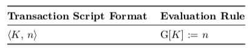
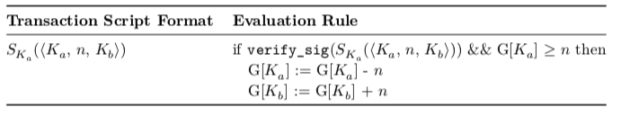
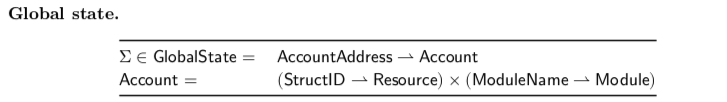
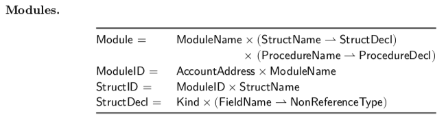
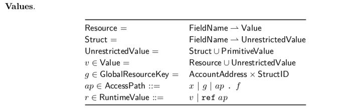
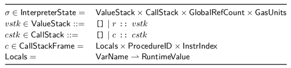
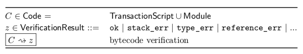

# Move言語

## 概要

LibraBlockchain [1] [2]の安全で柔軟なプログラミング言語であるMoveを提供します。 Moveは、カスタムトランザクションとスマートコントラクトの実装に使用される実行可能なバイトコード言語です。 Moveの主要な機能は、線形ロジック[3]に触発されたセマンティクスでカスタムリソースタイプを定義する機能です。

リソースはコピーまたは暗黙的に破棄できず、プログラムストレージの場所間でのみ移動できます。これらの安全保証は、Moveの型システムによって静的に実施されます。これらの特別な保護にもかかわらず、リソースは通常のプログラム値です。

データ構造に保存したり、プロシージャに引数として渡すことができます。一流のリソースは非常に一般的な概念であり、プログラマーは安全なデジタル資産を実装するだけでなく、資産をラッピングし、アクセス制御ポリシーを適用するための正しいビジネスロジックを作成するために使用できますMoveの安全性と表現力により、Libraコイン、トランザクション処理、検証管理など、Libraプロトコルの重要な部分をMoveに実装できます。

## Introduction

インターネットとモバイルブロードバンドの到来により、世界中の何十億もの人々がつながり、知識へのアクセス、無料のコミュニケーション、および低コストでより便利な幅広いサービスが提供されています。この接続性により、より多くの人々が金融エコシステムにアクセスできるようになりました。しかし、この進歩にもかかわらず、金融サービスへのアクセスは、それを最も必要とする人々にとって依然として制限されています。

天秤座の使命は、この状況を変えることです[1]。この論文では、Libraプロトコルでカスタムトランザクションロジックとスマートコントラクトを実装するための新しいプログラミング言語であるMoveを紹介します[2]。 Moveを紹介するために：

1. ブロックチェーン上でデジタル資産を表現する際の課題を説明してください（セクション2）。
2. Moveの設計がこれらの課題にどのように対処しているかを説明します（セクション3）。
3. Moveの主要な機能とプログラミングモデルの例指向の概要を示します（セクション4）。
4. 言語および仮想マシンの設計の技術的な詳細を調べます（セクション5、セクション6、および付録A）。
5. 最後に、Moveでの進捗状況を要約し、言語進化の計画を説明し、LibraブロックチェーンでのサードパーティのMoveコードをサポートするためのロードマップを概説します（セクション7）。


## ManagingDigitalAssetsonaBlockchain

まず、Moveのような「ブロックチェーンプログラミング言語」が果たす役割を読者が理解できるように、抽象レベルでブロックチェーンを簡単に説明します。この説明では、言語の観点から関連する機能に焦点を当てるために、ブロックチェーンシステムの多くの重要な詳細を意図的に省略しています。

### AnAbstractViewofaBlockchain

ブロックチェーンは複製された状態マシンです[4] [5]。システム内のレプリケーターはバリデーターとして知られています。システムのユーザーはトランザクションをバリデーターに送信します。各バリデーターは、トランザクションを実行して内部状態マシンを現在の状態から新しい状態に移行する方法を理解しています。

バリデーターは、トランザクション実行の共通の理解を活用して、レプリケートされた状態を集合的に定義および維持するためのコンセンサスプロトコルに従います。もし

* •バリデーターは同じ初期状態から始まります。
* •バリデーターは次のトランザクションがどうあるべきかについて合意します。
* •トランザクションを実行すると決定論的な状態遷移が生成されます。


バリデーターは次の状態についても同意します。このスキームを繰り返し適用すると、バリデーターは現在の状態に同意しながらトランザクションを処理できます。

コンセンサスプロトコルと状態遷移コンポーネントは、互いの実装の詳細に影響されないことに注意してください。コンセンサスプロトコルがトランザクション間の完全な順序を保証し、状態遷移スキームが決定的である限り、コンポーネントは調和して相互作用できます。


### EncodingDigitalAssetsinanOpenSystem


Moveのようなブロックチェーンプログラミング言語の役割は、遷移と状態の表現方法を決定することです。豊かな金融インフラをサポートするために、Libra Blockchainの状態は、特定の時点でデジタル資産の所有者をエンコードできる必要があります。さらに、状態の移行により、資産の譲渡が可能になります。

ブロックチェーンプログラミング言語の設計を知らせる必要がある他の考慮事項が1つあります。他のパブリックブロックチェーンと同様に、Libraブロックチェーンはオープンシステムです。誰でも現在のブロックチェーンの状態を表示したり、バリデーターにトランザクションを送信したりできます（つまり、状態遷移を提案します）。

従来、デジタル資産を管理するためのソフトウェア（銀行ソフトウェアなど）は、特別な
2
管理コントロール。パブリックブロックチェーンでは、すべての参加者が同じ立場にあります。参加者は、好きな状態遷移を提案できますが、システムがすべての状態遷移を許可する必要はありません。たとえば、Aliceは、Bobが所有する資産を転送する状態遷移を自由に提案できます。状態遷移関数は、この状態遷移が無効であることを認識し、拒否できる必要があります。

オープンソフトウェアシステムのデジタル資産の所有権をエンコードする遷移と状態の表現を選択することは困難です。特に、デジタル資産でエンコードするのが難しい物理資産の2つのプロパティがあります。

* 希少性。システム内の資産の供給を制御する必要があります。既存の資産の複製は禁止する必要があり、新しい資産の作成は特権操作である必要があります。
* アクセス制御。システムの参加者は、アクセス制御ポリシーで資産を保護できる必要があります。

直観を構築するために、状態遷移の表現に関する一連のストローマンの提案の中で、これらの問題がどのように発生するかを見ていきます。 StrawCoinと呼ばれる単一のデジタル資産を追跡するブロックチェーンを想定します。

ブロックチェーン状態Gは、ユーザーID（暗号化公開キーで表される）を各ユーザーが保持するStrawCoinをエンコードする自然数値にマップするキー値ストアとして構造化されます。プロポーザルは、特定の評価ルールを使用して評価されるトランザクションスクリプトで構成され、グローバル状態に適用する更新を生成します。 

G [𝐾]：= writeと書き、グローバルブロックチェーン状態のキーkeyに格納されている自然数を値updatingで更新することを示します。

各提案の目標は、AliceがStrawCoinをBobに送信するのに十分な表現力を持ちながら、ユーザーが希少性やアクセス制御プロパティに違反することを防ぐのに十分な制約があるシステムを設計することです。この提案は、重要ではあるが希少性とアクセス制御に関する議論とは無関係のリプレイ攻撃[6]などのセキュリティ問題に対処しようとはしていません。

希少性。最も簡単な提案は、トランザクションスクリプト内の状態への更新を直接エンコードすることです。




この表現は、AliceからBobへのStrawCoinの送信をエンコードできます。しかし、いくつかの深刻な問題があります。一つには、この提案はStrawCoinの不足を強制しません。アリスは、「アリス、100」というトランザクションを送信することで、「薄気味悪い」状態で好きなだけ多くのStrawCoinを提供できます。したがって、AliceがBobに送信するStrawCoinは、Bobが自分でそれらのコインを簡単に作成できたため、事実上価値がありません。

希少性は貴重な物理的資産の重要な特性です。金のような希少金属は自然に不足していますが、デジタル資産に固有の物理的不足はありません。 G [Alice]→10などのバイトシーケンスとしてエンコードされたデジタル資産は、G [Alice]→100などの他のバイトシーケンスよりも物理的に作成やコピーが難しくありません。代わりに、評価ルールは不足を強制する必要がありますプログラムで。
希少性を考慮した2番目の提案を考えてみましょう。


このスキームでは、トランザクションスクリプトは送信者の公開鍵key Aliceと受信者の公開鍵Bob Bobの両方を指定します。評価ルールは、更新を実行する前に、underに保存されているStrawCoinの数が少なくともthatであることを確認するようになりました。チェックが成功すると、評価ルールは送信者のキーの下に保存されているStrawCoinから𝑛を引き、受信者のキーの下に保存されているStrawCoinに𝑛1を追加します。

このスキームでは、有効なトランザクションスクリプトを実行すると、システム内のStrawCoinの数が節約されるため、不足が発生します。アリスはもはや空からStrawCoinを作成することはできません。彼女はアカウントから引き落とされたボブStrawCoinのみを与えることができます。


#### アクセス制御。 

2番目の提案は希少性の問題に対処していますが、それでも問題があります。ボブはアリスに属するStrawCoinを使用するトランザクションを送信できます。たとえば、評価ルールには、ボブがトランザクション「Alice、100、Bob」を送信するのを止めるものは何もありません。デジタル署名に基づくアクセス制御メカニズムを追加することにより、これに対処できます





このスキームでは、アリスがプライベートキーでトランザクションスクリプトに署名する必要があります。公開鍵pairとペアになった秘密鍵を使用して、メッセージsignに署名するために𝑆𝐾（𝑚）を記述します。評価ルールは、verify_sig関数を使用して、Aliceの公開キーに対する署名を確認します𝐾𝑎。署名が検証されない場合、更新は実行されません。

この新しいルールは、デジタル署名の偽造不可能性を使用して、アリスが自分以外のアカウントからStrawCoinを引き落とさないようにすることで、以前の提案の問題を解決します。

余談ですが、最初のストローマンの提案では評価ルールが事実上必要ないことに注意してください。提案された状態の更新は、キーと値のストアに直接適用されました。しかし、提案を進めていくと、更新を実行するための前提条件と更新自体の間の明確な分離が明らかになりました。評価ルールは、スクリプトを評価することにより、更新を実行するかどうかと実行する更新の両方を決定します。

アクセス制御と希少性ポリシーを実施するためには何らかの評価が必要になるため、この分離は基本です。ユーザーは状態変更を提案し、状態変更がポリシーに準拠しているかどうかを判断するために計算を実行する必要があります。

オープンシステムでは、参加者は、ポリシーをオフチェーンで実施し、州に直接更新を送信することはできません（最初の提案のように）。代わりに、アクセス制御ポリシーは評価ルールによってチェーン上で実施する必要があります。


### ExistingBlockchainLanguages


StrawCoinはおもちゃの言語ですが、Bitcoin Script [7] [8]およびEthereum Virtual Machineバイトコード[9]言語（特に後者）の本質をキャプチャしようとします。これらの言語はStrawCoinよりも高度ですが、同じ問題の多くに直面しています。

1. 資産の間接的な表現。資産は整数を使用してエンコードされますが、整数値は資産と同じではありません。実際、Bitcoin / Ether / StrawCoinを表す型や値はありません！これにより、アセットを使用するプログラムを作成するのが難しくなり、エラーが発生しやすくなります。プロシージャへのアセットの受け渡しやデータ構造へのアセットの保存などのパターンには、特別な言語サポートが必要です。

2. 希少性は拡張できません。この言語は、1つの希少な資産のみを表します。さらに、不足の保護は、言語のセマンティクスに直接ハードコーディングされています。カスタム資産を作成したいプログラマーは、言語のサポートなしで、不足を慎重に再実装する必要があります。
 
3. アクセス制御は柔軟ではありません。モデルが実施する唯一のアクセス制御ポリシーは、公開鍵に基づく署名スキームです。希少性保護と同様に、アクセス制御ポリシーは言語セマンティクスに深く組み込まれています。プログラマーがカスタムアクセス制御ポリシーを定義できるように言語を拡張する方法は明らかではありません。

#### Bitcoin Script.

 Bitcoin Scriptのシンプルでエレガントなデザインは、Bitcoinを使用するためのカスタムアクセス制御ポリシーの表現に焦点を当てています。グローバル状態は、未使用のトランザクション出力（UTXO）のセットで構成されます。ビットコインスクリプトプログラムは、消費する古いUTXOのアクセス制御ポリシーを満たす入力（デジタル署名など）を提供し、作成する新しいUTXOのカスタムアクセス制御ポリシーを指定します。
 
Bitcoin Scriptにはデジタル署名チェック用の強力な命令（マルチ署名[10]サポートを含む）が含まれているため、プログラマーはさまざまなアクセス制御ポリシーをエンコードできます。
 
ただし、ビットコインスクリプトの表現力は根本的に制限されています。プログラマはカスタムデータ型（およびその結果としてカスタムアセット）またはプロシージャを定義できず、言語はチューリング完全ではありません。協力関係者は、複雑なマルチトランザクションプロトコル[11]でより高度な計算を実行したり、「色付きコイン」[12] [13]でカスタムアセットを非公式に定義したりすることができます。ただし、これらのスキームは言語の外に複雑さを押し出すことで機能するため、真の拡張性を実現できません。

#### Ethereum Virtual Machine bytecode. 


イーサリアムは、単なる支払い以上のブロックチェーンシステムの使用方法を示す画期的なシステムです。 Ethereum Virtual Machine（EVM）バイトコードプログラマは、Etherなどの資産とやり取りし、チューリング完全言語を使用して新しい資産を定義するスマートコントラクト[14]を公開できます。 EVMは、ユーザー定義の手順、仮想呼び出し、ループ、データ構造など、ビットコインスクリプトではサポートされていない多くの機能をサポートしています。

ただし、EVMの表現力は、高価なプログラミングの間違いへの扉を開いています。 StrawCoinと同様に、Ether通貨は言語で特別なステータスを持ち、希少性を強制する方法で実装されます。ただし、カスタムアセットの実装者（たとえば、ERC20 [15]標準経由）は、これらの保護を継承しません（（2）で説明）。

アセットの複製、再利用、または損失を許可するバグを導入しないように注意する必要があります。これは、（1）で説明されている間接表現の問題とEVMの非常に動的な動作の組み合わせにより困難です。特に、Etherをスマートコントラクトに転送するには、動的なディスパッチが必要です。

これにより、再入可能性の脆弱性として知られる新しいクラスのバグが発生しました[16]。 DAO攻撃[17]やパリティウォレットハック[18]などの有名なエクスプロイトにより、攻撃者は数百万ドル相当の暗号通貨を盗むことができました

## MoveDesignGoals


Libraの使命は、数十億人を支援するシンプルなグローバル通貨と金融インフラを実現することです[1]。 Move言語は、このビジョンを構築できる安全でプログラム可能な基盤を提供するように設計されています。 Moveは、Libra通貨とガバナンスルールを、正確で、理解可能で、検証可能な方法で表現できなければなりません。長期的には、Moveは、金融インフラストラクチャを構成する豊富な種類の資産と対応するビジネスロジックをエンコードできる必要があります。

これらの要件を満たすために、一流の資産、柔軟性、安全性、検証可能性という4つの重要な目標を念頭に置いてMoveを設計しました。

### First-ClassResources


ブロックチェーンシステムにより、ユーザーはデジタル資産と直接やり取りするプログラムを作成できます。セクション2.2で説明したように、デジタル資産には、ブール値、整数、文字列など、プログラミングで伝統的に使用される値と区別する特別な特性があります。資産を使用したプログラミングに対する堅牢でエレガントなアプローチには、これらの特性を保持する表現が必要です。

Moveの主要な機能は、線形ロジック[3]に触発されたセマンティクスでカスタムリソースタイプを定義する機能です。リソースはコピーまたは暗黙的に破棄できず、プログラムストレージの場所間でのみ移動できます。これらの安全保証は、Moveの型システムによって静的に実施されます。これらの特別な保護にもかかわらず、リソースは通常のプログラム値です。

データ構造に保存したり、プロシージャに引数として渡すことができます。一流のリソースは非常に一般的な概念であり、プログラマーは安全なデジタル資産を実装するだけでなく、資産をラッピングし、アクセス制御ポリシーを適用するための正しいビジネスロジックを作成するために使用できます
Libraコイン自体は、言語に特別なステータスのない通常のMoveリソースとして実装されます。 

LibraコインはLibraリザーブ[19]によって管理される実世界の資産を表すため、Moveはリソースの作成（たとえば、新しい実世界の資産がLibraリザーブに入ったとき）、修正（たとえば、デジタル資産の所有権の変更）、および破棄されます（たとえば、デジタル資産を支える物理資産が売却されたとき）。

移動プログラマは、モジュールを使用してこれらの重要な操作へのアクセスを保護できます。移動モジュールは、他のブロックチェーン言語のスマートコントラクトに似ています。

モジュールは、宣言されたリソースを作成、破棄、および更新するためのルールをエンコードするリソースタイプとプロシージャを宣言します。モジュールは、他のモジュールによって宣言されたプロシージャを呼び出し、他のモジュールによって宣言された型を使用できます。ただし、モジュールは強力なデータ抽象化を強制します。

型は宣言モジュール内では透明で、外部では不透明です。さらに、リソースタイプTの重要な操作は、Tを定義するモジュール内でのみ実行できます。


### Flexibility

Moveは、トランザクションスクリプトを介してLibraに柔軟性を追加します。各Libraトランザクションには、トランザクションのメインプロシージャであるトランザクションスクリプトが含まれています。トランザクションスクリプトは、カスタマイズ可能なトランザクションを可能にする任意のMoveコードを含む単一のプロシージャです。スクリプトは、ブロックチェーンで公開されたモジュールの複数のプロシージャを呼び出し、結果に対してローカル計算を実行できます。

つまり、スクリプトは、表現力豊かな単発的な動作（特定の受信者への支払いなど）または再利用可能な動作（再利用可能なロジックをカプセル化する単一のプロシージャを呼び出す）のいずれかを実行できます。

Moveモジュールは、安全でありながら柔軟なコード構成により、異なる種類の柔軟性を実現します。高レベルでは、Moveのモジュール/リソース/プロシージャ間の関係は、オブジェクト指向プログラミングのクラス/オブジェクト/メソッド間の関係に似ています。

ただし、重要な違いがあります。Moveモジュールは複数のリソースタイプ（またはゼロのリソースタイプ）を宣言でき、Moveプロシージャはselfまたはこの値の概念を持ちません。移動モジュールは、MLスタイルモジュールの限定バージョンに最も似ています[20]。


### Safety

Moveは、リソースの安全性、タイプの安全性、メモリの安全性など、主要なプロパティを満たさないプログラムを拒否する必要があります。ブロックチェーンで実行されるすべてのプログラムがこれらの特性を満たすことを保証する実行可能な表現をどのように選択できますか？ （a）これらのプロパティをチェックするコンパイラで高レベルのプログラミング言語を使用するか、（b）実行時に低レベルの型なしアセンブリを使用してこれらの安全性チェックを実行します。

Moveは、これら2つの極端なアプローチを取ります。 Moveの実行可能形式は、アセンブリよりも高レベルでありながらソース言語よりも低レベルの型付きバイトコードです。バイトコードは、バイトコード検証ツール3によってチェーン上でリソース、タイプ、およびメモリの安全性がチェックされ、バイトコードインタープリターによって直接実行されます。この選択により、Moveは、ソースコンパイラを信頼できるコンピューティングベースに追加したり、コンパイルのコストをトランザクション実行のクリティカルパスに追加したりすることなく、通常ソース言語に関連付けられた安全性を保証できます。


### Verifiability

理想的には、オンチェーンのバイトコード分析またはランタイムチェックを介してMoveプログラムのすべての安全性プロパティをチェックします。残念ながら、これは現実的ではありません。安全性保証の重要性と一般性を、計算コストと、オンチェーン検証で保証を強化するプロトコルの複雑さを慎重に比較検討する必要があります。

私たちのアプローチは、主要な安全性プロパティの可能な限り軽量のオンチェーン検証を実行することですが、高度なオフチェーン静的検証ツールをサポートするようにMove言語を設計します。 Moveは、ほとんどの汎用言語よりも静的検証を受け入れやすくするために、いくつかの設計上の決定を下しました。

1. 動的ディスパッチなし。各コールサイトのターゲットは静的に決定できます。これにより、検証ツールは、複雑なコールグラフ構築分析を実行することなく、プロシージャコールの効果について正確に推論できます。
2. 限られた可変性。 Move値へのすべての突然変異は、参照を介して発生します。参照は、単一のトランザクションスクリプトの範囲内で作成および破棄する必要がある一時的な値です。 Moveのバイトコード検証では、Rustに似た「借用チェック」スキームを使用して、任意の時点で最大1つの値への可変参照が存在することを確認します。さらに、この言語は、グローバルストレージが常に任意のグラフではなくツリーであることを保証します。これにより、検証ツールは書き込み操作の影響に関する推論をモジュール化できます。
3. モジュール性。移動モジュールは、データの抽象化を実施し、リソースの重要な操作をローカライズします。モジュールによって有効化されたカプセル化と、Moveタイプシステムによって適用された保護を組み合わせることにより、モジュールのタイプに対して確立されたプロパティがモジュール外のコードによって違反されないことが保証されます。この設計により、クライアントを考慮せずにモジュールを分離して表示することにより、重要なモジュール不変条件の徹底的な機能検証が可能になることが期待されます。


静的検証ツールは、Moveのこれらのプロパティを活用して、ランタイムエラー（整数オーバーフローなど）がないことと、プログラム固有の重要な機能的正当性プロパティ（支払いチャネルでロックされているリソースを最終的に要求できること）の両方を正確かつ効率的にチェックできます参加者による）。セクション7で機能検証の計画に関する詳細を共有します。

## MoveOverview

Moveの基本を紹介するために、単純なピアツーピアの支払いに関係するトランザクションスクリプトとモジュールについて説明します。このモジュールは、実際のLibraコイン実装の簡易バージョンです。サンプルのトランザクションスクリプトは、モジュール外の悪意のあるまたは不注意なプログラマーが、モジュールのリソースの主要な安全性の不変条件に違反できないことを示しています。サンプルモジュールは、強力なデータ抽象化を活用してこれらの不変条件を確立および維持するリソースを実装する方法を示しています。

このセクションのコードスニペットは、Move中間表現（IR）のバリアントで記述されています。 Move IRは、人間が読めるコードを記述するのに十分な高レベルですが、Moveバイトコードに直接変換できるほど低レベルです。スタックベースのMoveバイトコードは読みにくいため、IRでコードを提示します。現在、Moveソース言語を設計しています（セクション7を参照）。 Moveタイプシステムによって提供されるすべての安全性保証がチェックされていることに注意してください。
コードを実行する前にバイトコードレベルで。


### 4.1. Peer-to-PeerPaymentTransactionScript


```java
public main(payee: address, amount: u64) {
  let coin: 0x0.Currency.Coin = 0x0.Currency.withdraw_from_sender(copy(amount));
  0x0.Currency.deposit(copy(payee), move(coin));
}
```

このスクリプトは、支払いの受取人のアカウントアドレスと受取人に送金されるコインの数を表す符号なし整数の2つの入力を取ります。このスクリプトを実行する効果は簡単です。金額のコインがトランザクション送信者から受取人に転送されます。これは2つのステップで発生します。

最初のステップで、送信者は、0x0.Currencyに保存されているモジュールからwithdraw_from_senderという名前のプロシージャを呼び出します。セクション4.2で説明するように、0x0はモジュールが保存されているアカウントアドレス4であり、通貨はモジュールの名前です。このプロシージャによって返される値コインは、タイプが0x0.Currency.Coinのリソース値です。 2番目のステップでは、送信者はコインリソースの値を0x0.Currencyモジュールの入金手順に移動することにより、受取人に資金を転送します。

この例は非常にデリケートなので興味深いものです。 Moveのタイプシステムは、同じコードの小さなバリアントを拒否し、不適切な動作を引き起こします。特に、型システムは、リソースの複製、再利用、または損失を防ぐことができます。たとえば、スクリプトに対する次の3つの変更は、型システムによって拒否されます。


#### Duplicating currency by changing


move（coin）to copy（coin）。この例の変数の各使用法は、copy（）またはmove（）でラップされていることに注意してください。 RustおよびC ++に続くMoveは、Moveセマンティクスを実装しています。 Move変数xを読み取るたびに、使用法がxの値を変数から移動するか（レンダリングxが使用不可）、値をコピーするか（xを引き続き使用できるようにする）を指定する必要があります。 u64やaddressなどの無制限の値は、コピーと移動の両方が可能です。ただし、リソース値は移動のみ可能です。リソース値を複製しようとすると（上記の例でcopy（coin）を使用するなど）、バイトコード検証時にエラーが発生します。

#### Reusing currency by writing move(coin) twice. 

行0x0.Currency.deposit（copy（some_other_payee）、move（coin））を上記の例に追加すると、送信者はコインを2回「支出」できます。1回目は受取人、2回目はsome_other_payeeです。この望ましくない動作は、物理的な資産では不可能です。さいわい、Moveはこのプログラムを拒否します。変動コインは最初の移動後に利用できなくなり、2番目の移動はバイトコード検証エラーをトリガーします


#### Losing currency by neglecting to move(coin). 

Move言語は、1回だけ移動する必要がある線形[3] [23]リソースを実装します5。リソースの移動に失敗すると（たとえば、上記の例のmove（coin）を含む行を削除することにより）、バイトコード検証エラーがトリガーされます。これにより、Moveプログラマーが誤って（または意図的に）リソースを追跡できなくなるのを防ぎます。これらの保証は、紙幣などの物理的資産で可能なことを超えています。

リソースの安全性という用語を使用して、Moveリソースがコピー、再利用、または失われないことを保証します。 Moveプログラマーはこれらの保護を享受するカスタムリソースを実装できるため、これらの保証は非常に強力です。セクション3.1で説明したように、Libra通貨でさえ、Move言語で特別なステータスのないカスタムリソースとして実装されます。

## CurrencyModule

このセクションでは、上記の例で使用されているCurrencyモジュールの実装がリソースの安全性を活用して、安全な代替資産を実装する方法を示します。まず、Moveコードが実行されるブロックチェーン環境について少し説明します。

入門書：実行モデルを移動します。セクション3.2で説明したように、Moveには2種類のプログラムがあります。セクション4.1で説明した例のようなトランザクションスクリプトと、後ほど説明する通貨モジュールなどのモジュールです。例のようなトランザクションスクリプトは、ユーザーが送信した各トランザクションに含まれ、モジュールのプロシージャを呼び出してグローバル状態を更新します。トランザクションスクリプトの実行は、すべてかゼロかです。実行が正常に完了し、スクリプトによって実行されたすべての書き込みがグローバルストレージにコミットされるか、実行がエラーで終了します（たとえば、アサーションの失敗またはアウトオブガスエラー）、および何もコミットされていません。トランザクションスクリプトは使い捨てのコードです。実行後は、他のトランザクションスクリプトまたはモジュールから再度呼び出すことはできません。

対照的に、モジュールはグローバルな状態で公開された長命のコードです。上記の例で使用されているモジュール名0x0.Currencyには、モジュールコードが公開されているアカウントアドレス0x0が含まれています。グローバル状態は、アカウントアドレスからアカウントへのマップとして構造化されます。


各アカウントには、0個以上のモジュール（四角形で表示）と1つ以上のリソース値（シリンダーで表示）を含めることができます。たとえば、アドレス0x0のアカウントには、モジュール0x0.Currencyとタイプ0x0.Currency.Coinのリソース値が含まれています。アドレス0x1のアカウントには、2つのリソースと1つのモジュールがあります。アドレス0x2のアカウントには2つのモジュールと1つのリソース値があります。


アカウントには、指定されたタイプの最大1つのリソース値と、指定された名前の最大1つのモジュールを含めることができます。アドレス0x0のアカウントには、追加の0x0.Currency.CoinリソースまたはCurrencyという名前の別のモジュールを含めることはできません。ただし、アドレス0x1のアカウントは、Currencyというモジュールを追加できます。その場合、0x0はタイプ0x1.Currency.Coinのリソースも保持できます。 0x0.Currency.Coinと0x1.Currency.Coinは、互換的に使用できない別個のタイプです。宣言モジュールのアドレスは型の一部です。
アカウントで指定されたタイプのリソースを1つしか許可しないことに注意してください。この設計は、最上位のアカウント値に予測可能なストレージスキーマを提供します。プログラマーは、カスタムラッパーリソースを定義することにより、アカウント内の特定のリソースタイプの複数のインスタンスを保持できます。

```java
resource TwoCoins { c1: 0x0.Currency.Coin, c2: 0x0.Currency.Coin }
```

#### Declaring the Coin resource. 

モジュールがMove実行モデルにどのように適合するかを説明したので、ついにCurrencyモジュールの内部を見る準備ができました。

```java
module Currency {
  resource Coin { value: u64 }
  // ...
}
```


このコードは、Currencyというモジュールと、モジュールによって管理されるCoinというリソースタイプを宣言します。 Coinは、u64型（64ビット符号なし整数）の単一フィールド値を持つ構造体型です。 Coinの構造は、Currencyモジュールの外部では不透明です。他のモジュールおよびトランザクションスクリプトは、モジュールによって公開されるパブリックプロシージャを介してのみ値フィールドの書き込みまたは参照を行うことができます。同様に、通貨モジュールのプロシージャのみが、コイン型の値を作成または破棄できます。

このスキームにより、強力なデータ抽象化が可能になります。モジュール作成者は、宣言されたリソースのアクセス、作成、および破棄を完全に制御できます。 Currencyモジュールによって公開されたAPIの外で、別のモジュールがCoinで実行できる操作は移動のみです。リソースの安全性により、他のモジュールがリソースをコピー、破壊、または二重に移動することを禁止しています。


#### Implementing deposit. 


前のセクションでトランザクションスクリプトによって呼び出されたCurrency.depositプロシージャがどのように機能するかを調べてみましょう。

```java
public deposit(payee: address, to_deposit: Coin) {
  let to_deposit_value: u64 = Unpack<Coin>(move(to_deposit));
  let coin_ref: &mut Coin = BorrowGlobal<Coin>(move(payee));
  let coin_value_ref: &mut u64 = &mut move(coin_ref).value;
  let coin_value: u64 = *move(coin_value_ref);
  *move(coin_value_ref) = move(coin_value) + move(to_deposit_value);
}
```

高レベルでは、このプロシージャはCoinリソースを入力として受け取り、それを支払い先のアカウントに保存されているCoinリソースと結合します。これは次の方法で実現します。

1. 入力コインを破棄し、その値を記録します。
2. 受取人のアカウントの下に保存されている一意のCoinリソースへの参照を取得します。
3. 受取人のコインの価値を、手続きに渡されたコインの価値で増やします。

この手順の低レベルのメカニズムには、説明する価値のある側面がいくつかあります。 to_depositにバインドされたCoinリソースは、depositプロシージャが所有しています。プロシージャを呼び出すには、呼び出し元はto_depositにバインドされたCoinを呼び出し先に移動する必要があります（これにより、呼び出し元が再利用できなくなります）。


最初の行で呼び出されるUnpackプロシージャは、モジュールによって宣言された型を操作するためのいくつかのモジュール組み込み関数の1つです。 

Unpack <T>は、タイプTのリソースを削除する唯一の方法です。タイプTのリソースを入力として受け取り、それを破棄し、リソースのフィールドにバインドされた値を返します。 

Unpackなどのモジュールビルトインは、現在のモジュールで宣言されているリソースでのみ使用できます。 Unpackの場合、この制約は他のコードがCoinを破壊することを防ぎます。これにより、CurrencyモジュールはCoinリソースの破壊にカスタム前提条件を設定できます（たとえば、ゼロの破壊のみを許可することを選択できます）価値のあるコイン）


3行目で呼び出されるBorrowGlobalプロシージャもモジュールに組み込まれています。 BorrowGlobal <T>はアドレスを入力として受け取り、そのアドレスで発行されたTの一意のインスタンスへの参照を返します6。

これは、上記のコードのcoin_refのタイプが＆mut Coin（所有するCoinリソースであるCoinではなくCoinリソースへの可変参照）であることを意味します。

次の行は、Coin_refにバインドされた参照値を移動して、Coinの値フィールドへの参照coin_value_refを取得します。手順の最後の行では、支払い先のCoinリソースの以前の値を読み取り、coin_value_refを変更して、預け入れ金額を反映させます7。

Move型システムは、モジュール内のすべての実装ミスをキャッチできないことに注意してください。たとえば、型システムは、存在するすべてのコインの合計値が預金の呼び出しによって保持されることを保証しません。

プログラマが* move（coin_value_ref）= 1 + move（coin_value）+ move（to_deposit_value）を最終行に間違えた場合、型システムは問題なくコードを受け入れます。

これは、責任の明確な分割を示唆しています。モジュールの境界内でコインの適切な安全不変量を確立するのはプログラマーの仕事であり、モジュール外のコインのクライアントがこれらの不変量に​​違反できないことを保証するのは型システムの仕事です。


#### Implementing withdraw_from_sender.


上記の実装では、入金手順による資金の入金には承認は必要ありません。入金は誰でも呼び出すことができます。対照的に、アカウントからの引き出しは、通貨リソースの所有者に排他的な特権を付与するアクセス制御ポリシーによって保護する必要があります。ピアツーピアの支払いトランザクションスクリプトによって呼び出されるwithdraw_from_senderプロシージャがどのようにこの承認を実装するかを見てみましょう。

```java
public withdraw_from_sender(amount: u64): Coin {
  let transaction_sender_address: address = GetTxnSenderAddress();
  let coin_ref: &mut Coin = BorrowGlobal<Coin>(move(transaction_sender_address));
  let coin_value_ref: &mut u64 = &mut move(coin_ref).value;
  let coin_value: u64 = *move(coin_value_ref);
  RejectUnless(copy(coin_value) >= copy(amount));
  *move(coin_value_ref) = move(coin_value) - copy(amount);
  let new_coin: Coin = Pack<Coin>(move(amount));
  return move(new_coin);
}
```

この手順は、預金のほとんど逆ですが、完全ではありません。それ：

1. 送信者のアカウントで公開されたタイプCoinの一意のリソースへの参照を取得します。
2. 参照されるコインの値を入力量だけ減らします。
3. 価値のある新しいコインを作成して返します。


この手順で実行されるアクセス制御チェックはやや微妙です。預金手続きにより、呼び出し側はBorrowGlobalに渡されるアドレスを指定できますが、withdraw_from_senderはGetTxnSenderAddressによって返されたアドレスのみを渡すことができます。このプロシージャは、Moveコードが現在実行中のトランザクションからデータを読み取ることができるいくつかのトランザクション組み込み関数の1つです。

移動仮想マシンは、トランザクションが実行される前に送信者アドレスを認証します。この方法でBorrowGlobalビルトインを使用すると、トランザクションの送信者は自分のCoinリソースからのみ資金を引き出すことができます。

すべてのモジュール組み込み関数と同様に、BorrowGlobal <Coin>は、Coinを宣言するモジュール内でのみ呼び出すことができます。 

CurrencyモジュールがBorrowGlobalの結果を返すプロシージャを公開しない場合、Currencyモジュール外のコードがグローバルストレージで公開されたCoinリソースへの参照を取得する方法はありません。


トランザクション送信者のCoinリソースの値を減らす前に、RejectUnless命令を使用して、コインの値が入力された正式な金額以上であることを確認します。これにより、送信者は自分が持っているよりも多く引き出すことができなくなります。このチェックが失敗すると、現在のトランザクションスクリプトの実行が停止し、実行した操作はいずれもグローバルステートに適用されません。

最後に、この手順では、送信者のCoinの値を量だけ減らし、Unpackの逆を使用して新しいCoinリソースを作成します—組み込みのPackモジュールPack <T>はタイプTの新しいリソースを作成します。Unpack<T>と同様に、Pack <T>はリソースTの宣言モジュール内でのみ呼び出すことができます。

ここで、PackはタイプCoinのリソースnew_coinを作成し、移動します発信者に。発信者はこのCoinリソースを所有し、好きな場所に移動できます。セクション4.1のサンプルトランザクションスクリプトでは、発信者はコインを支払い先のアカウントに入金することを選択します。


## TheMoveLanguage

このセクションでは、Move言語、バイトコード検証、および仮想マシンの準形式的な説明を示します。付録Aでは、これらのコンポーネントをすべて詳細に説明していますが、散文は含まれていません。ここでの議論では、付録からの抜粋を使用し、時々そこに定義されているシンボルを参照します。




Moveの目標は、プログラマーがグローバルブロックチェーン状態を定義し、グローバル状態を更新する操作を安全に実装できるようにすることです。セクション4.2で説明したように、グローバル状態はアドレスからアカウントへの部分的なマップとして編成されます。

アカウントには、リソースデータ値とモジュールコード値の両方が含まれます。アカウント内の異なるリソースには、個別の識別子が必要です。アカウント内の異なるモジュールには異なる名前が必要です。




モジュールは、名前、構造体宣言（これから説明するリソースを含む）、およびプロシージャ宣言で構成されます。

コードは、モジュールのアカウントアドレスとモジュール名で構成される一意の識別子を使用して、公開されたモジュールを参照できます。モジュール識別子は、モジュール外のコードの構造体型とプロシージャの識別子を修飾する名前空間として機能します。

移動モジュールは、強力なデータ抽象化を可能にします。モジュールのプロシージャは、モジュールによって宣言された型を作成、書き込み、および破棄するためのルールをエンコードします。型は、宣言モジュールの内部では透明で、外部では不透明です。

 Moveモジュールは、MoveToSender命令を使用してアカウントでリソースを公開し、BorrowGlobal命令を使用してアカウントでリソースへの参照を取得し、MoveFrom命令を使用してアカウントからリソースを削除するための前提条件を強制することもできます。

モジュールにより、Moveプログラマーは、リソースに対する豊富なアクセス制御ポリシーを柔軟に定義できます。たとえば、モジュールは、fフィールドがゼロの場合にのみ破棄できるリソースタイプ、または特定のアカウントアドレスでのみ公開できるリソースを定義できます。


Moveは、ブール値、64ビット符号なし整数、256ビットアカウントアドレス、固定サイズのバイト配列などのプリミティブ型をサポートしています。構造体は、モジュールによって宣言されたユーザー定義型です。構造体タイプは、リソースの種類でタグ付けすることにより、リソースとして指定されます。非リソース構造体型およびプリミティブ型を含む他のすべての型は、無制限型と呼ばれます。

リソースタイプの変数はリソース変数です。無制限タイプの変数は無制限変数です。バイトコード検証は、リソース変数とリソースタイプの構造体フィールドに制限を適用します。リソース変数はコピーできず、常に移動する必要があります。

リソース変数とリソースタイプの構造体フィールドの両方を再割り当てすることはできません。再割り当てすると、以前に保管場所に保持されていたリソース値が破壊されます。さらに、リソースタイプへの参照は逆参照できません。これは、基になるリソースのコピーを作成するためです。対照的に、無制限の型はコピー、再割り当て、および間接参照できます。

最後に、無制限の構造体型には、リソース型のフィールドを含めることはできません。この制限により、（a）無制限の構造体をコピーしてもネストされたリソースがコピーされなくなり、（b）無制限の構造体を再割り当てしてもネストされたリソースが破壊されなくなります。

参照型は、可変または不変のいずれかです。不変の参照による書き込みは許可されていません。バイトコード検証は、リソースタイプの制限とともにこれらの規則を実施する参照安全性チェックを実行します（セクション5.2を参照）




構造体とプリミティブ値に加えて、Moveは参照値もサポートします。参照は一時的なものであるため、他のMove値とは異なります。バイトコード検証では、参照型のフィールドは許可されません。つまり、トランザクションスクリプトの実行中に参照を作成し、そのトランザクションスクリプトの終了前に参照を解放する必要があります。

構造体値の形状の制限により、グローバル状態が常に任意のグラフではなくツリーになることが保証されます。状態ツリーの各ストレージの場所は、そのアクセスパス[24] —ストレージツリーのルート（ローカル変数𝑥またはグローバルリソースキーeither）からフィールドのシーケンスでマークされた子孫ノードまでのパスを使用して標準的に表すことができます。識別子𝑓。

この言語は、プリミティブ値と構造体への参照を許可しますが、他の参照への参照は許可しません。 Moveプログラマーは、BorrowLoc命令を使用してローカル変数への参照を、BorrowField命令を使用して構造体のフィールドを、BorrowGlobal命令を使用してアカウントで公開されたリソースへの参照を取得できます。後者の2つの構造は、現在のモジュール内で宣言された構造型でのみ使用できます。


プロシージャシグネチャは、可視性、型付きの仮パラメータ、および戻り値の型で構成されます。プロシージャ宣言には、署名、型付きローカル変数、およびバイトコード命令の配列が含まれます。手順の可視性は、パブリックまたは内部のいずれかです。

内部プロシージャは、同じモジュール内の他のプロシージャによってのみ呼び出すことができます。パブリックプロシージャは、任意のモジュールまたはトランザクションスクリプトによって呼び出すことができます。

ブロックチェーンの状態は、アカウントで現在公開されているモジュールのパブリックプロシージャを呼び出すことができるトランザクションスクリプトによって更新されます。トランザクションスクリプトは、関連するモジュールのない単なるプロシージャ宣言です。

プロシージャは、モジュール識別子と署名によって一意に識別できます。バイトコード呼び出し命令には、入力として一意のプロシージャIDが必要です。これにより、Moveのすべてのプロシージャコールが静的に決定されます。

関数ポインタや仮想コールはありません。さらに、モジュール間の依存関係は、構成上非周期的です。モジュールは、線形トランザクション履歴で以前に公開されたモジュールにのみ依存できます。非循環モジュール依存関係グラフと動的ディスパッチの欠如の組み合わせにより、強力な実行不変条件が強制されます。

モジュール内のプロシージャに属するすべてのスタックフレームは連続している必要があります。したがって、Moveモジュールにはイーサリアムスマートコントラクトの再入可能性[16]に相当する問題はありません。

このセクションの残りの部分では、バイトコード操作とそのセマンティクス（セクション5.1）を紹介し、モジュールコードの実行または保存（セクション5.2）を許可する前にバイトコード検証が実行する静的分析について説明します。


### BytecodeInterpreter




Move bytecode命令は、Common Language Runtime [22]およびJava Virtual Machine [21]と同様のスタックベースのインタープリターによって実行されます。命令は、スタックからオペランドを消費し、結果をスタックにプッシュします。命令は、現在のプロシージャのローカル変数（仮パラメータを含む）との間で値を移動およびコピーすることもできます。

バイトコードインタープリターは、プロシージャコールをサポートしています。呼び出し先に渡される入力値と呼び出し元に返される出力値も、スタックを介して通信されます。最初に、呼び出し側はプロシージャの引数をスタックにプッシュします。次に、呼び出し元はCall命令を呼び出します。

これにより、呼び出し先の新しい呼び出しスタックフレームが作成され、プッシュされた値が呼び出し先のローカル変数にロードされます。最後に、バイトコードインタープリターは、呼び出し先プロシージャのバイトコード命令の実行を開始します。

バイトコードの実行は、現在の手順で静的に決定されたオフセットへのジャンプを引き起こす分岐操作がない限り、操作を順番に実行することにより進行します。呼び出し先が戻りたい場合、戻り値をスタックにプッシュし、Return命令を呼び出します。次に、制御が呼び出し側に返され、呼び出し側がスタック上の出力値を見つけます。

Moveプログラムの実行は、EVMと同様の方法で測定されます[9]。各バイトコード命令にはガス単位のコストが関連付けられており、実行するトランザクションにはガス単位の予算が含まれている必要があります。インタプリタは、実行中に残っているガスユニットを追跡し、残量がゼロに達するとエラーで停止します。

レジスタベースとスタックベースの両方のバイトコードインタープリターを検討し、型付きローカルを持つスタックマシンがMoveのリソースセマンティクスに非常に自然に適合することを発見しました。

ローカル変数、スタック、および呼び出し元/呼び出し先のペア間で値を移動する低レベルのメカニズムは、Moveプログラムの高レベルの意図を密接に反映しています。ローカルのないスタックマシンはより冗長であり、レジスタマシンはプロシージャの境界を越えてリソースを移動することをより複雑にします。


#### Instructions.

Moveは、バイトコード命令の6つの広範なカテゴリをサポートしています。

* •ローカル変数からスタックにデータをコピー/移動するためのCopyLoc / MoveLocなどの操作、
スタックからローカル変数にデータを移動するためのStoreLoc。
* •定数をスタックにプッシュするなどの型付きスタック値の操作、および算術
スタックオペランドのmetic / logical操作。
* •モジュールの宣言されたタイプを作成/破棄するPackおよびUnpack、アカウントの下でモジュールのタイプを公開/非公開するMoveToSender / MoveFrom、モジュールのいずれかのタイプのフィールドへの参照を取得するBorrowFieldなどのモジュール組み込み関数。
* •参照を読み取るためのReadRef、参照を書き込むためのWriteRef、参照を破棄するためのReleaseRef、可変参照を不変参照に変換するためのFreezeRefなどの参照関連の命令。
* •条件分岐やプロシージャからの呼び出し/戻りなどの制御フロー操作

* トランザクションスクリプトの送信者のアドレスの取得や新しいアカウントの作成など、ブロックチェーン固有の組み込み操作。


付録Aに、Moveバイトコード命令の完全なリストを示します。 Moveはsha3などの暗号化プリミティブも提供しますが、これらはバイトコード命令としてではなく、標準ライブラリのモジュールとして実装されます。

これらの標準ライブラリモジュールでは、プロシージャはネイティブとして宣言され、プロシージャ本体はMove VMによって提供されます。 VMのみが新しいネイティブプロシージャを定義できます。

つまり、これらの暗号化プリミティブは通常のバイトコード命令として実装できます。ただし、VMは各暗号プリミティブの呼び出し規約を再実装する代わりに、プロシージャを呼び出すための既存のメカニズムに依存できるため、ネイティブプロシージャが便利です。


### BytecodeVerifier




バイトコード検証の目的は、公開用に送信されたモジュールおよび実行用に送信されたトランザクションスクリプトの安全プロパティを静的に適用することです。バイトコード検証を通過せずに、Moveプログラムを公開または実行することはできません。

バイトコード検証は、適切な形式のMoveプログラムを保持する必要がある一般的な安全プロパティを適用します。私たちは、将来の作業でプログラム固有のプロパティ用に別のオフライン検証ツールを開発することを目指しています
（セクション7を参照）。

Moveモジュールまたはトランザクションスクリプトのバイナリ形式は、定数、型シグネチャ、構造体定義、プロシージャ定義などのエンティティのテーブルのコレクションをエンコードします。検証者によって実行されるチェックは、3つのカテゴリに分類されます。

* •バイトコードテーブルが整形式であることを確認するための構造チェック。これらのチェックは、不正なテーブルインデックス、重複したテーブルエントリ、参照への参照などの不正なタイプシグネチャなどのエラーを検出します。
* •プロシージャボディのセマンティックチェック。これらのチェックは、不正なプロシージャ引数、参照のダングリング、リソースの複製などのエラーを検出します。
* •宣言型モジュールに対する構造体型とプロシージャシグネチャの使用のリンク。これらのチェックは、内部プロシージャの不正な呼び出しや、宣言と一致しないプロシージャ識別子の使用などのエラーを検出します。

このセクションの残りの部分では、セマンティック検証とリンクのフェーズについて説明します。


#### Control-flow graph construction. 

ベリファイアは、命令シーケンスを基本ブロックのコレクションに分解することにより、制御フローグラフを構築します（これらはブロックチェーン内のトランザクションの「ブロック」とは無関係です）。各基本ブロックには、連続した一連の命令が含まれています。すべての命令のセットはブロック間で分割されます。各基本ブロックは、分岐命令またはリターン命令で終了します。分解は、ブランチがいくつかの基本ブロックの開始時にのみ土地をターゲットにすることを保証します。分解はまた、生成されたブロックが最大であることを保証しようとします。ただし、バイトコード検証の健全性は最大に依存しません。

#### Stack balance checking.


スタックバランスチェックにより、呼び出し先が呼び出し元に属するスタックの場所にアクセスできないことが保証されます。基本ブロックの実行は、ローカル変数の配列とスタックのコンテキストで発生します。

プロシージャのパラメータは、ローカル変数の配列のプレフィックスです。プロシージャコール間で引数と戻り値を渡すことは、スタックを介して行われます。プロシージャの実行が開始されると、その引数はすでにパラメータにロードされています。プロシージャの実行開始時のスタックの高さがnであるとします。

有効なバイトコードは、実行が基本ブロックの終わりに達したとき、スタックの高さがnであるという不変式を満たす必要があります。ベリファイアは、各基本ブロックを個別に分析し、スタックの高さに対する各命令の効果を計算することにより、これを保証します。高さがnを下回らないこと、および基本ブロック出口でnであることを確認します。 1つの例外は、Return命令で終わるブロックです。ここで、高さはn + m（mはプロシージャによって返される値の数）でなければなりません。


#### Type checking. 

ベリファイアの第2フェーズでは、各命令とプロシージャ（組み込みプロシージャとユーザー定義プロシージャの両方を含む）が適切な型の引数で呼び出されることを確認します。命令のオペランドは、ローカル変数またはスタック上にある値です。プロシージャのローカル変数のタイプは、すでにバイトコードで提供されています。ただし、スタック値のタイプは推測されます。この操作と各操作の型チェックは、基本ブロックごとに個別に実行されます。各基本ブロックの先頭のスタックの高さはnであり、ブロックの実行中にnを下回らないため、ブロック命令の型チェックのためにnで始まるスタックのサフィックスをモデル化するだけです。基本ブロックの命令シーケンスが処理されるときに型がプッシュおよびポップされる型のスタックを使用して、この接尾辞をモデル化します。型スタックと静的に既知のローカル変数の型は、各バイトコード命令の型チェックに十分です。

#### Kind checking.


検証者は、型チェックフェーズ中に次の追加チェックを介してリソースの安全性を強化します。

* •リソースは複製できません。CopyLocはkindリソースのローカル変数では使用されず、ReadRefはkindリソースの値への参照であるタイプのスタック値では使用されません。
* •リソースを破棄することはできません：PopUnrestrictedは種類のリソースのスタックの場所では使用されません。StoreLocは既にリソースを保持しているローカル変数では使用されず、WriteRefは種類のリソースの値への参照では実行されません。
* •リソースを使用する必要があります：プロシージャが戻るとき、ローカル変数はリソース値を保持できません。また、評価スタックの呼び出し先のセグメントはプロシージャの戻り値のみを保持する必要があります。


非リソース構造体タイプには種類リソースのフィールドを含めることはできないため、これらのチェックは（たとえば）リソースフィールドを持つ非リソース構造体をコピーすることによって覆すことはできません。

エラーで停止するプログラム実行によってリソースを破壊することはできません。セクション4.2で説明したように、トランザクションスクリプトの部分的な実行によって生成される状態の変更は、グローバル状態にコミットされません。これは、実行時障害時にスタック上またはローカル変数内にあるリソースが、トランザクションの実行が開始される前の場所に（効果的に）戻ることを意味します。

原則として、リソースは、終了しないプログラムの実行によって到達不能になる可能性があります。ただし、セクション5.1で説明したガスメータリングスキームにより、Moveプログラムの実行は常に終了します。ガスを使い果たした実行はエラーで停止しますが、リソースの損失は発生しません（上で説明したように）。


-------------
## What'sNextforMove

これまでのところ、Moveの次のコンポーネントを設計および実装しています。

* •ブロックチェーンの実行に適したプログラミングモデル。
* •このプログラム可能なモデルに適合するバイトコード言語。
* •強力なデータ抽象化とアクセス制御の両方を備えたライブラリを実装するためのモジュールシステム。
* •シリアライザー/デシリアライザー、バイトコード検証、およびバイトコードインタープリターで構成される仮想マシン。


この進展にもかかわらず、長い道のりがあります。最後に、Moveのいくつかの即時の次のステップと長期計画について説明します。

Libra Blockchainのコア機能の実装。 Moveを使用して、Libra Blockchainのコア機能を実装します：アカウント、Libraコイン、Libraリザーブ管理、検証ノードの追加と削除、トランザクション料金の収集と配布、コールドウォレットなど。この作業はすでに進行中です。

新しい言語機能。パラメトリックポリモーフィズム（ジェネリック）、コレクション、およびイベントをMove言語に追加します。パラメトリック多型は、Moveの既存の安全性と検証可能性の保証を損なうものではありません。私たちの設計では、種類（つまり、リソースまたは無制限）の制約を持つ型パラメーターを[25]と同様の方法でプロシージャと構造体に追加します。

さらに、Moveモジュール、トランザクションスクリプト、および公開されたリソースをバージョン管理および更新するための信頼できるメカニズムを開発します。


--------------------------------------------------------------


リブラのための安全で柔軟なプログラミング言語

カスタマイズ可能なトランザクションやスマートコントラクトのための実行可能なバイトコード言語です

Move言語の特徴は、線型論理にインスパイアされたセマンティクスを持つカスタム化できるリソースタイプが定義できることです

リソースは


## Encoding Digital Assets in an Open System


 
## 検証可能性

理想的には、Moveプログラムのすべての安全特性をオンチェーンバイトコード分析またはランタイムで検証できるべきです。しかし残念ながら、それは現実的ではありません。

オンチェーン検証に対する、計算コストに対する安全性保証、一般性、追加されたプロトコルの複雑さの重要性を慎重に検討しなければなりません。

1. ダイナミックディスパッチの禁止

The target of each call site can be statically determined. This makes
it easy for verification tools to reason precisely about the effects of a procedure call without
performing a complex call graph construction analysis.

2. ミュータビリティの制限

Every mutation to a Move value occurs through a reference. References
are temporary values that must be created and destroyed within the confines of a single transaction script. Move’s bytecode verifier uses a “borrow checking” scheme similar to Rust to ensure
that at most one mutable reference to a value exists at any point in time. In addition, the
language ensures that global storage is always a tree instead of an arbitrary graph. This allows
verification tools to modularize reasoning about the effects of a write operation.

3. モジュラリティ

Move modules enforce data abstraction and localize critical operations on resources. The encapsulation enabled by a module combined with the protections enforced by
the Move type system ensures that the properties established for a module’s types cannot be
violated by code outside the module. We expect this design to enable exhaustive functional verification of important mod


## 言語仕様

###  Peer-to-Peer Payment Transaction Script

```
public main(payee: address, amount: u64) {
    let coin: 0x0.Currency.Coin = 0x0.Currency.withdraw_from_sender(copy(amount));
    0x0.Currency.deposit(copy(payee), move(coin));
}
```

This script takes two inputs: the account address of the payment’s recipient and an unsigned integer that represents the number of coins to be transferred to the recipient. 

The effect of executing this
script is straightforward: amount coins will be transferred from the transaction sender to payee. 

This happens in two steps. 

In the first step, the sender invokes a procedure named *withdraw\_from\_sender*
from the module stored at 0x0.Currency.

 As we will explain in Section 4.2, 0x0 is the account address4 where the module is stored and Currency is the name of the module. The value coin returned by this procedure is a resource value whose type is 0x0.Currency.Coin. 

In the second step,
the sender transfers the funds to payee by moving the coin resource value into the 0x0.Currency module’s deposit procedure.

This example is interesting because it is quite delicate. 
Move’s type system will reject small variants of the same code that would lead to bad behavior. In particular, the type system ensures that resources can never be duplicated, reused, or lost. For example, the following three changes to the script would be rejected by the type system:

#### Duplicating currency by changing move(coin) to copy(coin). 

Note that each usage of a
variable in the example is wrapped in either copy() or move(). Move, following Rust and C++,
implements move semantics. Each read of a Move variable x must specify whether the usage moves
x’s value out of the variable (rendering x unavailable) or copies the value (leaving x available for
continued use). Unrestricted values like u64 and address can be both copied and moved. But
resource values can only be moved. Attempting to duplicate a resource value (e.g., using copy(coin)
in the example above) will cause an error at bytecode verification time.


###  Currency Module


このセクションでは、Move言語、バイトコード検証、および
仮想マシンについて述べる

付録Aでは、これらすべてのコンポーネントを詳細に説明していますが、散文は付属していません。

ここでの議論では、付録の抜粋を使用し、時々参照します
そこで定義されたシンボル。


## 付録A　 Move Language Reference

In this appendix, we present the structure of programs and state in the Move bytecode language.


### Identifiers

```
𝑛 ∈ StructName
𝑓 ∈ FieldName
𝑥 ∈ VarName
ProcedureName
ModuleName
```

### Types and Kinds

```
𝑎 ∈ AccountAddress
𝑏 ∈ Bool
𝑢 ∈ UnsignedInt64
⃗𝑏 ∈ Bytes
Kind ::= resource | unrestricted
ModuleID = AccountAddress × ModuleName
StructID = ModuleID × StructName
StructType = StructID × Kind
PrimitiveType = AccountAddress ∪ Bool ∪ UnsignedInt64 ∪ Bytes
𝒯 ⊆ NonReferenceType = StructType ∪ PrimitiveType
Type ::= 𝒯 | &mut 𝒯 | & 𝒯
```

### Values

```
Resource = FieldName ⇀ Value
Struct = FieldName ⇀ UnrestrictedValue
PrimitiveValue ::= 𝑎 | 𝑏 | 𝑢 |
⃗𝑏
UnrestrictedValue = Struct ∪ PrimitiveValue
𝑣 ∈ Value = Resource ∪ UnrestrictedValue
𝑔 ∈ GlobalResourceKey = AccountAddress × StructID
𝑎𝑝 ∈ AccessPath ::= 𝑥 | 𝑔 | 𝑎𝑝 . 𝑓
𝑟 ∈ RuntimeValue ::= 𝑣 | ref 𝑎𝑝
```

### Global State

```
Σ ∈ GlobalState = AccountAddress ⇀ Account
Account = (StructID ⇀ Resource) × (ModuleName ⇀ Module)
```

### Modules and Transaction Scripts

```
Module = ModuleName × (StructName ⇀ StructDecl)
× (ProcedureName ⇀ ProcedureDecl)
TransactionScript = ProcedureDecl
StructDecl = Kind × (FieldName ⇀ NonReferenceType)
ProcedureSig = Visibility × (VarName ⇀ Type) × Type∗
ProcedureDecl = ProcedureSig × (VarName ⇀ Type) × [Instrℓ
]
ℓ=𝑖
ℓ=0
Visibility ::= public | internal
ℓ ∈ InstrIndex = UnsignedInt64
```

### Interpreter State

```
𝜎 ∈ InterpreterState = ValueStack × CallStack × GlobalRefCount × GasUnits
𝑣𝑠𝑡𝑘 ∈ ValueStack ::= [] | 𝑟 :: 𝑣𝑠𝑡𝑘
𝑐𝑠𝑡𝑘 ∈ CallStack ::= [] | 𝑐 :: 𝑐𝑠𝑡𝑘
𝑐 ∈ CallStackFrame = Locals × ProcedureID × InstrIndex
Locals = VarName ⇀ RuntimeValue
𝑝 ∈ ProcedureID = ModuleID × ProcedureSig
GlobalRefCount = GlobalResourceKey ⇀ UnsignedInt64
GasUnits = UnsignedInt64
```

### Evaluation

```
𝑇 ∈ Transaction = TransactionScript × PrimitiveValue∗ × Module∗
×AccountAddress × GasUnits …
𝐵 ∈ Block = Transaction∗ × …
𝐸 ∈ TransactionEffect = AccountAddress ⇀ Account
apply ∈ (GlobalState × TransactionEffect) updating global state
→ GlobalState
⟨𝐵, Σ⟩ ⇓ 𝐸            block evaluation
⟨𝑇 , 𝐸, Σ⟩ ⇓ 𝐸′      transaction evaluation
⟨𝜎, 𝐸, Σ⟩ ⇓ 𝜎′, 𝐸′  interpreter state evaluation
```

### Verification

```
𝐶 ∈ Code = TransactionScript ∪ Module
𝑧 ∈ VerificationResult ::= ok | stack_err | type_err | reference_err | …
𝐶 ⇝ 𝑧 bytecode verification
𝐷 ∈ Dependencies = StructType∗ × ProcedureID∗
deps ∈ Code → Dependencies computing dependencies
𝑙 ∈ LinkingResult ::= success | fail
⟨𝐷, Σ⟩ ↪ 𝑙 linking dependencies with global state
```

### Instructions † indicates an instruction whose execution may fail at runtime

```
LocalInstr ::=
MoveLoc< 𝑥 > Push value stored in 𝑥 on the stack. 𝑥 is now unavailable.
| CopyLoc< 𝑥 > Push value stored in 𝑥 on the stack.
| StoreLoc< 𝑥 > Pop the stack and store the result in 𝑥. 𝑥 is now available.
| BorrowLoc< 𝑥 > Create a reference to the value stored in 𝑥 and push it on the stack.
ReferenceInstr ::=
ReadRef Pop 𝑟 and push ∗𝑟 on the stack.
| WriteRef Pop two values 𝑣 and 𝑟, perform the write ∗𝑟 = 𝑣.
| ReleaseRef Pop 𝑟 and decrement the appropriate refcount if 𝑟 is a global reference.
| FreezeRef Pop mutable reference 𝑟, push immutable reference to the same value.
CallInstr ::=
Call< 𝑝 > Pop arguments 𝑟
∗
, load into 𝑝’s formals 𝑥
∗
, transfer control to 𝑝.
| Return Return control to the previous frame in the call stack.
ModuleBuiltinInstr ::=
Pack< 𝑛 > Pop arguments 𝑣
∗
, create struct of type 𝑛 with 𝑓𝑖
: 𝑣𝑖
, push it on the stack.
| Unpack< 𝑛 > Pop struct of type 𝑛 from the stack and push its field values 𝑣
∗ on the stack.
| BorrowField< 𝑓 > Pop reference to a struct and push a reference to field 𝑓 of the struct.
| MoveToSender< 𝑛 >† Pop resource of type 𝑛 and publish it under the sender’s address.
| MoveFrom< 𝑛 >† Pop address 𝑎, remove resource of type 𝑛 from 𝑎, push it.
| BorrowGlobal< 𝑛 >† Pop address 𝑎, push a reference to the resource of type 𝑛 under 𝑎.
| Exists< 𝑛 > Pop address 𝑎, push bool encoding “a resource of type 𝑛 exists under 𝑎”.
TxnBuiltinInstr ::=
GetGasRemaining Push u64 representing remaining gas unit budget.
| GetTxnSequenceNumber Push u64 encoding the transaction’s sequence number.
| GetTxnPublicKey Push byte array encoding the transaction sender’s public key.
| GetTxnSenderAddress Push address encoding the sender of the transaction.
| GetTxnMaxGasUnits Push u64 representing the initial gas unit budget.
| GetTxnGasUnitPrice Push u64 representing the Libra coin per gas unit price.
SpecialInstr ::=
PopUnrestricted Pop a non-resource value.
| RejectUnless† Pop bool 𝑏 and u64 𝑢, fail with error code 𝑢 if 𝑏 is false.
| CreateAccount† Pop address 𝑎, create a LibraAccount.T under 𝑎.
ConstantInstr ::=
LoadTrue Push true on the stack.
| LoadFalse Push false on the stack.
| LoadU64< 𝑢 > Push the u64 𝑢 on the stack.
| LoadAddress< 𝑎 > Push the address 𝑎 on the stack.
| LoadBytes< ⃗𝑏 > Push the byte array ⃗𝑏 on the stack.
StackInstr ::=
Not Pop boolean 𝑏 and push ¬𝑏.
| Add† Pop two u64’s 𝑢1 and 𝑢2 and push 𝑢1 + 𝑢2
. Fail on overflow.
| Sub† Pop two u64’s 𝑢1 and 𝑢2 and push 𝑢1
- 𝑢2
. Fail on underflow.
| Mul† Pop two u64’s 𝑢1 and 𝑢2 and push 𝑢1 × 𝑢2
. Fail on overflow.
| Div† Pop two u64’s 𝑢1 and 𝑢2 and push 𝑢1 ÷ 𝑢2
. Fail if 𝑢2
is zero.
| Mod† Pop two u64’s 𝑢1 and 𝑢2 and push 𝑢1 mod 𝑢2
. Fail if 𝑢2
is zero.
| BitOr Pop two u64’s 𝑢1 and 𝑢2 and push 𝑢1
| 𝑢2
.
| BitAnd Pop two u64’s 𝑢1 and 𝑢2 and push 𝑢1 & 𝑢2
.
| Xor Pop two u64’s 𝑢1 and 𝑢2 and push 𝑢1 ⊕ 𝑢2
.
| Lt Pop two u64’s 𝑢1 and 𝑢2 and push 𝑢1 < 𝑢2
.
```

### Instructions † indicates an instruction whose execution may fail at runtime

```
| Gt Pop two u64’s 𝑢1 and 𝑢2 and push 𝑢1 > 𝑢2
.
| Le Pop two u64’s 𝑢1 and 𝑢2 and push 𝑢1 ≤ 𝑢2
.
| Ge Pop two u64’s 𝑢1 and 𝑢2 and push 𝑢1 ≥ 𝑢2
.
| Or Pop two booleans 𝑏1 and 𝑏2 and push 𝑏1 ∨ 𝑏2
.
| And Pop two booleans 𝑏1 and 𝑏2 and push 𝑏1 ∧ 𝑏2
.
| Eq Pop two values 𝑟1 and 𝑟2 and push 𝑟1 = 𝑟2
.
| Neq Pop two values 𝑟1 and 𝑟2 and push 𝑟1 ≠ 𝑟2
.
ControlFlowInstr ::=
Branch< ℓ > Jump to instruction index ℓ in the current procedure.
| BranchIfTrue< ℓ > Pop boolean, jump to instruction index ℓ in the current procedure if true.
| BranchIfFalse< ℓ > Pop boolean, jump to instruction index ℓ in the current procedure if false.
Instr =
LocalInstr
∪ ReferenceInstr
∪ CallInstr
∪ ModuleBuiltinInstr
∪ TxnBuiltinInstr
∪ SpecialInstr
∪ ConstantInstr
∪ StackInstr
∪ ControlFlowInstr
```