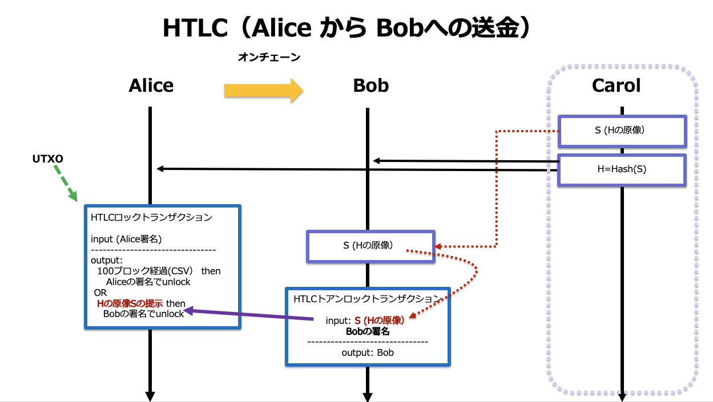
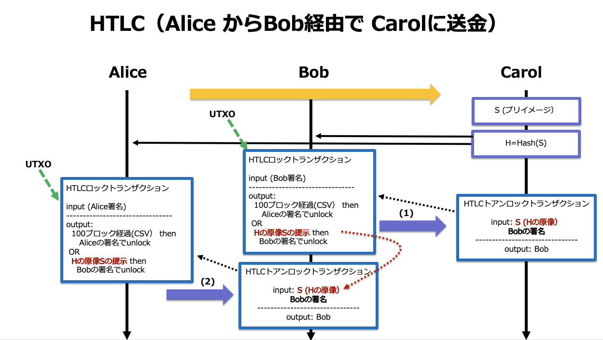

# 7. HTLCの作成

2022/08/13 更新　Shigeichiro Yamasaki

## Alice からBobに送金する



## Alice からBob経由で Carolに送金する



### redeem script (一般化したロックスクリプト)

注意!:　(`OP_CSV`は，初期のビットコインスクリプトの仕様ではリザーブされていたオペコードを使用しているので，旧仕様のノードにリジェクトされないように `OP_DROP`でスタックから取り除いています)

```
OP_IF
    OP_SHA256 <Secretのハッシュ値> OP_EQUALVERIFY 
    <Bobの公開鍵>
OP_ELSE
    <ロックするブロック数> OP_CSV 
    OP_DROP  
    <Aliceの公開鍵>
OP_ENDIF
OP_CHECKSIG
```

### unlocking script (Bobによるアンロックの場合）

```
<Bobの署名> 
<Secret> 
true
```

### unlocking script と redeem scriptの連接結果 (witness)

```
<Bobの署名> 
<Secret> 
true
------------連接--------------
OP_IF
    OP_SHA256 <Secretのハッシュ値> OP_EQUALVERIFY 
    <Bobの公開鍵>
OP_ELSE
    <ロックするブロック数> OP_CSV 
    OP_DROP  
    <Aliceの公開鍵>
OP_ENDIF
OP_CHECKSIG
```

1. スタックに， `<Bobの署名>` ，`<Secret>`，true　が順に積まれます
2. true が適用され，`OP_IF` 側の処理が実行されます
3. `<Secret>` の `OP_SHA256` の結果と `<Secretのハッシュ値>` が `OP_EQUALVERIFY` で比較されます
4. 等しければ，Bobの公開鍵による Bobの署名が検証され，成功すればロックが解除されます


## bitcoinrb でHTLCを実装

### 実行環境とアドレスの準備

```ruby
require 'bitcoin'
require 'net/http'
require 'json'
include Bitcoin::Opcodes
Bitcoin.chain_params = :signet
HOST="localhost"
PORT=38332          # mainnetの場合は 8332
RPCUSER="hoge"      # bitcoin core RPCユーザ名
RPCPASSWORD="hoge"  # bitcoin core パスワード
# bitcoin core RPC を利用するメソッド
def bitcoinRPC(method, params)
    http = Net::HTTP.new(HOST, PORT)
    request = Net::HTTP::Post.new('/')
    request.basic_auth(RPCUSER, RPCPASSWORD)
    request.content_type = 'application/json'
    request.body = { method: method, params: params, id: 'jsonrpc' }.to_json
    JSON.parse(http.request(request).body)["result"]
end
# Aliceのアドレス
addrAlice = bitcoinRPC("getnewaddress", [])
# Aliceの秘密鍵
privAlice = bitcoinRPC("dumpprivkey", [addrAlice])
# Aliceの鍵オブジェクト(WIF形式の秘密鍵から生成）
keyAlice = Bitcoin::Key.from_wif(privAlice)
# Aliceの公開鍵
pubkeyAlice = keyAlice.pubkey
# Aliceはデポジットする資金を持っている
bitcoinRPC('sendtoaddress',[addrAlice, 0.0001])
bitcoinRPC('sendtoaddress',[addrAlice, 0.0002])
bitcoinRPC('sendtoaddress',[addrAlice, 0.0003])
bitcoinRPC('sendtoaddress',[addrAlice, 0.0004])

# --- Bob側マシンでの準備 ----
# Bobのアドレス
addrBob = bitcoinRPC("getnewaddress", [])
# Bobの秘密鍵
privBob = bitcoinRPC("dumpprivkey", [addrBob])
# Bobの鍵オブジェクト(WIF形式の秘密鍵から生成）
keyBob = Bitcoin::Key.from_wif(privBob)
# Bobの公開鍵
pubkeyBob = keyBob.pubkey

```

### 秘密情報

`<Secret>` ：秘密情報　
この説明では　"HTLC_test"　とします。

```ruby
secret='HTLC_test'
secret_hash=Bitcoin.sha256(secret)
```

#### script処理のテスト(OP_SHA256の検証)

```ruby
# scriptのテスト
script = Bitcoin::Script.new << secret.bth << OP_SHA256 << secret_hash << OP_EQUAL
script.run
# => true
```

## Alice によるHTLCロックトランザクション作成メソッド


```ruby
# secret_hash 秘密情報のハッシュ値
# pubkeySND 送金者の公開鍵
# addrSND 送金者のアドレス
# pubkeyRSV 受領者の公開鍵
# lockDays　ロックする日数
def send_HTLC_lock_tx(secret_hash, pubkeySND, addrSND, pubkeyRSV, deposit, fee, lockDays)
    # 未署名のHTLC Lock トランザクションの生成
    unsigned_HTCL_lock_tx, redeem_script, p2wshaddr  = unsigned_HTCL_lock_transaction(secret_hash, pubkeySND, addrSND, pubkeyRSV, deposit, fee, lockDays)
    # HTLC Lock トランザクションへの署名
    signed_HTCL_lock_tx = bitcoinRPC('signrawtransactionwithwallet',[unsigned_HTCL_lock_tx.to_hex])
    htlc_lock_txid = bitcoinRPC('sendrawtransaction',[signed_HTCL_lock_tx["hex"]])
    return [htlc_lock_txid, redeem_script, p2wshaddr]
end
# HTLC redeem script作成メソッド
def redeem_script_HTLC(pubkeySND, pubkeyRSV, secret_hash, lockDays)
    # <ロックするブロック数> 10日間のブロック数（リトルエンディアン）
    locktime = (6*24*lockDays).to_bn.to_s(2).reverse.bth
    # redeem script
    redeem_script = Bitcoin::Script.new << OP_IF << OP_SHA256 << secret_hash << OP_EQUALVERIFY << pubkeyRSV << OP_ELSE << locktime << OP_CSV << OP_DROP << pubkeySND << OP_ENDIF << OP_CHECKSIG
    # redeem scriptの内容の確認
    return redeem_script
end
# 送金金額＋手数料をぎりぎり上回るUTXOリストの作成
def consuming_utxos(amount)
    # ワレットの未使用のUTXOの一覧を得る
    unspent = bitcoinRPC('listunspent', [])
    # 消費可能状態のUTXOの選定
    spendable_utxos = unspent.select{|t|t["spendable"]}
    # UTXOを金額で昇順にソートする
    sorted_utxos = spendable_utxos.sort_by{|x|x["amount"]}
    # 少額のUTXOから集めて，指定金額を上回るぎりぎりのUTXOのリストを作成する
    utxos=[]
    balance = 0
    begin
        utxos << sorted_utxos.shift
        balance = utxos.reduce(0){|s,t|s+=t["amount"]}
    end until balance >= amount
    return utxos
end
#未署名のHTLC Lock トランザクションの生成
def unsigned_HTCL_lock_transaction(secret_hash, pubkeySND, addrSND, pubkeyRSV, deposit, fee, lockDays)
    if bitcoinRPC('getbalance',[]) < (deposit+fee) then
        puts "you don't have enough funds for deposit"
    else
        # 送金金額＋手数料をぎりぎり上回るUTXOリストの作成とその総額
        utxos = consuming_utxos(deposit + fee)
        balance = utxos.map {|tx|tx[ "amount"]}.sum
        # HTLC のredeem scriptの生成
        redeem_script = redeem_script_HTLC(pubkeySND, pubkeyRSV, secret_hash, lockDays)
        # HTLCロックトランザクションの scriptPubKey
        scriptPubKey_p2wsh = Bitcoin::Script.from_string("0 #{redeem_script.to_sha256}")
        # P2WSH アドレスの生成   
        p2wshaddr = scriptPubKey_p2wsh.to_addr
        # お釣り
        change= balance-deposit-fee
        # それぞれの金額をSatoshiに変換
        deposit_satoshi = (deposit * (10**8)).to_i
        change_satoshi = (change * (10**8)).to_i
        # トランザクションテンプレートの生成
        tx = Bitcoin::Tx.new
        # inputの作成
        tx = make_inputs(tx, utxos)
        # デポジット用 P2WSH outputの作成
        tx.out << Bitcoin::TxOut.new(value: deposit_satoshi, script_pubkey:  Bitcoin::Script.parse_from_addr(p2wshaddr))
        # おつり用のP2WPKH outputの作成
        tx.out << Bitcoin::TxOut.new(value: change_satoshi , script_pubkey:  Bitcoin::Script.parse_from_addr(addrSND))
        return [tx, redeem_script.to_h[:asm], p2wshaddr]
    end
end
# トランザクションのinputの構成
def make_inputs(tx, utxos)
    utxos.each{|utxo|
        # UTXOをinputから参照するための txid と vout を得る
        outpoint = Bitcoin::OutPoint.from_txid(utxo["txid"], utxo["vout"])
        # 参照をトランザクションのinputに埋め込む
        tx.in << Bitcoin::TxIn.new(out_point: outpoint)
    }
    return tx
end
# 実行
htlc_lock_txid, redeem_script_htlc, p2wshaddr = send_HTLC_lock_tx(secret_hash, pubkeyAlice, addrAlice, pubkeyBob, 0.0003, 0.00002, 10)
```

## Bob によるHTCLアンロックトランザクションの作成

Bobの秘密鍵は、もともとBob側マシンで生成していたものとします

### Bob側のマシンの環境セットアップ

```ruby
require 'bitcoin'
require 'net/http'
require 'json'
include Bitcoin::Opcodes

Bitcoin.chain_params = :signet

HOST="localhost"
PORT=38332          # mainnetの場合は 8332
RPCUSER="hoge"      # bitcoin core RPCユーザ名
RPCPASSWORD="hoge"  # bitcoin core パスワード

# bitcoin core RPC を利用するメソッド
def bitcoinRPC(method, params)
    http = Net::HTTP.new(HOST, PORT)
    request = Net::HTTP::Post.new('/')
    request.basic_auth(RPCUSER, RPCPASSWORD)
    request.content_type = 'application/json'
    request.body = { method: method, params: params, id: 'jsonrpc' }.to_json
    JSON.parse(http.request(request).body)["result"]
end
```

### アンロックのためにBobが知っている（べき）情報

* Aliceの公開鍵
* Bobの公開鍵
* 秘密情報 `<Secret>` (Carolから開示される）
* redeem script (Aliceからもらう）
* HTLCロックトランザクションの トランザクションID (Aliceからもらう）
  * HTLCロックトランザクションの scriptPubKey
  * HTLCロックトランザクションのP2WSHアドレス
  * アンロックの対象となるUTXO のvout
  * アンロックの対象となるUTXO の金額

```ruby
def htlc_unlock_tx(htlc_lock_txid, secret, redeem_script_htlc , addrRSV, keyRSV, fee)
    # HTLC ロックトランザクション本体を得る
    htlc_lock_tx = Bitcoin::Tx.parse_from_payload(bitcoinRPC('getrawtransaction',[htlc_lock_txid]).htb)
    deposit_satoshi = htlc_lock_tx.outputs[0].value
    # アンロックによる報酬金額
    reward_satoshi = deposit_satoshi - ((fee * (10**8)).to_i)
    tx = Bitcoin::Tx.new
    # inputの作成
    htlc_utxo = Bitcoin::OutPoint.from_txid(htlc_lock_txid,0)
    tx.in << Bitcoin::TxIn.new(out_point: htlc_utxo)
    # 報酬用のP2PKH outputの作成
    script_pubkey_reward = Bitcoin::Script.parse_from_addr(addrRSV)
    tx.out << Bitcoin::TxOut.new(value: reward_satoshi, script_pubkey: script_pubkey_reward)
    # redeem_scriptの復元
    redeem_script = Bitcoin::Script.from_string(redeem_script_htlc)
    # アンロック対象UTXOのscriptPubKey
    scriptPubKey = htlc_lock_tx.outputs[0].script_pubkey
    # 署名対象のsighash
    sighash = tx.sighash_for_input(0, redeem_script, sig_version: :witness_v0, amount: deposit_satoshi, hash_type: Bitcoin::SIGHASH_TYPE[:all])
    # Bobの秘密鍵で署名 SHIGHASH_TYPE ALL
    signature = keyRSV.sign(sighash) + [Bitcoin::SIGHASH_TYPE[:all]].pack('C')
    tx.in[0].script_witness.stack << signature
    tx.in[0].script_witness.stack << secret
    tx.in[0].script_witness.stack << [1].pack("C")
    tx.in[0].script_witness.stack << redeem_script.to_payload
    return tx
end
# 実行
tx = htlc_unlock_tx(htlc_lock_txid, secret, redeem_script_htlc, addrBob, keyBob, 0.00002)
```

### unlocking script の確認

```ruby
tx.inputs[0].script_sig.run
=> true
```

## HTLC アンロックトランザクションのブロードキャスト

```ruby
htcl_unlockTx_txid = bitcoinRPC('sendrawtransaction',[tx.to_hex])

=> "70bef77420fd60d42b041b70434b5eae6f34cd6f2a9c724352ae084f242ebeea"
```
