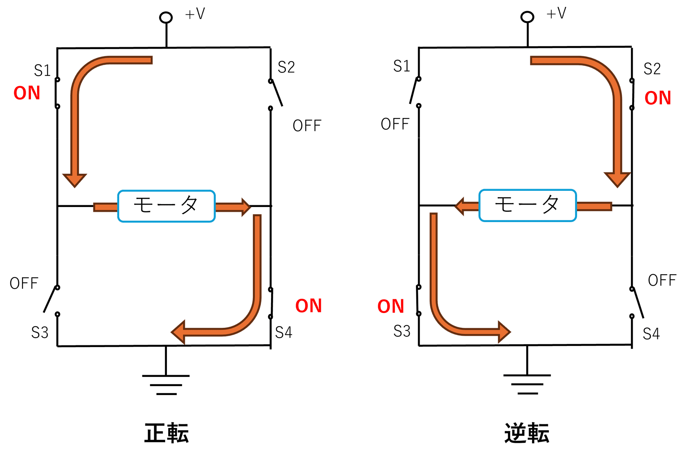
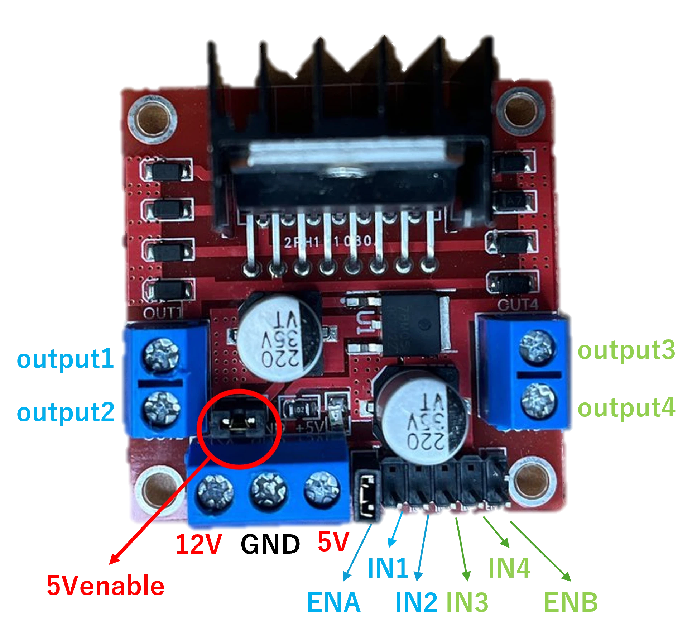

# モータードライバ L298N

2026/03/13

Shigeichiro Yamasaki

## データシート

[L298N Motor Driver Module](https://components101.com/modules/l293n-motor-driver-module)

### Hブリッジ

* Hブリッジ回路は、DCモータの回転方向を制御するために使われる回路構成
* Hブリッジ回路では、4つのスイッチ（トランジスタやMOSFET）を切り替えることでモータへの電流の流れを制御
* Hブリッジには4つのスイッチ（S1, S2, S3, S4）があり、それらの組み合わせによって以下のように動作します。




## L298 のpin 配置

* IN1, IN2（モータ1用）: モータ1の回転方向を制御します。
    * IN1をHIGH、IN2をLOWにするとモータが正転します。
    * IN1をLOW、IN2をHIGHにするとモータが逆転します。
* IN3, IN4（モータ2用）: モータ2の回転方向を制御します（同様の方法で制御します）。
* ENA, ENB: モータ1（ENA）、モータ2（ENB）のPWM信号を有効にします。
* OUT1, OUT2: モータ1への出力。
* OUT3, OUT4: モータ2への出力。
* 12V: モータに電源を供給するためのピンです。
* 5V: モジュール内のレギュレータによって生成される5V電源です。Raspberry Piの5Vピンに接続してロジック電源として使用できます。
* GND: 共通のGNDを接続する。




### L298 の制御方法

|IN1	|IN2	|モーター制御|
| :--|:--|:--|
|H	|H	|ブレーキ|
|H	|L	|正転|
|L	|H	|逆転|
|L	|L	|ブレーキ|

## PWM の有効化

初期設定ではPWM は無効になっている

### 設定ファイルの編集

```bash
sudo nano /boot/firmware/config.txt
```

```bash
# PWMを有効化 (GPIO 18, 19)
dtoverlay=pwm-2chan
```

* システムを再起動

### GPIO のピンの確認方法 


GPIO18 と GPIO19 で PWM が有効化されていることがわかる

```bash
pinctrl -p

 1:  1: 3v3
 2: 5v
 3: a0    pu | hi // GPIO2 = SDA1
 4: 5v
 5: a0    pu | hi // GPIO3 = SCL1
 6: gnd
 7: ip    pn | lo // GPIO4 = input
 8: a5    pn | hi // GPIO14 = TXD1
 9: gnd
10: a5    pu | hi // GPIO15 = RXD1
11: ip    pd | lo // GPIO17 = input
12: a5    pd | lo // GPIO18 = PWM0_0
13: ip    pd | lo // GPIO27 = input
14: gnd
15: ip    pd | lo // GPIO22 = input
16: ip    pd | lo // GPIO23 = input
17: 3v3
18: ip    pd | lo // GPIO24 = input
19: a0    pd | lo // GPIO10 = SPI0_MOSI
20: gnd
21: a0    pd | lo // GPIO9 = SPI0_MISO
22: ip    pd | lo // GPIO25 = input
23: a0    pd | lo // GPIO11 = SPI0_SCLK
24: op -- pu | hi // GPIO8 = output
25: gnd
26: op -- pu | hi // GPIO7 = output
27: ip    pu | hi // GPIO0 = input
28: ip    pu | hi // GPIO1 = input
29: ip    pu | hi // GPIO5 = input
30: gnd
31: ip    pu | hi // GPIO6 = input
32: ip    pd | lo // GPIO12 = input
33: ip    pd | lo // GPIO13 = input
34: gnd
35: a5    pd | lo // GPIO19 = PWM0_1
36: ip    pd | lo // GPIO16 = input
37: ip    pd | lo // GPIO26 = input
38: ip    pd | lo // GPIO20 = input
39: gnd
40: ip    pd | lo // GPIO21 = input
```

## python ライブラリ

## raspberry pi のGPIO との接続

ENA のジャンパーピンを取り外す


GPIO23(17) --> IN1
GPIO24(18) --> IN2
GPIO12(32) --> ENA

## プログラム


* l298.py

```python
import RPi.GPIO as GPIO          
from time import sleep

#GPIO初期設定

# LHS enable
enA=12
# L_FWD
in1=23
# L_REV
in2=24

GPIO.setmode(GPIO.BCM) # Broadcom pin-numbering scheme
GPIO.setup(enA,GPIO.OUT)
GPIO.setup(in1,GPIO.OUT)
GPIO.setup(in2,GPIO.OUT)

# pwm = GPIO.PWM([チャンネル], [周波数(Hz)]) 
p1=GPIO.PWM(enA,1000)
p1.start(50)

# run R
GPIO.output(enA,GPIO.HIGH)
GPIO.output(in1,GPIO.HIGH)
GPIO.output(in2,GPIO.LOW)

# run L
GPIO.output(enA,GPIO.HIGH)
GPIO.output(in1,GPIO.LOW)
GPIO.output(in2,GPIO.HIGH)

# 速度変更
p1.ChangeDutyCycle(25)
p1.ChangeDutyCycle(70)
p1.ChangeDutyCycle(90)

# stop
GPIO.output(enA,GPIO.LOW)
GPIO.output(in1,GPIO.LOW)
GPIO.output(in2,GPIO.LOW)

# cleanup
GPIO.cleanup()

```