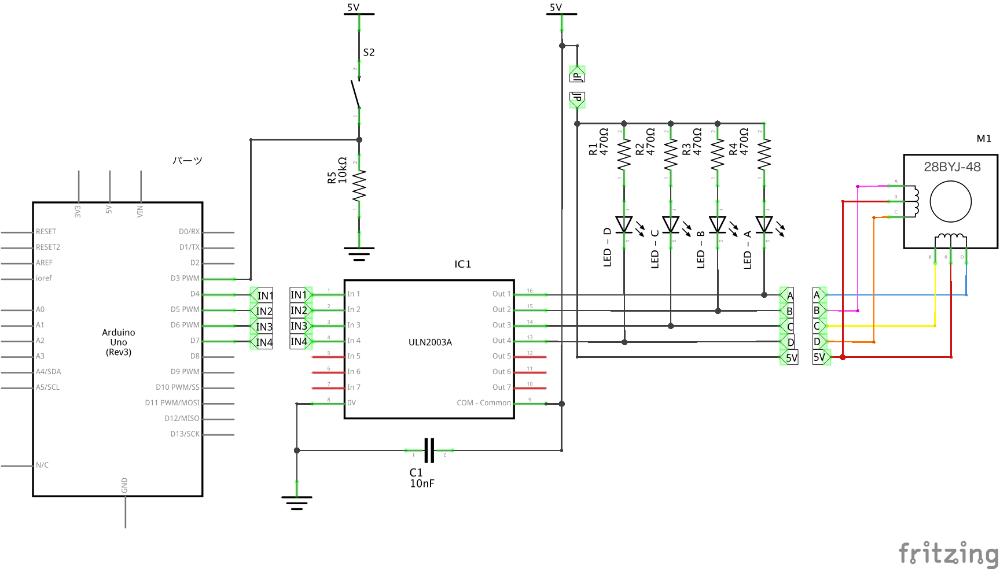

# ステッピングモーター

2026/03/11

## ５V ステッピングモーター(28BYJ-48)

1. 定格電圧：DC5V　4相
2. 絶縁抵抗：>10MΩ (500V)
3. 誘電強度：600V AC / 1mA / 1s
4. ステップ角度：5.625 x 1/64
5. 直流抵抗：200Ω±7% (25C)
6. 減速比：1/64、絶縁等級：A
7. 無負荷周波数引き：>600Hz
8. 無負荷周波数抜く：>1000Hz
9. 引きトルク: >34.3mN.m(120Hz)
10. 戻りトルク: >34.3mN.m
11. 温度上昇：40K(120Hz)

## ドライバーボード (ULN2003)

* [データシート](chrome-extension://efaidnbmnnnibpcajpcglclefindmkaj/https://akizukidenshi.com/goodsaffix/uln2003.pdf)
* [資料](chrome-extension://efaidnbmnnnibpcajpcglclefindmkaj/https://akizukidenshi.com/goodsaffix/TD62003APG_datasheet_ja_20091029.pdf)
  
  

## arduino 接続

* D4  --> IN1
* D5  --> IN2
* D6  --> IN3
* D7  --> IN4


## AArduino プログラム

* Stepperライブラリを利用
* 「ツール」-> 「ライブラリを管理...」
* Stepper をインストール

```arduino
#include <Stepper.h>

const int stepsPerRevolution = 2048;  // 1回転のステップ数
const int A = 4;
const int B = 6;
const int C = 5;
const int D = 7;

Stepper myStepper(stepsPerRevolution, A, B, C, D);

void setup() {
    myStepper.setSpeed(15);
}

void loop()
{
  myStepper.step(2048);
  delay(1000);
  myStepper.step(-2048);
  delay(1000);
}
```