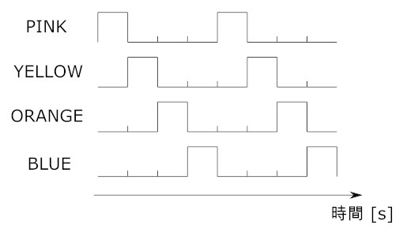
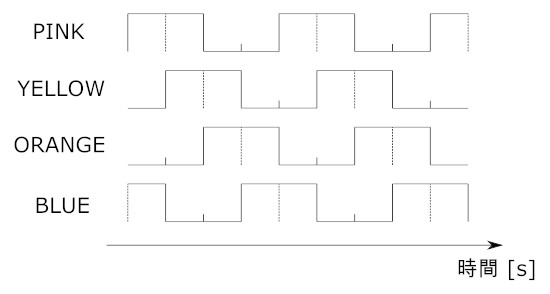
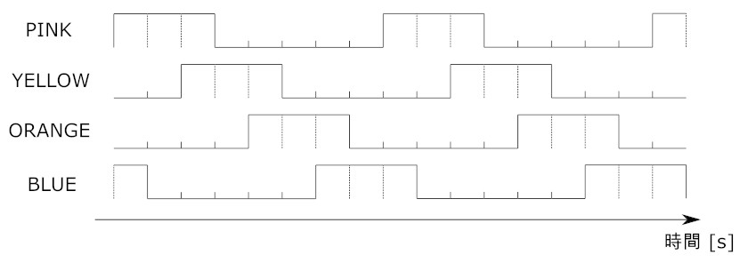
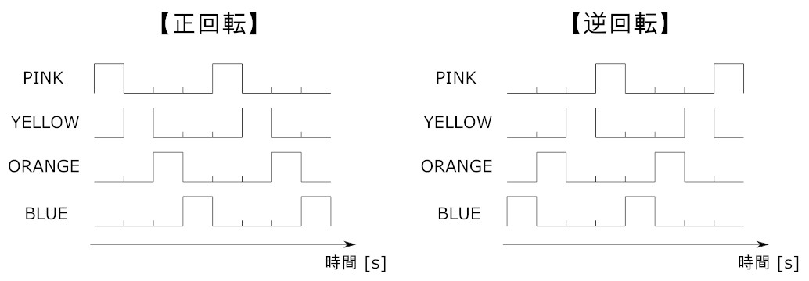
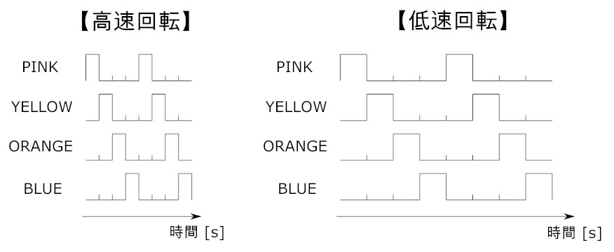

# ステッピングモータ28BYJ-48 ULN2003ドライバー

2026/03/18

Shigeichiro Yamasaki

## 構成

* 28BYJ-48 ULN2003ドライバーボードセット
* 5V 電源
* raspberry pi 4

## 28BYJ-48 はユニポーラ型ステッピングモータ

* 1相励起


* 2相励起
  
* 1-2相励磁
  
* 逆回転
  
* 回転速度
  

## 回転速度

###  1相励磁、2相励磁

* 5.625°回転 → 32 パルス
* 360°回転   → 2048 パルス

### 1-2相励起

* 5.625°回転  → 64 パルス
* 360°回転    → 4096 パルス

## プログラム （２相励起）

* 28BYJ-48.py

```python
#coding:utf-8

#GPIOライブラリをインポート
import RPi.GPIO as GPIO

#timeライブラリをインポート
import time

#collectionsライブラリのdequeオブジェクトをインポート
from collections import deque

#ピン番号の割当方式を「コネクタピン番号」に設定
GPIO.setmode(GPIO.BOARD)

#使用するピン番号を代入
IN_1=11
IN_2=12
IN_3=13
IN_4=15

#各ピンを出力ピンに設定し、初期出力をローレベルにする
GPIO.setup(IN_1,GPIO.OUT,initial=GPIO.LOW)
GPIO.setup(IN_2,GPIO.OUT,initial=GPIO.LOW)
GPIO.setup(IN_3,GPIO.OUT,initial=GPIO.LOW)
GPIO.setup(IN_4,GPIO.OUT,initial=GPIO.LOW)

#出力信号パターンのリストを作成
#（1相励磁 or 2相励磁どちらかを選択）
#sig = deque([0,1,0,0])        #1相励磁
sig = deque([1,1,0,0])       #2相励磁

#回転させる角度をdegで入力
ang = 360

#角度degをパルス数に換算
p_cnt = int(ang / (5.625 / 32))

#回転方向を定義（-1が時計回り、1が反時計回り）
dir = 1

#パルス幅を変数に入力
#値が小さい程回転速度は上がる。0.002より小さい値にすると回転しない
p_wid = 0.002


#時計回りに1回転、反時計回りに1回転する
for i in range(0,2):
    #パルス出力開始
    for j in range(0,p_cnt):
        
        #出力信号パターンを出力
        GPIO.output(IN_1, sig[0])
        GPIO.output(IN_2, sig[1])
        GPIO.output(IN_3, sig[2])
        GPIO.output(IN_4, sig[3])
        
        #パスル幅分待機
        time.sleep(p_wid)
        
        #出力信号パターンをローテート
        sig.rotate(dir)
    #回転方向を逆向きにする
    dir = dir * -1
    #1秒待機
    time.sleep(1.0)
    #カウントアップ
    i += 1


#メッセージを表示
print("End of program")
    

#GPIOを開放
GPIO.cleanup()
```