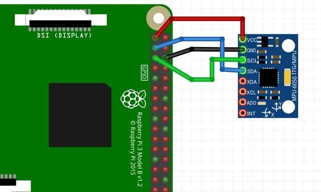

# 倒立振子 Raspberry pi Zero

2026/03/29

Shigeichiro Yamasaki

## 構成

* Raspberry pi 4
* DCモータ
* 加速度ジャイロセンサー：MPU6050
* モータ・ドライバ：TB6612FGN

## raspberry pi のハードウェア PWM 制御

python の GPIOライブラリはソフトウェア PWM なので，正確な波形を出力することは難しい

### PWM 制御ペア
* GPIO18-GPIO12
* GPIO13-GPIO19

上記のペアで異なる PWM 周波数を出力することはできない

### pythonからのハードウェアPWM利用ライブラリ

* インストール
```bash
sudo pip install rpi-hardware-pwm --break-system-packages
```

* /boot/config.txt を編集

Channel0に設定したPWMをGPIO18から、Channel1に設定したPWMをGPIO19から出力する場合

```
[all]
## 中略 ##
dtoverlay=pwm-2chan,pin=12,func=4,pin2=13,func2=4
```

* python コード

```python
import sys
from rpi_hardware_pwm import HardwarePWM
```


## 電源

* 単三 × ４個 約 6V
* モバイルバッテリー：5V
  
## 接続

### 使用するピン番号

* AIN1=11 # GPIO17
* AIN2=7  # GPIO4
* BIN1=29 # GPIO5
* BIN2=31 # GPIO6
* PWMA=33 # GPIO13
* PWMB=35 # GPIO19

## MPU6050

I2C 接続



* VCC --> 1pin 3.3v
* GND --> 9pin GND
* 3pin SDA=3 # GPIO2
* 4pin SCL=5 # GPIO3

### GPIOの設定状態確認

```bash
pinctrl -p

 1: 3v3
 2: 5v
 3: a0    pu | hi // GPIO2 = SDA1
 4: 5v
 5: a0    pu | hi // GPIO3 = SCL1
 6: gnd
 7: ip    pu | hi // GPIO4 = input
 8: a5    pn | hi // GPIO14 = TXD1
 9: gnd
10: a5    pu | hi // GPIO15 = RXD1
11: ip    pd | lo // GPIO17 = input
12: a5    pd | lo // GPIO18 = PWM0_0
13: ip    pd | lo // GPIO27 = input
14: gnd
15: ip    pd | lo // GPIO22 = input
16: ip    pd | lo // GPIO23 = input
17: 3v3
18: ip    pd | lo // GPIO24 = input
19: ip    pd | lo // GPIO10 = input
20: gnd
21: ip    pd | lo // GPIO9 = input
22: ip    pd | lo // GPIO25 = input
23: ip    pd | lo // GPIO11 = input
24: ip    pu | hi // GPIO8 = input
25: gnd
26: ip    pu | hi // GPIO7 = input
27: ip    pu | hi // GPIO0 = input
28: ip    pu | hi // GPIO1 = input
29: ip    pu | hi // GPIO5 = input
30: gnd
31: ip    pu | hi // GPIO6 = input
32: ip    pd | lo // GPIO12 = input
33: ip    pd | lo // GPIO13 = input <--PWMA
34: gnd
35: a5    pd | lo // GPIO19 = PWM0_1 <--PWMB
36: ip    pd | lo // GPIO16 = input
37: ip    pd | lo // GPIO26 = input
38: ip    pd | lo // GPIO20 = input
39: gnd
40: ip    pd | lo // GPIO21 = input
```

#### I2C

* 3: a0    pu | hi // GPIO2 = SDA1
* 5: a0    pu | hi // GPIO3 = SCL1

#### モータードライバ

*  回転速度
  * 1相励磁、2相励磁
     * 5.625°回転 → 32 パルス
     * 360°回転   → 2048 パルス
   * 1-2相励起
     * 5.625°回転  → 64 パルス
     * 360°回転    → 4096 パルス

### I2C デバイスのアドレスを確認する

```bash
sudo i2cdetect -y 1

     0  1  2  3  4  5  6  7  8  9  a  b  c  d  e  f
00:                         -- -- -- -- -- -- -- -- 
10: -- -- -- -- -- -- -- -- -- -- -- -- -- -- -- -- 
20: -- -- -- -- -- -- -- -- -- -- -- -- -- -- -- -- 
30: -- -- -- -- -- -- -- -- -- -- -- -- -- -- -- -- 
40: -- -- -- -- -- -- -- -- -- -- -- -- -- -- -- -- 
50: -- -- -- -- -- -- -- -- -- -- -- -- -- -- -- -- 
60: -- -- -- -- -- -- -- -- 68 -- -- -- -- -- -- -- 
70: -- -- -- -- -- -- -- --   
```

MPU-6050のアドレスは「0x68」

## 本体の物理的状態

### 質量 M

本体：375g
車輪：48g
車軸と重心までの距離：5cm
車輪直径：5.7cm

## ジャイロ加速度センサー MPU-6050

### 加速度センサー

* X,Y,Z 軸
* 16bit それぞれ２バイト
* 単位：1G = 9.8m/s^2
* X軸：左右方向加速度
* Y軸：前後方向加速度
* Z軸：上下方向加速度 

### ジャイロセンサー（角速度）

* X,Y,Z 軸
* 16bit それぞれ２バイト
* 単位：250°/s
* X軸：前後傾斜変化(後＋, 前ー)
* Y軸：前後傾斜変化(右＋，左ー)
* Z軸：水平方向変化(左＋，右ー）

## 制御の基本方針

1. 加速度と角速度を読む
2. 相補フィルターで傾きを推定する
3. 目標角度との誤差を計算する
4. PIDでモータへの指令を計算する
5. PWM＋方向をモータードライバに送信

## 相補フィルター

* 短時間変化はジャイロ
* 長期変化は加速度

### 軸の検出


加速度から得る角度： 
$$ \theta_{\text{acc}} $$
 （ドリフトしないがノイズあり）

$$\theta_{\text{gyro}}(t) = \int \omega(t)\,dt$$


## プログラム

### ジャイロ加速度センサー MPU-6050


```python
import time
import math
from smbus2 import SMBus

# =========================
# MPU6050 register map
# =========================
MPU6050_ADDR = 0x68

PWR_MGMT_1   = 0x6B
CONFIG       = 0x1A
SMPLRT_DIV   = 0x19
ACCEL_CONFIG = 0x1C
GYRO_CONFIG  = 0x1B

ACCEL_XOUT_H = 0x3B
GYRO_XOUT_H  = 0x43

I2C_BUS = 1  # Raspberry Pi 4 は通常 1


class MPU6050:
    def __init__(self, bus_num=1, address=0x68):
        self.address = address
        self.bus = SMBus(bus_num)

        # sleep解除
        self.bus.write_byte_data(self.address, PWR_MGMT_1, 0x00)
        time.sleep(0.1)

        # サンプルレート設定
        # sample_rate = gyro_output_rate / (1 + SMPLRT_DIV)
        # DLPF有効時 gyro_output_rate = 1kHz
        self.bus.write_byte_data(self.address, SMPLRT_DIV, 0x09)  # 約100Hz

        # 内蔵DLPF設定
        # 0x03: gyro ~44Hz, accel ~44Hz
        self.bus.write_byte_data(self.address, CONFIG, 0x03)

        # 加速度レンジ ±2g
        self.bus.write_byte_data(self.address, ACCEL_CONFIG, 0x00)

        # ジャイロレンジ ±250 deg/s
        self.bus.write_byte_data(self.address, GYRO_CONFIG, 0x00)

        time.sleep(0.1)

    def read_i2c_word(self, reg):
        high = self.bus.read_byte_data(self.address, reg)
        low = self.bus.read_byte_data(self.address, reg + 1)
        value = (high << 8) | low
        if value >= 0x8000:
            value = -((65535 - value) + 1)
        return value

    def get_accel_data(self):
        raw_ax = self.read_i2c_word(ACCEL_XOUT_H)
        raw_ay = self.read_i2c_word(ACCEL_XOUT_H + 2)
        raw_az = self.read_i2c_word(ACCEL_XOUT_H + 4)

        # ±2g -> 16384 LSB/g
        ax = raw_ax / 16384.0
        ay = raw_ay / 16384.0
        az = raw_az / 16384.0
        return ax, ay, az

    def get_gyro_data(self):
        raw_gx = self.read_i2c_word(GYRO_XOUT_H)
        raw_gy = self.read_i2c_word(GYRO_XOUT_H + 2)
        raw_gz = self.read_i2c_word(GYRO_XOUT_H + 4)

        # ±250 deg/s -> 131 LSB/(deg/s)
        gx = raw_gx / 131.0
        gy = raw_gy / 131.0
        gz = raw_gz / 131.0
        return gx, gy, gz

    def close(self):
        self.bus.close()


class ComplementaryFilter:
    """
    相補フィルター
    angle = alpha * (angle + gyro_rate * dt) + (1 - alpha) * accel_angle
    """
    def __init__(self, alpha=0.98, initial_angle=0.0):
        self.alpha = alpha
        self.angle = initial_angle
        self.initialized = False

    def update(self, accel_angle, gyro_rate, dt):
        if not self.initialized:
            self.angle = accel_angle
            self.initialized = True
        else:
            gyro_pred = self.angle + gyro_rate * dt
            self.angle = self.alpha * gyro_pred + (1.0 - self.alpha) * accel_angle
        return self.angle


def calc_pitch_from_accel(ax, ay, az):
    """
    加速度から pitch 角を計算
    センサ取り付け方向に応じて符号や軸は調整が必要
    """
    pitch_rad = math.atan2(ax, math.sqrt(ay * ay + az * az))
    return math.degrees(pitch_rad)


def calc_roll_from_accel(ax, ay, az):
    """
    参考: roll 角
    """
    roll_rad = math.atan2(ay, math.sqrt(ax * ax + az * az))
    return math.degrees(roll_rad)


def calibrate_gyro(mpu, samples=500, sleep_sec=0.002):
    print("ジャイロオフセットを測定中です。センサを静止させてください...")
    gx_sum = 0.0
    gy_sum = 0.0
    gz_sum = 0.0

    for _ in range(samples):
        gx, gy, gz = mpu.get_gyro_data()
        gx_sum += gx
        gy_sum += gy
        gz_sum += gz
        time.sleep(sleep_sec)

    gx_offset = gx_sum / samples
    gy_offset = gy_sum / samples
    gz_offset = gz_sum / samples

    print(f"gyro offset: gx={gx_offset:.4f}, gy={gy_offset:.4f}, gz={gz_offset:.4f}")
    return gx_offset, gy_offset, gz_offset


def main():
    mpu = MPU6050(bus_num=I2C_BUS, address=MPU6050_ADDR)

    # 倒立振子で使うなら 0.97～0.995 くらいで調整
    comp_filter = ComplementaryFilter(alpha=0.98)

    gx_offset, gy_offset, gz_offset = calibrate_gyro(mpu)

    prev_time = time.perf_counter()

    print("計測開始: Ctrl+C で終了")
    print(" ax[g]    ay[g]    az[g]   pitch_acc[deg]  gyro_y[deg/s]  pitch_comp[deg]")

    try:
        while True:
            now = time.perf_counter()
            dt = now - prev_time
            prev_time = now

            ax, ay, az = mpu.get_accel_data()
            gx, gy, gz = mpu.get_gyro_data()

            # ジャイロオフセット補正
            gx -= gx_offset
            gy -= gy_offset
            gz -= gz_offset

            # 加速度から角度
            pitch_acc = calc_pitch_from_accel(ax, ay, az)

            # 相補フィルター
            # どの軸のジャイロを使うかは取り付け方向次第
            # 多くの場合 gy または gx を使うので実機で確認
            pitch_comp = comp_filter.update(
                accel_angle=pitch_acc,
                gyro_rate=gy,
                dt=dt
            )

            print(
                f"{ax:7.3f}  {ay:7.3f}  {az:7.3f}  "
                f"{pitch_acc:12.3f}  {gy:12.3f}  {pitch_comp:14.3f}"
            )

            time.sleep(0.01)  # 約100Hz

    except KeyboardInterrupt:
        print("\n終了します。")

    finally:
        mpu.close()


if __name__ == "__main__":
    main()
```

### DCモータ

* RpiMotorLib モジュールをインストール

```bash
pip3 install RpiMotorLib  --break-system-packages
```

```python
#coding:utf-8

#GPIOライブラリをインポート
import RPi.GPIO as GPIO

#timeライブラリをインポート
import time

#collectionsライブラリのdequeオブジェクトをインポート
from collections import deque

#ピン番号の割当方式を「コネクタピン番号」に設定
GPIO.setmode(GPIO.BOARD)

# 右モータ
#* IN_1=11 # GPIO17
#* IN_2=12 # GPIO18
#* IN_3=13 # GPIO27
#* IN_4=15 # GPIO22
### 左モータ
#* IN_1=18 # GPIO24
#* IN_2=22 # GPIO25
#* IN_3=29 # GPIO5
#* IN_4=31 # GPIO6

#使用するピン番号を代入
LIN_1=11
LIN_2=12
LIN_3=13
LIN_4=15

RIN_1=18
RIN_2=22
RIN_3=29
RIN_4=31

#各ピンを出力ピンに設定し、初期出力をローレベルにする
GPIO.setup(LIN_1,GPIO.OUT,initial=GPIO.LOW)
GPIO.setup(LIN_2,GPIO.OUT,initial=GPIO.LOW)
GPIO.setup(LIN_3,GPIO.OUT,initial=GPIO.LOW)
GPIO.setup(LIN_4,GPIO.OUT,initial=GPIO.LOW)

GPIO.setup(RIN_1,GPIO.OUT,initial=GPIO.LOW)
GPIO.setup(RIN_2,GPIO.OUT,initial=GPIO.LOW)
GPIO.setup(RIN_3,GPIO.OUT,initial=GPIO.LOW)
GPIO.setup(RIN_4,GPIO.OUT,initial=GPIO.LOW)

#出力信号パターンのリストを作成
#（1相励磁 or 2相励磁どちらかを選択）
#sig = deque([0,1,0,0])        #1相励磁
sig = deque([1,1,0,0])       #2相励磁

#回転させる角度をdegで入力
ang = 360

#角度degをパルス数に換算
p_cnt = int(ang / (5.625 / 32))

#回転方向を定義（-1が時計回り、1が反時計回り）
dir = 1

#パルス幅を変数に入力
#値が小さい程回転速度は上がる。0.002より小さい値にすると回転しない
p_wid = 0.002


#時計回りに1回転、反時計回りに1回転する
for i in range(0,2):
    #パルス出力開始
    for j in range(0,p_cnt):
        
        #出力信号パターンを出力
        GPIO.output(LIN_1, sig[0])
        GPIO.output(LIN_2, sig[1])
        GPIO.output(LIN_3, sig[2])
        GPIO.output(LIN_4, sig[3])
                #出力信号パターンを出力
        GPIO.output(RIN_1, sig[0])
        GPIO.output(RIN_2, sig[1])
        GPIO.output(RIN_3, sig[2])
        GPIO.output(RIN_4, sig[3])

        #パスル幅分待機
        time.sleep(p_wid)
        
        #出力信号パターンをローテート
        sig.rotate(dir)
    #回転方向を逆向きにする
    dir = dir * -1
    #1秒待機
    time.sleep(1.0)
    #カウントアップ
    i += 1


#メッセージを表示
print("End of program")
    

#GPIOを開放
GPIO.cleanup()
```

