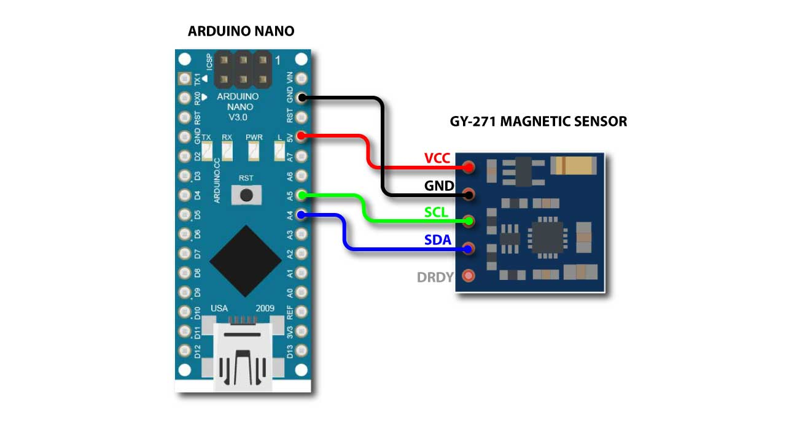
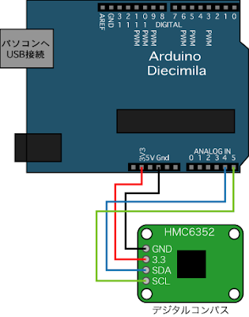

# 磁気コンパス

2-26/03/11

## GY271 (HMC5883L)

精度は１〜２度の磁気コンパス（12 bit）

### 接続

* 5v  --> VCC
* GND --> GND
* A5  --> SCL
* A4  --> SDA




### Arduino

[HMC5883L_Simple ライブラリ](https://github.com/sleemanj/HMC5883L_Simple)

#### Arduino IDE に HMC5883L_Simple ライブラリをインストール

* 「ツール」-> 「ライブラリを管理...」
* HMC5883L で検索してライブラリをインストール

#### HMC5883L_Simple ライブラリでの地磁気補正

* 地域ごとの地磁気に関する情報  http://www.magnetic-declination.com/ 

* 福岡の緯度，経度（33,130)
* 福岡の偏角：西に８度
* 福岡の伏角：48度


```
Compass.SetDeclination(-8, 48, 'W');  
float heading = Compass.GetHeadingDegrees();
```


#### プログラム

```arduino
#include <Arduino.h>
#include <Wire.h>
#include <HMC5883L_Simple.h>

HMC5883L_Simple Compass;
void setup()
{
  Serial.begin(9600);
  Wire.begin();
  Compass.SetDeclination(-8, 48, 'W');  
  Compass.SetSamplingMode(COMPASS_SINGLE);
  Compass.SetScale(COMPASS_SCALE_088);
  Compass.SetOrientation(COMPASS_HORIZONTAL_X_NORTH);
}

void loop()
{
   float heading = Compass.GetHeadingDegrees();
   
   Serial.print("Heading: \t");
   Serial.println( heading );   
   delay(100);
}

```

## 補正

|方位| センサー値| 誤差|補正|
| :--| :--| :--|:--|
|0|350
|45|
|90|98
|135|
|180|196
|225|
|270|270
|315|


# HMC6352

* I2C通信で０.０〜３５９.９度（０.１度ずつ）の分解能

## arduino 接続

* VDD --> 3.3v
* GND --> GND
* SDA --> A4
* SCL --> A5



## Arduino プログラム

* HMC6325のデフォルトのI2Cアドレスは１６進数の「0x42」

```arduino

//I2C通信ライブラリを取り込む
#include <Wire.h>

//デジタルコンパスモジュールのアドレス設定
int compassAddress = 0x42 >> 1; //=0x21
//読み込み値（角度）の変数を用意
int reading = 0; 
 
void setup() {
  //I2C通信開始 
  Wire.begin();
  //角度表示のためのシリアル通信開始
  //Serial.begin(9600);
  
  //Continuous Modeに設定する
  Wire.beginTransmission(compassAddress);
  //RAM書き込み用コマンド
  Wire.send('G');
  //書き込み先指定
  Wire.send(0x74);
  //モード設定
  Wire.send(0x72);
  //通信終了
  Wire.endTransmission();
  //処理時間
  delayMicroseconds(70);
} 
  
void loop() {
  //デバイスに２バイト分のデータを要求する
  Wire.requestFrom(compassAddress, 2);
  //要求したデータが２バイト分来たら
  if(Wire.available()>1){
    //１バイト分のデータの読み込み 
    reading = Wire.receive();
    //読み込んだデータを８ビット左シフトしておく
    reading = reading << 8;
    //次の１バイト分のデータを読み込み
    //一つ目のデータと合成（２バイト）
    reading += Wire.receive();
    //２バイト分のデータを１０で割る
    reading /= 10; 
    Serial.println(reading);
  } 
  //処理のために少し待つ（20Hz）
  delay(50);
}
```