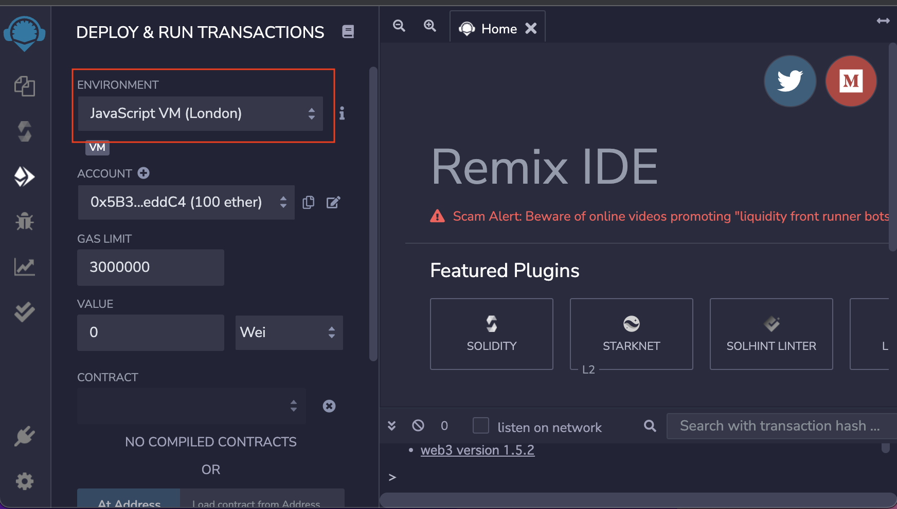
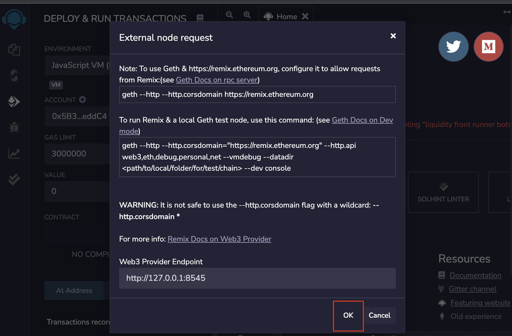
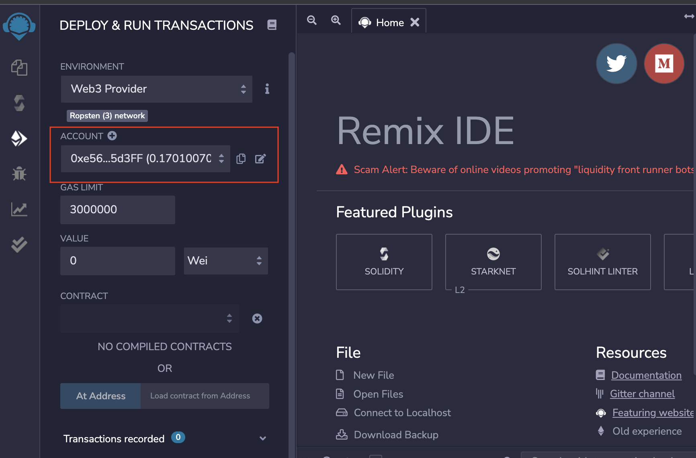
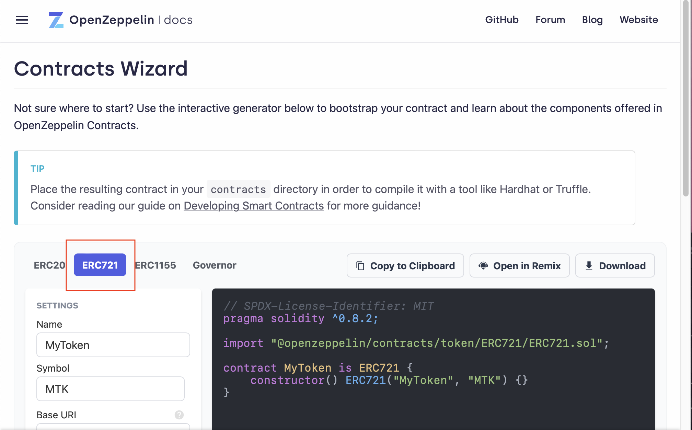

# Ethereum ERC721トークンの作成


[Openzeppelinの Contract Wizard](https://docs.openzeppelin.com/contracts/4.x/wizard) を利用

[REMIX](https://remix.ethereum.org/#optimize=false&runs=200&evmVersion=null&version=soljson-v0.8.7+commit.e28d00a7.js)で EthereumのRopsten テストネットワークにデプロイする

### 前提

* [geth で ropstenネットワークに接続](https://github.com/ShigeichiroYamasaki/yamalabo/blob/master/ethereum-Ropsten.md) faucetを利用して、テスト用のEtherを持つアカウントを準備している


## 自分のノードでgethを起動しRemix と接続する

ropsten ネットワーク
--http.corsdomain　オプションでREMIXサイト `https://remix.ethereum.org` を指定して http接続する

```
$ geth --ropsten --syncmode "snap" --datadir "./ropsten" --http --http.corsdomain https://remix.ethereum.org --http.api "eth,net,web3,admin,miner,txpool,personal" --allow-insecure-unlock -- console 2>> ./ropsten/geth_err.log


Welcome to the Geth JavaScript console!

instance: Geth/v1.10.15-stable/darwin-arm64/go1.17.5
coinbase: 0xe56e63c5cc3c062ee39d725e1d241b126e75d3ff
at block: 11960558 (Sun Feb 13 2022 23:44:12 GMT+0900 (JST))
 datadir: /Users/shigeichiroyamasaki/Ethereum/ropsten
 modules: admin:1.0 debug:1.0 eth:1.0 ethash:1.0 miner:1.0 net:1.0 personal:1.0 rpc:1.0 txpool:1.0 web3:1.0

To exit, press ctrl-d or type exit
> 

```

### アカウントに ether をあることを確認

```
> eth.getBalance(eth.accounts[0])
170100701298074633
> eth.getBalance(eth.accounts[1])
101000000000000000
```

## REMIXの設定

### DEPLOY & RUN TRANSACTIONSの設定

* ENVIRONMENTのネットワークとして `web3 Provider`  を選択する



* External node request を確認して、OKをクリックする





* ACCOUNTのところにEtherを所持するアカウントが設定されていることを確認する





## Openzeppelinのウィザードサイト

ERC721ボタンをクリックする




### ERC721 コントラクトの作成

#### NFTの対象となるデータを決める

ここでは、githubのこのページを対象にします。


#### NFTの名前を決定する

### NFTの通貨記号を決める

### 
