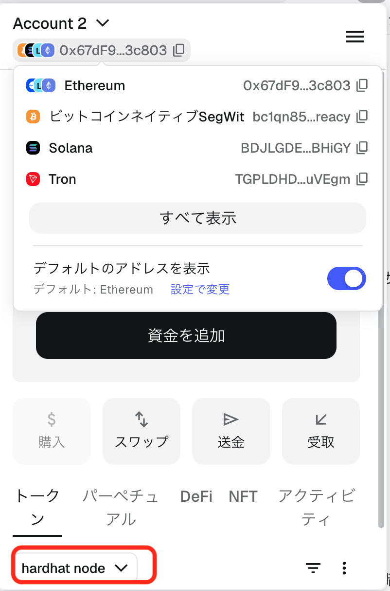
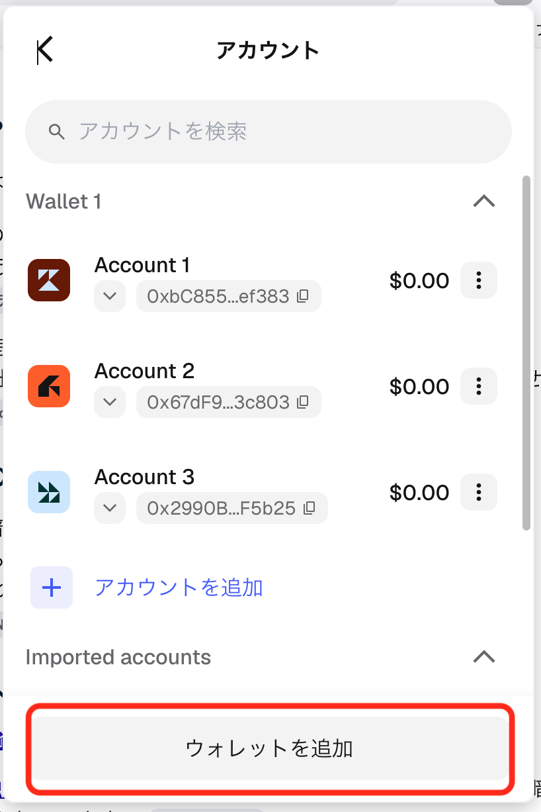
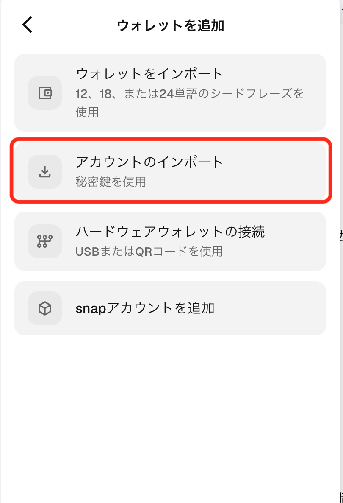
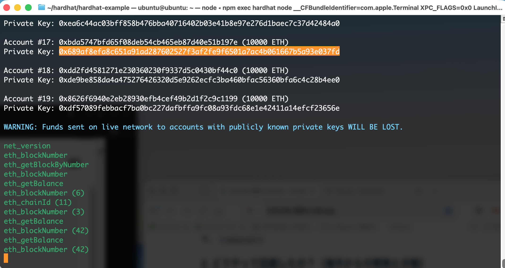
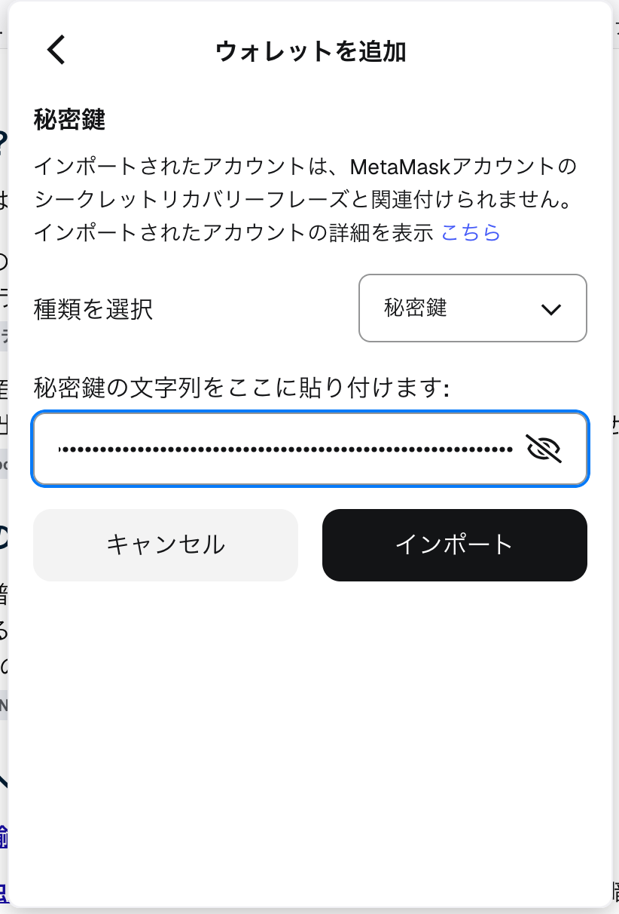
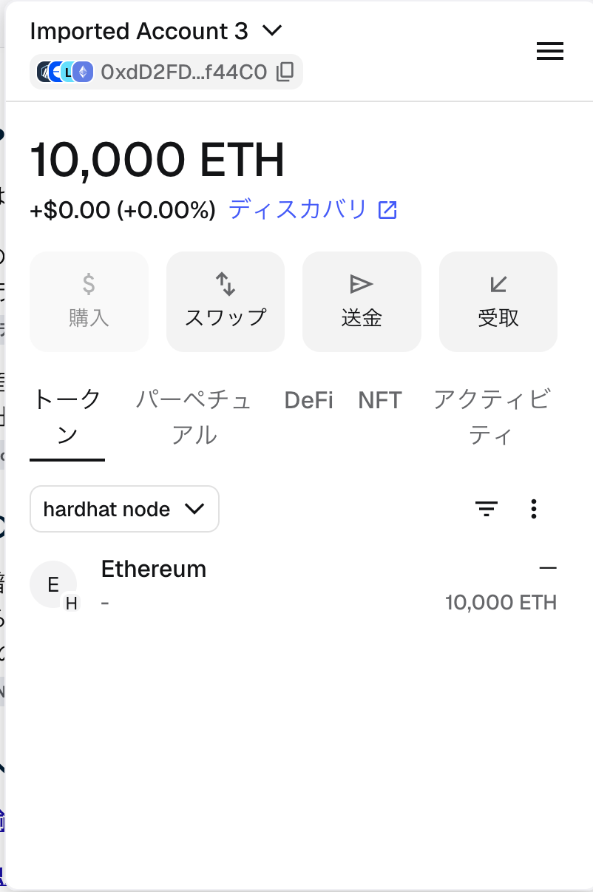

# 01. Hardhat 3  のチュートリアル

Ethereum の開発環境

2026/06/18

Shigeichiro Yamasaki

hardhat 3 は，hardhat 2 と多くの相違点があります

* EVM と対話するラッピングクライアントのデフォルトが，Ethers.js から viem に変更された
* テスト言語に solidityが追加され，Chai, moca から Node test runner がデフォルトになった
* TypeScript と ESM がデフォルトになった
* 複数のチェーンへの同時接続が可能になった


##  <a id="setup">環境のセットアップ</a>

* hardhat node はローカルマシンで実行することを前提にします
* Node.js と JavaScript と TypeScript の知識が前提になります

### ubuntu

```bash
sudo apt update
sudo apt upgrade -y
sudo apt install -y curl git tree
cd ~
curl -o- https://raw.githubusercontent.com/nvm-sh/nvm/v0.40.3/install.sh | bash
\. "$HOME/.nvm/nvm.sh"
source ~/.profile

nvm install node
npm install -g yarn

node -v
=>
v26.3.0
```
* VS code のインストール

```bash
sudo snap install --classic code
```

### MacOSX

```bash
brew update
brew upgrade
brew install curl git tree
source $(brew --prefix nvm)/nvm.sh
echo 'source $(brew --prefix nvm)/nvm.sh' >> ~/.zprofile
source ~/.zprofile

cd ~
curl -o- https://raw.githubusercontent.com/nvm-sh/nvm/v0.40.3/install.sh | bash
\. "$HOME/.nvm/nvm.sh"

nvm install node
npm install -g yarn

node -v
=>
v26.3.0
```

* VS code のインストール

[https://code.visualstudio.com/download](https://code.visualstudio.com/download) からインストーラーをダウンロード

## <a id="project">Hardhat プロジェクトの新規作成</a>

### プロジェクトフォルダの作成

プロジェクトのフォルダを決めます．

★ このディレクトリを「プロジェクトルート」といいます．

```bash
cd ~
mkdir hardhat
cd hardhat/
mkdir hardhat-example
cd hardhat-example
```

* ここでは，プロジェクトルートを hardhat-example という名前のフォルダにしますが，適宜自分のプロジェクト名に修正してください

### VS codeを利用する場合

拡張機能のインストール

* Japanese Language Pack for Visual Studio Code
* Hardhat Developer Pack

プロジェクトルートのディレクトリを VS code  から指定

### JavaScript プロジェクトの作成

init コマンドでプロジェクトのフォルダ群を自動生成します．
また，このパスがプロジェクトの起点となる「プロジェクトルート」になります．
設定ファイルは，package.json というファイルです．


### Hardhat 3 の初期化

初期化コマンド

```bash
npx hardhat --init
```
実行後


```bash
 █████  █████                         ███  ███                  ███      ██████
░░███  ░░███                         ░███ ░███                 ░███     ███░░███
 ░███   ░███   ██████  ████████   ███████ ░███████    ██████  █████
 ░██████████  ░░░░░███░░███░░███ ███░░███ ░███░░███  ░░░░░███░░░███░      
 ░███░░░░███   ███████ ░███ ░░░ ░███ ░███ ░███ ░███   ███████  ░███      ░
 ░███   ░███  ███░░███ ░███     ░███ ░███ ░███ ░███  ███░░███  ░███ ███ 
 █████  █████░░███████ █████    ░░███████ ████ █████░░███████  ░░█
░░░░░  ░░░░░  ░░░░░░░ ░░░░░      ░░░░░░░ ░░░░ ░░░░░  ░░░░░░░    ░░░░░   ░░░░░░
 
👷 Welcome to Hardhat v3.9.0 👷

? Which version of Hardhat would you like to use? … 
❯ Hardhat 3 (recommended for new projects)
  Hardhat 2 (older version)


```

* Hardhat ３を選択して，return キーを押す
* Project type: “A minimal Hardhat project” n
* Install dependencies: yes

### Hardhat 3 のヘルプ

以下のようにして help を確認できます

```bash
npx hardhat --help
=>
Hardhat version 3.9.0

Usage: hardhat [GLOBAL OPTIONS] <TASK> [SUBTASK] [TASK OPTIONS] [--] [TASK ARGUMENTS]

AVAILABLE TASKS:

...
```

### hardhat のTask 

コンパイルなど Hardhat のコマンドラインから実行する処理のこと

実行形式  `npx hardhat <タスク>` 


*  build    |         プロジェクト全体のコンパイルとartifactsの構築
*  clean    |         キャッシュや artifacts の全データの消去
*  compile  |         プロジェクト全体のコンパイルとartifactsの構築t (alias for build)
*  console  |         hardhat console を開く
*  flatten  |         依存関係のあるコントラクトコードをすべてフラットに出力
*  node     |         Hardhat NetworkサーバーとJSON-RPCの起動
*  run      |         プロジェクトのユーザ定義のスクリプトの実行
*  telemetry|         設定の更新と確認
*  test     |         テストの実行
*  verify             explorer を利用したコントラクトの検証

### プロジェクトのディレクトリ構成

hardhat プロジェクトのディレクトリは以下のような構成になっている

```bash
tree -L 1
=>
.
├── AGENTS.md
├── CLAUDE.md -> AGENTS.md
├── contracts
├── hardhat.config.ts
├── ignition
├── node_modules
├── package-lock.json
├── package.json
├── README.md
├── scripts
├── test
└── tsconfig.json

6 directories, 7 files
```

さらにその下の構造を確認してください

```bash
tree contracts -L 1
=>
contracts
├── Counter.sol
└── Counter.t.sol

1 directory, 2 files

tree test -L 1    
=> 
test
└── Counter.ts

1 directory, 1 file


tree ignition -L 1 
=>
ignition
└── modules

2 directories, 0 files

tree scripts -L 1 
=>
scripts
└── send-op-tx.ts

1 directory, 1 file
```


## <a id="compile">スマートコントラクトの作成とコンパイル</a>

* プロジェクトルート・ディレクトリにいることを確認する

### Solidity プログラムの作成 （contracts/Counter.sol）

* contractディレクトリの下に Solidity言語のプログラムのファイルを作成します．
* ここでは, サンプルとして自動生成されている Counter.sol というファイル名のコントラクトを利用します.
* Solidityプログラムのソースコードには .sol という拡張子をつけます．

contracts/Counter.sol

```js
// SPDX-License-Identifier: UNLICENSED
pragma solidity ^0.8.28;

contract Counter {
  uint public x;

  event Increment(uint by);

  function inc() public {
    x++;
    emit Increment(1);
  }

  function incBy(uint by) public {
    require(by > 0, "incBy: increment should be positive");
    x += by;
    emit Increment(by);
  }
}

```


### コントラクトのコンパイル

以下の hardhat の build タスクを実行してください

```bash
npx hardhat build
=>
Compiled 2 Solidity files with solc 0.8.28 (evm target: cancun)
```

### コンパイル結果の確認

#### artifacts ディレクトリ

* コンパイル結果のABIやバイトコードなどのオブジェクトは artifacts ディレクトリに格納されます

artifacts ディレクトリ以下を3階層まで木構造表示させると以下のような構造が見えます

```bash
tree artifacts -L 3
=>
artifacts
├── artifacts.d.ts
├── build-info
│   ├── solc-0_8_28-5882f7cb354dbef8443184e631e287fcc6849be2.json
│   └── solc-0_8_28-5882f7cb354dbef8443184e631e287fcc6849be2.output.json
└── contracts
    ├── Counter.sol
    │   ├── artifacts.d.ts
    │   └── Counter.json
    └── Counter.t.sol
        └── CounterTest.json

5 directories, 6 files
```


#### コンパイル結果のファイル

artifacts/contracts の下にある `'コントラクト名.sol` ディレクトリの下の `コントラクト名.json` にJSON形式になったコンパイル結果があります．

```bash
cat artifacts/contracts/Counter.sol/Counter.json 
=>
{
  "_format": "hh3-artifact-1",
  "contractName": "Counter",
  "sourceName": "contracts/Counter.sol",
  "abi": [
    {
      "anonymous": false,
      "inputs": [
        {
          "indexed": false,
          "internalType": "uint256",
          "name": "by",
          "type": "uint256"
        }
      ],


...

```

## <a id="test"> コントラクトのテスト</a>

hardhat 3 から，solidity と TypeSctipt でテスト記述できるようになりました．


### Solidity による単体テスト

単体テストは Solidity で記述することにメリットが多いです．

Solidity のでテストプログラムは，ファイル名の拡張子が `.t.sol` になります

* contract/Counter.t.sol

```solidity
// SPDX-License-Identifier: UNLICENSED
pragma solidity ^0.8.28;

import {Counter} from "./Counter.sol";
import {Test} from "forge-std/Test.sol";

contract CounterTest is Test {
  Counter counter;

  function setUp() public {
    counter = new Counter();
  }

  function test_InitialValue() public view {
    require(counter.x() == 0, "Initial value should be 0");
  }

  function testFuzz_Inc(uint8 x) public {
    for (uint8 i = 0; i < x; i++) {
      counter.inc();
    }
    require(counter.x() == x, "Value after calling inc x times should be x");
  }

  function test_IncByZero() public {
    vm.expectRevert();
    counter.incBy(0);
  }
}


```

#### このテストプログラムの概要

* unit テスト
  * test_InitialValue 関数と test_IncByZero 関数
  * パラメータが無く，テストの実行は1回だけ
* fuzz テスト
  * testFuzz_Inc 関数
  * ランダムな入力を入れて複数回テストが実行される
  * テストが失敗したときは，そのインプットが示される


#### テストの実行

以下のようにテストすると，すべてのテストが実行されます

```bash
npx hardhat test
=>
No contracts to compile

Running Solidity tests

  contracts/Counter.t.sol:CounterTest
    ✔ test_InitialValue()
    ✔ test_IncByZero()
    ✔ testFuzz_Inc(uint8) (runs: 256)

Running node:test tests

  Counter
    ✔ Should emit the Increment event when calling the inc() function
    ✔ The sum of the Increment events should match the current value


5 passing (3 solidity, 2 nodejs)

```

#### テストの実行内容

1. コントラクトとテストのコンパイル
2. test/ ディレクトリの下のスクリプトが統合される
3. コントラクトやテストがデプロイされる
4. すべてのテストが実施され，失敗しているテスト項目は failed と記載される


#### solidity のテストのみを行う場合

```bash
npx hardhat test solidity
Compiling your Solidity contracts...

Nothing to compile
Running Solidity tests

  contracts/Counter.t.sol:CounterTest
    ✔ test_InitialValue()
    ✔ test_IncByZero()
    ✔ testFuzz_Inc(uint8) (runs: 256)


  3 passingå
```

### アサーション・ライブラリの利用

#### ファンドリーのアサーションライブラリの追加

```bash
npm add --save-dev "foundry-rs/forge-std#v1.11.0"

npx hardhat test solidity
```


### TypeScript テスト

solidityによるテストは，EVM で，実際の動かすことができるという利点があります．

しかし，solidity 言語はテスト用言語としては記述力が貧弱です．
例えば，非同期処理のテストなどはできません．
TypeScript のテストフレームワークを利用して補強することができます．

TypeScript のテストフレームワークである [Node.js test runner](https://nodejs.org/api/test.html) を利用したテストができます

#### Node.js test runner の基本

* 名前付きテスト

```ts
test("足し算", () => {
  assert.equal(1 + 2, 3);
});
```

* 非同期テスト

```ts
test("非同期", async () => {
  const v = await Promise.resolve(42);
  assert.equal(v, 42);
});
```

* サブテスト

```ts
test("配列操作 (with hooks)", async (t) => {
  let arr: number[];

  await t.beforeEach(() => { arr = [1, 2, 3]; });
  await t.afterEach(() => { arr = []; });

  await t.test("push", () => {
    arr.push(4);
    assert.deepEqual(arr, [1, 2, 3, 4]);
  });

  await t.test("length", () => {
    assert.equal(arr.length, 3);
  });
});
```

### test/Counter.ts の例

```ts
import assert from "node:assert/strict";
import { describe, it } from "node:test";

import { network } from "hardhat";

describe("Counter", async function () {
  const { viem } = await network.create();
  const publicClient = await viem.getPublicClient();

  it("Should emit the Increment event when calling the inc() function", async function () {
    const counter = await viem.deployContract("Counter");

    await viem.assertions.emitWithArgs(
      counter.write.inc(),
      counter,
      "Increment",
      [1n],
    );
  });

  it("The sum of the Increment events should match the current value", async function () {
    const counter = await viem.deployContract("Counter");
    const deploymentBlockNumber = await publicClient.getBlockNumber();

    // run a series of increments
    for (let i = 1n; i <= 10n; i++) {
      await counter.write.incBy([i]);
    }

    const events = await publicClient.getContractEvents({
      address: counter.address,
      abi: counter.abi,
      eventName: "Increment",
      fromBlock: deploymentBlockNumber,
      strict: true,
    });

    // check that the aggregated events match the current value
    let total = 0n;
    for (const event of events) {
      total += event.args.by;
    }

    assert.equal(total, await counter.read.x());
  });
});


```

#### TypeScriptテストのみの実行

```bash
npx hardhat test nodejs
=>
Running node:test tests

  Counter
    ✔ Should emit the Increment event when calling the inc() function
    ✔ The sum of the Increment events should match the current value


  2 passing (506ms)

```


### ブロックチェーンネットワークと対話するスクリプト

`scripts` ディレクトリに記述する TypeScript スクリプトでブロックチェーンネットワークと対話することができます

* scripts/send-op-tx.ts の例

```ts
import { network } from "hardhat";

const { viem } = await network.create({
  network: "hardhatOp",
  chainType: "op",
});

console.log("Sending transaction using the OP chain type");

const publicClient = await viem.getPublicClient();
const [senderClient] = await viem.getWalletClients();

console.log("Sending 1 wei from", senderClient.account.address, "to itself");

const l1Gas = await publicClient.estimateL1Gas({
  account: senderClient.account.address,
  to: senderClient.account.address,
  value: 1n,
});

console.log("Estimated L1 gas:", l1Gas);

console.log("Sending L2 transaction");
const tx = await senderClient.sendTransaction({
  to: senderClient.account.address,
  value: 1n,
});

await publicClient.waitForTransactionReceipt({ hash: tx });

console.log("Transaction sent successfully");


```

* スクリプトの実行

```bash
npx hardhat run scripts/send-op-tx.ts
=>
Sending transaction using the OP chain type
Sending 1 wei from 0xf39fd6e51aad88f6f4ce6ab8827279cfffb92266 to itself
Estimated L1 gas: 1600n
Sending L2 transaction
Transaction sent successfully

```

## コントラクトのデプロイ

hardhat にはデプロイを宣言的に記述できる Hardhat Ignition というシステムがあります．

コントラクトのデプロイの定義は Ignition Module によって実現されています．

* Ignition module は，`ignition/modules/` ディレクトリに定義します
* ignition/modules/Counter.ts の例

```ts
import { buildModule } from "@nomicfoundation/hardhat-ignition/modules";

export default buildModule("CounterModule", (m) => {
  const counter = m.contract("Counter");

  m.call(counter, "incBy", [5n]);

  return { counter };
});

```

このプログラムの `m.call()` や `m.contract()` は，デプロイを実行する関数です．

[ignition module 定義の詳しい説明](https://hardhat.org/ignition/docs/guides/creating-modules)


* デプロイの実行

```bash
npx hardhat ignition deploy ignition/modules/Counter.ts
=>
You are running Hardhat Ignition against an in-process instance of Hardhat Network.
This will execute the deployment, but the results will be lost.
You can use --network <network-name> to deploy to a different network.

Hardhat Ignition 🚀

Deploying [ CounterModule ]

Batch #1
  Executed CounterModule#Counter

Batch #2
  Executed CounterModule#Counter.incBy

[ CounterModule ] successfully deployed 🚀

Deployed Addresses

CounterModule#Counter - 0x5FbDB2315678afecb367f032d93F642f64180aa3

```

この例では，コントラクトは Hardhat Network にデプロイされていますが，メインネットやテストネットなど他のネットワークへのデプロイも可能です．


## Solidityによるテストの記述方法

### Solidityテストプログラムの記述場所

* test/ ディレクトリの場合： 拡張子 .sol
* ontracts/ディレクトリの場合： 拡張子 .t.sol

例えば `contracts/CounterTest.t.sol` あるいは `test/CounterTest.sol` というテストプログラムが存在した場合

```solidity
contract CounterTest {
    function testInc() public {
        Counter counter = new Counter();
        counter.inc();
        require(counter.count() == 1, "count should be 1");
    }
}
```

テストランナーは，CounterTest コントラクトをコンパイルしてデプロイし，testInc 関数を call します．
また，hardhat は fuzz test などもサポートしています．

```solidity
contract CounterTest {
    function testIncBy(uint by) public {
        Counter counter = new Counter();
        counter.incBy(by);
        require(counter.count() == by, "count should match the 'by' value");
    }
}

```

### アサーションライブラリ

上の例の  fuzz test において失敗したとき，`testIncBy(uint by)` の by という引数の値を知ることは solidity ではできません．もっとよいエラーメッセージを得るために，forge-std というライブラリを利用できます．

これを利用するためには以下のようにしてインストールします


```bash
npm install --save-dev github:foundry-rs/forge-std
```

そしてこのライブラリから，Test というコントラクトをインポートして継承できるようになります．

assertEq というヘルパー関数を利用することで，不一致のときの値を表示できるようになります．

```ts
import { Test } from "forge-std/Test.sol";

contract CounterTest is Test {
    function testIncBy(uint by) public {
        Counter counter = new Counter();
        counter.incBy(by);
        assertEq(counter.count(), by, "count should match the 'by' value");
    }
}
```


### SetUp 関数

すべてのテストにおいて共通に利用するロジックを事前に行う関数です

```solidity
contract CounterTest {
    Counter counter;

    function setUp() public {
      counter = new Counter();
    }

    function testInc() public {
        counter.inc();
        require(counter.count() == 1, "count should be 1");
    }

    function testIncBy(uint by) public {
        counter.incBy(by);
        require(counter.count() == by, "count should match the 'by' value");
    }
}
```


### Solidityテストの実行

* 全テストの実行
  
```bash
npx hardhat test
```

* solidity テストのみの実行
  
```bash
npx hardhat test solidity
```

* 指定したファイル群のみの実行

```bash
npx hardhat test <test-file-1> <test-file-2> ...
```

## hardhat で viem を利用する方法

### セットアップ

* viem プラグインのインストール

```bash
npm install --save-dev @nomicfoundation/hardhat-viem
```

* hardhat.config.ts の修正

```ts
...
import hardhatViem from "@nomicfoundation/hardhat-viem";

const config: HardhatUserConfig = {
  plugins: [
    hardhatViem,
    // ...other plugins...
  ],
  // ...other config...
};

export default config;
```


### ネットワークへの接続

hardhat の network マネージャの network connections を使ってネットワークに接続します

```ts
import { network } from "hardhat";

const connection = await network.connect();
```

viem を拡張した hardhat-viem プラグインはこのネットワーク接続機能のヘルパーを提供します

```ts
const { viem } = await network.connect();

const publicClient = await viem.getPublicClient();
console.log("Latest block number:", await publicClient.getBlockNumber());
```

### viem クライアントの利用方法

hardhat-viem プラグインは viem クライアントを簡単に利用できるようにします．

* viem クライアントの生成
public client は，getPublicClient メソッドによって生成することができます．

```ts
const { viem } = await network.connect();

const publicClient = await viem.getPublicClient();

console.log("Latest block number:", await publicClient.getBlockNumber());

```

* ワレットの生成
getWalletClients メソッドによって Hardhatの設定に従ってワレットクライアントの配列を返します

```ts
const [senderClient, receiverClient] = await viem.getWalletClients();

await senderClient.sendTransaction({
  to: receiverClient.account.address,
  value: 10n ** 18n,
});
```


### コントラクトのデプロイと操作

hardhat-viem にはデプロイ機能もあります．deployContract 関数でデプロイを行います．
この関数の返り値は viem contract instance です

```ts
import { network } from "hardhat";

const { viem } = await network.connect();
const counter = await viem.deployContract("Counter");

await counter.write.inc();

console.log("Counter value:", await counter.read.x());
```

コンストラクターが引数を持つ場合は，第2引数で渡すことができます

```ts
const initialValue = 10n;
const counter = await viem.deployContract("Counter", [initialValue]);
```
デフォルトでは 定義された最初のアカウントからデプロイされますが，デプロイするアカウントを指定することもできます

```ts
const [wallet1, wallet2] = await viem.getWalletClients();

const counter = await viem.deployContract("Counter", [10n], {
  client: {
    wallet: wallet2,
  },
});
```

deployContract関数は，デプロイが完了するまで待ちます．
マイニングが完了する以前にデプロイのトランザクションを送信したい場合 sendDeploymentTransaction 関数を使います

```ts
const { deploymentTransaction } = await viem.sendDeploymentTransaction(
  "Counter",
  [10n],
  {
    client: {
      wallet: wallet2,
    },
  }
);

```


### viem ベース処理のテストアサーション

hardhat-viem-assertions プラグインによる TypeScriptテストの定義方法です

* 呼び出した関数が期待したイベントを発生していることを確認するテスト

```ts
it("Should emit the Increment event when calling the inc() function", async function () {
  const counter = await viem.deployContract("Counter");

  await viem.assertions.emitWithArgs(
    counter.write.inc(),
    counter,
    "Increment",
    [1n]
  );
});

```


## <a id="hhNetwork"> Hardhar Networkの起動</a>

* ここから新しく別のターミナルを開く
* プロジェクトルートに移動する

### hardhat node の起動

* 自分のマシンのローカル環境にテスト用の Ethereum Network Node を起動します
* 自動的に20個のアカウント（EOA) が生成されます
* 自動生成されたアカウントはそれぞれ 10000 Eth の資金を所有しています

```bash
npx hardhat node

=>
Started HTTP and WebSocket JSON-RPC server at http://127.0.0.1:8545/

Accounts
========

WARNING: These accounts, and their private keys, are publicly known.
Any funds sent to them on Mainnet or any other live network WILL BE LOST.

Account #0: 0xf39Fd6e51aad88F6F4ce6aB8827279cffFb92266 (10000 ETH)
Private Key: 0xac0974bec39a17e36ba4a6b4d238ff944bacb478cbed5efcae784d7bf4f2ff80

...

Account #19: 0x8626f6940E2eb28930eFb4CeF49B2d1F2C9C1199 (10000 ETH)
Private Key: 0xdf57089febbacf7ba0bc227dafbffa9fc08a93fdc68e1e42411a14efcf23656e

WARNING: These accounts, and their private keys, are publicly known.
Any funds sent to them on Mainnet or any other live network WILL BE LOST.

```

* 各アカウントのアドレスと秘密鍵を確認してください


## メタマスクの利用

有名なethrerum ワレットです


左下のネットワーク接続メニューを選択



カスタムネットワークを追加ボタンをクリック

「ネットワークを手動で追加」をクリック

* ネットワーク名： hardhat network
* 新しいRPC URL： http://localhost:8545/
* チェーンID： 31337
* 通貨記号： ETH

で「保存」をクリックしてネットワークに接続します

### メタマスクにアカウントを取り込む


* ウォレットを追加
  

* 

* コンソールの秘密鍵を一つ選んでコピーする
 

* 秘密鍵をペーストして「インポート」する
* 


### アカウントに 10000 ETH の所持金があることを確認する

* 複数のアカウントを取り込み，ETH の送金などを試してください




## コントラクトのデプロイ

### デプロイスクリプトの作成

ファイル名

```bash
ignition/modules/Counter.ts
```

TypeScript のコード

```ts
import { buildModule } from "@nomicfoundation/hardhat-ignition/modules";

export default buildModule("CounterModule", (m) => {
  const counter = m.contract("Counter");

  m.call(counter, "incBy", [5n]);

  return { counter };
});
```

このコードで Counter コントラクトのインスタンスがデプロイされ，`incBy(5)` が call されます．

### ローカルノードへのデプロイの実行


* デプロイするネットワークは `--network ` で指定します

```bash
npx hardhat ignition deploy ignition/modules/Counter.ts --network localhost

=>
Hardhat Ignition 🚀

Deploying [ CounterModule ]

Batch #1
  Executed CounterModule#Counter

Batch #2
  Executed CounterModule#Counter.incBy

[ CounterModule ] successfully deployed 🚀

Deployed Addresses

CounterModule#Counter - 0x5FbDB2315678afecb367f032d93F642f64180aa3
```