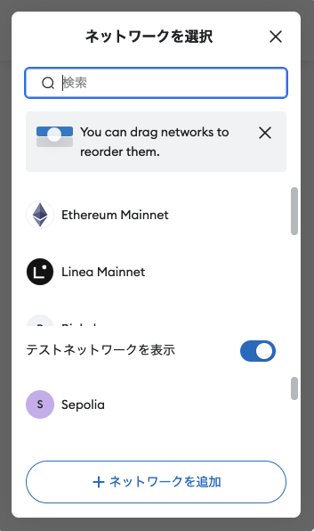

# 01. Hardhat のチュートリアル

Ethereum の開発環境

2025/02/07
Shigeichiro Yamasaki

* [環境のセットアップ](#setup)
* [Hardhat プロジェクトの新規作成](#project)
* [スマートコントラクトの作成とコンパイル](#compile)
* [コントラクトのテスト](#test)
* [Hardhar Networkへのデプロイ](#hhNetwork)


##  <a id="setup">環境のセットアップ</a>

* hardhat node はローカルマシンで実行することを前提にします
* Node.js と JavaScriptの知識が前提になります

### ubuntu

```bash
sudo apt update
sudo apt upgrade -y
sudo apt install -y curl git tree
curl https://raw.githubusercontent.com/creationix/nvm/master/install.sh | bash
source ~/.profile

nvm install --lts
npm install -g yarn

node -v
=>
v22.13.1
```
* VS code のインストール

```bash
sudo snap install --classic code
```

### MacOSX

```bash
brew update
brew upgrade
brew install curl git tree
source $(brew --prefix nvm)/nvm.sh
echo 'source $(brew --prefix nvm)/nvm.sh' >> ~/.zprofile
source ~/.zprofile

nvm install 22.13.1
npm install -g yarn

node -v
=>
v22.13.1
```

* VS code のインストール

[https://code.visualstudio.com/download](https://code.visualstudio.com/download) からインストーラーをダウンロード

## <a id="project">Hardhat プロジェクトの新規作成</a>

### プロジェクトフォルダの作成

プロジェクトのフォルダを決めます．

★ このディレクトリを「プロジェクトルート」といいます．

```bash
cd ~
mkdir hardhat
cd hardhat/
mkdir tutorial
cd tutorial
```

* ここでは，プロジェクトルートを hardhat/tutolial という名前のフォルダにしますが，適宜自分のプロジェクト名に修正してください

### VS codeを利用する場合

拡張機能のインストール

* Japanese Language Pack for Visual Studio Code
* Hardhat Developer Pack

プロジェクトルートのディレクトリをVS codenpm  から指定

### JavaScript プロジェクトの作成

init コマンドでプロジェクトのフォルダ群を自動生成します．
また，このパスがプロジェクトの起点となる「プロジェクトルート」になります．
設定ファイルは，package.json というファイルです．

```bash
yarn init -y
```

### Hardhat パッケージモジュールのインストール

```bash
yarn add --dev hardhat
```

### Hardhat の初期化

初期化コマンド `npx hardhat init` 実行後に

▶ Create a JavaScript project を選択（キーボードの矢印キーを使って）

プロジェクトルートディレクトリに，空の hardhat.config.js ファイルを作成します．

```bash
npx hardhat init
```

```bash
=>
888    888                      888 888               888
888    888                      888 888               888
888    888                      888 888               888
8888888888  8888b.  888d888 .d88888 88888b.   8888b.  888888
888    888     "88b 888P"  d88" 888 888 "88b     "88b 888
888    888 .d888888 888    888  888 888  888 .d888888 888
888    888 888  888 888    Y88b 888 888  888 888  888 Y88b.
888    888 "Y888888 888     "Y88888 888  888 "Y888888  "Y888

Welcome to Hardhat v2.22.5

? What do you want to do? … 
▸ Create a JavaScript project
  Create a TypeScript project
  Create a TypeScript project (with Viem)
  Create an empty hardhat.config.js
  Quit


```

### プロジェクトのディレクトリ構成

hardhat プロジェクトのディレクトリは以下のような構成になっている

```
tree -L 1

=>
.
├── README.md
├── contracts
├── hardhat.config.js
├── ignition
├── node_modules
├── package-lock.json
├── package.json
└── test

5 directories, 4 files
```

### 余計なファイルの削除

hardhat は Lock という名前のサンプルのスマートコントラクトとテストプログラムを生成してくれます．

特に害はありませんが，ここでは余計なので削除してしまいます

```bash
rm contracts/Lock.sol
rm test/Lock.js
rm ignition/modules/Lock.js
```

### hardhat のTask 

コンパイルなど Hardhat のコマンドラインから実行する処理のこと

実行形式  `npx hardhat <タスク>` 

* clean   :          キャッシュや artifacts の全データの消去
* compile :          プロジェクト全体のコンパイルとartifactsの構築
* console :          hardhat console の起動
* coverage:         テストのためのコードの適用範囲のレポート表示
* flatten :          	依存関係のあるコントラクトコードをすべてフラットに出力
* node    :          	Hardhat Networkに対するJSON-RPC server の起動
* run     :          	ユーザ定義のスクリプトの実行
* test    :          	mocha test の実行
* verify  :           Etherscan や Sourcify を利用したコントラクトの検証
* ignition:		        hardhat Ignitionを利用したコントラクトのデプロイ


## <a id="compile">スマートコントラクトの作成とコンパイル</a>

* プロジェクトルート・ディレクトリにいることを確認する

### Solidity プログラムの作成

* contractディレクトリの下に Solidity言語のプログラムのファイルを作成します．
* ここでは, Token.sol というファイル名にします.
* Solidityプログラムのソースコードには .sol という拡張子をつけます．

#### プログラムの内容

* マップデータとしてトークンを生成し
* マップの更新によってアカウント間でトークンの送金を行う

★ nano エディタではなく VScode を利用しても良いです．

```bash
nano contracts/Token.sol
```
ファイルの内容

* 単純にコピー／ペーストするのではなく，すべての行を読んでください
* 特にコメントをよく読んでください

```js
//SPDX-License-Identifier: MIT
pragma solidity ^0.8.0;

// Token コントラクトの定義
contract Token {
    // トークン名と通貨記号
    string public name = "Kindai Token";
    string public symbol = "KDT";
    // トークンの発行総量
    uint256 public totalSupply = 1000000;
    // 最初の所有者（発行者）のアドレス
    address public owner;
    // アカウントごとのトークンの所持金残高を管理するマップ
    mapping(address => uint256) balances;
    // 外部にこのコントラクトによる送金の発生を伝えるためのイベント
    // indexed を付けることで送金者や受領者のアドレスでイベントを検索できるようになる
    event Transfer(address indexed _from, address indexed _to, uint256 _value);

    /**
     * コンストラクタによるコントラクトの初期化
     */
    constructor() {
        // トークンの総量がこのコントラクトをデプロイするトランザクションの送信者に割り当てられる
        balances[msg.sender] = totalSupply;
        owner = msg.sender;
    }

    /**
     * トークンを送金する関数
     *
     * `external` の指定によりコントラクトの外部からのみアクセス可能な関数
     */
    function transfer(address to, uint256 amount) external {
        // トランザクションの送金者が十分なトークン残高を持っていることをチェックする
        // 残高不十分なら失敗する
        require(balances[msg.sender] >= amount, "Insufficient balance");

        // 指定した金額を送金者の所持金から減額し送金先の所持金を増額する
        balances[msg.sender] -= amount;
        balances[to] += amount;

        // 処理結果を外部に通知するイベント
        emit Transfer(msg.sender, to, amount);
    }

    /**
     * アカウントのトークン残高を知るための読みだし専用関数
     * `view` の指定によりコントラクトの状態を更新できない
     */
    function balanceOf(address account) external view returns (uint256) {
        return balances[account];
    }
}
```

nano エディタの操作

* キーボード：`<ctrl o>` で保存先ファイル名を確認して `<Enter>` で保存
* キーボード：`<ctrl x>` で nano エディタ終了

### コントラクトのコンパイル

以下の hardhat の compile タスクを実行してください

```bash
npx hardhat compile

=>
Compiled 1 Solidity file successfully (evm target: paris).
```

### コンパイル結果の確認


#### artifacts ディレクトリ

* コンパイル結果のABIやバイトコードなどのオブジェクトは artifacts ディレクトリに格納されます

artifacts ディレクトリ以下を3階層まで木構造表示させると以下のような構造が見えます

```bash
 tree artifacts -L 3 

=>
artifacts
├── build-info
│   └── 3bbdeea033514ca538b39c745e3e170d.json
└── contracts
    └── Token.sol
        ├── Token.dbg.json
        └── Token.json

4 directories, 3 files
```


#### コンパイル結果のファイル

artifacts/contracts の下にある `'コントラクト名.sol` ディレクトリの下の `コントラクト名.json` にJSON形式になったコンパイル結果があります．

```bash
cat artifacts/contracts/Token.sol/Token.json

=>
{
  "_format": "hh-sol-artifact-1",
  "contractName": "Token",
  "sourceName": "contracts/Token.sol",
  "abi": [
    {
      "inputs": [],
      "stateMutability": "nonpayable",
      "type": "constructor"
    },

...

```

## <a id="test"> コントラクトのテスト</a>

* コントラクトの操作は，ethere.js を利用します
* テスト実行は JavaScript のテストフレームワーク Chai と Mocha を利用します．

### Chai.js によるテストのアサーションの記述方法

should , expect, assert の３タイプのテストの流儀が利用可能

#### expect タイプの場合

* メソッドチェーン(以下のメソッドは読みやすさのためのもので，処理の連鎖以外の意味は無い）
to
be
does
have
and
...

* equal() : 等しい
* a(型)/an(型) : 型チェック
* include() ：含む
* not ： それ以降の否定
* true ： trueになる
* false ： falseになる
* within(開始, 終了) : 開始から終了の間 

```js
expect(x).to.equal(2);  		  // xは2に等しい
expect(x).to.be.a('string');  	// x はstring型
expect(x).to.be.an('array');  	// x はarray型
expect(x).to.include(3);  		// xは3を含む
expect(x).to.does.not.include(3);  // xは3を含まない
expect(x).to.be.true			  // xは true
expect(x).to.be.false		    // xは false
```

### Mocha によるテストフレームワークの記述

* テストの定義(describe)(
  * 事前条件(before)
     * 個別のアサーションの事前条件(beforeEach)
     * 個別のアサーション(it) 
     * 個別のアサーションの事前条件(afterEach)
  * 結果(after)
* )

#### Mochaの文法

* describe()	:テストの定義
* before()	：事前条件
* after()            : 事後条件
* it()		：個別のアサーション
* beforeEach() ：個別のアサーションの事前処理
* afterEach()    ：個別のアサーションの事後処理


#### Mocha によるテストの例

```js
describe("べき乗関数 pow", function() {
  it("2の0乗は1", function() {
    assert(math.pow(2, 0)==1);
  });
  it("2の3乗は8", function() {
    assert(math.pow(2, 3)==(8));
  });
  it("2の-2乗は0.25", function() {
    assert(math.pow(2, -2)==0.25);
  });
});

```

### ethers.js (v6系) を使ったコントラクトのデプロイ

* ethers.deployContract 関数

```js
const contract = await ethers.deployContract(abi, contract,[args])
```

デプロイするコントラクトのABIやバイトコードと初期値を入れてトランザクション化
トランザクションをブロードキャストしてコントラクトをデプロイする

  * 引数
    * ABI
    * コントラクト
    * コンストラクタの初期値の配列: []
  * 返り値
    *デプロイしたトランザクションのハッシュ値

### Hardhat Toolbox の利用

hardhat には etheres.js を利用して開発するための各種ツールが備わっています．

[Hardhat Toolbox](https://hardhat.org/hardhat-runner/plugins/nomicfoundation-hardhat-toolbox)


* test やデプロイには，hardhat toolbox を利用するのが便利です


## テストプログラムの作成

* プロジェクトルートの下に test ディレクトリにテストプログラムを作成します
* hardhat では，chai を ES6モジュール（commonJSモジュール）ではなく Node.js モジュールとして require で読み込むことに注意してください

* Token.js 

```bash
nano test/Token.js
```

* hardhat toolbox の loadFixture を利用します．
* コントラクトのデプロイとテスト用アカウントを生成する処理を関数として定義しています
* it によるテスト項目ごとに上記の関数と loadFixture でテスト環境を初期化します

```js
// hardhat tool box の loadFixture 利用
const {loadFixture} = require("@nomicfoundation/hardhat-toolbox/network-helpers");
// Chaiのライブラリを利用
const { expect } = require("chai");

describe("Tokenコントラクトのテスト", function () {
  // Token コントラクトのデプロイとテスト用アカウントを準備する関数
  async function deployTokenFixture() {
    // テスト用アカウントの取得（ethers.getSigners() はアカウント取得用関数）
    const [owner, addr1, addr2] = await ethers.getSigners();
    // コントラクトをデプロイする
    const Token = await ethers.deployContract("Token");
    // テスト用フィクスチャ
    return { Token, owner, addr1, addr2 };
  }
  it("デプロイによりトークンの総量が所有者に割り当てられること", async function () {
    // Token テスト用フィクスチャをロードする
    const {Token, owner, addr1, addr2} = await loadFixture(deployTokenFixture);
    // オーナーの所持金の初期値
    const ownerBalance = await Token.balanceOf(owner.address);
    // トークンの総量がオーナーの所持金の初期値と等しいことの確認
    expect(await Token.totalSupply()).to.equal(ownerBalance);
  });
});
```

* キーボード：`<ctrl o>` で保存先ファイル名を確認して `<Enter>` で保存
* キーボード：`<ctrl x>` で nano エディタ終了


### テストの実行

* プロジェクトルートから hardhat のテストタスクを実行します

```bash
npx hardhat test
=>

  トークンのコントラクト
    ✔ デプロイによりトークンの総供給量が所有者に割り当てられること(435ms)


  1 passing (436ms)
```

### テストプログラムの内容の説明

* ethers オブジェクトは，ラッピングライブラリ ethers.js を意味します．
* ethers.getSigners() は，トランザクション送信者（署名者）のEthereumアカウントを返すメソッドです．

```js
const [owner] = await ethers.getSigners();
```
* ethers.deployContract()  は，引数のコントラクトをデプロイする ethers.js メソッドです．
* デプロイが完了すると Token というコントラクトのオブジェクトが利用可能になります．

```js
const Token = await ethers.deployContract("Token");
```
* コントラクトオブジェクト Tokenに対して balanceOf メソッドを使うと Owner の所持金を確認することができます．

```js
const ownerBalance = await Token.balanceOf(owner.address);
```
* コントラクトオブジェクト Token に対して totalSupply というメソッドを使ってトークンの総量を求めます．
* ここではさらに，その値が Ownerの所持金と等しいことをテストします．

```js
expect(await Token.totalSupply()).to.equal(ownerBalance);
```

#### テストの修正

```bash
nano test/Token.js
```

```js
// hardhat tool box の利用
const {loadFixture} = require("@nomicfoundation/hardhat-toolbox/network-helpers");
// CHaiの利用
const { expect } = require("chai");

describe("Tokenコントラクト", function () {
  async function deployTokenFixture() {
    // 複数のテスト用アカウントの取得
    const [owner, addr1, addr2] = await ethers.getSigners();
    // コントラクトをデプロイする
    const Token = await ethers.deployContract("Token");
    // Tokenテスト用フィクスチャ
    return { Token, owner, addr1, addr2 };
  }

  it("Tokenの総量が owner に割り当てられていること", async function () {
    // Tokenテスト用フィクスチャをロードする
    const { Token, owner } = await loadFixture(deployTokenFixture);
    // オーナーの所持金額の確認
    const ownerBalance = await Token.balanceOf(owner.address);
    // トークンの総額はオーナーの所持金に等しい
    expect(await Token.totalSupply()).to.equal(ownerBalance);
  });

  it("アカウント間でトークンが転送されること", async function () {
    // Tokenテスト用フィクスチャをロードする
    const { Token, owner, addr1, addr2 } = await loadFixture(
      deployTokenFixture
    );

    // 50トークンを owner から addr1 に送金する
    await expect(
      Token.transfer(addr1.address, 50)
    ).to.changeTokenBalances(Token, [owner, addr1], [-50, 50]);

    // 50トークンを addr1 から addr2に送金する
    // ここではトークンの送金に .connect(signer) を利用している
    await expect(
      Token.connect(addr1).transfer(addr2.address, 50)
    ).to.changeTokenBalances(Token, [addr1, addr2], [-50, 50]);
  });
});

```

* キーボード：`<ctrl o>` で保存先ファイル名を確認して `<Enter>` で保存
* キーボード：`<ctrl x>` で nano エディタ終了

#### テストの再実行

```bash
npx hardhat test 

=>

  Tokenコントラクト
    ✔ Tokenの総量が owner に割り当てられていること (387ms)
    ✔ アカウント間でトークンが転送されること


  2 passing (402ms)


```


## <a id="hhNetwork"> Hardhar Networkの起動</a>

* ここから新しく別のターミナルを開く
* プロジェクトルートに移動する

```bash
cd ~/hardhat/tutorial
```

### hardhat node の起動

* 自分のマシンのローカル環境にテスト用の Ethereum Network Node を起動します
* 自動的に20個のアカウント（EOA) が生成されます
* 自動生成されたアカウントはそれぞれ 10000 Eth の資金を所有しています

```bash
npx hardhat node

=>
Started HTTP and WebSocket JSON-RPC server at http://127.0.0.1:8545/

Accounts
========

WARNING: These accounts, and their private keys, are publicly known.
Any funds sent to them on Mainnet or any other live network WILL BE LOST.

Account #0: 0xf39Fd6e51aad88F6F4ce6aB8827279cffFb92266 (10000 ETH)
Private Key: 0xac0974bec39a17e36ba4a6b4d238ff944bacb478cbed5efcae784d7bf4f2ff80

...

Account #19: 0x8626f6940E2eb28930eFb4CeF49B2d1F2C9C1199 (10000 ETH)
Private Key: 0xdf57089febbacf7ba0bc227dafbffa9fc08a93fdc68e1e42411a14efcf23656e

WARNING: These accounts, and their private keys, are publicly known.
Any funds sent to them on Mainnet or any other live network WILL BE LOST.

```

* 各アカウントのアドレスと秘密鍵を確認してください


### メタマスクの利用

有名なethrerum ワレットです


左上のネットワーク接続メニューを選択



ネットワークを追加ボタンをクリック

「ネットワークを手動で追加」をクリック

* ネットワーク名： hardhat network
* 新しいRPC URL： http://localhost:8545/
* チェーンID： 31337
* 通貨記号： ETH

で「保存」をクリックしてネットワークに接続します

### メタマスクにアカウントを取り込む

* 

* 

* 

Hardhat node の起動画面のアカウントのリストにある

* Private Key: 秘密鍵

のどれかを秘密鍵としてコピーしてペーストします

* 


## コントラクトのデプロイ

### hardhat ignition を利用したコントラクトのデプロイ

* hardhat ignition は，デプロイスクリプトを抽象化し，デプロイスクリプトのモジュールとして，宣言的にデプロイを記述します

#### Future オブジェクト

* この宣言的にデプロイを実施するモジュールのことを `Future` オブジェクトと呼びます
* `Future` オブジェクトは，内部的なデプロイ実施方法の表現であって，ネットワークへの実際の作用は行いません．

#### buildModule 関数

* buildModule 関数は `Future` モジュールを生成する関数です．
* この関数の，第１引数がモジュール名で，第２引数がモジュールを定義するコールバック関数です．
* `Future` オブジェクトの生成は，`contract` メソッドと `call` メソッドで実施します．
* `contract` メソッドは，コントラクトのインスタンスをデプロイするための指示を生成します．
* `call` メソッドはコントラクトの関数を呼び出す指示を生成します．

### デプロイモジュール

```bash
nano ignition/modules/Token.js
```
  
```js
const { buildModule } = require("@nomicfoundation/hardhat-ignition/modules");

// ここではモジュール名をTutorial にする．m がモジュールになる
module.exports = buildModule("Tutorial", (m) => {
  // コントラクト名Tokenのインスタンスに対するデプロイ指示となる Future オブジェクトの生成
  // コンストラクタの引数は無い
  const contract = m.contract("Token", []);
  // コントラクトをデプロイするFuture オブジェクトを返す
  return { contract };
});
```

### デプロイの実行

* 新しいターミナルのプロジェクトルート・ディレクトリから実行

```bash
npx hardhat ignition deploy ignition/modules/Token.js --network localhost

=>
Hardhat Ignition 🚀

Deploying [ Tutorial ]

Batch #1
  Executed Tutorial#Token

[ Tutorial ] successfully deployed 🚀

Deployed Addresses

Tutorial#Token - 0x5FbDB2315678afecb367f032d93F642f64180aa3

```

