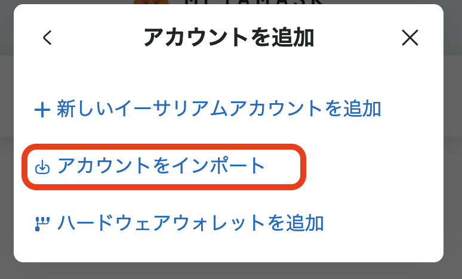

# 01. Hardhat 3  のチュートリアル

Ethereum の開発環境

2025/08/26
Shigeichiro Yamasaki

hardhat 3 は，viem という TypeScript ライブラリを利用してEVMと対話します．


##  <a id="setup">環境のセットアップ</a>

* hardhat node はローカルマシンで実行することを前提にします
* Node.js と JavaScriptの知識が前提になります

### ubuntu

```bash
sudo apt update
sudo apt upgrade -y
sudo apt install -y curl git tree
cd ~
curl -o- https://raw.githubusercontent.com/nvm-sh/nvm/v0.40.3/install.sh | bash
\. "$HOME/.nvm/nvm.sh"
source ~/.profile

nvm install node
npm install -g yarn

node -v
=>
v24.6.0
```
* VS code のインストール

```bash
sudo snap install --classic code
```

### MacOSX

```bash
brew update
brew upgrade
brew install curl git tree
source $(brew --prefix nvm)/nvm.sh
echo 'source $(brew --prefix nvm)/nvm.sh' >> ~/.zprofile
source ~/.zprofile

cd ~
curl -o- https://raw.githubusercontent.com/nvm-sh/nvm/v0.40.3/install.sh | bash
\. "$HOME/.nvm/nvm.sh"

nvm install node
npm install -g yarn

node -v
=>
v24.6.0
```

* VS code のインストール

[https://code.visualstudio.com/download](https://code.visualstudio.com/download) からインストーラーをダウンロード

## <a id="project">Hardhat プロジェクトの新規作成</a>

### プロジェクトフォルダの作成

プロジェクトのフォルダを決めます．

★ このディレクトリを「プロジェクトルート」といいます．

```bash
cd ~
mkdir hardhat
cd hardhat/
mkdir hardhat-example
cd hardhat-example
```

* ここでは，プロジェクトルートを hardhat-example という名前のフォルダにしますが，適宜自分のプロジェクト名に修正してください

### VS codeを利用する場合

拡張機能のインストール

* Japanese Language Pack for Visual Studio Code
* Hardhat Developer Pack

プロジェクトルートのディレクトリを VS code  から指定

### JavaScript プロジェクトの作成

init コマンドでプロジェクトのフォルダ群を自動生成します．
また，このパスがプロジェクトの起点となる「プロジェクトルート」になります．
設定ファイルは，package.json というファイルです．


### Hardhat 3 の初期化

初期化コマンド

```bash
npx hardhat --init
```
実行後

```bash
Need to install the following packages:
hardhat@3.0.1
Ok to proceed? (y) 
```

* キーボードの return キーを押すと，以下のような表示が出現します

```bash
=>
 █████  █████                         ███  ███                  ███      ██████
░░███  ░░███                         ░███ ░███                 ░███     ███░░███
 ░███   ░███   ██████  ████████   ███████ ░███████    ██████  ███████  ░░░  ░█
 ░██████████  ░░░░░███░░███░░███ ███░░███ ░███░░███  ░░░░░███░░░███░      ████░
 ░███░░░░███   ███████ ░███ ░░░ ░███ ░███ ░███ ░███   ███████  ░███      ░░░░███
 ░███   ░███  ███░░███ ░███     ░███ ░███ ░███ ░███  ███░░███  ░███ ███ ███ ░███
 █████  █████░░███████ █████    ░░███████ ████ █████░░███████  ░░█████ ░░██
░░░░░  ░░░░░  ░░░░░░░ ░░░░░      ░░░░░░░ ░░░░ ░░░░░  ░░░░░░░    ░░░░░   ░░░░░░
 
👷 Welcome to Hardhat v3.0.1 👷

? Which version of Hardhat would you like to use? … 
❯ Hardhat 3 Beta (recommended for new projects)
  Hardhat 2 (older version)

```

* ❯ Hardhat 3 Beta (recommended for new projects) を選択し，return キーを押す
* その後も，ただ return キーを押していきます

### Hardhat 3 のヘルプ

以下のようにして help を確認できます

```bash
npx hardhat --help

Hardhat version 3.0.1

Usage: hardhat [GLOBAL OPTIONS] <TASK> [SUBTASK] [TASK OPTIONS] [--] [TASK ARGUMENTS]

AVAILABLE TASKS:

...
```

### hardhat のTask 

コンパイルなど Hardhat のコマンドラインから実行する処理のこと

実行形式  `npx hardhat <タスク>` 


*  build    |         プロジェクト全体のコンパイルとartifactsの構築
*  clean    |         キャッシュや artifacts の全データの消去
*  compile  |         プロジェクト全体のコンパイルとartifactsの構築t (alias for build)
*  console  |         hardhat console を開く
*  flatten  |         依存関係のあるコントラクトコードをすべてフラットに出力
*  node     |         Hardhat NetworkサーバーとJSON-RPCの起動
*  run      |         プロジェクトのユーザ定義のスクリプトの実行
*  telemetry|         設定の更新と確認
*  test     |         テストの実行
*  verify             explorer を利用したコントラクトの検証

### プロジェクトのディレクトリ構成

hardhat プロジェクトのディレクトリは以下のような構成になっている

```
tree -L 1
=>
.
├── contracts
├── hardhat.config.ts
├── ignition
├── node_modules
├── package-lock.json
├── package.json
├── README.md
├── scripts
├── test
└── tsconfig.json

6 directories, 5 files
```

さらにその下の構造を確認してください

```bash
tree contracts -L 1
contracts
├── Counter.sol
└── Counter.t.sol

tree test -L 1     
test
└── Counter.ts

tree ignition -L 1 
ignition
└── modules

tree scripts -L 1 
scripts
└── send-op-tx.ts
```


## <a id="compile">スマートコントラクトの作成とコンパイル</a>

* プロジェクトルート・ディレクトリにいることを確認する

### Solidity プログラムの作成 （contracts/Counter.sol）

* contractディレクトリの下に Solidity言語のプログラムのファイルを作成します．
* ここでは, サンプルとして自動生成されている Counter.sol というファイル名のコントラクトを利用します.
* Solidityプログラムのソースコードには .sol という拡張子をつけます．

contracts/Counter.sol

```js
// SPDX-License-Identifier: UNLICENSED
pragma solidity ^0.8.28;

contract Counter {
  uint public x;

  event Increment(uint by);

  function inc() public {
    x++;
    emit Increment(1);
  }

  function incBy(uint by) public {
    require(by > 0, "incBy: increment should be positive");
    x += by;
    emit Increment(by);
  }
}

```


### コントラクトのコンパイル

以下の hardhat の compile タスクを実行してください

```bash
npx hardhat build
=>
Compiling your Solidity contracts...
Compiled 1 Solidity file with solc 0.8.28 (evm target: cancun)
```

### コンパイル結果の確認

#### artifacts ディレクトリ

* コンパイル結果のABIやバイトコードなどのオブジェクトは artifacts ディレクトリに格納されます

artifacts ディレクトリ以下を3階層まで木構造表示させると以下のような構造が見えます

```bash
tree artifacts -L 3
=>
artifacts
├── artifacts.d.ts
├── build-info
│   ├── solc-0_8_28-f51ae87ae795dce4b7c7ed5c8b1e794e7ad8d02a.json
│   └── solc-0_8_28-f51ae87ae795dce4b7c7ed5c8b1e794e7ad8d02a.output.json
└── contracts
    └── Counter.sol
        ├── artifacts.d.ts
        └── Counter.json
```


#### コンパイル結果のファイル

artifacts/contracts の下にある `'コントラクト名.sol` ディレクトリの下の `コントラクト名.json` にJSON形式になったコンパイル結果があります．

```bash
cat artifacts/contracts/Counter.sol/Counter.json 
=>
{
  "_format": "hh3-artifact-1",
  "contractName": "Counter",
  "sourceName": "contracts/Counter.sol",
  "abi": [
    {
      "anonymous": false,
      "inputs": [
        {
          "indexed": false,
          "internalType": "uint256",
          "name": "by",
          "type": "uint256"
        }
      ],


...

```

## <a id="test"> コントラクトのテスト</a>

hardhat 3 から，solidity と TypeSctipt でテスト記述するようになりました．


### Solidity によるテスト

テストプログラムは，ファイル名の拡張子が `.t.sol` になります

* contract/Counter.t.sol

```solidity
// SPDX-License-Identifier: UNLICENSED
pragma solidity ^0.8.28;

import {Counter} from "./Counter.sol";
import {Test} from "forge-std/Test.sol";

contract CounterTest is Test {
  Counter counter;

  function setUp() public {
    counter = new Counter();
  }

  function test_InitialValue() public view {
    require(counter.x() == 0, "Initial value should be 0");
  }

  function testFuzz_Inc(uint8 x) public {
    for (uint8 i = 0; i < x; i++) {
      counter.inc();
    }
    require(counter.x() == x, "Value after calling inc x times should be x");
  }

  function test_IncByZero() public {
    vm.expectRevert();
    counter.incBy(0);
  }
}

```

#### このテストプログラムの概要

* unit テスト
  * test_InitialValue 関数と test_IncByZero 関数
  * パラメータが無く，テストの実行は1回だけ
* fuzz テスト
  * testFuzz_Inc 関数
  * ランダムな入力を入れて複数回テストが実行される
  * テストが失敗したときは，そのインプットが示される


#### テストの実行

以下のようにテストすると，すべてのテストが実行されます

```bash
npx hardhat test
=>
Compiling your Solidity contracts...

Nothing to compile

Running Solidity tests

  contracts/Counter.t.sol:CounterTest
    ✔ test_InitialValue()
    ✔ test_IncByZero()
    ✔ testFuzz_Inc(uint8) (runs: 256)


  3 passing

Running node:test tests

  Counter
    ✔ Should emit the Increment event when calling the inc() function
    ✔ The sum of the Increment events should match the current value


  2 passing (1435ms)

```

#### テストの実行内容

1. コントラクトとテストのコンパイル
2. test/ ディレクトリの下のスクリプトが統合される
3. コントラクトやテストがデプロイされる
4. すべてのテストが実施され，失敗しているテスト項目は failed と記載される


#### solidity のテストのみを行う場合

```bash
npx hardhat test solidity
Compiling your Solidity contracts...

Nothing to compile
Running Solidity tests

  contracts/Counter.t.sol:CounterTest
    ✔ test_InitialValue()
    ✔ test_IncByZero()
    ✔ testFuzz_Inc(uint8) (runs: 256)


  3 passingå
```


### TypeScript テスト

solidityによるテストは，EVM で，実際の動かすことができるという利点があります．

しかし，solidity 言語はテスト用言語としては記述力が貧弱です．
例えば，非同期処理のテストなどはできません．
TypeScript のテストフレームワークを利用して補強することができます．

TypeScript のテストフレームワークである [Node.js test runner](https://nodejs.org/api/test.html) を利用したテストができます

#### Node.js test runner の基本

* 名前付きテスト

```ts
test("足し算", () => {
  assert.equal(1 + 2, 3);
});
```

* 非同期テスト

```ts
test("非同期", async () => {
  const v = await Promise.resolve(42);
  assert.equal(v, 42);
});
```

* サブテスト

```ts
test("配列操作 (with hooks)", async (t) => {
  let arr: number[];

  await t.beforeEach(() => { arr = [1, 2, 3]; });
  await t.afterEach(() => { arr = []; });

  await t.test("push", () => {
    arr.push(4);
    assert.deepEqual(arr, [1, 2, 3, 4]);
  });

  await t.test("length", () => {
    assert.equal(arr.length, 3);
  });
});
```

### test/Counter.ts の例

```ts
// We don't have Ethereum specific assertions in Hardhat 3 yet
import assert from "node:assert/strict";
import { describe, it } from "node:test";

import { network } from "hardhat";

describe("Counter", async function () {
  const { viem } = await network.connect();
  const publicClient = await viem.getPublicClient();

  it("Should emit the Increment event when calling the inc() function", async function () {
    const counter = await viem.deployContract("Counter");

    await viem.assertions.emitWithArgs(
      counter.write.inc(),
      counter,
      "Increment",
      [1n],
    );
  });

  it("The sum of the Increment events should match the current value", async function () {
    const counter = await viem.deployContract("Counter");
    const deploymentBlockNumber = await publicClient.getBlockNumber();

    // run a series of increments
    for (let i = 1n; i <= 10n; i++) {
      await counter.write.incBy([i]);
    }

    const events = await publicClient.getContractEvents({
      address: counter.address,
      abi: counter.abi,
      eventName: "Increment",
      fromBlock: deploymentBlockNumber,
      strict: true,
    });

    // check that the aggregated events match the current value
    let total = 0n;
    for (const event of events) {
      total += event.args.by;
    }

    assert.equal(total, await counter.read.x());
  });
});

```

#### TypeScriptテストのみの実行

```bash
npx hardhat test nodejs
=>
Compiling your Solidity contracts...

Nothing to compile

Running node:test tests

  Counter
    ✔ Should emit the Increment event when calling the inc() function
    ✔ The sum of the Increment events should match the current value


  2 passing (1591ms)

```


### ブロックチェーンネットワークと対話するスクリプト

`scripts` ディレクトリに記述する TypeScript スクリプトでブロックチェーンネットワークと対話することができます

* cripts/send-op-tx.ts の例

```ts
import { network } from "hardhat";

const { viem } = await network.connect({
  network: "hardhatOp",
  chainType: "op",
});

console.log("Sending transaction using the OP chain type");

const publicClient = await viem.getPublicClient();
const [senderClient] = await viem.getWalletClients();

console.log("Sending 1 wei from", senderClient.account.address, "to itself");

const l1Gas = await publicClient.estimateL1Gas({
  account: senderClient.account.address,
  to: senderClient.account.address,
  value: 1n,
});

console.log("Estimated L1 gas:", l1Gas);

console.log("Sending L2 transaction");
const tx = await senderClient.sendTransaction({
  to: senderClient.account.address,
  value: 1n,
});

await publicClient.waitForTransactionReceipt({ hash: tx });

console.log("Transaction sent successfully");

```

* スクリプトの実行

```bash
npx hardhat run scripts/send-op-tx.ts
=>
Compiling your Solidity contracts...

Nothing to compile

Sending transaction using the OP chain type
Sending 1 wei from 0xf39fd6e51aad88f6f4ce6ab8827279cfffb92266 to itself
Estimated L1 gas: 1600n
Sending L2 transaction
Transaction sent successfully
```

## コントラクトのデプロイ

hardhat にはデプロイを宣言的に記述できる Hardhat Ignition というシステムがあります．

コントラクトのデプロイの定義は Ignition Module によって実現されています．

* Ignition module は，`ignition/modules/` ディレクトリに定義します
* ignition/modules/Counter.ts の例

```ts
import { buildModule } from "@nomicfoundation/hardhat-ignition/modules";

export default buildModule("CounterModule", (m) => {
  const counter = m.contract("Counter");

  m.call(counter, "incBy", [5n]);

  return { counter };
});

```

このプログラムの `m.call()` や `m.contract()` は，デプロイを実行する関数です．

[ignition module 定義の詳しい説明](https://hardhat.org/ignition/docs/guides/creating-modules)


* デプロイの実行

```bash
npx hardhat ignition deploy ignition/modules/Counter.ts
=>
You are running Hardhat Ignition against an in-process instance of Hardhat Network.
This will execute the deployment, but the results will be lost.
You can use --network <network-name> to deploy to a different network.

Hardhat Ignition 🚀

Deploying [ CounterModule ]

Batch #1
  Executed CounterModule#Counter

Batch #2
  Executed CounterModule#Counter.incBy

[ CounterModule ] successfully deployed 🚀

Deployed Addresses

```

この例では，コントラクトは Hardhat Network にデプロイされていますが，メインネットやテストネットなど他のネットワークへのデプロイも可能です．


## Solidityによるテストの記述方法

### Solidityテストプログラムの記述場所

* test/ ディレクトリの場合： 拡張子 .sol
* ontracts/ディレクトリの場合： 拡張子 .t.sol

例えば `contracts/CounterTest.t.sol` あるいは `test/CounterTest.sol` というテストプログラムが存在した場合

```solidity
contract CounterTest {
    function testInc() public {
        Counter counter = new Counter();
        counter.inc();
        require(counter.count() == 1, "count should be 1");
    }
}
```

テストランナーは，CounterTest コントラクトをコンパイルしてデプロイし，testInc 関数を call します．
また，hardhat は fuzz test などもサポートしています．

```solidity
contract CounterTest {
    function testIncBy(uint by) public {
        Counter counter = new Counter();
        counter.incBy(by);
        require(counter.count() == by, "count should match the 'by' value");
    }
}

```

### アサーションライブラリ

上の例の  fuzz test において失敗したとき，`testIncBy(uint by)` の by という引数の値を知ることは solidity ではできません．もっとよいエラーメッセージを得るために，forge-std というライブラリを利用できます．

これを利用するためには以下のようにしてインストールします


```bash
npm install --save-dev github:foundry-rs/forge-std
```

そしてこのライブラリから，Test というコントラクトをインポートして継承できるようになります．

assertEq というヘルパー関数を利用することで，不一致のときの値を表示できるようになります．

```ts
import { Test } from "forge-std/Test.sol";

contract CounterTest is Test {
    function testIncBy(uint by) public {
        Counter counter = new Counter();
        counter.incBy(by);
        assertEq(counter.count(), by, "count should match the 'by' value");
    }
}
```


### SetUp 関数

すべてのテストにおいて共通に利用するロジックを事前に行う関数です

```solidity
contract CounterTest {
    Counter counter;

    function setUp() public {
      counter = new Counter();
    }

    function testInc() public {
        counter.inc();
        require(counter.count() == 1, "count should be 1");
    }

    function testIncBy(uint by) public {
        counter.incBy(by);
        require(counter.count() == by, "count should match the 'by' value");
    }
}
```


### Solidityテストの実行

* 全テストの実行
  
```bash
npx hardhat test
```

* solidity テストのみの実行
  
```bash
npx hardhat test solidity
```

* 指定したファイル群のみの実行

```bash
npx hardhat test <test-file-1> <test-file-2> ...
```

## hardhat で viem を利用する方法

### セットアップ

### ネットワークへの接続

### viem クライアントの利用


### コントラクトのデプロイと操作

### viem ベース処理のテストアサーション


========================================================================
# 以下は hatdhat 2 までの時代の古い情報

### Chai.js によるテストのアサーションの記述方法

should , expect, assert の３タイプのテストの流儀が利用可能

#### expect タイプの場合

* メソッドチェーン(以下のメソッドは読みやすさのためのもので，処理の連鎖以外の意味は無い）
to
be
does
have
and
...

* equal() : 等しい
* a(型)/an(型) : 型チェック
* include() ：含む
* not ： それ以降の否定
* true ： trueになる
* false ： falseになる
* within(開始, 終了) : 開始から終了の間 

```js
expect(x).to.equal(2);  		    // xは2に等しい
expect(x).to.be.a('string');  	// x はstring型
expect(x).to.be.an('array');  	// x はarray型
expect(x).to.include(3);  		// xは3を含む
expect(x).to.does.not.include(3);  // xは3を含まない
expect(x).to.be.true			  // xは true
expect(x).to.be.false		    // xは false
```

### Mocha によるテストフレームワークの記述

* テストの定義(describe)(
  * 事前条件(before)
     * 個別のアサーションの事前条件(beforeEach)
     * 個別のアサーション(it) 
     * 個別のアサーションの事前条件(afterEach)
  * 結果(after)
* )

#### Mochaの文法

* describe()	:テストの定義
* before()	：事前条件
* after()            : 事後条件
* it()		：個別のアサーション
* beforeEach() ：個別のアサーションの事前処理
* afterEach()    ：個別のアサーションの事後処理


#### Mocha によるテストの例

以下は assert スタイルの例です

```js
describe("べき乗関数 pow", function() {
  it("2の0乗は1", function() {
    assert(math.pow(2, 0)==1);
  });
  it("2の3乗は8", function() {
    assert(math.pow(2, 3)==(8));
  });
  it("2の-2乗は0.25", function() {
    assert(math.pow(2, -2)==0.25);
  });
});

```

expect スタイルの場合

```js
describe("べき乗関数 pow", function() {
  it("2の0乗は1", function() {
    expect(math.pow(2, 0)).to.equal(1);
  });
  it("2の3乗は8", function() {
    expect(math.pow(2, 3)).to.equal(8);
  });
  it("2の-2乗は0.25", function() {
    expect(math.pow(2, -2)).to.equal(0.25);
  });
});
```

### ethers.js (v6系) を使ったコントラクトのデプロイ

* ethers.deployContract 関数

デプロイするコントラクトのABIやバイトコードと初期値を入れてトランザクション化
トランザクションをブロードキャストしてコントラクトをデプロイする

  * 引数
    * ABI
    * コントラクト
    * コンストラクタの初期値の配列: []
  * 返り値
    *デプロイしたトランザクションのハッシュ値
  
```js
const contract = await ethers.deployContract(abi, contract,[args])
```


### Hardhat Toolbox の利用

hardhat には etheres.js を利用して開発するための各種ツールが備わっています．

[Hardhat Toolbox](https://hardhat.org/hardhat-runner/plugins/nomicfoundation-hardhat-toolbox)


* test やデプロイには，hardhat toolbox を利用するのが便利です


## テストプログラムの作成

* プロジェクトルートの下に test ディレクトリにテストプログラムを作成します
* hardhat では，chai を ES6モジュール（commonJSモジュール）ではなく Node.js モジュールとして require で読み込むことに注意してください

* Token.js 

```bash
nano test/Token.js
```

* hardhat toolbox の loadFixture を利用します．
* コントラクトのデプロイとテスト用アカウントを生成する処理を関数として定義しています
* it によるテスト項目ごとに上記の関数と loadFixture でテスト環境を初期化します

```js
// hardhat tool box の loadFixture 利用
const {loadFixture} = require("@nomicfoundation/hardhat-toolbox/network-helpers");
// Chaiのライブラリを利用
const { expect } = require("chai");

// Token コントラクトのデプロイとテスト用アカウントを準備する関数
async function deployTokenFixture() {
  // テスト用アカウントの取得（ethers.getSigners() はアカウント取得用関数）
  const [owner, addr1, addr2] = await ethers.getSigners();
  // コントラクトをデプロイする
  const Token = await ethers.deployContract("Token");
  // テスト用フィクスチャ
  return { Token, owner, addr1, addr2 };
}

describe("Tokenコントラクトのテスト", function () {
  it("デプロイによりトークンの総量が所有者に割り当てられること", async function () {
    // Token テスト用フィクスチャをロードする
    const {Token, owner, addr1, addr2} = await loadFixture(deployTokenFixture);
    // オーナーの所持金の初期値
    const ownerBalance = await Token.balanceOf(owner.address);
    // トークンの総量がオーナーの所持金の初期値と等しいことの確認
    expect(await Token.totalSupply()).to.equal(ownerBalance);
  });
});
```

* キーボード：`<ctrl o>` で保存先ファイル名を確認して `<Enter>` で保存
* キーボード：`<ctrl x>` で nano エディタ終了


### テストの実行

* プロジェクトルートから hardhat のテストタスクを実行します

```bash
npx hardhat test
=>

  Tokenコントラクトのテスト
    ✔ デプロイによりトークンの総量が所有者に割り当てられること (365ms)


  1 passing (367ms)
```

### テストプログラムの内容の説明

* ethers オブジェクトは，ラッピングライブラリ ethers.js を意味します．
* ethers.getSigners() は，トランザクション送信者（署名者）のEthereumアカウントを返すメソッドです．

```js
const [owner] = await ethers.getSigners();
```
* ethers.deployContract()  は，引数のコントラクトをデプロイする ethers.js メソッドです．
* デプロイが完了すると Token というコントラクトのオブジェクトが利用可能になります．

```js
const Token = await ethers.deployContract("Token");
```
* コントラクトオブジェクト Tokenに対して balanceOf メソッドを使うと Owner の所持金を確認することができます．

```js
const ownerBalance = await Token.balanceOf(owner.address);
```
* コントラクトオブジェクト Token に対して totalSupply というメソッドを使ってトークンの総量を求めます．
* ここではさらに，その値が Ownerの所持金と等しいことをテストします．

```js
expect(await Token.totalSupply()).to.equal(ownerBalance);
```

#### テストの修正

```bash
nano test/Token.js
```

```js
// hardhat tool box の利用
const {loadFixture} = require("@nomicfoundation/hardhat-toolbox/network-helpers");
// CHaiの利用
const { expect } = require("chai");

describe("Tokenコントラクト", function () {
  async function deployTokenFixture() {
    // 複数のテスト用アカウントの取得
    const [owner, addr1, addr2] = await ethers.getSigners();
    // コントラクトをデプロイする
    const Token = await ethers.deployContract("Token");
    // Tokenテスト用フィクスチャ
    return { Token, owner, addr1, addr2 };
  }

  it("Tokenの総量が owner に割り当てられていること", async function () {
    // Tokenテスト用フィクスチャをロードする
    const { Token, owner } = await loadFixture(deployTokenFixture);
    // オーナーの所持金額の確認
    const ownerBalance = await Token.balanceOf(owner.address);
    // トークンの総額はオーナーの所持金に等しい
    expect(await Token.totalSupply()).to.equal(ownerBalance);
  });

  it("アカウント間でトークンが転送されること", async function () {
    // Tokenテスト用フィクスチャをロードする
    const { Token, owner, addr1, addr2 } = await loadFixture(
      deployTokenFixture
    );

    // 50トークンを owner から addr1 に送金する
    await expect(
      Token.transfer(addr1.address, 50)
    ).to.changeTokenBalances(Token, [owner, addr1], [-50, 50]);

    // 50トークンを addr1 から addr2に送金する
    // ここではトークンの送金に .connect(signer) を利用している
    await expect(
      Token.connect(addr1).transfer(addr2.address, 50)
    ).to.changeTokenBalances(Token, [addr1, addr2], [-50, 50]);
  });
});

```

* キーボード：`<ctrl o>` で保存先ファイル名を確認して `<Enter>` で保存
* キーボード：`<ctrl x>` で nano エディタ終了

#### テストの再実行

```bash
npx hardhat test 

=>
  Tokenコントラクト
    ✔ Tokenの総量が owner に割り当てられていること (316ms)
    ✔ アカウント間でトークンが転送されること


  2 passing (330ms)
```


## <a id="hhNetwork"> Hardhar Networkの起動</a>

* ここから新しく別のターミナルを開く
* プロジェクトルートに移動する

```bash
cd ~/hardhat/tutorial
```

### hardhat node の起動

* 自分のマシンのローカル環境にテスト用の Ethereum Network Node を起動します
* 自動的に20個のアカウント（EOA) が生成されます
* 自動生成されたアカウントはそれぞれ 10000 Eth の資金を所有しています

```bash
npx hardhat node

=>
Started HTTP and WebSocket JSON-RPC server at http://127.0.0.1:8545/

Accounts
========

WARNING: These accounts, and their private keys, are publicly known.
Any funds sent to them on Mainnet or any other live network WILL BE LOST.

Account #0: 0xf39Fd6e51aad88F6F4ce6aB8827279cffFb92266 (10000 ETH)
Private Key: 0xac0974bec39a17e36ba4a6b4d238ff944bacb478cbed5efcae784d7bf4f2ff80

...

Account #19: 0x8626f6940E2eb28930eFb4CeF49B2d1F2C9C1199 (10000 ETH)
Private Key: 0xdf57089febbacf7ba0bc227dafbffa9fc08a93fdc68e1e42411a14efcf23656e

WARNING: These accounts, and their private keys, are publicly known.
Any funds sent to them on Mainnet or any other live network WILL BE LOST.

```

* 各アカウントのアドレスと秘密鍵を確認してください


### メタマスクの利用

有名なethrerum ワレットです


左上のネットワーク接続メニューを選択


ネットワークを追加ボタンをクリック

「ネットワークを手動で追加」をクリック

* ネットワーク名： hardhat network
* 新しいRPC URL： http://localhost:8545/
* チェーンID： 31337
* 通貨記号： ETH

で「保存」をクリックしてネットワークに接続します

### メタマスクにアカウントを取り込む

* 

* 

* 

Hardhat node の起動画面のアカウントのリストにある

* Private Key: 秘密鍵

のどれかを秘密鍵としてコピーしてペーストします

* 


## コントラクトのデプロイ

### hardhat ignition を利用したコントラクトのデプロイ

* hardhat ignition は，デプロイスクリプトを抽象化し，デプロイスクリプトのモジュールとして，宣言的にデプロイを記述します

#### Future オブジェクト

* この宣言的にデプロイを実施するモジュールのことを `Future` オブジェクトと呼びます
* `Future` オブジェクトは，デプロイを実施する方法を記述しているだけで，実際にネットワークへのデプロイは行いません．

#### buildModule 関数

* buildModule 関数は `Future` モジュールを生成する関数です．
* この関数の，第１引数がモジュール名で，第２引数がモジュールを定義するコールバック関数です．
* `Future` オブジェクトの生成は，`contract` メソッドと `call` メソッドで実施します．
* `contract` メソッドは，コントラクトのインスタンスをデプロイするための指示を生成します．
* `call` メソッドはコントラクトの関数を呼び出す指示を生成します．

### デプロイモジュール

```bash
nano ignition/modules/Token.js
```
  
```js
// hardhat toolbox を利用する
const { buildModule } = require("@nomicfoundation/hardhat-ignition/modules");

// ここではモジュール名を "Tutorial" にしている．引数 m に実際のモジュールが渡される
module.exports = buildModule("Tutorial", (m) => {
  // コントラクト名Tokenのインスタンスに対するデプロイ指示となる Future オブジェクトの生成
  // この例ではコンストラクタの引数は無いが，引数がある場合は配列 [] の中に設定する
  const contract = m.contract("Token", []);
  // コントラクトをデプロイするFuture オブジェクトを返す
  return { contract };
});
```

### デプロイの実行

* 新しいターミナルのプロジェクトルート・ディレクトリから実行 (--network の後にデプロイするネットワークを指定する)

```bash
npx hardhat ignition deploy ignition/modules/Token.js --network localhost

=>
Hardhat Ignition 🚀

Deploying [ Tutorial ]

Batch #1
  Executed Tutorial#Token

[ Tutorial ] successfully deployed 🚀

Deployed Addresses

Tutorial#Token - 0x5FbDB2315678afecb367f032d93F642f64180aa3

```

