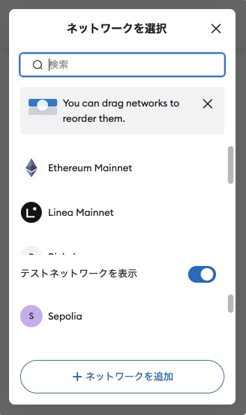
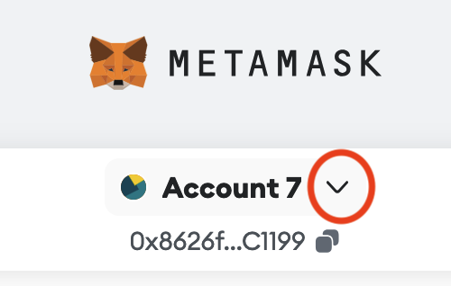
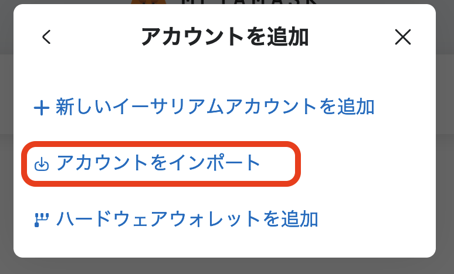

# 1. Hardhat のチュートリアル

Ethereum の開発環境

2024/11/18
Shigeichiro Yamasaki

* [環境のセットアップ](#setup)
* [Hardhat プロジェクトの新規作成](#project)
* [スマートコントラクトの作成とコンパイル](#compile)
* [コントラクトのテスト](#test)
* [Hardhar Networkへのデプロイ](#hhNetwork)


##  <a id="setup">環境のセットアップ</a>

* hardhat node はローカルマシンで実行することを前提にします
* Node.js と JavaScriptの知識が前提になります

### ubuntu

```bash
sudo apt update
sudo apt upgrade -y
sudo apt install curl git tree
curl https://raw.githubusercontent.com/creationix/nvm/master/install.sh | bash
source ~/.profile

nvm install --lts

node -v

=>
v22.11.0
```
* VS code のインストール

```bash
sudo snap install --classic code
```

* tree コマンドのインストール

```bash
sudo apt install tree
```

### MacOSX

```bash
brew update
brew upgrade
brew install curl git tree
source $(brew --prefix nvm)/nvm.sh
echo 'source $(brew --prefix nvm)/nvm.sh' >> ~/.zprofile
source ~/.zprofile

nvm install --lts

node -v

=>
v22.11.0
```

* VS code のインストール

[https://code.visualstudio.com/download](https://code.visualstudio.com/download) からインストーラーをダウンロード

## <a id="project">Hardhat プロジェクトの新規作成</a>

### プロジェクトフォルダの作成

プロジェクトのフォルダを決めます．

★ このディレクトリを「プロジェクトルート」といいます．

```bash
cd ~
mkdir hardhat
cd hardhat/
mkdir tutorial
cd tutorial
```

* ここでは，プロジェクトルートを hardhat/tutolial という名前のフォルダにしますが，適宜自分のプロジェクト名に修正してください

### VS codeを利用する場合

拡張機能のインストール

* Japanese Language Pack for Visual Studio Code
* Hardhat Developer Pack

プロジェクトルートのディレクトリをVS codenpm  から指定

### JavaScript プロジェクトの作成

init コマンドでプロジェクトのフォルダ群を自動生成します．

また，このパスがプロジェクトの起点となる「プロジェクトルート」になります．

とりあえず，入力なしでエンターキーを押していくだけでよいですが，実際にプロジェクトを作成するときは，それぞれの設定を入力してください．

設定ファイルは，package.json というファイルです．

```bash
npm init

=>
# 学習用ではデフォルトのまま <enterキー>
# 実際にプロジェクトを構築するときは適切に設定してください
...

Is this OK? (yes) 
npm notice
npm notice New minor version of npm available! 10.8.2 -> 10.9.0
npm notice Changelog: https://github.com/npm/cli/releases/tag/v10.9.0
npm notice To update run: npm install -g npm@10.9.0
npm notice
```

### Hardhat パッケージモジュールのインストール

hardhat は,javaScriptのパッケージモジュールです.

★  --save-dev というオプションは，このプロジェクトだけのローカルな環境にモジュールをインストールするという意味です．

```bash
npm install --save-dev hardhat
```


### Hardhat の初期化

初期化コマンド `npx hardhat init` 実行後に

▶ Create a JavaScript project を選択（キーボードの矢印キーを使って）

プロジェクトルートディレクトリに，空の hardhat.config.js ファイルを作成します．

```bash
npx hardhat init
```

```bash
=>
888    888                      888 888               888
888    888                      888 888               888
888    888                      888 888               888
8888888888  8888b.  888d888 .d88888 88888b.   8888b.  888888
888    888     "88b 888P"  d88" 888 888 "88b     "88b 888
888    888 .d888888 888    888  888 888  888 .d888888 888
888    888 888  888 888    Y88b 888 888  888 888  888 Y88b.
888    888 "Y888888 888     "Y88888 888  888 "Y888888  "Y888

Welcome to Hardhat v2.22.5

? What do you want to do? … 
▸ Create a JavaScript project
  Create a TypeScript project
  Create a TypeScript project (with Viem)
  Create an empty hardhat.config.js
  Quit


```

### プロジェクトのディレクトリ構成

hardhat プロジェクトのディレクトリは以下のような構成になっている

```
tree -L 1

=>
.
├── README.md
├── contracts
├── hardhat.config.js
├── ignition
├── node_modules
├── package-lock.json
├── package.json
└── test

5 directories, 4 files
```

### 余計なファイルの削除

hardhat は Lock という名前のサンプルのスマートコントラクトとテストプログラムを生成してくれます．

しかし，ここでは余計なので削除してしまいます

```bash
rm contracts/Lock.sol
rm test/Lock.js
rm ignition/modules/Lock.js
```

### hardhat のTask 

コンパイルなど Hardhat のコマンドラインから実行する処理のこと

実行形式  `npx hardhat <タスク>` 

* clean   :          キャッシュや artifacts の全データの消去
* compile :          プロジェクト全体のコンパイルとartifactsの構築
* console :          hardhat console の起動
* coverage:         テストのためのコードの適用範囲のレポート表示
* flatten :          	依存関係のあるコントラクトコードをすべてフラットに出力
* node    :          	Hardhat Networkに対するJSON-RPC server の起動
* run     :          	ユーザ定義のスクリプトの実行
* test    :          	mocha test の実行
* verify  :           Etherscan や Sourcify を利用したコントラクトの検証
* ignition:		        hardhat Ignitionを利用したコントラクトのデプロイ


## <a id="compile">スマートコントラクトの作成とコンパイル</a>

* プロジェクトルート・ディレクトリにいることを確認する

### Solidity プログラムの作成

* contractディレクトリの下に Solidity言語のプログラムのファイルを作成します．
* ここでは, Token.sol というファイル名にします.
* Solidityプログラムのソースコードには .sol という拡張子をつけます．

#### プログラムの内容

* マップデータとしてトークンを生成し
* マップの更新によってアカウント間でトークンの送金を行う

★ nano エディタではなく VScode を利用しても良いです．

```bash
nano contracts/Token.sol
```
ファイルの内容

* コメントをよく読んでください

```js
//SPDX-License-Identifier: MIT
pragma solidity ^0.8.0;

// スマートコントラクトの定義
contract Token {
    // トークンのタイプとシンボル名
    string public name = "Kindai Token";
    string public symbol = "KDT";
    // トークンの総量
    uint256 public totalSupply = 1000000;
    // オーナーのアドレス
    address public owner;
    // アカウントごとのトークンの所持金を管理するマップ
    mapping(address => uint256) balances;
    // チェーンの外部にこのコントラクトの状況を伝えるためのイベント
    event Transfer(address indexed _from, address indexed _to, uint256 _value);

    /**
     * コントラクトの初期化
     */
    constructor() {
        // トークンの総量がこのコントラクトをデプロイするトランザクションの送信者に割り当てられる
        balances[msg.sender] = totalSupply;
        owner = msg.sender;
    }

    /**
     * トークンを送金する関数
     *
     * `external` の指定によりコントラクトの外部からのみアクセス可能な関数
     */
    function transfer(address to, uint256 amount) external {
        // トランザクションの送金者が十分な所持金を持っていることをチェックする
        // 不十分なら失敗する
        require(balances[msg.sender] >= amount, "Not enough tokens");

        // 指定した金額を送金者の所持金から減額し送金先の所持金を増額する
        balances[msg.sender] -= amount;
        balances[to] += amount;

        // 処理結果を外部に通知するイベント
        emit Transfer(msg.sender, to, amount);
    }

    /**
     * アカウントのトークン残高を知るための読みだし専用関数
     * `view` の指定によりコントラクトの状態を更新できない
     */
    function balanceOf(address account) external view returns (uint256) {
        return balances[account];
    }
}
```

nano エディタの操作

* キーボード：`<ctrl o>` で保存先ファイル名を確認して `<Enter>` で保存
* キーボード：`<ctrl x>` で nano エディタ終了

### コントラクトのコンパイル

以下の hardhat の compile タスクを実行してください

```bash
npx hardhat compile

=>
Compiled 1 Solidity file successfully (evm target: paris).
```

### コンパイル結果の確認


#### artifacts ディレクトリ

* コンパイル結果のABIやバイトコードなどのオブジェクトは artifacts ディレクトリに格納されます

artifacts ディレクトリ以下を3階層まで木構造表示させると以下のような構造が見えます

```bash
 tree artifacts -L 3 

=>
.
├── build-info
│   └── 94c0b958419f077d841398267624fa75.json
└── contracts
    └── Token.sol
        ├── Token.dbg.json
        └── Token.json

4 directories, 3 files
```


#### コンパイル結果のファイル

artifacts/contracts の下にある `'コントラクト名.sol` ディレクトリの下の `コントラクト名.json` にJSON形式になったコンパイル結果があります．

```bash
cat artifacts/contracts/Token.sol/Token.json

=>
{
  "_format": "hh-sol-artifact-1",
  "contractName": "Token",
  "sourceName": "contracts/Token.sol",
  "abi": [
    {
      "inputs": [],
      "stateMutability": "nonpayable",
      "type": "constructor"
    },

...

```

#### コンパイル結果からのABI の取得

* コンパイル結果の JSON 形式にはABIの情報とコンパイル結果のバイトコードが含まれています．
* hardhat の built-in method readArtifact を利用してこれを取得できます

node.js から hardhat メソッドを使ってABI情報を取得する

```bash
node

=>
Welcome to Node.js v20.18.0.
Type ".help" for more information.
```

コントラクト名が 'Token' のとき

```js
> const hre = require('hardhat')
undefined
> const myContractArtifact = await hre.artifacts.readArtifact('Token')
undefined
> const {bytecode, abi} = myContractArtifact;
undefined

// abi の確認
> abi
[
  { inputs: [], stateMutability: 'nonpayable', type: 'constructor' },
  {
    anonymous: false,
    inputs: [ [Object], [Object], [Object] ],
    name: 'Transfer',
    type: 'event'
  },
  {
    inputs: [ [Object] ],
    name: 'balanceOf',
    outputs: [ [Object] ],
    stateMutability: 'view',
    type: 'function'
  },
  {
    inputs: [],
    name: 'name',
    outputs: [ [Object] ],
    stateMutability: 'view',
    type: 'function'
  },
  {
    inputs: [],
    name: 'owner',
    outputs: [ [Object] ],
    stateMutability: 'view',
    type: 'function'
  },
  {
    inputs: [],
    name: 'symbol',
    outputs: [ [Object] ],
    stateMutability: 'view',
    type: 'function'
  },
  {
    inputs: [],
    name: 'totalSupply',
    outputs: [ [Object] ],
    stateMutability: 'view',
    type: 'function'
  },
  {
    inputs: [ [Object], [Object] ],
    name: 'transfer',
    outputs: [],
    stateMutability: 'nonpayable',
    type: 'function'
  }
]
> 
```

## <a id="test"> コントラクトのテスト</a>

* コントラクトのテストは ローカルノードである Hardhat Networkで実施します．
* コントラクトの操作は，ethere.js を利用します
* テスト実行は JavaScript のテストフレームワーク Chai と Mocha を利用します．

### テストプログラムの作成

* プロジェクトルートの下に test ディレクトリにテストプログラムを作成します
* ★ hardhat では，chai を ES6モジュール（commonJSモジュール）ではなく Node.js モジュールとして require で読み込むことに注意してください

* Token.js 

```bash
nano test/Token.js
```

* コメントをよく読んでください

```js
const { expect } = require("chai");

describe("トークンのコントラクト", function () {
  it("デプロイによりトークンの総量が所有者に割り当てられること", async function () {
    // ethers.getSigners() は，トランザクション送信者のEthereumアカウントを返すメソッド
    const [owner] = await ethers.getSigners();
    // ethers.deployContract()  は，引数のコントラクトをデプロイする ethers.js メソッド
    const hardhatToken = await ethers.deployContract("Token");
    // オーナーの所持金
    const ownerBalance = await hardhatToken.balanceOf(owner.address);
    // トークンの総量はオーナーの所持金と等しい
    expect(await hardhatToken.totalSupply()).to.equal(ownerBalance);
  });
});
```

* キーボード：`<ctrl o>` で保存先ファイル名を確認して `<Enter>` で保存
* キーボード：`<ctrl x>` で nano エディタ終了

### テストの実行

* プロジェクトルートから hardhat のテストタスクを実行します

```bash
npx hardhat test
=>

  トークンのコントラクト
    ✔ デプロイによりトークンの総供給量が所有者に割り当てられること(435ms)


  1 passing (436ms)
```

### テストプログラムの内容の説明

* ethers オブジェクトは，ラッピングライブラリ ethers.js を意味します．
* ethers.getSigners() は，トランザクション送信者（署名者）のEthereumアカウントを返すメソッドです．

```js
const [owner] = await ethers.getSigners();
```
* ethers.deployContract()  は，引数のコントラクトをデプロイする ethers.js メソッドです．
* デプロイが完了すると hardhatToken というコントラクトのオブジェクトが利用可能になります．

```js
const hardhatToken = await ethers.deployContract("Token");
```
* コントラクトオブジェクト hardhatTokenに対して balanceOf メソッドを使うと Owner の所持金を確認することができます．

```js
const ownerBalance = await hardhatToken.balanceOf(owner.address);
```
* コントラクトオブジェクト hardhatToken に対して totalSupply というメソッドを使ってトークンの総量を求めます．
* ここではさらに，その値が Ownerの所持金と等しいことをテストします．

```js
expect(await hardhatToken.totalSupply()).to.equal(ownerBalance);
```

#### テストの修正

* テスト環境を整備するために  hardhat tool box が提供するフィクスチャーを利用するように修正します．これによってテスト用のアカウントなどが利用できるようになります．
* [Hardhat Toolbox](https://hardhat.org/hardhat-runner/plugins/nomicfoundation-hardhat-toolbox)  を利用します

```bash
nano test/Token.js
```

```js
// hardhat tool box の利用
const {loadFixture} = require("@nomicfoundation/hardhat-toolbox/network-helpers");
// CHaiの利用
const { expect } = require("chai");

describe("トークンのコントラクト", function () {
  async function deployTokenFixture() {
    // 複数のテスト用アカウントの取得
    const [owner, addr1, addr2] = await ethers.getSigners();
    // コントラクトをデプロイする
    const hardhatToken = await ethers.deployContract("Token");
    // テストに有用なフィクスチャ
    return { hardhatToken, owner, addr1, addr2 };
  }

  it("トークンの総量が所有者に割り当てられていること", async function () {
    // フィクスチャをデプロイする
    const { hardhatToken, owner } = await loadFixture(deployTokenFixture);
    // オーナーの所持金額
    const ownerBalance = await hardhatToken.balanceOf(owner.address);
    // トークンの総額がオーナーの所持金に等しい
    expect(await hardhatToken.totalSupply()).to.equal(ownerBalance);
  });

  it("アカウント間でトークンが転送されること", async function () {
    // フィクスチャをデプロイする
    const { hardhatToken, owner, addr1, addr2 } = await loadFixture(
      deployTokenFixture
    );

    // 50トークンをオーナーから addr1 に送金する
    await expect(
      hardhatToken.transfer(addr1.address, 50)
    ).to.changeTokenBalances(hardhatToken, [owner, addr1], [-50, 50]);

    // 50トークンを addr1 から addr2に送金する
    // ここではトークンの送金に .connect(signer) を利用している
    await expect(
      hardhatToken.connect(addr1).transfer(addr2.address, 50)
    ).to.changeTokenBalances(hardhatToken, [addr1, addr2], [-50, 50]);
  });
});

```

* キーボード：`<ctrl o>` で保存先ファイル名を確認して `<Enter>` で保存
* キーボード：`<ctrl x>` で nano エディタ終了

#### テストの再実行

```bash
npx hardhat test 

=>

  トークンのコントラクト
    ✔ トークンの総供給量が所有者に割り当てられること (433ms)
    ✔ アカウント間でトークンが転送されること


  2 passing (446ms)
```


## <a id="hhNetwork"> Hardhar Networkの起動</a>

* ここから新しく別のターミナルを開く
* プロジェクトルートに移動する

```bash
cd ~
cd hardhat/tutorial
```

### hardhat設定ファイル hardhat.config.js の修正

* ネットワークを hardhat networkにする
* チェインIDを 31337
* マイニングの間隔を10秒に設定

```bash
nano hardhat.config.js
```

```js
require("@nomicfoundation/hardhat-toolbox");

/** @type import('hardhat/config').HardhatUserConfig */
module.exports = {
  solidity: "0.8.27",
  networks: {
    hardhat: {
      chainId: 31337,
      mining: {
        auto: false,
        interval: [10000, 11000]
      }
    },
  },
};
```
### hardhat node の起動

* 自分のマシンのローカル環境にテスト用の Ethereum Network Node を起動します
* 自動的に20個のアカウント（EOA) が生成されます
* 自動生成されたアカウントはそれぞれ 10000 Eth の資金を所有しています

```bash
npx hardhat node

=>
Started HTTP and WebSocket JSON-RPC server at http://127.0.0.1:8545/

Accounts
========

WARNING: These accounts, and their private keys, are publicly known.
Any funds sent to them on Mainnet or any other live network WILL BE LOST.

Account #0: 0xf39Fd6e51aad88F6F4ce6aB8827279cffFb92266 (10000 ETH)
Private Key: 0xac0974bec39a17e36ba4a6b4d238ff944bacb478cbed5efcae784d7bf4f2ff80

...

Account #19: 0x8626f6940E2eb28930eFb4CeF49B2d1F2C9C1199 (10000 ETH)
Private Key: 0xdf57089febbacf7ba0bc227dafbffa9fc08a93fdc68e1e42411a14efcf23656e

WARNING: These accounts, and their private keys, are publicly known.
Any funds sent to them on Mainnet or any other live network WILL BE LOST.

```

* 各アカウントのアドレスと秘密鍵を確認してください


### メタマスクの利用

有名なethrerum ワレットです


左上のネットワーク接続メニューを選択



ネットワークを追加ボタンをクリック

「ネットワークを手動で追加」をクリック

* ネットワーク名： hardhat network
* 新しいRPC URL： http://localhost:8545/
* チェーンID： 31337
* 通貨記号： ETH

で「保存」をクリックしてネットワークに接続します

### メタマスクにアカウントを取り込む

* 

* 

* 

Hardhat node の起動画面のアカウントのリストにある

* Private Key: 秘密鍵

のどれかを秘密鍵としてコピーしてペーストします

* 


## hardhat Node にコントラクトをデプロイする


### scripts フォルダとデプロイスクリプトの作成

* プロジェクトルートの下の scripts フォルダにデプロイスクリプトを生成

```bash
mkdir scripts
```

* デプロイスクリプトファイルを作成する (deploy.js)

```bash
nano scripts/deploy.js
```

* deploy.js

```js
const hre = require("hardhat");

async function main() {
   const deployedContract = await hre.ethers.deployContract("Token");
   await deployedContract.waitForDeployment();
}

main().catch((error) => {
   console.error(error);
   process.exitCode = 1;
});

```

### デプロイスクリプトによる hardhat ネットワークへのデプロイ

```bash
npx hardhat run scripts/deploy.js --network localhost
```

* コンソール側のターミナルで Token コントラクトのデプロイの確認
* コントラクトアカウントのアドレスの確認
* トランザクションIDの確認
* デプロイしたアカウントのアドレスの確認
* デプロイのために消費した Gas の確認

```bash
eth_blockNumber
net_version (2)
eth_getBlockByNumber
eth_blockNumber
eth_getBalance (7)
eth_blockNumber (4)
eth_chainId (2)
eth_blockNumber (51)
eth_accounts
hardhat_metadata (20)
eth_blockNumber
eth_getBlockByNumber
eth_feeHistory
eth_maxPriorityFeePerGas
eth_sendTransaction
  Contract deployment: Token
  Contract address:    0x5fbdb2315678afecb367f032d93f642f64180aa3
  Transaction:         0x0281202f3c48df83b0ddb1e76125f0e11dc7453b143423b849e18bde6e60e389
  From:                0xf39fd6e51aad88f6f4ce6ab8827279cfffb92266
  Value:               0 ETH
  Gas used:            712681 of 30000000
  Block #1:            0x313780e83fdd73b03f9609706176d2c91e6a5f90c373af6277903ed69a9ad19d
```

## hardhat ignition を利用したコントラクトのデプロイ

デプロイスクリプトの抽象化して，デプロイスクリプトをモジュールとして，宣言的にデプロイを記述する

### デプロイモジュール

```bash
nano ignition/modules/Token.js
```

* コメントをよく読んでください
  
```js
const { buildModule } = require("@nomicfoundation/hardhat-ignition/modules");

// モジュール名
module.exports = buildModule("Token", (m) => {
  // コントラクト名
  const contract = m.contract("Token", []);
  return { contract };
});
```

### デプロイの実行

* 新しいターミナルのプロジェクトルート・ディレクトリから実行

```bash
npx hardhat ignition deploy ignition/modules/Token.js --network localhost
```

### node のログの確認

* Tokenコントラクトのデプロイが成功すると，コントラクトアドレスが生成される
* このコントラクトアドレス宛にメッセージトランザクションを送ることで Token コントラクトを操作することができる

```bash
Mined block #42
  Block: 0x2636fb5d14784f2a3f5ce41a835315272b408049a351baf3b7ffd892d0cf3039
    Base fee: 3688905
    Transaction:           0x3368a9b026beb7009cf48d17e26617876ef3ad34aadb1eb301d4a23b32fc792c
      Contract deployment: Token
      Contract address:    0xe7f1725e7734ce288f8367e1bb143e90bb3f0512
      From:                0xf39fd6e51aad88f6f4ce6ab8827279cfffb92266
      Value:               0 ETH
      Gas used:            620478 of 620478
```


