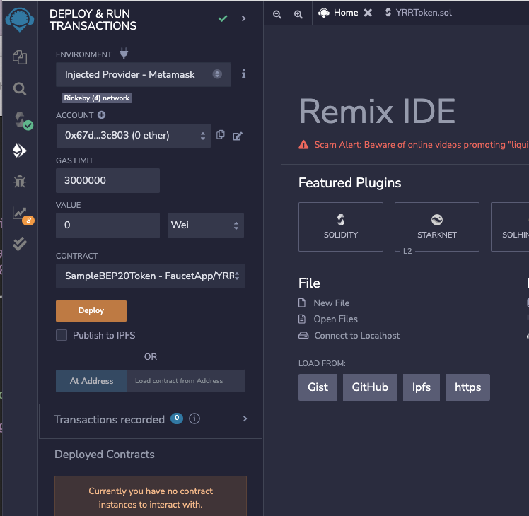
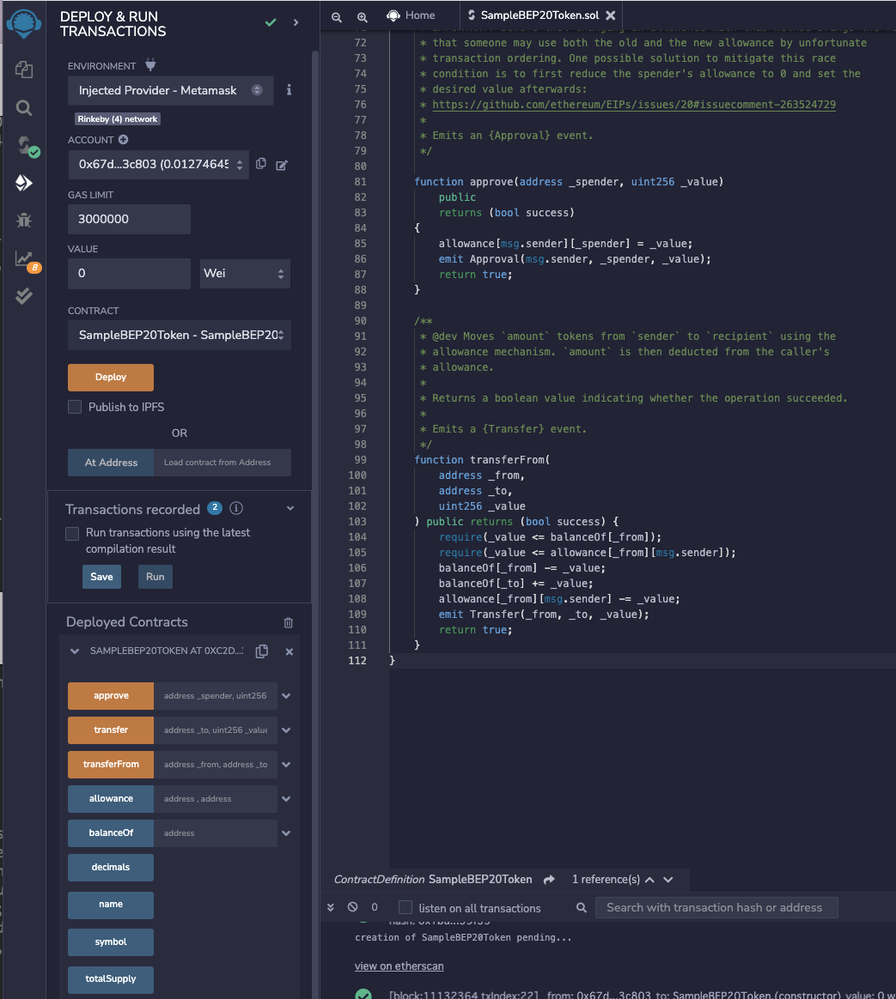

# 3. Ethereum Remix によるSolidityのスマートコントラクト開発

2022/08/02 更新　Shigeichiro Yamasaki

webベースのIDE（開発環境）であるRemixを使ったSlidityのスマートコントラクト開発

## 環境

* ブラウザは、 Chrome

### MetaMaskの準備

MetaMaskはChromeの拡張機能として作られている Ethereumワレットです

* 公式サイトからダウンロード


### MetaMaskへの送金

* Rinkeby テストネットに接続する


ファセットで、MetaMaskのアドレスを入れて Etherを入手してください。


## Remix IDE

[Remix IDE](http://remix.ethereum.org/#optimize=false&runs=200&evmVersion=null&version=soljson-v0.8.7+commit.e28d00a7.js)


参照：https://note.com/npaka/n/n5a22a46258b3

### MetaMaskと連携してRinkeby テストネットにデプロイするようにする

「デプロイ＆実行」アイコン→　「ENVIRONMENT」メニューで、「Injected Provider-Metamask」を選択



### ACCOUNT のアドレスにMetamaskから Eth を送金する

アドレスをコピーして、Metamaskから Eth を送金し、ガス代などの資金にする

### プログラムの登録

* ファイルアイコンのモード
* Workspace の[+] アイコンで新規ワークスペースを作成
* Choose tamplateで Blannk を選択して、OK
* 書類アイコン「Create new file」でファイル名を指定する（ここでは "SampleBEP20Token.sol"とします）

### エディターウィンドーにSolidityプログラムを書く

ここでは、[https://gist.github.com/PraneshASP/2e18a11d8ee79ae0baa8429fe4ecda49](https://gist.github.com/PraneshASP/2e18a11d8ee79ae0baa8429fe4ecda49)　のBEP20トークンのスマートコントラクトプログラムを利用します。

```json
// SPDX-License-Identifier: UNLISCENSED

pragma solidity 0.8.4;


/**
 * @title SampleBEP20Token
 * @dev Very simple BEP20 Token example, where all tokens are pre-assigned to the creator.
 * Note they can later distribute these tokens as they wish using `transfer` and other
 * `BEP20` functions.
 * USE IT ONLY FOR LEARNING PURPOSES. SHOULD BE MODIFIED FOR PRODUCTION
 */
 
contract SampleBEP20Token {
    string public name = "SampleBEP20 Token";
    string public symbol = "SBT";
    uint256 public totalSupply = 1000000000000000000000000; // 1 million tokens
    uint8 public decimals = 18;
    
    /**
     * @dev Emitted when `value` tokens are moved from one account (`from`) to
     * another (`to`).
     *
     * Note that `value` may be zero.
     */
    event Transfer(address indexed _from, address indexed _to, uint256 _value);

     /**
     * @dev Emitted when the allowance of a `spender` for an `owner` is set by
     * a call to {approve}. `value` is the new allowance.
     */
    event Approval(
        address indexed _owner,
        address indexed _spender,
        uint256 _value
    );

    mapping(address => uint256) public balanceOf;
    mapping(address => mapping(address => uint256)) public allowance;

    /**
     * @dev Constructor that gives msg.sender all of existing tokens.
     */
    constructor() {
        balanceOf[msg.sender] = totalSupply;
    }

     /**
     * @dev Moves `amount` tokens from the caller's account to `recipient`.
     *
     * Returns a boolean value indicating whether the operation succeeded.
     *
     * Emits a {Transfer} event.
     */
    function transfer(address _to, uint256 _value)
        public
        returns (bool success)
    {
        require(balanceOf[msg.sender] >= _value);
        balanceOf[msg.sender] -= _value;
        balanceOf[_to] += _value;
        emit Transfer(msg.sender, _to, _value);
        return true;
    }
    
     /**
     * @dev Sets `amount` as the allowance of `spender` over the caller's tokens.
     *
     * Returns a boolean value indicating whether the operation succeeded.
     *
     * IMPORTANT: Beware that changing an allowance with this method brings the risk
     * that someone may use both the old and the new allowance by unfortunate
     * transaction ordering. One possible solution to mitigate this race
     * condition is to first reduce the spender's allowance to 0 and set the
     * desired value afterwards:
     * https://github.com/ethereum/EIPs/issues/20#issuecomment-263524729
     *
     * Emits an {Approval} event.
     */

    function approve(address _spender, uint256 _value)
        public
        returns (bool success)
    {
        allowance[msg.sender][_spender] = _value;
        emit Approval(msg.sender, _spender, _value);
        return true;
    }

    /**
     * @dev Moves `amount` tokens from `sender` to `recipient` using the
     * allowance mechanism. `amount` is then deducted from the caller's
     * allowance.
     *
     * Returns a boolean value indicating whether the operation succeeded.
     *
     * Emits a {Transfer} event.
     */
    function transferFrom(
        address _from,
        address _to,
        uint256 _value
    ) public returns (bool success) {
        require(_value <= balanceOf[_from]);
        require(_value <= allowance[_from][msg.sender]);
        balanceOf[_from] -= _value;
        balanceOf[_to] += _value;
        allowance[_from][msg.sender] -= _value;
        emit Transfer(_from, _to, _value);
        return true;
    }
}
```


### Solidityプログラムのコンパイル

「コンパイル」アイコンのモードで、「Compile 
SampleBEP20Token.sol」ボタンをクリックする

### BEP20スマートコントラクトのデプロイ

「デプロイ　&　実行」アイコンのモードで、

「Injected Provider - Metamask」メニューになっていること
ACCOUNT が一定のEth (0.01 Eth程度）を保持していることを確認

* 「Deploy」ボタンをクリック
* Metamask がポップアップする
* Metamaskの「確認」ボタンをクリックする


### Deployed Contractを操作する

#### ERC20トークンの関数

* approve: 受領者のアドレスと金額を指定すると、指定された金額を上限とする複数の送金が承認される
* transfer：アドレスと送金金額を指定すると、その送金を実行
* 




* totalSupplyボタンをクリック ->     uint256 public totalSupply = 1000000000000000000000000; // 1 million tokens

* approveの引数部分の 'v' アイコンをクリック （受領者宛の送金額の上限）
    * -> _sender: アリスのアドレス
    * -> _value: 100000000000
    * 「transact」ボタンをクリック
    * Metamaskにアクセス権限を与える　「確認ボタン」
* transferの引数部分の 'v' アイコンをクリック
    * → _to: アリスのアドレス
    * -> _value: 500
    * 「transact」ボタンをクリック
    * Metamaskにアクセス権限を与える　「確認ボタン」


