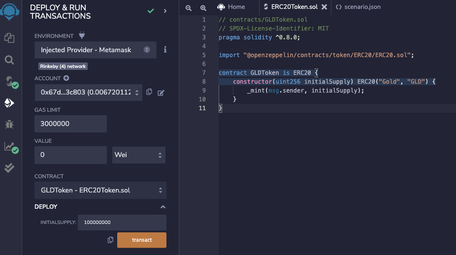
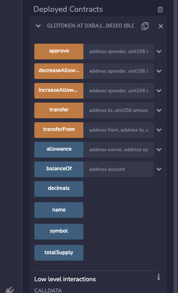
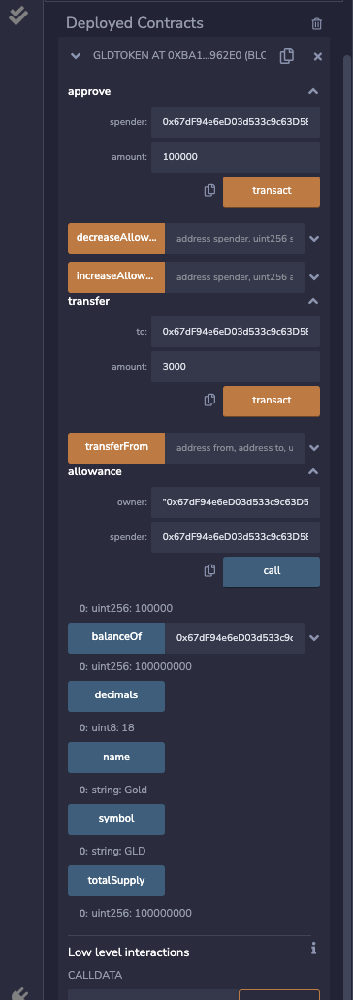

# Ethereum ERC20トークンの作成

2022/08/02 更新 Shigeichiro Yamasaki

Remix を使ってファンジブルトークンの標準であるERC20トークンを作成する
Openzeppelinのライブラリを利用します。

## ERC20トークンのインターフェース

関数

|関数名	|説明	|定義|
| :-- | :-- | :--|
|name|	トークンの名前を返す関数	|function name() constant returns (string name)|
|symbol|	トークンのシンボルを返す関数|	function symbol() constant returns (string symbol)
|decimals|	トークンが使用する小数点以下の桁数を返す関数|	function decimals() constant returns (uint8 decimals)|
|totalSupply	|トークンの総供給量を返す関数|	function totalSupply() constant returns (uint256 totalSupply)|
|balanceOf|	アカウントの残高を返す関数|	function balanceOf(address _owner) constant returns (uint256 balance)|
|transfer	|トークンを転送するための関数|	function transfer(address to, uint256 value) returns (bool success)|
|transferFrom	|トークンを転送するための関数。転送元アドレスを指定する。|	function transferFrom(address from, address to, uint256 _value) returns (bool success)|
|approve	|引出限度額を設定する関数	|function approve(address spender, uint256 value) returns (bool success)|
|allowance	|ownerのアドレスからspenderの引き出しが許可されている金額	|function allowance(address owner, address spender) constant returns(uint256 remaining)|

Events

|イベント名|	説明	|定義|
|:--|:--|:--|
|Transfer	|トークンが転送されたら実施しなければいけないイベント	|event Transfer(address indexed from, address indexed to, uint256 _value)|
|Approval	|approve関数が呼ばれたら実施しなければいけないイベント	|event Approval(address indexed owner, address indexed spender, uint256 _value)|

参照：SaaS企業で働くプロダクトマネージャーのブログ https://www.blockchainengineer.tokyo/entry/2017/12/31/223214

### Remixでブランクファイルを作成

ファイル名：ERC20Token.sol とします。

### ETC20Token.sol

Openzeppelinのサンプルそのままです。
GLDTokenというコントラクト名になっています。

```javascript
// contracts/GLDToken.sol
// SPDX-License-Identifier: MIT
pragma solidity ^0.8.0;

import "@openzeppelin/contracts/token/ERC20/ERC20.sol";

contract GLDToken is ERC20 {
    constructor(uint256 initialSupply) ERC20("Gold", "GLD") {
        _mint(msg.sender, initialSupply);
    }
}
```

### Rinkebyテストネットに接続

デプロイ & 実行モード

ENVIRONMENT で、Injected Provider - Metamask を選択
ACCOUNT に ETH があることを確認する

### Rinkebyテストネットにコントラクトをデプロイ

* CONTRACT で、GLDToken - ERC20Token.solを選択
* DEPLOYの'v'を展開
* INITIALSUPPLY にトークン発行総量（100000000 など）を設定
* transactボタンをクリック
* Metamaskで「確認」




### デプロイされたコントラクトを実行

約15秒後

Deployed Contracts を展開する




### いろいろ試してみる





