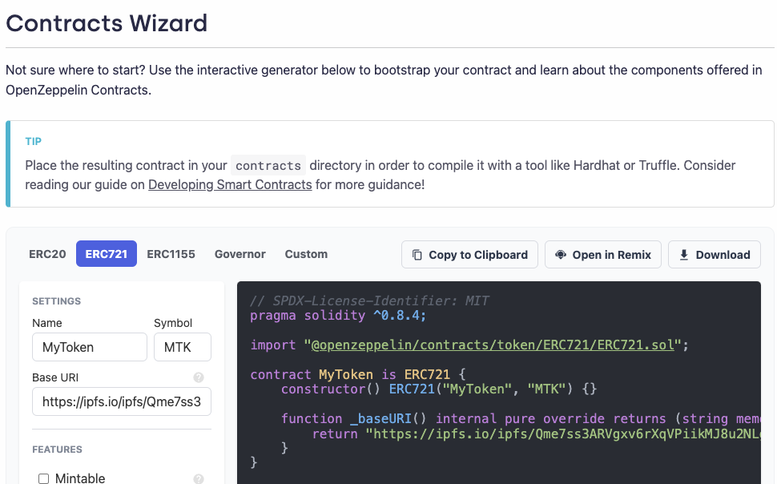
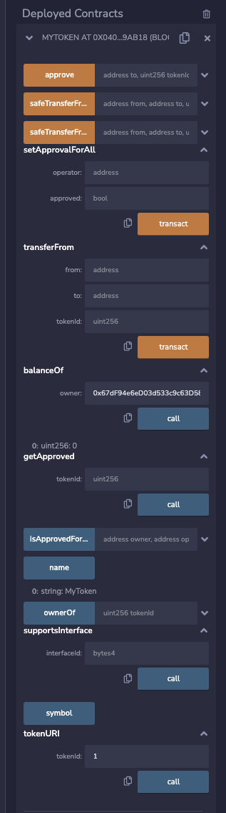

# Ethereum ERC721トークンの作成

2022/08/03 修正Shigeichiro Yamasaki


## ERC-721の発行

[Openzeppelinの Contract Wizard](https://docs.openzeppelin.com/contracts/4.x/wizard) を利用

[REMIX](https://remix.ethereum.org/#optimize=false&runs=200&evmVersion=null&version=soljson-v0.8.7+commit.e28d00a7.js)で EthereumのRopsten テストネットワークにデプロイする

## NFTを発行する対象

とりあえず以下のURLとします

`https://js.ipfs.io/static/cube-5a125bc68b1f819d3976b2f4a04cf821.svg`

](https://js.ipfs.io/static/cube-5a125bc68b1f819d3976b2f4a04cf821.svg)

## Openzeppelin の Contract Wizardでコントラクトを生成

* Base URLとして対象のURLを設定します。

生成されたプログラム

```javascript
// SPDX-License-Identifier: MIT
pragma solidity ^0.8.4;

import "@openzeppelin/contracts/token/ERC721/ERC721.sol";

contract MyToken is ERC721 {
    constructor() ERC721("MyToken", "MTK") {}

    function _baseURI() internal pure override returns (string memory) {
        return "https://ipfs.io/ipfs/Qme7ss3ARVgxv6rXqVPiikMJ8u2NLgmgszg13pYrDKEoiu";
    }
}
```



## Remix に移動

「Open in Remix」　ボタンをクリックすると Remixに移動します

### コントラクトをコンパイル

Comple *** ボタンをクリックする

### デプロイ

* ENVIRONMENT を Inject Provider - Metamask
* CONTRACT として MyToken を選択
* Deployボタンをクリック
* Metamask で確認

### 使ってみる


