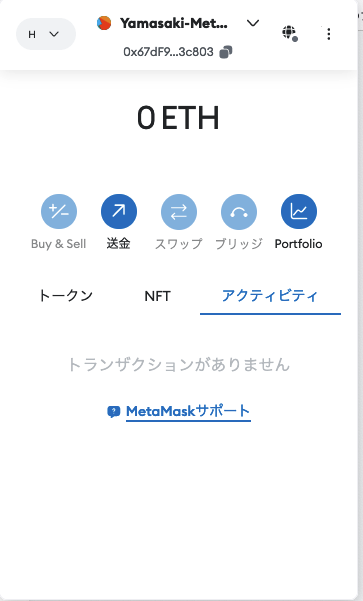

# Hardhat 

2024/07/24
作成，更新 Shigeichiro Yamasaki

* [環境のセットアップ](#setup)
* [Hardhat プロジェクトの新規作成](#project)
* [スマートコントラクトの作成とコンパイル](#compile)
* [Hardhat Network でのコントラクトのテスト](#test)
* [Sepolia テストネットへのデプロイ](#sepolia)

##  <a id="setup">環境のセットアップ</a>

Node.js と JavaScriptの知識が前提になります

### ubuntu

```bash
sudo apt update
sudo apt install curl git
curl -fsSL https://deb.nodesource.com/setup_20.x | sudo -E bash -
sudo apt-get install -y nodejs
```


### MacOSX

```bash
curl -o- https://raw.githubusercontent.com/nvm-sh/nvm/v0.39.1/install.sh | bash
nvm install 20
nvm use 20
nvm alias default 20
npm install npm --global
```

## <a id="project">Hardhat プロジェクトの新規作成</a>

### プロジェクトフォルダの作成

プロジェクトのフォルダを決めます．

★ このディレクトリを「プロジェクトルート」といいます．

ここでは，hardhat-tutorial という名前のフォルダにします．

```bash
cd ~
mkdir hardhat-projects
cd hardhat-projects/
mkdir hardhat-tutorial
cd hardhat-tutorial
```

以下では，npm 7 を利用します．

### JavaScript プロジェクトの作成

init コマンドでプロジェクトのフォルダ群を自動生成します．

また，このパスがプロジェクトの起点となる「プロジェクトルート」になります．

とりあえず，入力なしでエンターキーを押していくだけでよいですが，実際にプロジェクトを作成するときは，それぞれの設定を入力してください．

設定ファイルは，package.json というファイルです．

```bash
npm init

=>
This utility will walk you through creating a package.json file.
It only covers the most common items, and tries to guess sensible defaults.

See `npm help init` for definitive documentation on these fields
and exactly what they do.

Use `npm install <pkg>` afterwards to install a package and
save it as a dependency in the package.json file.

Press ^C at any time to quit.
package name: (hardhat-tutorial) 
version: (1.0.0) 
description: 
entry point: (index.js) 
test command: 
git repository: 
keywords: 
author: 
license: (ISC) 
About to write to /Users/shigeichiroyamasaki/hardhat-projects/hardhat-tutorial/package.json:

{
  "name": "hardhat-tutorial",
  "version": "1.0.0",
  "main": "index.js",
  "scripts": {
    "test": "echo \"Error: no test specified\" && exit 1"
  },
  "author": "",
  "license": "ISC",
  "description": ""
}


Is this OK? (yes) 
```

### Hardhat パッケージモジュールのインストール

hardhat は，javaScriptのパッケージモジュールです．

★  --save-dev というオプションは，このプロジェクトだけのローカルな環境にモジュールをインストールするという意味です．

```bash
npm install --save-dev hardhat
```

### Hardhat の初期化 （空の設定ファイルの作成）

初期化コマンド `npx hardhat init` 実行後に

▶ Create an empty hardhat.config.js を選択

プロジェクトルートディレクトリに，空の hardhat.config.js ファイルを作成します．

```bash
npx hardhat init
=>
888    888                      888 888               888
888    888                      888 888               888
888    888                      888 888               888
8888888888  8888b.  888d888 .d88888 88888b.   8888b.  888888
888    888     "88b 888P"  d88" 888 888 "88b     "88b 888
888    888 .d888888 888    888  888 888  888 .d888888 888
888    888 888  888 888    Y88b 888 888  888 888  888 Y88b.
888    888 "Y888888 888     "Y88888 888  888 "Y888888  "Y888

Welcome to Hardhat v2.22.5

? What do you want to do? … 
  Create a JavaScript project
  Create a TypeScript project
  Create a TypeScript project (with Viem)
▸ Create an empty hardhat.config.js
  Quit

```

### プロジェクトのディレクトリ構成

hardhat プロジェクトのディレクトリは以下のような構成になっている

```bash
contracts/
ignition/modules/
test/
hardhat.config.js
```

### contracts ディレクトリの作成

プロジェクトルートの下に contracts というディレクトリを作成します．

ここに solidity言語のスマートコントラクトのファイルを作成します．

```bash
mkdir contracts
```

### test ディレクトリの作成

プロジェクトルートの下に test というディレクトリを作成します．

ここにテストプログラムを作成します．

```bash
mkdir test
```

### ignition ディレクトリの作成

プロジェクトルートの下に ignition というディレクトリを作成します．

ここにデプロイしたコントラクトを操作するモジュールが格納されます

```bash
mkdir ignition
cd ignition
mkdir modules
cd ..
```

### Task と Plugin

* Task

コンパイルなど Hardhat のコマンドラインから実行する処理のこと

例 compile タスクの実行

```bash
npx hardhat compile
```

* plugin

Hardhat はプラグインの集合体として構成されています．
Hardhatのツールには組み込みのデフォルトのものがありますが，プラグインによって柔軟に別のツールに上書きが可能です．

#### 推奨プラグインのインストール

以下では，推奨プラグインを使って説明します．

hardhat の推奨プラグインのインストールは以下のようにします．

```bash
npm install --save-dev @nomicfoundation/hardhat-toolbox
```

* hardhat.config.js ファイルの修正

```bash
nano hardhat.config.js
```

プラグインの require文を追加
```js
require("@nomicfoundation/hardhat-toolbox");

/** @type import('hardhat/config').HardhatUserConfig */
module.exports = {
  solidity: "0.8.24",
};
```

## <a id="compile">スマートコントラクトの作成とコンパイル</a>

プロジェクトルートのディレクトリ一覧

```bash
ls
=>
cache			hardhat.config.js	node_modules		package-lock.json	package.json
```


### Solidity プログラムの作成

contractディレクトリの下に Solidity言語のプログラムのファイルを作成します．
ここでは，Token.sol というファイル名にします.

Solidityプログラムのソースコードには .sol という拡張子をつけます．

* Token.sol

```bash
nano contracts/Token.sol
```

ファイルの内容

```js
//SPDX-License-Identifier: UNLICENSED
pragma solidity ^0.8.0;

// スマートコントラクトの定義
contract Token {
    // トークンのタイプとシンボル名
    string public name = "Kindai Token";
    string public symbol = "KT";
    // トークンの総量
    uint256 public totalSupply = 1000000;
    // オーナーのアドレス
    address public owner;
    // アカウントごとのトークンの所持金を管理するマップ
    mapping(address => uint256) balances;
    // チェーンの外部にこのコントラクトの状況を伝えるためのイベント
    event Transfer(address indexed _from, address indexed _to, uint256 _value);

    /**
     * コントラクトの初期化
     */
    constructor() {
        // トークンの総量がこのコントラクトをデプロイするトランザクションの送信者に割り当てられる
        balances[msg.sender] = totalSupply;
        owner = msg.sender;
    }

    /**
     * トークンを送金する関数
     *
     * `external` の指定によりコントラクトの外部からのみアクセス可能な関数
     */
    function transfer(address to, uint256 amount) external {
        // トランザクションの送金者が十分な所持金を持っていることをチェックする
        // 不十分なら失敗する
        require(balances[msg.sender] >= amount, "Not enough tokens");

        // 指定した金額を送金者の所持金から減額し送金先の所持金を増額する
        balances[msg.sender] -= amount;
        balances[to] += amount;

        // 処理結果を外部に通知するイベント
        emit Transfer(msg.sender, to, amount);
    }

    /**
     * アカウントのトークン残高を知るための読みだし専用関数
     * `view` の指定によりコントラクトの状態を更新できない
     */
    function balanceOf(address account) external view returns (uint256) {
        return balances[account];
    }
}
```

### コントラクトのコンパイル

```bash
npx hardhat compile

=>
Compiled 1 Solidity file successfully (evm target: paris).
```

## <a id="test">Hardhat Network でのコントラクトのテスト</a>

コントラクトのテストは ローカルノードである Hardhat Networkで実施します．

コントラクトの操作は，ethere.js を利用します

テスト実行は Mocha を利用します．

### テストの作成

プロジェクトルートの下に test ディレクトリにテストを作成します

#### JavaScript のテストフレームワーク Chai を利用する

また， ethers.js を利用して操作を行います

ここではテストプログラムを Token.js とします．

* Token.js

```bash
nano test/Token.js
```

ファイルの内容

```js
const { expect } = require("chai");

describe("トークンのコントラクト", function () {
  it("デプロイによりトークンの総量が所有者に割り当てられること", async function () {
    // ethers.getSigners() は，トランザクション送信者のEthereumアカウントを返すメソッド
    const [owner] = await ethers.getSigners();
    // ethers.deployContract()  は，引数のコントラクトをデプロイする ethers.js メソッド
    const hardhatToken = await ethers.deployContract("Token");
    // オーナーの所持金
    const ownerBalance = await hardhatToken.balanceOf(owner.address);
    // トークンの総量はオーナーの所持金と等しい
    expect(await hardhatToken.totalSupply()).to.equal(ownerBalance);
  });
});
```

### テストの実行

プロジェクトルートで実行

```bash
cd ..

npx hardhat test

=>


  トークンのコントラクト
    ✔ デプロイによりトークンの総供給量が所有者に割り当てられること(435ms)


  1 passing (436ms)
```

#### テストプログラムの内容の説明

ラッピングライブラリには ethers.js  を使っています．

ethers.getSigners() は，トランザクション送信者（署名者）のEthereumアカウントを返すメソッドです．

```js
const [owner] = await ethers.getSigners();
```

ethers.deployContract()  は，引数のコントラクトをデプロイする ethers.js メソッドです．

デプロイが完了すると hardhatToken というコントラクトのオブジェクトが利用可能になります．

```js
const hardhatToken = await ethers.deployContract("Token");
```


コントラクトオブジェクト hardhatTokenに対して balanceOf メソッドを使うと Owner の所持金を確認することができます．

```js
const ownerBalance = await hardhatToken.balanceOf(owner.address);
```

コントラクトオブジェクト hardhatToken に対して totalSupply というメソッドを使ってトークンの総量を求めます．

ここではさらに，その値が Ownerの所持金と等しいことをテストします．

```js
expect(await hardhatToken.totalSupply()).to.equal(ownerBalance);
```

#### Token.js の修正例

* [Hardhat Toolbox](https://hardhat.org/hardhat-runner/plugins/nomicfoundation-hardhat-toolbox)  を利用します
* テストプログラム Token.js は test ディレクトリにあるので，これを修正します

```bash
nano test/Token.js
```


```js
// hardhat tool box の利用
const {loadFixture} = require("@nomicfoundation/hardhat-toolbox/network-helpers");
// CHaiの利用
const { expect } = require("chai");

describe("トークンのコントラクト", function () {
  async function deployTokenFixture() {
    // 複数のテスト用アカウントの取得
    const [owner, addr1, addr2] = await ethers.getSigners();
    // コントラクトをデプロイする
    const hardhatToken = await ethers.deployContract("Token");
    // テストに有用なフィクスチャ
    return { hardhatToken, owner, addr1, addr2 };
  }

  it("トークンの総量が所有者に割り当てられていること", async function () {
    // フィクスチャをデプロイする
    const { hardhatToken, owner } = await loadFixture(deployTokenFixture);
    // オーナーの所持金額
    const ownerBalance = await hardhatToken.balanceOf(owner.address);
    // トークンの総額がオーナーの所持金に等しい
    expect(await hardhatToken.totalSupply()).to.equal(ownerBalance);
  });

  it("アカウント間でトークンが転送されること", async function () {
    // フィクスチャをデプロイする
    const { hardhatToken, owner, addr1, addr2 } = await loadFixture(
      deployTokenFixture
    );

    // 50トークンをオーナーから addr1 に送金する
    await expect(
      hardhatToken.transfer(addr1.address, 50)
    ).to.changeTokenBalances(hardhatToken, [owner, addr1], [-50, 50]);

    // 50トークンを addr1 から addr2に送金する
    // ここではトークンの送金に .connect(signer) を利用している
    await expect(
      hardhatToken.connect(addr1).transfer(addr2.address, 50)
    ).to.changeTokenBalances(hardhatToken, [addr1, addr2], [-50, 50]);
  });
});

```

テストの実行

```bash
npx hardhat test 

=>

  トークンのコントラクト
    ✔ トークンの総供給量が所有者に割り当てられること (433ms)
    ✔ アカウント間でトークンが転送されること


  2 passing (446ms)
```

#### フルテストの例

* Token.js

```bash
nano test/Token.js
```

```js
const { expect } = require("chai");
const {loadFixture} = require("@nomicfoundation/hardhat-toolbox/network-helpers");

describe("トークンのコントラクト", function () {
  async function deployTokenFixture() {
    // 署名者
    const [owner, addr1, addr2] = await ethers.getSigners();
    // Token コントラクトのデプロイ
    const hardhatToken = await ethers.deployContract("Token");
    await hardhatToken.waitForDeployment();
    // Token コントラクトオブジェクトと署名者
    return { hardhatToken, owner, addr1, addr2 };
  }

  // You can nest describe calls to create subsections.
  describe("デプロイ", function () {
    it("正しいオーナーが設定されていること", async function () {
      // コントラクトオブジェクトとオーナー
      const { hardhatToken, owner } = await loadFixture(deployTokenFixture);
      // コントラクトのオーナーがオーナーであること
      expect(await hardhatToken.owner()).to.equal(owner.address);
    });

    it("トークンの総量がオーナーに割り当てられること", async function () {
      // コントラクトオブジェクトとオーナー
      const { hardhatToken, owner } = await loadFixture(deployTokenFixture);
      // オーナーの所持金
      const ownerBalance = await hardhatToken.balanceOf(owner.address);
      // トークンの総量がオーナーの所持金に等しい
      expect(await hardhatToken.totalSupply()).to.equal(ownerBalance);
    });
  });

  describe("トランザクション", function () {
    it("アカウント間でトークンが転送されること", async function () {
      // コントラクトオブジェクト，オーナー，addr1, addr2
      const { hardhatToken, owner, addr1, addr2 } = await loadFixture(
        deployTokenFixture
      );
      // オーナーからaddr1 に50トークン送金する
      await expect(
        hardhatToken.transfer(addr1.address, 50)
      ).to.changeTokenBalances(hardhatToken, [owner, addr1], [-50, 50]);
      // add1 から addr2 に50トークン送金する
      // その結果，addr1 の残高が-50 addr2 の残高が +50 に変化する
      await expect(
        hardhatToken.connect(addr1).transfer(addr2.address, 50)
      ).to.changeTokenBalances(hardhatToken, [addr1, addr2], [-50, 50]);
    });

    it("転送イベントが発出されること", async function () {
      // コントラクトオブジェクト，オーナー，addr1 addr2
      const { hardhatToken, owner, addr1, addr2 } = await loadFixture(
        deployTokenFixture
      );

      // オーナーからaddr1 に50トークン送金する
      await expect(hardhatToken.transfer(addr1.address, 50))
        .to.emit(hardhatToken, "Transfer")
        .withArgs(owner.address, addr1.address, 50);

      // addr1 から addr2 に 50トークン送金する
      // We use .connect(signer) to send a transaction from another account
      await expect(hardhatToken.connect(addr1).transfer(addr2.address, 50))
        .to.emit(hardhatToken, "Transfer")
        .withArgs(addr1.address, addr2.address, 50);
    });

    it("送金者が十分なトークンを所持していないときに失敗すること", async function () {
      const { hardhatToken, owner, addr1 } = await loadFixture(
        deployTokenFixture
      );
      const initialOwnerBalance = await hardhatToken.balanceOf(owner.address);

      // addr1（所持金0） からオーナーに 1 トークン送金しようとする
      // `require` will evaluate false and revert the transaction.
      await expect(
        hardhatToken.connect(addr1).transfer(owner.address, 1)
      ).to.be.revertedWith("Not enough tokens");

      // オーナーの残高は変わっていない
      expect(await hardhatToken.balanceOf(owner.address)).to.equal(
        initialOwnerBalance
      );
    });
  });
});

```

```bash
npx hardhat test 

=>
トークンのコントラクト
    デプロイ
      ✔ 正しいオーナーが設定されていること (345ms)
      ✔ トークンの総量がオーナーに割り当てられること
    トランザクション
      ✔ アカウント間でトークンが転送されること
      ✔ 転送イベントが発出されること
      ✔ 送金者が十分なトークンを所持していないときに失敗すること


  5 passing (383ms)

```

### Solidityの console.log 

* Token.js の修正版

contracts ディレクトリに移動して修正

```bash
nano contracts/Token.sol
```

```js
//SPDX-License-Identifier: UNLICENSED
pragma solidity ^0.8.0;
import "hardhat/console.sol";

contract Token {
    // トークンのタイプとシンボル名
    string public name = "Kindai Token";
    string public symbol = "KT";

    // トークンの総量
    uint256 public totalSupply = 1000000;

    // An address type variable is used to store ethereum accounts.
    address public owner;

    // A mapping is a key/value map. Here we store each account's balance.
    mapping(address => uint256) balances;

    // The Transfer event helps off-chain applications understand
    // what happens within your contract.
    event Transfer(address indexed _from, address indexed _to, uint256 _value);

    /**
     * コントラクトの初期化
     */
    constructor() {
        // The totalSupply is assigned to the transaction sender, which is the
        // account that is deploying the contract.
        balances[msg.sender] = totalSupply;
        owner = msg.sender;
    }

    /**
     * トークンを送金する関数
     *
     * The `external` modifier makes a function *only* callable from *outside*
     * the contract.
     */
    function transfer(address to, uint256 amount) external {
        // Check if the transaction sender has enough tokens.
        // If `require`'s first argument evaluates to `false`, the
        // transaction will revert.
        require(balances[msg.sender] >= amount, "Not enough tokens");

    console.log(
        "transfer  %s to %s %s tokens",
        msg.sender,
        to,
        amount
    );

        // Transfer the amount.
        balances[msg.sender] -= amount;
        balances[to] += amount;

        // イベントを外部に通知する
        emit Transfer(msg.sender, to, amount);
    }

    /**
     * Read only function to retrieve the token balance of a given account.
     *
     * The `view` modifier indicates that it doesn't modify the contract's
     * state, which allows us to call it without executing a transaction.
     */
    function balanceOf(address account) external view returns (uint256) {
        return balances[account];
    }
}
```

テストの実行とコンソールメッセージの確認

```bash
npx hardhat test


  トークンのコントラクト
    デプロイ
      ✔ 正しいオーナーが設定されていること (374ms)
      ✔ トークンの総量がオーナーに割り当てられること
    トランザクション
transfer 0xf39fd6e51aad88f6f4ce6ab8827279cfffb92266 to 0x70997970c51812dc3a010c7d01b50e0d17dc79c8 50 tokens
transfer 0x70997970c51812dc3a010c7d01b50e0d17dc79c8 to 0x3c44cdddb6a900fa2b585dd299e03d12fa4293bc 50 tokens
      ✔ アカウント間でトークンが転送されること
transfer 0xf39fd6e51aad88f6f4ce6ab8827279cfffb92266 to 0x70997970c51812dc3a010c7d01b50e0d17dc79c8 50 tokens
transfer 0x70997970c51812dc3a010c7d01b50e0d17dc79c8 to 0x3c44cdddb6a900fa2b585dd299e03d12fa4293bc 50 tokens
      ✔ 転送イベントが発出されること
      ✔ 送金者が十分なトークンを所持していないときに失敗すること


  5 passing (422ms)

```

### Hardhat Network の利用

hardhat node の起動

```bash
npx hardhat node

=>
Started HTTP and WebSocket JSON-RPC server at http://127.0.0.1:8545/

Accounts
========

WARNING: These accounts, and their private keys, are publicly known.
Any funds sent to them on Mainnet or any other live network WILL BE LOST.

Account #0: 0xf39Fd6e51aad88F6F4ce6aB8827279cffFb92266 (10000 ETH)
Private Key: 0xac0974bec39a17e36ba4a6b4d238ff944bacb478cbed5efcae784d7bf4f2ff80

...

Account #19: 0x8626f6940E2eb28930eFb4CeF49B2d1F2C9C1199 (10000 ETH)
Private Key: 0xdf57089febbacf7ba0bc227dafbffa9fc08a93fdc68e1e42411a14efcf23656e

WARNING: These accounts, and their private keys, are publicly known.
Any funds sent to them on Mainnet or any other live network WILL BE LOST.

eth_chainId (8)
eth_blockNumber
eth_getBalance (6)
eth_getBlockByNumber
net_version (2)
eth_blockNumber (2)
eth_gasPrice
eth_blockNumber (1568)
```

### メタマスクの利用



左上のネットワーク接続メニューを選択


ネットワークを追加ボタンをクリック

「ネットワークを手動で追加」をクリック

* ネットワーク名： hardhat network
* 新しいRPC URL： http://localhost:8545/
* チェーンID： 31337
* 通貨記号： ETH

で「保存」をクリックしてネットワークに接続します


## <a id="sepolia">Sepolia テストネットへのデプロイ</a>

infula を利用して Sepolia テストネットにデプロイする方法を説明します．
mainnet へのデプロイも基本的に同様の方法で実施できます．

### Hardhat Ignitionモジュール

Ignitionモージュールは，デプロイを支援するJavaScript 関数です．


`./ignition/modules`ディレクトリに以下の `Token.js` ファイルを作成します．

```js
const { buildModule } = require("@nomicfoundation/hardhat-ignition/modules");

const TokenModule = buildModule("TokenModule", (m) => {
  const token = m.contract("Token");

  return { token };
});

module.exports = TokenModule;

```

### Hardhat とネットワークの接続方法

プロジェクトルートから，
以下のようにネットワーク名を指定して ignition のデプロイを実行します

```bash
npx hardhat ignition deploy ./ignition/modules/Token.js --network <ネットワーク名>
```

プロジェクトルートに移動して，ネットワーク名を指定せずにテストとしてデプロイコマンドを実行して，エラーがないことを確認する．

```bash
cd ../..
npx hardhat ignition deploy ./ignition/modules/Token.js

=>
You are running Hardhat Ignition against an in-process instance of Hardhat Network.
This will execute the deployment, but the results will be lost.
You can use --network <network-name> to deploy to a different network.

Hardhat Ignition 🚀

Deploying [ TokenModule ]

Batch #1
  Executed TokenModule#Token

[ TokenModule ] successfully deployed 🚀

Deployed Addresses

TokenModule#Token - 0x5FbDB2315678afecb367f032d93F642f64180aa3
```


### テストネットワークへのデプロイの事前準備

* infula のアカウントを作成
* infula のAPIキーを取得:
  * INFURA_API_KEY
* Sepolia テストネットでアカウントに foucet から資金を得ておく
* Sepolia で資金を所有するアカウントの秘密鍵を確認する: 
  * SEPOLIA_PRIVATE_KEY


### 設定変数へのキーの登録

```bash
npx hardhat vars set INFURA_API_KEY

=>
✔ Enter value: · ********************************
The configuration variable has been stored in /home/yamasaki/.config/hardhat-nodejs/vars.json
```

```bash
npx hardhat vars set SEPOLIA_PRIVATE_KEY

=>
✔ Enter value: · ****************************************************************
The configuration variable has been stored in /home/yamasaki/.config/hardhat-nodejs/vars.json

```

### 設定ファイルの修正

プロジェクトルートの `hardhat.config.js` を修正

```js
require("@nomicfoundation/hardhat-toolbox");

// Ensure your configuration variables are set before executing the script
const { vars } = require("hardhat/config");

// Go to https://infura.io, sign up, create a new API key
// in its dashboard, and add it to the configuration variables
const INFURA_API_KEY = vars.get("INFURA_API_KEY");

// Add your Sepolia account private key to the configuration variables
// To export your private key from Coinbase Wallet, go to
// Settings > Developer Settings > Show private key
// To export your private key from Metamask, open Metamask and
// go to Account Details > Export Private Key
// Beware: NEVER put real Ether into testing accounts
const SEPOLIA_PRIVATE_KEY = vars.get("SEPOLIA_PRIVATE_KEY");

module.exports = {
  solidity: "0.8.24",
  networks: {
    sepolia: {
      url: `https://sepolia.infura.io/v3/${INFURA_API_KEY}`,
      accounts: [SEPOLIA_PRIVATE_KEY],
    },
  },
};
```

### Sepoliaへのデプロイ

```bash
npx hardhat ignition deploy ./ignition/modules/Token.js --network sepolia

=>
✔ Confirm deploy to network sepolia (11155111)? … yes
Hardhat Ignition 🚀

Deploying [ TokenModule ]

Batch #1
  Executed TokenModule#Token

[ TokenModule ] successfully deployed 🚀

Deployed Addresses

TokenModule#Token - 0x2E911f3975D1c08aF0DF1cC64EDf2267701626b0

```