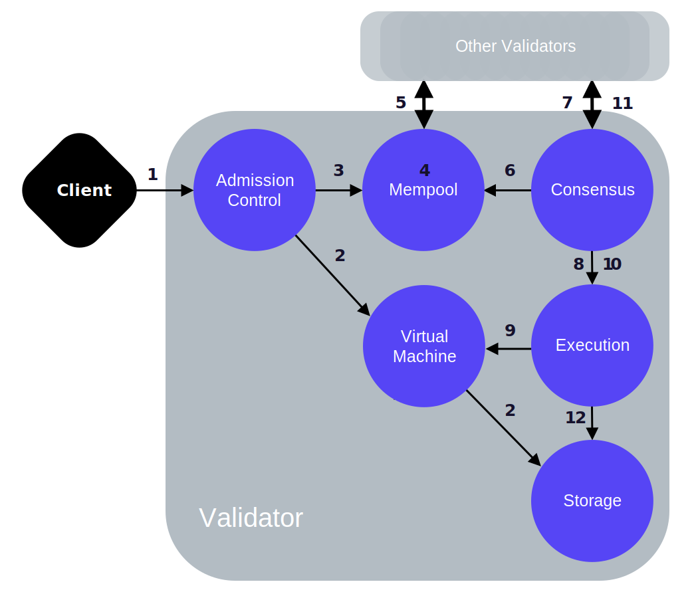
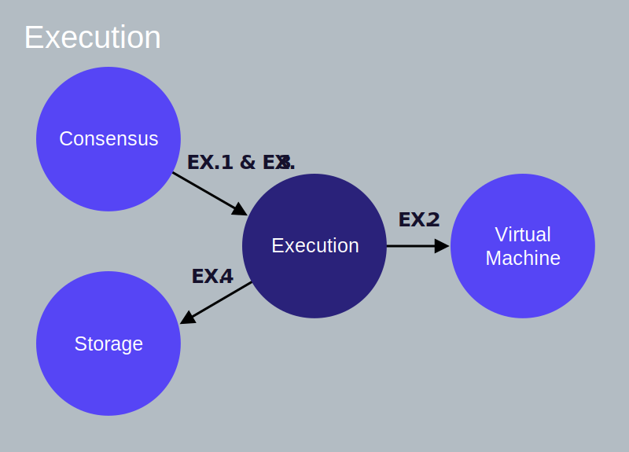
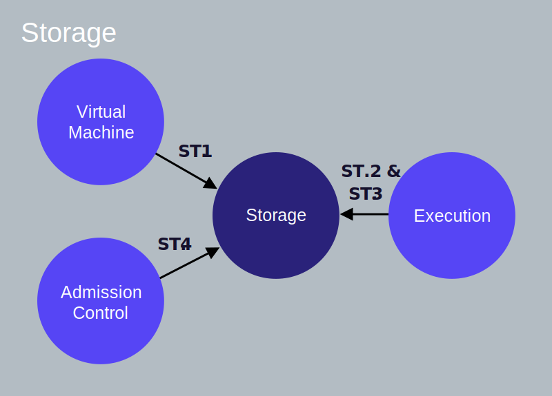

# Libra テストネットノードの構築とトランザクション

## 資料サイト


[https://developers.libra.org/docs/my-first-transaction](https://developers.libra.org/docs/my-first-transaction)
## ローカルネットワークでのlibra_swarmの構成

*  custodial client
*  validator node


## Libra Coreのクローンとビルド

### 事前準備

```bash
sudo apt install -y build-essential 
sudo apt install -y curl
sudo apt install -y ssh
sudo apt install -y clang
sudo apt install -y cmake
```

Rust言語のインストール

```bash
curl https://sh.rustup.rs -sSf | sh
```

### Libra Coreリポジトリのクローンを作成する

```bash
git clone https://github.com/libra/libra.git
```

### testnetブランチをチェックアウトする

```bash
git checkout testnet
```

### 依存関係のインストール

Libra Coreをセットアップするには、次のようにlibraディレクトリに移動し、セットアップスクリプトを実行して依存関係をインストールします。

```bash
cd libra
./scripts/dev_setup.sh
```

セットアップスクリプトは、次のアクションを実行します。

* rustupをインストールします— rustupは、Libra Coreが実装されているRustプログラミング言語のインストーラーです。
* 必要なバージョンのrust-toolchainをインストールします。
* CMakeをインストールします—ビルドプロセスを管理します。
* プロトコルバッファ用のコンパイラであるprotocをインストールします。
* Goをインストールします—プロトコルバッファを構築します。


セットアップが失敗した場合は、トラブルシューティングを参照してください

## Libra CLIクライアントをビルドしてテストネットに接続する

Libraテストネットで実行されているバリデータノードに接続するには、以下に示すようにクライアントを実行します。

```bash
./scripts/cli/start_cli_testnet.sh
```

このコマンドは、cargo（Rustのパッケージマネージャー）を使用してクライアントを構築および実行し、クライアントをテストネット上のバリデータノードに接続します。

クライアントがテストネット上のノードに接続すると、次の出力が表示されます。いつでもクライアントを終了するには、quit次のコマンドを使用します。

```
usage: <command> <args>

Use the following commands:

account | a
  Account operations
query | q
  Query operations
transfer | transferb | t | tb
  <sender_account_address>|<sender_account_ref_id> <receiver_account_address>|<receiver_account_ref_id> <number_of_coins> [gas_unit_price (default=0)] [max_gas_amount (default 10000)] Suffix 'b' is for blocking.
  Transfer coins from account to another.
help | h
  Prints this help
quit | q!
  Exit this client


Please, input commands:

libra%
```


クライアントの構築とテストネットへの接続に問題がある場合は、トラブルシューティングを参照してください。

>> 注：システム上でバリデータノードをローカルで実行する場合は、ローカルバリデータノードを実行するの指示に従ってください。アカウントの作成、コインの鋳造、トランザクションの実行の手順は、testnet上のノードの手順と同じです。

## アリスとボブのアカウントを作成

クライアントがテストネットに接続されると、CLIコマンドを実行して新しいアカウントを作成できます。2人のユーザーのアカウントを作成します（アリスとボブと呼びましょう）。

### ステップ1：CLIクライアントがシステムで実行されているかどうかを確認する

Libraの％コマンドラインプロンプトは、あなたのLibraCLIクライアントが実行されていることを示しています。accountコマンドのヘルプ情報を表示するには、次のように「アカウント」と入力します。

```bash
libra% account
usage: account <arg>

Use the following args for this command:

create | c
  Create an account. Returns reference ID to use in other operations
list | la
  Print all accounts that were created or loaded
recover | r <file path>
  Recover Libra wallet from the file path
write | w <file name>
  Save Libra wallet mnemonic recovery seed to disk
mint | mintb | m | mb <receiver account> <number of coins>
  Mint coins to the account. Suffix 'b' is for blocking
```

### ステップ2：アリスのアカウントを作成する

CLIを使用してアカウントを作成しても、ブロックチェーンは更新されず、ローカルキーペアが作成されるだけです。

アリスのアカウントを作成するには、次のコマンドを入力します。

```bash
libra% account create

成功時のサンプル出力：

>> Creating/retrieving next account from wallet
Created/retrieved account #0 address 3ed8e5fafae4147b2a105a0be2f81972883441cfaaadf93fc0868e7a0253c4a8
```

0はアリスのアカウントのインデックスであり、16進文字列はアリスのアカウントのアドレスです。インデックスは、アリスのアカウントを参照する方法にすぎません。アカウントインデックスはローカルCLIインデックスであり、ユーザーが他のCLIコマンドで使用して、作成したアカウントを簡単に参照できます。インデックスはブロックチェーンにとって無意味です。アリスのアカウントは、お金がミントによってアリスのアカウントに追加されるか、別のユーザーからの送金によってアリスのアカウントに送金される場合にのみ、ブロックチェーン上に作成されます。CLIコマンドで16進アドレスを使用することもできます。アカウントインデックスは、アカウントアドレスの便利なラッパーです。

### ステップ3：ボブのアカウントを作成する

Bobのアカウントを作成するには、アカウント作成コマンドを繰り返します。

```bash
libra% account create
```

成功時のサンプル出力：

```
>> Creating/retrieving next account from wallet
Created/retrieved account #1 address 8337aac709a41fe6be03cad8878a0d4209740b1608f8a81566c9a7d4b95a2ec7
```

1はボブのアカウントのインデックスであり、16進文字列はボブのアカウントのアドレスです。インデックスの詳細については、アリスのアカウントの作成を参照してください。

### ステップ4（オプション）：アカウントのリスト

作成したアカウントをリストするには、次のコマンドを入力します。

```bash
libra% account list
```

成功時のサンプル出力：

```
User account index: 0, address: 3ed8e5fafae4147b2a105a0be2f81972883441cfaaadf93fc0868e7a0253c4a8, sequence number: 0
User account index: 1, address: 8337aac709a41fe6be03cad8878a0d4209740b1608f8a81566c9a7d4b95a2ec7, sequence number: 0
```

アカウントのシーケンス番号は、そのアカウントから送信されたトランザクションの数を示します。そのアカウントから送信されたトランザクションが実行され、ブロックチェーンに保存されるたびに増加します。詳細については、シーケンス番号を参照してください。

## Libra CoinsをAliceおよびBobのアカウントに追加する

testnetのアカウントへのコインの作成と追加は、Faucetを介して行われます。Faucetは、テストネットとともに実行されるサービスです。このサービスは、testnet用鋳造コインを促進するために存在し、存在していませんmainnet。現実世界の価値のないLibraを作成します。それぞれインデックス0とインデックス1でアリスとボブのアカウントを作成したと仮定すると、以下の手順に従って両方のアカウントにLibraを追加できます。


### ステップ1：110 LBRをAliceのアカウントに追加します

Libraをミントしてアリスのアカウントに追加するには、次のコマンドを入力します。

```bash
libra% account mint 0 110
```

0はアリスのアカウントのインデックスです。
110は、アリスのアカウントに追加されるLibraの量です。
account mintコマンドが成功すると、ブロックチェーン上にAliceのアカウントも作成されます。

成功時のサンプル出力：

```
>> Minting coins
Mint request submitted
```

要求が送信されると、（testnet上のバリデータノードの）Mempoolに正常に追加されたことを意味することに注意してください。必ずしも正常に完了することを意味するわけではありません。後で、口座残高を照会して、マイニングが成功したかどうかを確認します。

アカウントmintコマンドがリクエストを正常に送信しなかった場合は、トラブルシューティングを参照してください

### ステップ2：ボブのアカウントに52 LBRを追加する

LibraをミントしてBobのアカウントに追加するには、次のコマンドを入力します。

```bash
libra% account mint 1 52
```

1はボブのアカウントのインデックスです。
52は、Bobのアカウントに追加されるLibraの量です。
account mintコマンドが成功すると、ブロックチェーン上にBobのアカウントも作成されます。ブロックチェーン上にボブのアカウントを作成する別の方法は、アリスのアカウントからボブのアカウントに送金することです。
成功時のサンプル出力：

```
>> Minting coins
Mint request submitted
```

アカウントmintコマンドがリクエストを正常に送信しなかった場合は、トラブルシューティングを参照してください

### ステップ3：残高を確認する

アリスの口座の残高を確認するには、次のコマンドを入力します。

```
libra% query balance 0
```

成功時のサンプル出力：

```
Balance is: 110
```

Bobのアカウントの残高を確認するには、次のコマンドを入力します。

```bash
libra% query balance 1
```

成功時のサンプル出力：

```
Balance is: 52
```

## トランザクションを送信する

LibraをAliceのアカウントからBobのアカウントに転送するトランザクションを送信する前に、各アカウントのシーケンス番号を照会します。これは、トランザクションを実行すると各アカウントのシーケンス番号がどのように変化するかを理解するのに役立ちます。

### アカウントのシーケンス番号を照会する

```bash
libra% query sequence 0
>> Getting current sequence number
Sequence number is: 0
libra% query sequence 1
>> Getting current sequence number
Sequence number is: 0
```

でquery sequence 0、0はアリスのアカウントのインデックスです。アリスとボブの両方のアカウントのシーケンス番号0は、アリスまたはボブのアカウントからのトランザクションがこれまでに実行されていないことを示します。

## 送金

アリスのアカウントからボブのアカウントに10 LBRを転送するトランザクションを送信するには、次のコマンドを入力します。

```bash
libra% transfer 0 1 10
```

0はアリスのアカウントのインデックスです。
1はボブのアカウントのインデックスです。
10は、アリスのアカウントからボブのアカウントに転送するLibraの数です。
成功時のサンプル出力：

```
>> Transferring
Transaction submitted to validator
To query for transaction status, run: query txn_acc_seq 0 0 <fetch_events=true|false>
```

コマンドquery txn_acc_seq 0 0 true（アカウントおよびシーケンス番号によるトランザクション）を使用して、送信したばかりのトランザクションに関する情報を取得できます。最初のパラメーターは送信者アカウントのローカルインデックスで、2番目のパラメーターはアカウントのシーケンス番号です。このコマンドのサンプル出力を表示するにはを参照してください出力のサンプル。

トランザクションをtestnetのバリデータノードに送信したところ、バリデータのMempoolに含まれていました。これは、必ずしもトランザクションが実行されたことを意味するわけではありません。理論的には、システムが低速または過負荷の場合、結果を確認するのに時間がかかるため、アカウントを照会して複数回確認する必要があります。インデックス0でアカウントをクエリするには、次のコマンドを使用できます query account_state 0.。期待される出力は、サンプル出力セクションに表示されます

転送コマンドのトラブルシューティングについては、トラブルシューティングを参照してください。

ブロック転送コマンド：transferbコマンドの代わりに、transferコマンドを使用できます（以下を参照）。transferbトランザクションがブロックチェーンにコミットされた後にのみ、トランザクションを送信してクライアントプロンプトに戻ります。以下に例を示します。

```bash
libra% transferb 0 1 10
```

送信から実行および保存までのトランザクションのライフサイクルの理解については、トランザクションの寿命を参照してください。

### 転送後のクエリシーケンス番号

```bash
libra% query sequence 0
>> Getting current sequence number
Sequence number is: 1
libra% query sequence 1
>> Getting current sequence number
Sequence number is: 0
```

アリスのアカウントのシーケンス番号1（インデックス0）は、これまでに1つのトランザクションがアリスのアカウントから送信されたことを示しています。Bobのアカウントのシーケンス番号0（インデックス1）は、これまでにBobのアカウントからトランザクションが送信されていないことを示します。アカウントからトランザクションが送信されるたびに、シーケンス番号は1ずつ増加します。

### 譲渡後に両方の口座の残高を確認する

両方のアカウントの最終残高を確認するには、この手順で行ったように、各アカウントの残高を再度クエリします。トランザクション（転送）が正常に実行されると、Aliceのアカウントに100 LBR、Bobのアカウントに62 LBRが表示されます。

```bash
libra% query balance 0
Balance is: 100
libra% query balance 1
Balance is: 62
```

## 成功

Libraテストネットでトランザクションを正常に実行し、アリスのアカウントからボブのアカウントに10 LBRを転送しました！

## トラブルシューティング

### セットアップ

* Rustの更新：
    * rustup updatelibraディレクトリから実行します。
* 更新プロトコル：
    * protocバージョン3.6.0以降に更新します。
* libraディレクトリからセットアップスクリプトを再実行します。
    * ./scripts/dev_setup.sh

### クライアントのビルドと実行

ビルドに失敗した場合は、libraディレクトリからカーゴロックファイルを削除してください。

```bash
rm Cargo.lock
```

クライアントがテストネットに接続しなかった場合：

インターネット接続を確認してください。
クライアントの最新バージョンを使用していることを確認してください。最新のLibra Coreを引き出して、クライアントを再実行します。

```bash
./scripts/cli/start_cli_testnet.sh
```

### アカウントへのお金の鋳造と追加

* testnetで接続したバリデータノードが利用できない場合、以下に示すように「サーバーが利用できません」というメッセージが表示されます。

```bash
libra% account mint 0 110
>> Minting coins
[ERROR] Error minting coins: Server unavailable, please retry and/or check **if** host passed to the client is running
```

* トランザクションの送信後に残高が更新されなかった場合は、しばらく待ってから再度残高を照会してください。ブロックチェーンで大量のトランザクションが発生している場合、遅延が発生する可能性があります。それでも残高が更新されない場合は、もう一度ミントを試してください。

* アカウントが存在するかどうかを確認するには、アカウントの状態を照会します。インデックス0のアカウントの場合、次を入力します。

```bash
libra% query account_state 0
```

### 転送コマンド

testnetバリデータノード（クライアントが接続されていた）が利用できない場合、またはtestnetへの接続がタイムアウトした場合、次のエラーが表示されます。

```bash
libra% transfer 0 1 10
>> Transferring
[ERROR] Failed to perform transaction: Server unavailable, please retry and/or check if host passed to the client is running
```

転送エラーをトラブルシューティングするには：

* testnetへの接続を確認します。
* 送信者アカウントを照会して、それが存在することを確認します。インデックス0のアカウントに対して次のコマンドを使用します。
    * query account_state 0
* quitまたはを使用してクライアントを終了しq!、次のコマンドを再実行してテストネットに接続できます。
    * ./scripts/cli/start_cli_testnet.sh libraディレクトリから

## 追加のクエリコマンドのサンプル出力

### アカウントとシーケンス番号によるトランザクションのクエリ

この例では、アカウントとシーケンス番号を使用して、単一のトランザクションの詳細を照会します。

```bash
libra% query txn_acc_seq 0 0 true
>> Getting committed transaction by account and sequence number
Committed transaction: SignedTransaction {
 { raw_txn: RawTransaction {
    sender: 3ed8e5fafae4147b2a105a0be2f81972883441cfaaadf93fc0868e7a0253c4a8,
    sequence_number: 0,
    payload: {,
      transaction: peer_to_peer_transaction,
      args: [
        {ADDRESS: 8337aac709a41fe6be03cad8878a0d4209740b1608f8a81566c9a7d4b95a2ec7},
        {U64: 10000000},
      ]
    },
    max_gas_amount: 10000,
    gas_unit_price: 0,
    expiration_time: 1560466424s,
},
 public_key: 55af3fe3f28550a2f1e5ebf073ef193feda44344d94c463b48be202aa0b3255d,
 signature: Signature( R: CompressedEdwardsY: [210, 23, 214, 62, 228, 179, 64, 147, 81, 159, 180, 138, 100, 211, 111, 139, 178, 148, 81, 1, 240, 135, 148, 145, 104, 234, 227, 239, 198, 153, 13, 199], s: Scalar{
  bytes: [203, 76, 105, 49, 64, 130, 162, 81, 22, 237, 159, 26, 80, 181, 111, 94, 84, 6, 152, 126, 181, 192, 62, 103, 130, 94, 246, 174, 139, 214, 3, 15],
} ),
 }
 }
Events:
ContractEvent { access_path: AccessPath { address: 3ed8e5fafae4147b2a105a0be2f81972883441cfaaadf93fc0868e7a0253c4a8, type: Resource, hash: "217da6c6b3e19f1825cfb2676daecce3bf3de03cf26647c78df00b371b25cc97", suffix: "/sent_events_count/" } , index: 0, event_data: AccountEvent { account: 8337aac709a41fe6be03cad8878a0d4209740b1608f8a81566c9a7d4b95a2ec7, amount: 10000000 } }
ContractEvent { access_path: AccessPath { address: 8337aac709a41fe6be03cad8878a0d4209740b1608f8a81566c9a7d4b95a2ec7, type: Resource, hash: "217da6c6b3e19f1825cfb2676daecce3bf3de03cf26647c78df00b371b25cc97", suffix: "/received_events_count/" } , index: 0, event_data: AccountEvent { account: 3ed8e5fafae4147b2a105a0be2f81972883441cfaaadf93fc0868e7a0253c4a8, amount: 10000000 } }
```

トランザクション量はmicrolibraに表示されることに注意してください。

### クエリイベント

次の例では、参照インデックス0のアカウントから「送信済み」イベントをクエリします。このアカウントから1つのトランザクションを送信したため、単一のイベントがあることに気付くでしょう。現在の状態の証明も返されるため、イベントが欠落していないことを確認できます。これは、クエリが「制限」イベントを返さないときに行われます。

```bash
libra% query event 0 sent 0 true 10
>> Getting events by account and event type.
EventWithProof {
  transaction_version: 3,
  event_index: 0,
  event: ContractEvent { access_path: AccessPath { address: e7460e02058b36d28e8eef03f0834c605d3d6c57455b8ec9c3f0a3c8b89f248b, type: Resource, hash: "217da6c6b3e19f1825cfb2676daecce3bf3de03cf26647c78df00b371b25cc97", suffix: "/sent_events_count/" } , index: 0, event_data: AccountEvent { account: 46efbad798a739c088e0e98dd9d592c27c7eb45ba1f8ccbdfc00bd4d7f2947f3, amount: 10000000 } },
  proof: EventProof { ledger_info_to_transaction_info_proof: AccumulatorProof { siblings: [HashValue(62570ae9a994bcb20c03c055667a4966fa50d0f17867dd5819465072fd2c58ba), HashValue(cce2cf325714511e7d04fa5b48babacd5af943198e6c1ac3bdd39c53c87cb84c)] }, transaction_info: TransactionInfo { signed_transaction_hash: HashValue(69bed01473e0a64140d96e46f594bc4b463e88e244b694e962b7e19fde17f30d), state_root_hash: HashValue(5809605d5eed94c73e57f615190c165b11c5e26873012285cc6b131e0817c430), event_root_hash: HashValue(645df3dee8f53a0d018449392b8e9da814d258da7346cf64cd96824f914e68f9), gas_used: 0 }, transaction_info_to_event_proof: AccumulatorProof { siblings: [HashValue(5d0e2ebf0952f0989cb5b38b2a9b52a09e8d804e893cb99bf9fa2c74ab304bb1)] } }
}
Last event state: Some(
    AccountStateWithProof {
        version: 3,
        blob: Some(
            AccountStateBlob {
             Raw: 0x010000002100000001217da6c6b3e19f1825cfb2676daecce3bf3de03cf26647c78df00b371b25cc974400000020000000e7460e02058b36d28e8eef03f0834c605d3d6c57455b8ec9c3f0a3c8b89f248b00e1f50500000000000000000000000001000000000000000100000000000000
             Decoded: Ok(
                AccountResource {
                    balance: 100000000,
                    sequence_number: 1,
                    authentication_key: 0xe7460e02058b36d28e8eef03f0834c605d3d6c57455b8ec9c3f0a3c8b89f248b,
                    sent_events_count: 1,
                    received_events_count: 0,
                },
            )
             },
        ),
        proof: AccountStateProof {
            ledger_info_to_transaction_info_proof: AccumulatorProof {
                siblings: [
                    HashValue(62570ae9a994bcb20c03c055667a4966fa50d0f17867dd5819465072fd2c58ba),
                    HashValue(cce2cf325714511e7d04fa5b48babacd5af943198e6c1ac3bdd39c53c87cb84c),
                ],
            },
            transaction_info: TransactionInfo {
                signed_transaction_hash: HashValue(69bed01473e0a64140d96e46f594bc4b463e88e244b694e962b7e19fde17f30d),
                state_root_hash: HashValue(5809605d5eed94c73e57f615190c165b11c5e26873012285cc6b131e0817c430),
                event_root_hash: HashValue(645df3dee8f53a0d018449392b8e9da814d258da7346cf64cd96824f914e68f9),
                gas_used: 0,
            },
            transaction_info_to_account_proof: SparseMerkleProof {
                leaf: Some(
                    (
                        HashValue(c0fbd63b0ae4abfe57c8f24f912f164ba0537741e948a65f00d3fae0f9373981),
                        HashValue(fc45057fd64606c7ca40256b48fbe486660930bfef1a9e941cafcae380c25871),
                    ),
                ),
                siblings: [
                    HashValue(4136803b3ba779bb2c1daae7360f3f839e6fef16ae742590a6698b350a5fc376),
                    HashValue(5350415253455f4d45524b4c455f504c414345484f4c4445525f484153480000),
                    HashValue(a9a6bda22dd6ee78ddd3a42da152b9bd39797b7da738e9d6023f407741810378),
                ],
            },
        },
    },
)
```

### アカウント状態の照会

この例では、単一のアカウントの状態を照会します。

```bash
libra% query account_state 0
>> Getting latest account state
Latest account state is:
 Account: 3ed8e5fafae4147b2a105a0be2f81972883441cfaaadf93fc0868e7a0253c4a8
 State: Some(
    AccountStateBlob {
     Raw: 0x010000002100000001217da6c6b3e19f1825cfb2676daecce3bf3de03cf26647c78df00b371b25cc9744000000200000003ed8e5fafae4147b2a105a0be2f81972883441cfaaadf93fc0868e7a0253c4a800e1f50500000000000000000000000001000000000000000100000000000000
     Decoded: Ok(
        AccountResource {
            balance: 100000000,
            sequence_number: 1,
            authentication_key: 0x3ed8e5fafae4147b2a105a0be2f81972883441cfaaadf93fc0868e7a0253c4a8,
            sent_events_count: 1,
            received_events_count: 0,
        },
    )
     },
)
 Blockchain Version: 3
```


### ローカルバリデータノードを実行する

コンピューター上でバリデータノードをローカルで起動し、Libraテストネットに接続されていない独自のローカルブロックチェーンネットワークを作成するには、Libra Coreのセットアップで説明されているビルドスクリプトを実行し、Libra Coreリポジトリのルートディレクトリに移動します、libra_swarm次のように実行します。

```bash
$ cd ~/libra
$ cargo run -p libra_swarm -- -s
```

-p libra_swarm -cargo にlibra_swarmパッケージを実行させ、1つのノードで構成されるローカルブロックチェーンを開始します。

-s オプションは、ローカルクライアントを起動して、ローカルブロックチェーンに接続します。

ノードを起動してLibraブロックチェーンに接続するための追加オプションを表示するには、次を実行します：

```bash
$ cargo run -p libra_swarm -- -h
```

cargo実行コマンドの実行には時間がかかる場合があります。このコマンドの実行がエラーなしで完了すると、Libra CLIクライアントのインスタンスとLibraバリデータノードがシステムで実行されています。正常に実行されると、CLIクライアントメニューとlibra%プロンプトを含む出力が表示されます。

## トランザクションの寿命

最初のトランザクションを実行したら、ドキュメントのトランザクションの寿命を参照できます。

* 提出から実行までのトランザクションのライフサイクルを「内部で」見ます。
* Libraエコシステムでトランザクションが送信および実行される際の、Libraバリデーターの各論理コンポーネント間の相互作用の理解。


# Libraのトランザクション

## トランザクションの寿命

Libraトランザクションのライフサイクルをより深く理解するために、Libraバリデーターに送信されてからLibra Blockchainにコミットされるまでのトランザクションを追跡します。次に、バリデータの各論理コンポーネントを「ズームイン」し、他のコンポーネントとの相互作用を調べます。

### クライアントがトランザクションを送信する

Libra クライアントは生のトランザクションを構築し（T 5 raw と呼びます）、アリスのアカウントからボブのアカウントに10 LBRを転送します。生のトランザクションには、次のフィールドが含まれます。各フィールドは、用語集の定義にリンクされています。

* アリスのアカウントアドレス。
* アリスに代わって実行されるアクションを示すプログラム。を含む：
    * Move bytecode ピアツーピアトランザクションスクリプト。
    * スクリプトへの入力のリスト（この例では、Bobのアカウントアドレスと支払い額）。
* ガス価格（マイクロリブラ/ガス単位）—アリスがトランザクションを実行するためにガスの単位ごとに支払う金額。ガスは、計算と保管に費用をかける方法です。ガスユニットは、固有の実世界の価値を持たない計算の抽象的な測定値です。
* アリスがこのトランザクションに対して支払う意思のある最大ガス量。
* トランザクションの有効期限。
* シーケンス番号 -5
    * シーケンス番号5のトランザクションは、シーケンス番号5のアカウントにのみ適用できます。

クライアントは、トランザクション署名 T 5アリスの秘密鍵で生を。署名されたトランザクションT 5には以下が含まれます。

* 生のトランザクション。
* アリスの公開鍵。
* アリスの署名。

### 仮定

トランザクションT 5のライフサイクルを説明するために、次のことを想定します。

* アリスとボブは、Libraブロックチェーンにアカウントを持っています。
* アリスのアカウントには110 LBRがあります。
* Aliceのアカウントの現在のシーケンス番号は5です（これは、5つのトランザクションがすでにAliceのアカウントから送信されたことを示しています）。
* V - 100のバリデータの中の選択肢の一つです1 Vに100ネットワーク上で。
* クライアントはバリデータV 1にトランザクションT 5を送信します
* Validator V 1は、現在のラウンドの提案者/リーダーです。

### トランザクションのライフサイクル

このセクションでは、クライアントから送信されてからLibraブロックチェーンにコミットされるまでのトランザクションT 5のライフサイクルを説明します。

必要に応じて、ライフサイクルの番号付きの手順に従って、バリデータノードの対応するコンポーネント間相互作用へのリンクを提供しました。トランザクションのライフサイクルのすべてのステップに精通したら、各ステップの対応するコンポーネント間相互作用に関する情報を参照することができます。

>> 注：このドキュメントのすべてのグラフィックの矢印は、対話/アクションを開始するコンポーネントから始まり、アクションが実行されているコンポーネントで終了します。矢印は、読み取り、書き込み、または返されるデータを表していません。



図1.1トランザクションのライフサイクル図1.1トランザクションのライフサイクル

### トランザクションを受け入れる

* 1 —クライアントは、アドミッションコントロール（AC）コンポーネントがトランザクションを受信するバリデーターV 1にトランザクションT 5を送信します。（クライアント→AC AC.1）

* 2 — ACは仮想マシン（VM）コンポーネントを使用して、署名検証、Aliceのアカウントに十分な残高があることの確認、トランザクションT 5がリプレイされていないことの確認などの検証チェックを実行します（AC→VM AC.2、VM.1）

* 3 — T 5が検証チェックに合格すると、ACはT 5をV 1のMempoolに送信します。（AC→Mempool AC.3、MP.1）

### トランザクションを他のバリデーターと共有する

* 4 — Mempoolはメモリ内バッファーにT 5を保持します。Mempoolには、アリスのアドレスから送信された複数のトランザクションが既に含まれている場合があります。

* 5 -共有Mempoolプロトコルを使用して、V 1は、（T含むトランザクション共有する5を他のバリデータ（VとのMempoolに）2 Vの100）と場所取引独自Mempoolに他のバリデータから受け取りました。（Mempool→その他の検証MP.2）

### ブロックを提案する

* 6 —バリデーターV 1は提案者/リーダーであるため、Mempoolからトランザクションのブロックをプルし、コンセンサスコンポーネントを介してこのブロックを他のバリデーターへの提案として複製します。（コンセンサス→Mempool MP.3、CO.1）

* 7 — V 1のコンセンサスコンポーネントは、提案されたブロック内のトランザクションの順序に関するすべての検証者間の合意を調整する責任があります。（コンセンサス→その他のバリデーターCO.2）。提案されているコンセンサスプロトコルLibraBFTの詳細については、技術論文Libra BlockchainのState Machine Replicationを参照してください。

### ブロックの実行とコンセンサスへの到達

* 8 —合意に達する一環として、トランザクションのブロック（T 5を含む）が実行コンポーネントに渡されます。（コンセンサス→実行CO.3、EX.1）

* 9 —実行コンポーネントは、仮想マシン（VM）のトランザクションの実行を管理します。この実行は、ブロック内のトランザクションが合意される前に投機的に行われることに注意してください。（実行→VM EX.2、VM.3）

* 10 —ブロック内のトランザクションを実行した後、実行コンポーネントはブロック内のトランザクション（T 5を含む）を（元帳履歴の）Merkleアキュムレータに追加します。これは、Merkleアキュムレーターのメモリー内/一時バージョンです。これらのトランザクションを実行した結果（提案/推測）は、コンセンサスコンポーネントに返されます。（コンセンサス→実行CO.3、EX.1）。「コンセンサス」から「実行」への矢印は、トランザクションを実行する要求がコンセンサスコンポーネントによって行われたことを示します。（このドキュメント全体で矢印を一貫して使用するために、データの流れを表すために矢印を使用していません）。

* 11 — V 1（コンセンサスリーダー）は、コンセンサスに参加している他の検証者とブロックの実行結果についてコンセンサスを得ようとします。（コンセンサス→その他のバリデーターCO.3）

### ブロックをコミットする

* 12 —ブロックの実行結果が投票のスーパーマジョリティを持つバリデーターのセットによって合意され、署名されている場合、バリデーターV 1の実行コンポーネントは投機的実行キャッシュからブロック実行の結果を読み取り、すべてのトランザクションをコミットします永続ストレージへのブロック内。（コンセンサス→実行CO.4、EX.3）、（実行→ストレージEX.4、ST.3）

* 13 -アリスのアカウントは今100 LBRを持つことになり、そのシーケンス番号がT場合は6となる5はボブによって再生され、それはアリスのアカウントのシーケンス番号として拒否されます（6）再生トランザクションのシーケンス番号よりも大きいです（5）。

## 検証コンポーネントの相互作用

で、前のセクションは、我々はblockchainの分散データベースにコミットされているに提出されることからサンプルトランザクションの典型的なライフサイクルを説明しました。

バリデーターがトランザクションを処理し、クエリに応答する際のバリデーターのコンポーネント間の相互作用をさらに詳しく見てみましょう。この情報は、次の人に最も役立ちます。

* システムがカバーの下でどのように機能するかについての全体的なアイデアを得たいと思います。
* Libra Coreソフトウェアに最終的に貢献することに興味があります。

説明のために、クライアントがトランザクションT NをバリデーターV Xに送信すると仮定します。

各バリデータコンポーネントについて、コンポーネント間の相互作用のそれぞれを、それぞれのコンポーネントのセクションの下のサブセクションで説明します。

コンポーネント間の相互作用を説明するサブセクションは、実行される順序で厳密にリストされていないことに注意してください。インタラクションのほとんどはトランザクションの処理に関連しており、いくつかはクライアントによるクエリの読み取りに関連しています（ブロックチェーン上の既存の情報のクエリ）。

バリデータノードのコア論理コンポーネントを見てみましょう。

* アドミッション・コントロール
* Mempool
* コンセンサス
* 実行
* 仮想マシン
* ストレージ

各セクションの最後に、対応するLibra Coreの「README」へのリンクを提供します。

## アドミッション・コントロール（AC）


図1.2アドミッションコントロール図1.2アドミッションコントロール

アドミッションコントロールは、バリデーターの唯一の外部インターフェイスです。クライアントからバリデーターへの要求は、最初にACに送信されます。

### クライアント→AC（AC.1）

クライアントは、バリデータV Xのアドミッションコントロールにトランザクションを送信します。これは次の方法 AC::SubmitTransaction() で行います。

### AC→VM（AC.2）

アドミッションコントロールは、バリデータの仮想マシン（VM）にアクセスして、不正なトランザクションを早期に拒否するためにトランザクションの予備チェックを実行します。これは次の方法 VM::ValidateTransaction() で行います。

### AC→Mempool（AC.3）

一旦VM::ValidateTransaction()エラーなし戻り、ACはVバリトランザクションを転送Xを介してのMempoolをMempool::AddTransactionWithValidation().バリデータVのためMempool XトランザクションT受け入れるN Tのシーケンス番号場合にのみ、ACからNは、現在のシーケンス番号以上であると送信者のアカウントの（トランザクションは、次のシーケンス番号になるまでコンセンサスに渡されないことに注意してください）。

### AC→ストレージ（AC.4）

クライアントがLibra Blockchainで読み取りクエリを実行すると（たとえば、Aliceのアカウントの残高を取得するために）、ACはストレージコンポーネントと直接対話して、要求された情報を取得します。

### アドミッション・コントロールのREADME

実装の詳細については、Admission ControlのREADMEを参照してください。

## 仮想マシン（VM）


図1.3仮想マシン図1.3仮想マシン

移動仮想マシン（VM）が確認し、移動バイトコードで記述されたトランザクションスクリプトを実行します。

### AC→VM（VM.1）

バリデーターV Xのアドミッションコントロールは、クライアントからトランザクションを受信するVM::ValidateTransaction()と、VMを呼び出してトランザクションを検証します。

### VM→ストレージ（VM.2）

ACまたはMempoolがVMにトランザクションを検証するように要求するVM::ValidateTransaction()と、VMはトランザクション送信者のアカウントをストレージからロードし、次の検証を実行します。

* 署名されたトランザクションの入力署名が正しいことを確認します（誤って署名されたトランザクションを拒否するため）。
* 送信者のアカウント認証キーが公開キーのハッシュと同じであることを確認します（トランザクションの署名に使用される秘密キーに対応）。
* トランザクションのシーケンス番号が送信者のアカウントの現在のシーケンス番号より小さくないことを確認します。このチェックを行うと、送信者のアカウントに対する同じトランザクションのリプレイが防止されます。
* 不正な形式のプログラムはVMで実行できないため、署名されたトランザクションのプログラムが不正な形式ではないことを確認します。
* トランザクションで指定された最大ガス量をサポートするために、送信者のアカウントに十分な残高があることを確認します。これにより、トランザクションは使用するリソースに対して支払いができます。

### 実行→VM（VM.3）

実行コンポーネントはVMを利用してを介してトランザクションを実行しVM::ExecuteTransaction()ます。

トランザクションの実行は、台帳の状態を更新し、結果をストレージに保持することとは異なることを理解することが重要です。トランザクションT Nは、コンセンサス中にブロックの合意に達する試みの一部として最初に実行されます。トランザクションの順序とその実行結果について他の検証者と合意に達した場合、結果はストレージに保持され、元帳の状態が更新されます。

### Mempool→VM（VM.4）

Mempoolが共有Mempoolを介して他のバリデーターからトランザクションを受信すると、MempoolはVM::ValidateTransaction()VMを呼び出してトランザクションを検証します。

### VMのREADME

実装の詳細については、仮想マシンのREADMEを参照してください。

Mempool


図1.4 Mempool図1.4 Mempool

Mempoolは、実行待ちのトランザクションを保持する共有バッファです。新しいトランザクションがMempoolに追加されると、Mempoolはこのトランザクションをシステム内の他のバリデーターと共有します。「共有Mempool」のネットワーク消費を削減するために、各バリデーターは、独自のトランザクションを他のバリデーターに配信する責任があります。バリデーターが別のバリデーターのMempoolからトランザクションを受信すると、そのトランザクションは受信者バリデーターのMempoolに追加されます。

### AC→Mempool（MP.1）

* 初期検証チェックを実行した後、バリデータのACはトランザクションをバリデータのMempoolに送信します。
* バリデータVのためMempool Xは、トランザクションT受け入れるNを Tのシーケンス番号場合にのみ、送信者のアカウントのNは、送信者のアカウントの現在のシーケンス番号以上です。

### Mempool→その他のバリデーター（MP.2）

* バリデータV XのMempoolは、同じネットワーク上の他のバリデータとトランザクションT Nを共有します。
* 他のバリデーターは、自分のMempoolのトランザクションをV XのMempoolと共有します。

### コンセンサス→Mempool（MP.3）

* バリデーターV Xがリーダーになると、そのコンセンサスはトランザクションのブロックをそのMempoolから引き出し、そのブロックを他のバリデーターに複製します。これは、トランザクションの順序とブロック内のトランザクションの実行結果に関するコンセンサスに到達するために行われます。
* トランザクションT Nがコンセンサスブロックに含まれていたからといって、ブロックチェーンの分散データベースにT Nが最終的に保持されることを保証しないことに注意してください。

### Mempool→VM（MP.4）

Mempoolが他のバリデーターからトランザクションを受け取ると、MempoolはVM::ValidateTransaction()VMを呼び出してトランザクションを検証します。

### Mempool README

実装の詳細については、MempoolのREADMEを参照してください。

## コンセンサス


図1.5コンセンサス図1.5コンセンサス

コンセンサスコンポーネントは、トランザクションのブロックを順序付け、ネットワーク内の他のバリデーターとコンセンサスプロトコルに参加することにより実行結果に同意する責任があります。

### コンセンサス→Mempool（CO.1）

バリデーターV Xがリーダー/ プロポーザーである場合、V Xのコンセンサスはを介してMempoolからトランザクションのブロックを引き出しMempool::GetBlock()、提案を作成します。

### コンセンサス→その他のバリデーター（CO.2）

V Xが提案者/リーダーである場合、そのコンセンサスは提案されたトランザクションのブロックを他の検証者に複製します。

### コンセンサス→実行、コンセンサス→その他のバリデーター（CO.3）

* トランザクションのブロックを実行するために、コンセンサスは実行コンポーネントと対話します。コンセンサスを介してトランザクションのブロックを実行するExecution:ExecuteBlock()（を参照してコンセンサス→実行）
* ブロック内のトランザクションを実行した後、実行はこれらのトランザクションの実行結果でコンセンサスに応答します。
* コンセンサスは実行結果に署名し、コンセンサスに参加している他の検証者とこの結果について合意に達しようとします。

### コンセンサス→実行（CO.4）

十分なバリデーターが同じ実行結果に投票すると、V XのコンセンサスコンポーネントはExecution::CommitBlock()、このブロックがコミットされる準備ができていることを介して実行に通知します。

### コンセンサスREADME

実装の詳細については、コンセンサスREADMEを参照してください。

## 実行



図1.6実行図1.6実行

実行の仕事は、トランザクションのブロックの実行を調整し、コンセンサスによって投票できる一時的な状態を維持することです。

### コンセンサス→実行（EX.1）

* コンセンサスは、を介してトランザクションのブロックを実行する実行を要求しますExecution::ExecuteBlock()。
* 実行は、「スクラッチパッド」を維持します。これは、Merkleアキュムレータの関連部分のメモリ内コピーを保持します。この情報は、ブロックチェーンの現在の状態のルートハッシュを計算するために使用されます。
* 現在の状態のルートハッシュは、ブロック内のトランザクションに関する情報と組み合わされて、アキュムレータの新しいルートハッシュが決定されます。これは、データを永続化する前に行われ、検証者の定足数によって合意に達するまで状態またはトランザクションが保存されないようにします。
* 実行は投機的なルートハッシュを計算し、V Xのコンセンサスがこのルートハッシュに署名し、このルートハッシュについて他のバリデーターとの合意を試みます。

### 実行→VM（EX.2）

コンセンサスがを介してトランザクションのブロックを実行するように実行を要求するとExecution::ExecuteBlock()、実行はVMを使用してトランザクションのブロックを実行した結果を判断します。

### コンセンサス→実行（EX.3）

バリデータの定足数がブロックの実行結果に同意する場合、各バリデータのコンセンサスはExecution::CommitBlock()、このブロックがコミットされる準備ができていることを介して実行コンポーネントに通知します。実行コンポーネントへのこの呼び出しには、合意の証拠を提供する同意バリデーターの署名が含まれます。

### 実行→ストレージ（EX.4）

実行は「スクラッチパッド」から値を取得し、永続化のためにを介してストレージに送信しますStorage::SaveTransactions()。次に、実行により、不要になった「スクラッチパッド」から古い値が削除されます（たとえば、コミットできない並列ブロック）。

### 実行README

実装の詳細については、実行READMEを参照してください。

## ストレージ


図1.7ストレージ図1.7ストレージ

ストレージコンポーネントは、トランザクションのブロックとその実行結果について合意されたままです。トランザクションのブロック/セット（トランザクションT Nを含む）は、次の場合にストレージを介して保存されます。

* 以下のすべてについてコンセンサスに参加している検証者の2f + 1以上の間で合意があります。
    * ブロックに含めるトランザクション。
    * トランザクションの順序。
    * ブロックに含まれるトランザクションの実行結果。

ブロックチェーンを表すデータ構造にトランザクションを追加する方法については、Merkleアキュムレータを参照してください。

### VM→ストレージ（ST.1）

ACまたはMempoolが呼び出しVM::ValidateTransaction()てトランザクションを検証するVM::ValidateTransaction()と、ストレージから送信者のアカウントが読み込まれ、トランザクションで読み取り専用の有効性チェックが実行されます。

### 実行→ストレージ（ST.2）

コンセンサスが呼び出されるとExecution::ExecuteBlock()、実行はメモリ内の「スクラッチパッド」データと組み合わされたストレージから現在の状態を読み取り、実行結果を決定します。
### 実行→ストレージ（ST.3）

* トランザクションのブロックでコンセンサスが得られると、実行は経由でストレージを呼び出してStorage::SaveTransactions()、トランザクションのブロックを保存し、永続的に記録します。これは、このトランザクションのブロックに同意したバリデータノードからの署名も保存します。
* このブロックの「スクラッチパッド」のメモリ内データは、更新されたストレージに渡され、トランザクションを永続化します。
* ストレージが更新されると、各トランザクションによって変更されたすべてのリソースのシーケンス番号がそれに応じて更新されます。
注：Libra Blockchainのアカウントのシーケンス番号は、そのアカウントから発信されたコミット済みのトランザクションごとに1ずつ増加します。

### AC→ストレージ（ST.4）

ブロックチェーンから情報を読み取るクライアントクエリの場合、ACは要求された情報を読み取るためにストレージと直接対話します。

