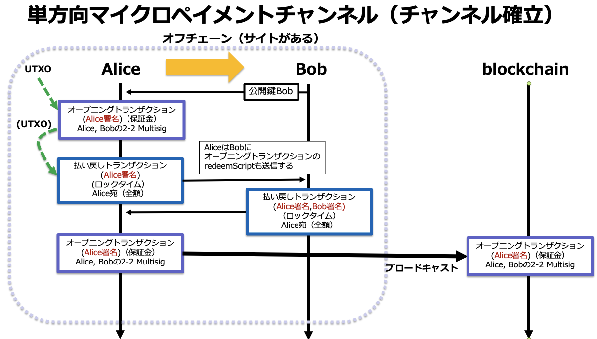
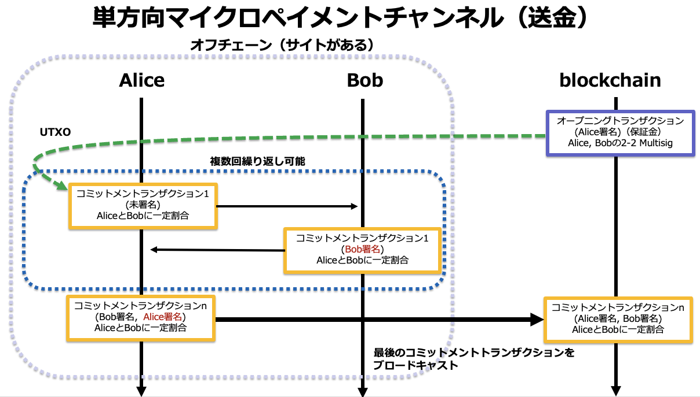
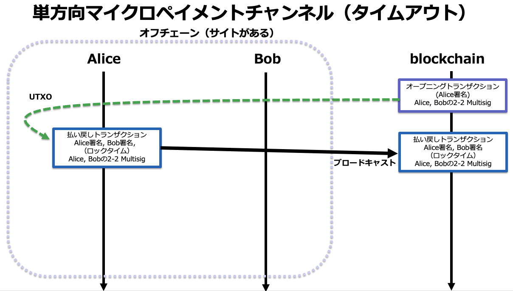

# マイクロペイメントチャンネルの作成
2021/10/29

# Alice からBobに送金する







* Aliceのアドレス：tb1qa20gy39as4qgce353fegq4cl7ss2jcsqu0e6w0
* Bobのアドレス：tb1q9vml26m9vgm5nk3fk9v7cfkad7tlfgsgnahkfu


## Bobが自分の公開鍵を確認する

```bash
bitcoin-core.cli getaddressinfo tb1q9vml26m9vgm5nk3fk9v7cfkad7tlfgsgnahkfu

{
  "address": "tb1q9vml26m9vgm5nk3fk9v7cfkad7tlfgsgnahkfu",
  "scriptPubKey": "00142b37f56b65623749da29b159ec26dd6f97f4a208",
  "ismine": true,
  "solvable": true,
  "desc": "wpkh([e4668231/0'/0'/1']03d66199f0dd6bbd161cd4a854cd238a4dbebf2d0cf1133180797e1270dac3e528)#p6vdawtq",
  "iswatchonly": false,
  "isscript": false,
  "iswitness": true,
  "witness_version": 0,
  "witness_program": "2b37f56b65623749da29b159ec26dd6f97f4a208",
  "pubkey": "03d66199f0dd6bbd161cd4a854cd238a4dbebf2d0cf1133180797e1270dac3e528",
  "ischange": false,
  "timestamp": 1634099655,
  "hdkeypath": "m/0'/0'/1'",
  "hdseedid": "1131dbe1dd22375906ef16f4d5651aedf8aba325",
  "hdmasterfingerprint": "e4668231",
  "labels": [
    ""
  ]
}
```

## Bobが，Aliceに自分の公開鍵を渡す

```
"pubkey": "03d66199f0dd6bbd161cd4a854cd238a4dbebf2d0cf1133180797e1270dac3e528",
```

## Alice がオープニングトランザクションを作成する

### Alice が自分のUTXOと残高を確認する

```bash
bitcoin-core.cli listunspent
[
  {
    "txid": "c0627fb7964d6134a2aef1f37b60866913122643aea86674305a06406d51bba5",
    "vout": 1,
    "address": "tb1qa20gy39as4qgce353fegq4cl7ss2jcsqu0e6w0",
    "label": "",
    "scriptPubKey": "0014ea9e8244bd85408c66348a7280571ff420a96200",
    "amount": 0.10000000,
    "confirmations": 2074,
    "spendable": true,
    "solvable": true,
    "desc": "wpkh([b6437264/0'/0'/0']03760b5a28bb264ca5b310d766ad3a095c9f866fe9a0b38b8079ca350c6a3e3347)#jzklsng9",
    "safe": true
  }
]
```

### Alice も自分の公開鍵を確認する

```bash
bitcoin-core.cli getaddressinfo tb1qa20gy39as4qgce353fegq4cl7ss2jcsqu0e6w0
{
  "address": "tb1qa20gy39as4qgce353fegq4cl7ss2jcsqu0e6w0",
  "scriptPubKey": "0014ea9e8244bd85408c66348a7280571ff420a96200",
  "ismine": true,
  "solvable": true,
  "desc": "wpkh([b6437264/0'/0'/0']03760b5a28bb264ca5b310d766ad3a095c9f866fe9a0b38b8079ca350c6a3e3347)#jzklsng9",
  "iswatchonly": false,
  "isscript": false,
  "iswitness": true,
  "witness_version": 0,
  "witness_program": "ea9e8244bd85408c66348a7280571ff420a96200",
  "pubkey": "03760b5a28bb264ca5b310d766ad3a095c9f866fe9a0b38b8079ca350c6a3e3347",
  "ischange": false,
  "timestamp": 1634103859,
  "hdkeypath": "m/0'/0'/0'",
  "hdseedid": "996145f9a9559745d1a132f74a31088ee18178af",
  "hdmasterfingerprint": "b6437264",
  "labels": [
    ""
  ]
}
```

*  BobとAliceの2-2 Multisig トランザクション( P2WSH)を作成する
*  そのために，Bob と Alice の2-2 マルチシグアドレスを作成する（Bob, Aliceの順番-> 公開鍵の順番）
*  署名のために descriptor: を保管しておく
*  署名のためにredeemScriptを保管しておく
*  Bobの公開鍵：03d66199f0dd6bbd161cd4a854cd238a4dbebf2d0cf1133180797e1270dac3e528
*  Aliceの公開鍵：03760b5a28bb264ca5b310d766ad3a095c9f866fe9a0b38b8079ca350c6a3e3347

### Bob と Alice の2-2 Multisig アドレスを生成する

```bash
bitcoin-core.cli createmultisig 2 '["03d66199f0dd6bbd161cd4a854cd238a4dbebf2d0cf1133180797e1270dac3e528","03760b5a28bb264ca5b310d766ad3a095c9f866fe9a0b38b8079ca350c6a3e3347"]' bech32


{
  "address": "tb1qh29r9sqy8fz0mk5v9sxp5qz2lp7y0wsre6l2ydsrskw3yh2dnvesnj3pfj",
  "redeemScript": "522103d66199f0dd6bbd161cd4a854cd238a4dbebf2d0cf1133180797e1270dac3e5282103760b5a28bb264ca5b310d766ad3a095c9f866fe9a0b38b8079ca350c6a3e334752ae",
  "descriptor": "wsh(multi(2,03d66199f0dd6bbd161cd4a854cd238a4dbebf2d0cf1133180797e1270dac3e528,03760b5a28bb264ca5b310d766ad3a095c9f866fe9a0b38b8079ca350c6a3e3347))#g8tynknc"
}
```

### descriptor

```
  "descriptor": "wsh(multi(2,03d66199f0dd6bbd161cd4a854cd238a4dbebf2d0cf1133180797e1270dac3e528,03760b5a28bb264ca5b310d766ad3a095c9f866fe9a0b38b8079ca350c6a3e3347))#g8tynknc"
}
```

### redeemScript

```
"redeemScript": "522103d66199f0dd6bbd161cd4a854cd238a4dbebf2d0cf1133180797e1270dac3e5282103760b5a28bb264ca5b310d766ad3a095c9f866fe9a0b38b8079ca350c6a3e334752ae"
```

### Aliceの bitcoin coreワレットにマルチシグ情報を登録する

```bash
bitcoin-core.cli importmulti '[{"desc":"wsh(multi(2,03d66199f0dd6bbd161cd4a854cd238a4dbebf2d0cf1133180797e1270dac3e528,03760b5a28bb264ca5b310d766ad3a095c9f866fe9a0b38b8079ca350c6a3e3347))#g8tynknc","timestamp": "now", "watchonly": true}]'

[
  {
    "success": true
  }
]
```

### Bobの bitcoin coreワレットにもマルチシグ情報を登録する

```bash
bitcoin-core.cli importmulti '[{"desc":"wsh(multi(2,03d66199f0dd6bbd161cd4a854cd238a4dbebf2d0cf1133180797e1270dac3e528,03760b5a28bb264ca5b310d766ad3a095c9f866fe9a0b38b8079ca350c6a3e3347))#g8tynknc","timestamp": "now", "watchonly": true}]'

[
  {
    "success": true
  }
]
```


### オープニングトランザクションを作成する（P2WSHとお釣りのP2WPKH）

* 送金先P2WSH アドレス(Bob,Alice)：

```
"tb1q6yfsfsm77jk9dqsu8hrdgasd02gl6uvz5r2lat4hqg5e50y3p39qkmq09s"
```

* 送金先P2WPKH アドレス(Alice)：

```
tb1qa20gy39as4qgce353fegq4cl7ss2jcsqu0e6w0
```

* オープニングトランザクションのredeemScript: 

```
"522103d66199f0dd6bbd161cd4a854cd238a4dbebf2d0cf1133180797e1270dac3e5282103760b5a28bb264ca5b310d766ad3a095c9f866fe9a0b38b8079ca350c6a3e334752ae"

```

* input(UTXO) のJSON形式: 

```bash
'[{"txid":"c0627fb7964d6134a2aef1f37b60866913122643aea86674305a06406d51bba5","vout":1}]' 
```

* output のJSON形式 (お釣り，手数料 0.0002)：

```bash
'[{"tb1q6yfsfsm77jk9dqsu8hrdgasd02gl6uvz5r2lat4hqg5e50y3p39qkmq09s":0.01}, {"tb1qa20gy39as4qgce353fegq4cl7ss2jcsqu0e6w0":0.0898}]'
```

#### 未署名のオープニングトランザクションの作成: 

```bash
bitcoin-core.cli createrawtransaction  '[{"txid":"c0627fb7964d6134a2aef1f37b60866913122643aea86674305a06406d51bba5","vout":1}]' '[{"tb1q6yfsfsm77jk9dqsu8hrdgasd02gl6uvz5r2lat4hqg5e50y3p39qkmq09s":0.01}, {"tb1qa20gy39as4qgce353fegq4cl7ss2jcsqu0e6w0":0.0898}]'

0200000001a5bb516d40065a307466a8ae432612136986607bf3f1aea234614d96b77f62c00100000000ffffffff0240420f0000000000220020d11304c37ef4ac56821c3dc6d4760d7a91fd7182a0d5feaeb702299a3c910c4a2006890000000000160014ea9e8244bd85408c66348a7280571ff420a9620000000000
```

### 作成した未署名のオープニングトランザクションの確認

```bash
bitcoin-core.cli decoderawtransaction 0200000001a5bb516d40065a307466a8ae432612136986607bf3f1aea234614d96b77f62c00100000000ffffffff0240420f0000000000220020d11304c37ef4ac56821c3dc6d4760d7a91fd7182a0d5feaeb702299a3c910c4a2006890000000000160014ea9e8244bd85408c66348a7280571ff420a9620000000000


{
  "txid": "14ae127ea86891d4ee1756e36610b66b3dad908b82bdf3504d2bab90bbbaa485",
  "hash": "14ae127ea86891d4ee1756e36610b66b3dad908b82bdf3504d2bab90bbbaa485",
  "version": 2,
  "size": 125,
  "vsize": 125,
  "weight": 500,
  "locktime": 0,
  "vin": [
    {
      "txid": "c0627fb7964d6134a2aef1f37b60866913122643aea86674305a06406d51bba5",
      "vout": 1,
      "scriptSig": {
        "asm": "",
        "hex": ""
      },
      "sequence": 4294967295
    }
  ],
  "vout": [
    {
      "value": 0.01000000,
      "n": 0,
      "scriptPubKey": {
        "asm": "0 d11304c37ef4ac56821c3dc6d4760d7a91fd7182a0d5feaeb702299a3c910c4a",
        "hex": "0020d11304c37ef4ac56821c3dc6d4760d7a91fd7182a0d5feaeb702299a3c910c4a",
        "address": "tb1q6yfsfsm77jk9dqsu8hrdgasd02gl6uvz5r2lat4hqg5e50y3p39qkmq09s",
        "type": "witness_v0_scripthash"
      }
    },
    {
      "value": 0.08980000,
      "n": 1,
      "scriptPubKey": {
        "asm": "0 ea9e8244bd85408c66348a7280571ff420a96200",
        "hex": "0014ea9e8244bd85408c66348a7280571ff420a96200",
        "address": "tb1qa20gy39as4qgce353fegq4cl7ss2jcsqu0e6w0",
        "type": "witness_v0_keyhash"
      }
    }
  ]
}


```

### オープニングトランザクションへのAliceの署名

#### signrawtransactionwithwallet コマンドの仕様

```bash
signrawtransactionwithwallet "hexstring" ( [{"txid":"hex","vout":n,"scriptPubKey":"hex","redeemScript":"hex","witnessScript":"hex","amount":amount},...] "sighashtype" )

rawトランザクションに署名します（16進エンコードされシリアライズされたもの）。
オプションの第２引数は、署名対象トランザクションのinput になる直前のトランザクションoutputの配列です。
この直前のトランザクションは、まだブロックチェーンに含まれてい可能性もあります。

引数:
1. hexstring                        (string, required) The transaction hex string
2. prevtxs                          (json array, optional) A json array of previous dependent transaction outputs
     [
       {                            (json object)
         "txid": "hex",             (string, required) The transaction id
         "vout": n,                 (numeric, required) The output number
         "scriptPubKey": "hex",     (string, required) script key
         "redeemScript": "hex",     (string) (required for P2SH) redeem script
         "witnessScript": "hex",    (string) (required for P2WSH or P2SH-P2WSH) witness script
         "amount": amount,          (numeric or string, required) The amount spent
       },
       ...
     ]
3. sighashtype                      (string, optional, default=ALL) The signature hash type. Must be one of
                                    "ALL"
                                    "NONE"
                                    "SINGLE"
                                    "ALL|ANYONECANPAY"
                                    "NONE|ANYONECANPAY"
                                    "SINGLE|ANYONECANPAY"

Result:
{
  "hex" : "value",                  (string) The hex-encoded raw transaction with signature(s)
  "complete" : true|false,          (boolean) If the transaction has a complete set of signatures
  "errors" : [                      (json array of objects) Script verification errors (if there are any)
    {
      "txid" : "hash",              (string) The hash of the referenced, previous transaction
      "vout" : n,                   (numeric) The index of the output to spent and used as input
      "scriptSig" : "hex",          (string) The hex-encoded signature script
      "sequence" : n,               (numeric) Script sequence number
      "error" : "text"              (string) Verification or signing error related to the input
    }
    ,...
  ]
}
```

### オープニングトランザクションへの署名

```bash
bitcoin-core.cli signrawtransactionwithwallet 0200000001a5bb516d40065a307466a8ae432612136986607bf3f1aea234614d96b77f62c00100000000ffffffff0240420f0000000000220020d11304c37ef4ac56821c3dc6d4760d7a91fd7182a0d5feaeb702299a3c910c4a2006890000000000160014ea9e8244bd85408c66348a7280571ff420a9620000000000


{
  "hex": "02000000000101a5bb516d40065a307466a8ae432612136986607bf3f1aea234614d96b77f62c00100000000ffffffff0240420f0000000000220020d11304c37ef4ac56821c3dc6d4760d7a91fd7182a0d5feaeb702299a3c910c4a2006890000000000160014ea9e8244bd85408c66348a7280571ff420a9620002473044022002e07e2af0fb2606c04d78204bf701a4a9dced4b9b263a4a9b0ee253b44435d102204664694838676b52edb3bbe89d0e14afeb0cdab9b978fbb8ef61448146531f00012103760b5a28bb264ca5b310d766ad3a095c9f866fe9a0b38b8079ca350c6a3e334700000000",
  "complete": true
}
```

### Alice が署名したオープニングトランザクションの確認

```bash
bitcoin-core.cli decoderawtransaction 02000000000101a5bb516d40065a307466a8ae432612136986607bf3f1aea234614d96b77f62c00100000000ffffffff0240420f0000000000220020d11304c37ef4ac56821c3dc6d4760d7a91fd7182a0d5feaeb702299a3c910c4a2006890000000000160014ea9e8244bd85408c66348a7280571ff420a9620002473044022002e07e2af0fb2606c04d78204bf701a4a9dced4b9b263a4a9b0ee253b44435d102204664694838676b52edb3bbe89d0e14afeb0cdab9b978fbb8ef61448146531f00012103760b5a28bb264ca5b310d766ad3a095c9f866fe9a0b38b8079ca350c6a3e334700000000


{
  "txid": "14ae127ea86891d4ee1756e36610b66b3dad908b82bdf3504d2bab90bbbaa485",
  "hash": "7810390540c8852e951be0efab05d800b73d7a05a131296c1786449bada15617",
  "version": 2,
  "size": 234,
  "vsize": 153,
  "weight": 609,
  "locktime": 0,
  "vin": [
    {
      "txid": "c0627fb7964d6134a2aef1f37b60866913122643aea86674305a06406d51bba5",
      "vout": 1,
      "scriptSig": {
        "asm": "",
        "hex": ""
      },
      "txinwitness": [
        "3044022002e07e2af0fb2606c04d78204bf701a4a9dced4b9b263a4a9b0ee253b44435d102204664694838676b52edb3bbe89d0e14afeb0cdab9b978fbb8ef61448146531f0001",
        "03760b5a28bb264ca5b310d766ad3a095c9f866fe9a0b38b8079ca350c6a3e3347"
      ],
      "sequence": 4294967295
    }
  ],
  "vout": [
    {
      "value": 0.01000000,
      "n": 0,
      "scriptPubKey": {
        "asm": "0 d11304c37ef4ac56821c3dc6d4760d7a91fd7182a0d5feaeb702299a3c910c4a",
        "hex": "0020d11304c37ef4ac56821c3dc6d4760d7a91fd7182a0d5feaeb702299a3c910c4a",
        "address": "tb1q6yfsfsm77jk9dqsu8hrdgasd02gl6uvz5r2lat4hqg5e50y3p39qkmq09s",
        "type": "witness_v0_scripthash"
      }
    },
    {
      "value": 0.08980000,
      "n": 1,
      "scriptPubKey": {
        "asm": "0 ea9e8244bd85408c66348a7280571ff420a96200",
        "hex": "0014ea9e8244bd85408c66348a7280571ff420a96200",
        "address": "tb1qa20gy39as4qgce353fegq4cl7ss2jcsqu0e6w0",
        "type": "witness_v0_keyhash"
      }
    }
  ]
}
```

使用するP2WSH のoutput は，"txid": "14ae127ea86891d4ee1756e36610b66b3dad908b82bdf3504d2bab90bbbaa485" の"vout": 0 


## Aliceが払い戻しトランザクションを作成する

* オープニングトランザクションは，まだブロードキャストしていない
* 使用する(UTXO)は，署名したオープニングトランザクションのoutput (まだUTXOにはなっていない）
* 現在のブロック高＋1000ブロック後に払い戻される(1000は余裕をもってという意味で，確認するなら10くらいでもいいです）
* 現在のブロック高を確認する

```
bitcoin-core.cli getblockcount

61880
```

* 払い戻しのブロック高 : 61880+1000=62880
* 送金先アドレス(Alice)："tb1qa20gy39as4qgce353fegq4cl7ss2jcsqu0e6w0"
* input(UTXO) のJSON形式: 

```bash
'[{"txid":"14ae127ea86891d4ee1756e36610b66b3dad908b82bdf3504d2bab90bbbaa485","vout":0}]' 
```
* output のJSON形式：(Alice のビットコインアドレス tb1qa20gy39as4qgce353fegq4cl7ss2jcsqu0e6w0，送金金額は 0.01 btc から手数料 0.0002 引いた値）

```bash
'[{"tb1qa20gy39as4qgce353fegq4cl7ss2jcsqu0e6w0":0.0098}]'
```

* locktime: 62880
* 未署名トランザクションの作成: 

```bash
bitcoin-core.cli createrawtransaction  '[{"txid":"14ae127ea86891d4ee1756e36610b66b3dad908b82bdf3504d2bab90bbbaa485","vout":0}]' '[{"tb1qa20gy39as4qgce353fegq4cl7ss2jcsqu0e6w0":0.0098}]' 62880

020000000185a4babb90ab2b4d50f3bd828b90ad3d6bb61066e35617eed49168a87e12ae140000000000feffffff0120f40e0000000000160014ea9e8244bd85408c66348a7280571ff420a96200a0f50000
```

#### 未署名の払い戻しトランザクションの内容

```bash
bitcoin-core.cli decoderawtransaction 020000000185a4babb90ab2b4d50f3bd828b90ad3d6bb61066e35617eed49168a87e12ae140000000000feffffff0120f40e0000000000160014ea9e8244bd85408c66348a7280571ff420a96200a0f50000

{
  "txid": "d87bbddc8b481fe99cd3b15a05309cff0a3dcafcc109b3390286df5de62cf5fe",
  "hash": "d87bbddc8b481fe99cd3b15a05309cff0a3dcafcc109b3390286df5de62cf5fe",
  "version": 2,
  "size": 82,
  "vsize": 82,
  "weight": 328,
  "locktime": 62880,
  "vin": [
    {
      "txid": "14ae127ea86891d4ee1756e36610b66b3dad908b82bdf3504d2bab90bbbaa485",
      "vout": 0,
      "scriptSig": {
        "asm": "",
        "hex": ""
      },
      "sequence": 4294967294
    }
  ],
  "vout": [
    {
      "value": 0.00980000,
      "n": 0,
      "scriptPubKey": {
        "asm": "0 ea9e8244bd85408c66348a7280571ff420a96200",
        "hex": "0014ea9e8244bd85408c66348a7280571ff420a96200",
        "address": "tb1qa20gy39as4qgce353fegq4cl7ss2jcsqu0e6w0",
        "type": "witness_v0_keyhash"
      }
    }
  ]
}

```

## 未署名の払い戻しトランザクションをBobに送信する

```
020000000185a4babb90ab2b4d50f3bd828b90ad3d6bb61066e35617eed49168a87e12ae140000000000feffffff0120f40e0000000000160014ea9e8244bd85408c66348a7280571ff420a96200a0f50000
```

#### 払い戻しトランザクションが使用するUTXOはオープニングトランザクションのP2WSH output

* "txid":"hex",

```
"14ae127ea86891d4ee1756e36610b66b3dad908b82bdf3504d2bab90bbbaa485"
```

* "vout":n,

```
0
```

* "scriptPubKey":"hex",

```
"0020d11304c37ef4ac56821c3dc6d4760d7a91fd7182a0d5feaeb702299a3c910c4a",
```

* "redeemScript":"hex", これは事前に Aliceが記録している

```
"522103d66199f0dd6bbd161cd4a854cd238a4dbebf2d0cf1133180797e1270dac3e5282103760b5a28bb264ca5b310d766ad3a095c9f866fe9a0b38b8079ca350c6a3e334752ae"
```

* "witnessScript":"hex",

```
"3044022002e07e2af0fb2606c04d78204bf701a4a9dced4b9b263a4a9b0ee253b44435d102204664694838676b52edb3bbe89d0e14afeb0cdab9b978fbb8ef61448146531f0001"
```

* "amount":amount

```
0.01000000
```


#### 払い戻しトランザクション用に確認したオープニングトランザクションの内容のJSON形式

```bash
 '[{"txid":"14ae127ea86891d4ee1756e36610b66b3dad908b82bdf3504d2bab90bbbaa485","vout":0,"scriptPubKey":"0020d11304c37ef4ac56821c3dc6d4760d7a91fd7182a0d5feaeb702299a3c910c4a","redeemScript":"522103d66199f0dd6bbd161cd4a854cd238a4dbebf2d0cf1133180797e1270dac3e5282103760b5a28bb264ca5b310d766ad3a095c9f866fe9a0b38b8079ca350c6a3e334752ae","witnessScript":"3044022002e07e2af0fb2606c04d78204bf701a4a9dced4b9b263a4a9b0ee253b44435d102204664694838676b52edb3bbe89d0e14afeb0cdab9b978fbb8ef61448146531f0001","amount": 0.01000000}]'
```
 
### Bob による払い戻しトランザクションへの署名

実行の結果「"error": "CHECK(MULTI)SIG failing with non-zero signature (possibly need more signatures)"」というメッセージが出るが，これは署名がまだ完全でないという意味で，失敗ではない。

出力の   "hex":  部分は  Aliceの署名だけがついたトランザクションになっている。

```bash
bitcoin-core.cli signrawtransactionwithwallet 020000000185a4babb90ab2b4d50f3bd828b90ad3d6bb61066e35617eed49168a87e12ae140000000000feffffff0120f40e0000000000160014ea9e8244bd85408c66348a7280571ff420a96200a0f50000 '[{"txid":"14ae127ea86891d4ee1756e36610b66b3dad908b82bdf3504d2bab90bbbaa485","vout":0,"scriptPubKey":"0020d11304c37ef4ac56821c3dc6d4760d7a91fd7182a0d5feaeb702299a3c910c4a","redeemScript":"522103d66199f0dd6bbd161cd4a854cd238a4dbebf2d0cf1133180797e1270dac3e5282103760b5a28bb264ca5b310d766ad3a095c9f866fe9a0b38b8079ca350c6a3e334752ae","witnessScript":"3044022002e07e2af0fb2606c04d78204bf701a4a9dced4b9b263a4a9b0ee253b44435d102204664694838676b52edb3bbe89d0e14afeb0cdab9b978fbb8ef61448146531f0001","amount": 0.01000000}]'


{
  "hex": "0200000000010185a4babb90ab2b4d50f3bd828b90ad3d6bb61066e35617eed49168a87e12ae140000000000feffffff0120f40e0000000000160014ea9e8244bd85408c66348a7280571ff420a96200040047304402203a51b96b7d40f2d925f72939471b2f7b470d6e0794a20c150f020b19e565ba3902201e59c356152aa2c2c5ccca2279ae42deaa187831501dc7824212092ac4ee2dfd010047522103760b5a28bb264ca5b310d766ad3a095c9f866fe9a0b38b8079ca350c6a3e33472103d66199f0dd6bbd161cd4a854cd238a4dbebf2d0cf1133180797e1270dac3e52852aea0f50000",
  "complete": false,
  "errors": [
    {
      "txid": "14ae127ea86891d4ee1756e36610b66b3dad908b82bdf3504d2bab90bbbaa485",
      "vout": 0,
      "witness": [
        "",
        "304402203a51b96b7d40f2d925f72939471b2f7b470d6e0794a20c150f020b19e565ba3902201e59c356152aa2c2c5ccca2279ae42deaa187831501dc7824212092ac4ee2dfd01",
        "",
        "522103760b5a28bb264ca5b310d766ad3a095c9f866fe9a0b38b8079ca350c6a3e33472103d66199f0dd6bbd161cd4a854cd238a4dbebf2d0cf1133180797e1270dac3e52852ae"
      ],
      "scriptSig": "",
      "sequence": 4294967294,
      "error": "CHECK(MULTI)SIG failing with non-zero signature (possibly need more signatures)"
    }
  ]
}
```

### Bob だけの署名が付与された払い戻しトランザクションの確認

```bash
bitcoin-core.cli decoderawtransaction 0200000000010185a4babb90ab2b4d50f3bd828b90ad3d6bb61066e35617eed49168a87e12ae140000000000feffffff0120f40e0000000000160014ea9e8244bd85408c66348a7280571ff420a96200040047304402203a51b96b7d40f2d925f72939471b2f7b470d6e0794a20c150f020b19e565ba3902201e59c356152aa2c2c5ccca2279ae42deaa187831501dc7824212092ac4ee2dfd010047522103760b5a28bb264ca5b310d766ad3a095c9f866fe9a0b38b8079ca350c6a3e33472103d66199f0dd6bbd161cd4a854cd238a4dbebf2d0cf1133180797e1270dac3e52852aea0f50000

{
  "txid": "d87bbddc8b481fe99cd3b15a05309cff0a3dcafcc109b3390286df5de62cf5fe",
  "hash": "bdaa37e9b04b79a2be972ea5e7490c3969cb5ca22d407cb0db1028591bf2cf59",
  "version": 2,
  "size": 231,
  "vsize": 120,
  "weight": 477,
  "locktime": 62880,
  "vin": [
    {
      "txid": "14ae127ea86891d4ee1756e36610b66b3dad908b82bdf3504d2bab90bbbaa485",
      "vout": 0,
      "scriptSig": {
        "asm": "",
        "hex": ""
      },
      "txinwitness": [
        "",
        "304402203a51b96b7d40f2d925f72939471b2f7b470d6e0794a20c150f020b19e565ba3902201e59c356152aa2c2c5ccca2279ae42deaa187831501dc7824212092ac4ee2dfd01",
        "",
        "522103760b5a28bb264ca5b310d766ad3a095c9f866fe9a0b38b8079ca350c6a3e33472103d66199f0dd6bbd161cd4a854cd238a4dbebf2d0cf1133180797e1270dac3e52852ae"
      ],
      "sequence": 4294967294
    }
  ],
  "vout": [
    {
      "value": 0.00980000,
      "n": 0,
      "scriptPubKey": {
        "asm": "0 ea9e8244bd85408c66348a7280571ff420a96200",
        "hex": "0014ea9e8244bd85408c66348a7280571ff420a96200",
        "address": "tb1qa20gy39as4qgce353fegq4cl7ss2jcsqu0e6w0",
        "type": "witness_v0_keyhash"
      }
    }
  ]
}

```

## Bobが署名した払い戻しトランザクションをAliceに送信

```
0200000000010185a4babb90ab2b4d50f3bd828b90ad3d6bb61066e35617eed49168a87e12ae140000000000feffffff0120f40e0000000000160014ea9e8244bd85408c66348a7280571ff420a96200040047304402203a51b96b7d40f2d925f72939471b2f7b470d6e0794a20c150f020b19e565ba3902201e59c356152aa2c2c5ccca2279ae42deaa187831501dc7824212092ac4ee2dfd010047522103760b5a28bb264ca5b310d766ad3a095c9f866fe9a0b38b8079ca350c6a3e33472103d66199f0dd6bbd161cd4a854cd238a4dbebf2d0cf1133180797e1270dac3e52852aea0f50000
```

## Alice も払い戻しトランザクションに署名する

```bash
bitcoin-core.cli signrawtransactionwithwallet 0200000000010185a4babb90ab2b4d50f3bd828b90ad3d6bb61066e35617eed49168a87e12ae140000000000feffffff0120f40e0000000000160014ea9e8244bd85408c66348a7280571ff420a96200040047304402203a51b96b7d40f2d925f72939471b2f7b470d6e0794a20c150f020b19e565ba3902201e59c356152aa2c2c5ccca2279ae42deaa187831501dc7824212092ac4ee2dfd010047522103760b5a28bb264ca5b310d766ad3a095c9f866fe9a0b38b8079ca350c6a3e33472103d66199f0dd6bbd161cd4a854cd238a4dbebf2d0cf1133180797e1270dac3e52852aea0f50000 '[{"txid":"14ae127ea86891d4ee1756e36610b66b3dad908b82bdf3504d2bab90bbbaa485","vout":0,"scriptPubKey":"0020d11304c37ef4ac56821c3dc6d4760d7a91fd7182a0d5feaeb702299a3c910c4a","redeemScript":"522103d66199f0dd6bbd161cd4a854cd238a4dbebf2d0cf1133180797e1270dac3e5282103760b5a28bb264ca5b310d766ad3a095c9f866fe9a0b38b8079ca350c6a3e334752ae","witnessScript":"3044022002e07e2af0fb2606c04d78204bf701a4a9dced4b9b263a4a9b0ee253b44435d102204664694838676b52edb3bbe89d0e14afeb0cdab9b978fbb8ef61448146531f0001","amount": 0.01000000}]'


{
  "hex": "0200000000010185a4babb90ab2b4d50f3bd828b90ad3d6bb61066e35617eed49168a87e12ae140000000000feffffff0120f40e0000000000160014ea9e8244bd85408c66348a7280571ff420a962000400473044022056a13a0017c6e539b7bb33315e66ef83cae7aaaa93d30edc90f56fd993084fd90220029f79827500aa4907a9899fdc47f602af44065e5e2a822f12e1846eea8f11fa0147304402203a51b96b7d40f2d925f72939471b2f7b470d6e0794a20c150f020b19e565ba3902201e59c356152aa2c2c5ccca2279ae42deaa187831501dc7824212092ac4ee2dfd0147522103760b5a28bb264ca5b310d766ad3a095c9f866fe9a0b38b8079ca350c6a3e33472103d66199f0dd6bbd161cd4a854cd238a4dbebf2d0cf1133180797e1270dac3e52852aea0f50000",
  "complete": true
}
```

### 完成した払い戻しトランザクション

```bash
bitcoin-core decoderawtransaction 0200000000010185a4babb90ab2b4d50f3bd828b90ad3d6bb61066e35617eed49168a87e12ae140000000000feffffff0120f40e0000000000160014ea9e8244bd85408c66348a7280571ff420a962000400473044022056a13a0017c6e539b7bb33315e66ef83cae7aaaa93d30edc90f56fd993084fd90220029f79827500aa4907a9899fdc47f602af44065e5e2a822f12e1846eea8f11fa0147304402203a51b96b7d40f2d925f72939471b2f7b470d6e0794a20c150f020b19e565ba3902201e59c356152aa2c2c5ccca2279ae42deaa187831501dc7824212092ac4ee2dfd0147522103760b5a28bb264ca5b310d766ad3a095c9f866fe9a0b38b8079ca350c6a3e33472103d66199f0dd6bbd161cd4a854cd238a4dbebf2d0cf1133180797e1270dac3e52852aea0f50000

{
  "txid": "d87bbddc8b481fe99cd3b15a05309cff0a3dcafcc109b3390286df5de62cf5fe",
  "hash": "1a7e60c9190efbaeb6904814d2c566d986c13601b3002791158c41feddb30cfa",
  "version": 2,
  "size": 302,
  "vsize": 137,
  "weight": 548,
  "locktime": 62880,
  "vin": [
    {
      "txid": "14ae127ea86891d4ee1756e36610b66b3dad908b82bdf3504d2bab90bbbaa485",
      "vout": 0,
      "scriptSig": {
        "asm": "",
        "hex": ""
      },
      "txinwitness": [
        "",
        "3044022056a13a0017c6e539b7bb33315e66ef83cae7aaaa93d30edc90f56fd993084fd90220029f79827500aa4907a9899fdc47f602af44065e5e2a822f12e1846eea8f11fa01",
        "304402203a51b96b7d40f2d925f72939471b2f7b470d6e0794a20c150f020b19e565ba3902201e59c356152aa2c2c5ccca2279ae42deaa187831501dc7824212092ac4ee2dfd01",
        "522103760b5a28bb264ca5b310d766ad3a095c9f866fe9a0b38b8079ca350c6a3e33472103d66199f0dd6bbd161cd4a854cd238a4dbebf2d0cf1133180797e1270dac3e52852ae"
      ],
      "sequence": 4294967294
    }
  ],
  "vout": [
    {
      "value": 0.00980000,
      "n": 0,
      "scriptPubKey": {
        "asm": "0 ea9e8244bd85408c66348a7280571ff420a96200",
        "hex": "0014ea9e8244bd85408c66348a7280571ff420a96200",
        "address": "tb1qa20gy39as4qgce353fegq4cl7ss2jcsqu0e6w0",
        "type": "witness_v0_keyhash"
      }
    }
  ]
}

```

## BobはAliceに完成した払い戻しトランザクションを送信する

```
"020000000001011ec16b8c77309a2269c7107e42d2aaa9f17873384df58697f6ae5f0ceff556dc0000000000feffffff0120f40e0000000000160014ea9e8244bd85408c66348a7280571ff420a96200040047304402204489c83335d1eebfb2554da528df3c0dc93058b73938c2cef799a5aa4f14015802201fc663cdafbfb51a80b57675008ae169c20c4101249eba8b8ad471c8bc83a5ab0147304402206e1df18b40e4659bdfeedcd8db92ebf906e8ac6eeb9ca137ba915ab4855ecd810220582fbc33ebb721511f400d25a43f3be25e9b953a7a53b0e9eb6a9d62c04b7a3f0147522103760b5a28bb264ca5b310d766ad3a095c9f866fe9a0b38b8079ca350c6a3e33472103d66199f0dd6bbd161cd4a854cd238a4dbebf2d0cf1133180797e1270dac3e52852aea0f50000"
```

### Alice は完成した払い戻しトランザクションを確認する

txidが一致していることや送金先アドレスなどを確認する。

```bash
bitcoin-core.cli decoderawtransaction 020000000001011ec16b8c77309a2269c7107e42d2aaa9f17873384df58697f6ae5f0ceff556dc0000000000feffffff0120f40e0000000000160014ea9e8244bd85408c66348a7280571ff420a96200040047304402204489c83335d1eebfb2554da528df3c0dc93058b73938c2cef799a5aa4f14015802201fc663cdafbfb51a80b57675008ae169c20c4101249eba8b8ad471c8bc83a5ab0147304402206e1df18b40e4659bdfeedcd8db92ebf906e8ac6eeb9ca137ba915ab4855ecd810220582fbc33ebb721511f400d25a43f3be25e9b953a7a53b0e9eb6a9d62c04b7a3f0147522103760b5a28bb264ca5b310d766ad3a095c9f866fe9a0b38b8079ca350c6a3e33472103d66199f0dd6bbd161cd4a854cd238a4dbebf2d0cf1133180797e1270dac3e52852aea0f50000

{
  "txid": "1478eff7b7ab0ef1dae669f06bcf8872187c928279f2d17429dc20f9430f0f6e",
  "hash": "ce5403ded7231027eced6f041d886ddd1711bf7725a1c065f19f6b153524789a",
  "version": 2,
  "size": 302,
  "vsize": 137,
  "weight": 548,
  "locktime": 62880,
  "vin": [
    {
      "txid": "dc56f5ef0c5faef69786f54d387378f1a9aad2427e10c769229a30778c6bc11e",
      "vout": 0,
      "scriptSig": {
        "asm": "",
        "hex": ""
      },
      "txinwitness": [
        "",
        "304402204489c83335d1eebfb2554da528df3c0dc93058b73938c2cef799a5aa4f14015802201fc663cdafbfb51a80b57675008ae169c20c4101249eba8b8ad471c8bc83a5ab01",
        "304402206e1df18b40e4659bdfeedcd8db92ebf906e8ac6eeb9ca137ba915ab4855ecd810220582fbc33ebb721511f400d25a43f3be25e9b953a7a53b0e9eb6a9d62c04b7a3f01",
        "522103760b5a28bb264ca5b310d766ad3a095c9f866fe9a0b38b8079ca350c6a3e33472103d66199f0dd6bbd161cd4a854cd238a4dbebf2d0cf1133180797e1270dac3e52852ae"
      ],
      "sequence": 4294967294
    }
  ],
  "vout": [
    {
      "value": 0.00980000,
      "n": 0,
      "scriptPubKey": {
        "asm": "0 ea9e8244bd85408c66348a7280571ff420a96200",
        "hex": "0014ea9e8244bd85408c66348a7280571ff420a96200",
        "address": "tb1qa20gy39as4qgce353fegq4cl7ss2jcsqu0e6w0",
        "type": "witness_v0_keyhash"
      }
    }
  ]
}
```

## Aliceがオープニングトランザクションをブロードキャストする

```bash
bitcoin-core.cli sendrawtransaction 02000000000101a5bb516d40065a307466a8ae432612136986607bf3f1aea234614d96b77f62c00100000000ffffffff0240420f0000000000220020d11304c37ef4ac56821c3dc6d4760d7a91fd7182a0d5feaeb702299a3c910c4a2006890000000000160014ea9e8244bd85408c66348a7280571ff420a9620002473044022002e07e2af0fb2606c04d78204bf701a4a9dced4b9b263a4a9b0ee253b44435d102204664694838676b52edb3bbe89d0e14afeb0cdab9b978fbb8ef61448146531f00012103760b5a28bb264ca5b310d766ad3a095c9f866fe9a0b38b8079ca350c6a3e334700000000


14ae127ea86891d4ee1756e36610b66b3dad908b82bdf3504d2bab90bbbaa485
```

## Aliceがコミットメントトランザクション１を作成

コミットメントトランザクションの作成方法は，基本的に払い戻しトランザクションと同じ。
ただし，タイムロックは不要

* Aliceのアドレス：tb1qa20gy39as4qgce353fegq4cl7ss2jcsqu0e6w0
* Bobのアドレス：tb1q9vml26m9vgm5nk3fk9v7cfkad7tlfgsgnahkfu 

### コミットメントトランザクション１のoutputは，0.01000000 をAliceとBobで分割する

AliceがBobに 0.001 送金する場合：Aliceが 0.0088, Bobが0.001, fee が 0.0002


### コミットメントトランザクション１が使用するUTXOは，オープンニングトランザクションのoutput

* input(UTXO)

```bash
'[{"txid":"14ae127ea86891d4ee1756e36610b66b3dad908b82bdf3504d2bab90bbbaa485","vout":0}]' 
```

* output のJSON形式

```bash
'[{"tb1qa20gy39as4qgce353fegq4cl7ss2jcsqu0e6w0": 0.0088}, {"tb1q9vml26m9vgm5nk3fk9v7cfkad7tlfgsgnahkfu":0.001}]'
```


### 未署名のコミットメントトランザクション１の作成

```bash
bitcoin-core.cli createrawtransaction '[{"txid":"14ae127ea86891d4ee1756e36610b66b3dad908b82bdf3504d2bab90bbbaa485","vout":0}]'  '[{"tb1qa20gy39as4qgce353fegq4cl7ss2jcsqu0e6w0": 0.0088}, {"tb1q9vml26m9vgm5nk3fk9v7cfkad7tlfgsgnahkfu":0.001}]'

020000000185a4babb90ab2b4d50f3bd828b90ad3d6bb61066e35617eed49168a87e12ae140000000000ffffffff02806d0d0000000000160014ea9e8244bd85408c66348a7280571ff420a96200a0860100000000001600142b37f56b65623749da29b159ec26dd6f97f4a20800000000
```

確認

```bash
bitcoin-core.cli decoderawtransaction 020000000185a4babb90ab2b4d50f3bd828b90ad3d6bb61066e35617eed49168a87e12ae140000000000ffffffff02806d0d0000000000160014ea9e8244bd85408c66348a7280571ff420a96200a0860100000000001600142b37f56b65623749da29b159ec26dd6f97f4a20800000000

{
  "txid": "0b3d5948a537554be00f34e20306211fe5447c481afb751515e7650485f0cb6d",
  "hash": "0b3d5948a537554be00f34e20306211fe5447c481afb751515e7650485f0cb6d",
  "version": 2,
  "size": 113,
  "vsize": 113,
  "weight": 452,
  "locktime": 0,
  "vin": [
    {
      "txid": "14ae127ea86891d4ee1756e36610b66b3dad908b82bdf3504d2bab90bbbaa485",
      "vout": 0,
      "scriptSig": {
        "asm": "",
        "hex": ""
      },
      "sequence": 4294967295
    }
  ],
  "vout": [
    {
      "value": 0.00880000,
      "n": 0,
      "scriptPubKey": {
        "asm": "0 ea9e8244bd85408c66348a7280571ff420a96200",
        "hex": "0014ea9e8244bd85408c66348a7280571ff420a96200",
        "address": "tb1qa20gy39as4qgce353fegq4cl7ss2jcsqu0e6w0",
        "type": "witness_v0_keyhash"
      }
    },
    {
      "value": 0.00100000,
      "n": 1,
      "scriptPubKey": {
        "asm": "0 2b37f56b65623749da29b159ec26dd6f97f4a208",
        "hex": "00142b37f56b65623749da29b159ec26dd6f97f4a208",
        "address": "tb1q9vml26m9vgm5nk3fk9v7cfkad7tlfgsgnahkfu",
        "type": "witness_v0_keyhash"
      }
    }
  ]
}
```

## Aliceが未署名のコミットメントトランザクションをBobに送信

```
020000000185a4babb90ab2b4d50f3bd828b90ad3d6bb61066e35617eed49168a87e12ae140000000000ffffffff02806d0d0000000000160014ea9e8244bd85408c66348a7280571ff420a96200a0860100000000001600142b37f56b65623749da29b159ec26dd6f97f4a20800000000
```


## Bobがコミットメントトランザクションに署名


#### オープニングトランザクションの内容のJSON形式

```bash
 '[{"txid":"14ae127ea86891d4ee1756e36610b66b3dad908b82bdf3504d2bab90bbbaa485","vout":0,"scriptPubKey":"0020d11304c37ef4ac56821c3dc6d4760d7a91fd7182a0d5feaeb702299a3c910c4a","redeemScript":"522103d66199f0dd6bbd161cd4a854cd238a4dbebf2d0cf1133180797e1270dac3e5282103760b5a28bb264ca5b310d766ad3a095c9f866fe9a0b38b8079ca350c6a3e334752ae","witnessScript":"3044022002e07e2af0fb2606c04d78204bf701a4a9dced4b9b263a4a9b0ee253b44435d102204664694838676b52edb3bbe89d0e14afeb0cdab9b978fbb8ef61448146531f0001","amount": 0.01000000}]'
```

### Bobによるコミットメントトランザクションへの署名

```bash
bitcoin-core.cli signrawtransactionwithwallet 020000000185a4babb90ab2b4d50f3bd828b90ad3d6bb61066e35617eed49168a87e12ae140000000000ffffffff02806d0d0000000000160014ea9e8244bd85408c66348a7280571ff420a96200a0860100000000001600142b37f56b65623749da29b159ec26dd6f97f4a20800000000 '[{"txid":"14ae127ea86891d4ee1756e36610b66b3dad908b82bdf3504d2bab90bbbaa485","vout":0,"scriptPubKey":"0020d11304c37ef4ac56821c3dc6d4760d7a91fd7182a0d5feaeb702299a3c910c4a","redeemScript":"522103d66199f0dd6bbd161cd4a854cd238a4dbebf2d0cf1133180797e1270dac3e5282103760b5a28bb264ca5b310d766ad3a095c9f866fe9a0b38b8079ca350c6a3e334752ae","witnessScript":"3044022002e07e2af0fb2606c04d78204bf701a4a9dced4b9b263a4a9b0ee253b44435d102204664694838676b52edb3bbe89d0e14afeb0cdab9b978fbb8ef61448146531f0001","amount": 0.01000000}]'



{
  "hex": "0200000000010185a4babb90ab2b4d50f3bd828b90ad3d6bb61066e35617eed49168a87e12ae140000000000ffffffff02806d0d0000000000160014ea9e8244bd85408c66348a7280571ff420a96200a0860100000000001600142b37f56b65623749da29b159ec26dd6f97f4a2080400473044022016b57be44a7a3d7f43483a0a1f66862918135a7205a40e6b51fbb8ac6b5690e8022002a32c8b36453d6b5693dacc77d4e33cc5a19f512d3182177e999e854527f877010047522103760b5a28bb264ca5b310d766ad3a095c9f866fe9a0b38b8079ca350c6a3e33472103d66199f0dd6bbd161cd4a854cd238a4dbebf2d0cf1133180797e1270dac3e52852ae00000000",
  "complete": false,
  "errors": [
    {
      "txid": "14ae127ea86891d4ee1756e36610b66b3dad908b82bdf3504d2bab90bbbaa485",
      "vout": 0,
      "witness": [
        "",
        "3044022016b57be44a7a3d7f43483a0a1f66862918135a7205a40e6b51fbb8ac6b5690e8022002a32c8b36453d6b5693dacc77d4e33cc5a19f512d3182177e999e854527f87701",
        "",
        "522103760b5a28bb264ca5b310d766ad3a095c9f866fe9a0b38b8079ca350c6a3e33472103d66199f0dd6bbd161cd4a854cd238a4dbebf2d0cf1133180797e1270dac3e52852ae"
      ],
      "scriptSig": "",
      "sequence": 4294967295,
      "error": "CHECK(MULTI)SIG failing with non-zero signature (possibly need more signatures)"
    }
  ]
}

```

## BobはAliceに署名済のコミットメントトランザクションを送る

```
0200000000010185a4babb90ab2b4d50f3bd828b90ad3d6bb61066e35617eed49168a87e12ae140000000000ffffffff02806d0d0000000000160014ea9e8244bd85408c66348a7280571ff420a96200a0860100000000001600142b37f56b65623749da29b159ec26dd6f97f4a2080400473044022016b57be44a7a3d7f43483a0a1f66862918135a7205a40e6b51fbb8ac6b5690e8022002a32c8b36453d6b5693dacc77d4e33cc5a19f512d3182177e999e854527f877010047522103760b5a28bb264ca5b310d766ad3a095c9f866fe9a0b38b8079ca350c6a3e33472103d66199f0dd6bbd161cd4a854cd238a4dbebf2d0cf1133180797e1270dac3e52852ae00000000
```

## Aliceもコミットメントトランザクションに署名する

#### オープニングトランザクションの内容のJSON形式

```bash
 '[{"txid":"14ae127ea86891d4ee1756e36610b66b3dad908b82bdf3504d2bab90bbbaa485","vout":0,"scriptPubKey":"0020d11304c37ef4ac56821c3dc6d4760d7a91fd7182a0d5feaeb702299a3c910c4a","redeemScript":"522103d66199f0dd6bbd161cd4a854cd238a4dbebf2d0cf1133180797e1270dac3e5282103760b5a28bb264ca5b310d766ad3a095c9f866fe9a0b38b8079ca350c6a3e334752ae","witnessScript":"3044022002e07e2af0fb2606c04d78204bf701a4a9dced4b9b263a4a9b0ee253b44435d102204664694838676b52edb3bbe89d0e14afeb0cdab9b978fbb8ef61448146531f0001","amount": 0.01000000}]'
```

### Aliceの署名

```bash
bitcoin-core.cli signrawtransactionwithwallet 0200000000010185a4babb90ab2b4d50f3bd828b90ad3d6bb61066e35617eed49168a87e12ae140000000000ffffffff02806d0d0000000000160014ea9e8244bd85408c66348a7280571ff420a96200a0860100000000001600142b37f56b65623749da29b159ec26dd6f97f4a2080400473044022016b57be44a7a3d7f43483a0a1f66862918135a7205a40e6b51fbb8ac6b5690e8022002a32c8b36453d6b5693dacc77d4e33cc5a19f512d3182177e999e854527f877010047522103760b5a28bb264ca5b310d766ad3a095c9f866fe9a0b38b8079ca350c6a3e33472103d66199f0dd6bbd161cd4a854cd238a4dbebf2d0cf1133180797e1270dac3e52852ae00000000 '[{"txid":"14ae127ea86891d4ee1756e36610b66b3dad908b82bdf3504d2bab90bbbaa485","vout":0,"scriptPubKey":"0020d11304c37ef4ac56821c3dc6d4760d7a91fd7182a0d5feaeb702299a3c910c4a","redeemScript":"522103d66199f0dd6bbd161cd4a854cd238a4dbebf2d0cf1133180797e1270dac3e5282103760b5a28bb264ca5b310d766ad3a095c9f866fe9a0b38b8079ca350c6a3e334752ae","witnessScript":"3044022002e07e2af0fb2606c04d78204bf701a4a9dced4b9b263a4a9b0ee253b44435d102204664694838676b52edb3bbe89d0e14afeb0cdab9b978fbb8ef61448146531f0001","amount": 0.01000000}]'


{
  "hex": "0200000000010185a4babb90ab2b4d50f3bd828b90ad3d6bb61066e35617eed49168a87e12ae140000000000ffffffff02806d0d0000000000160014ea9e8244bd85408c66348a7280571ff420a96200a0860100000000001600142b37f56b65623749da29b159ec26dd6f97f4a20804004730440220689319ea601ed18abe438901e4515d7dee81eb1411bdf4dc51977082ea4a61d802202aa4a3b1cb7fd8dfb938a3be9f8db9528777665b5806837731f59cb6090281fc01473044022016b57be44a7a3d7f43483a0a1f66862918135a7205a40e6b51fbb8ac6b5690e8022002a32c8b36453d6b5693dacc77d4e33cc5a19f512d3182177e999e854527f8770147522103760b5a28bb264ca5b310d766ad3a095c9f866fe9a0b38b8079ca350c6a3e33472103d66199f0dd6bbd161cd4a854cd238a4dbebf2d0cf1133180797e1270dac3e52852ae00000000",
  "complete": true
}
```

### 確認

```bash
bitcoin-core.cli decoderawtransaction 0200000000010185a4babb90ab2b4d50f3bd828b90ad3d6bb61066e35617eed49168a87e12ae140000000000ffffffff02806d0d0000000000160014ea9e8244bd85408c66348a7280571ff420a96200a0860100000000001600142b37f56b65623749da29b159ec26dd6f97f4a20804004730440220689319ea601ed18abe438901e4515d7dee81eb1411bdf4dc51977082ea4a61d802202aa4a3b1cb7fd8dfb938a3be9f8db9528777665b5806837731f59cb6090281fc01473044022016b57be44a7a3d7f43483a0a1f66862918135a7205a40e6b51fbb8ac6b5690e8022002a32c8b36453d6b5693dacc77d4e33cc5a19f512d3182177e999e854527f8770147522103760b5a28bb264ca5b310d766ad3a095c9f866fe9a0b38b8079ca350c6a3e33472103d66199f0dd6bbd161cd4a854cd238a4dbebf2d0cf1133180797e1270dac3e52852ae00000000

{
  "txid": "0b3d5948a537554be00f34e20306211fe5447c481afb751515e7650485f0cb6d",
  "hash": "0d4b1fddc64bde3d2f5183e825da11f1d713fb7c80bce3efa0dec5bd507412c7",
  "version": 2,
  "size": 333,
  "vsize": 168,
  "weight": 672,
  "locktime": 0,
  "vin": [
    {
      "txid": "14ae127ea86891d4ee1756e36610b66b3dad908b82bdf3504d2bab90bbbaa485",
      "vout": 0,
      "scriptSig": {
        "asm": "",
        "hex": ""
      },
      "txinwitness": [
        "",
        "30440220689319ea601ed18abe438901e4515d7dee81eb1411bdf4dc51977082ea4a61d802202aa4a3b1cb7fd8dfb938a3be9f8db9528777665b5806837731f59cb6090281fc01",
        "3044022016b57be44a7a3d7f43483a0a1f66862918135a7205a40e6b51fbb8ac6b5690e8022002a32c8b36453d6b5693dacc77d4e33cc5a19f512d3182177e999e854527f87701",
        "522103760b5a28bb264ca5b310d766ad3a095c9f866fe9a0b38b8079ca350c6a3e33472103d66199f0dd6bbd161cd4a854cd238a4dbebf2d0cf1133180797e1270dac3e52852ae"
      ],
      "sequence": 4294967295
    }
  ],
  "vout": [
    {
      "value": 0.00880000,
      "n": 0,
      "scriptPubKey": {
        "asm": "0 ea9e8244bd85408c66348a7280571ff420a96200",
        "hex": "0014ea9e8244bd85408c66348a7280571ff420a96200",
        "address": "tb1qa20gy39as4qgce353fegq4cl7ss2jcsqu0e6w0",
        "type": "witness_v0_keyhash"
      }
    },
    {
      "value": 0.00100000,
      "n": 1,
      "scriptPubKey": {
        "asm": "0 2b37f56b65623749da29b159ec26dd6f97f4a208",
        "hex": "00142b37f56b65623749da29b159ec26dd6f97f4a208",
        "address": "tb1q9vml26m9vgm5nk3fk9v7cfkad7tlfgsgnahkfu",
        "type": "witness_v0_keyhash"
      }
    }
  ]
}``
```