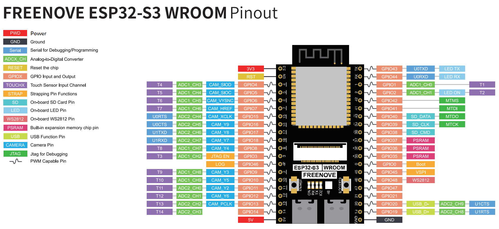

# 藪蚊捕獲器 ドヌーブ２

2026/07/04

Shigeichiro Yamasaki

## 藪蚊の誘引方法

### 誘引方法

1. 靴下（哺乳類の皮膚の匂いを簡単につくることができる）
2. CO2（炭酸水素ナトリウム＋クエン酸）
   1. ４秒 ~ 6秒間隔でCO2ノードを変化させる（動物の呼吸を模倣）
   2. ファンでCO２と匂いを拡散させる 
3. 体温（36°C）
4. 色彩（黒，青，赤と明暗コントラスト）
5. 皮膚模造パッド（色が重要）

## 蚊の検出方法

* 天敵であるトンボの複眼から着想を得る
* 藪蚊の視覚では，赤外線は見えないので赤外線を利用する
* 多数の赤外線受光センサーにより，蚊の影を検出する
* 両眼の視差を利用して誤検知を減らす
* 影のパタンの急激な変化で動体を検知する

### 技術的課題

* 蚊の影は非常に小さい
* 上下左右にランダムで高速に移動する
* 環境光が昼夜や天候などで変化する影響を考慮する
* 穴あけなどの工作精度は 1cm 程度

### 検出方法 （複眼方式）

```
    /     ◯
   /      ●
  /   x   ●
◯         ◯
  \       ◯
   \      ◯
    \     ◯

```

* 発光側：940nm赤外線LEDを発光させる
* 受光側：6個×3段＝18個の赤外線フォトトランジスタで，受光値の変化を調べ，変化したことで蚊の存在を知る

#### ２灯方式

発光側を２灯の赤外線LEDを時差で発光させることで，トンボの両眼による視覚を再現する

* 左IR LED  → 18個フォトトランジスタ
* 右IR LED  → 18個フォトトランジスタ

これで

* 左から見た影
* 右から見た影

の２枚の像を作成する

```
左IR LED                 右IR LED
   ●                         ●
    \                       /
     \                     /
      \                   /
       \                 /
        フォトトランジスタ18個
```

１フレームはつぎの３パターンにして差分を計算可能にする

背景光の明るさを知るために，両方のLEDを消灯する時間もつくる

* 全LED OFF → 背景光
* 左LED ON → 左影画像
* 右LED ON → 右影画像

差分によって影のない状態の明るさを知る

* leftSignal  = OFF - LeftON
* rightSignal = OFF - RightON

#### フォトトランジスタの配置

* 18個を３列で配置する
* 工作精度は 1cm 間隔だが，列を 5mm ずらすことで隙間を減らすことができる

```
p0  p1  p2  p3  p4  p5
  p6  p7  p8  p9  p10 p11
p12 p13 p14 p15 p16 p17
```

#### 蚊の影によるコントラクトの検出

蚊は小さいので蚊の影が影響するフォトレジスタは１個だけであると想定できる

隣接するフォトレジスタが受け取っている明るさとの対比で影の存在を知ることができる

#### ２個の赤外線LEDの視差を利用する

* 空中の物体であることの判定
  * 蚊がセンサー面から少し浮いていると、左右で影の位置がずれる
* 反射との識別
  * 視差によるずれば多き過ぎない
* 視差のある物体の移動
  *  飛翔体であることがわかる


#### 隣接パターンを事前に作成する

各フォトレジスタに対して，事前に隣接するノードで

## 蚊検出アルゴリズム

全体構成

```
赤外線LED（左）
      ↓
18個フォトトランジスタ
      ↑
赤外線LED（右）
```

1. 左LEDを点灯して18画素取得
2. 右LEDを点灯して18画素取得
3. 左右画像を統合
4. 前フレームとの差分を計算
5. 小さな移動物体を抽出
6. 数フレーム追跡
7. 蚊らしければ掃除機を起動
   
### 背景学習 

キャリブレーション：最初に蚊がいない状態を数秒間観測

* 各フォトトランジスタの個体差を調査し，初期パラメータを設定する

### 左右照明による画像取得

```
LED OFF
↓

左LED ON

↓

右LED ON
```

### 影画像生成

背景との差を計算

```
背景 2000

左LED 1700

↓

影 = 300
```

### 左右画像統合

```
左画像

右画像
```

### 局所コントラスト

画像処理のラプラシアン処理

```
影中心 - 周辺平均
```

### 動体研修

フレームの比較

```
現在 - １フレーム前
```

### 小さい物体だけ残す

少数の画素が変化したという情報だけを残す

### 重心計算

物体の移動の判断を行う

### トンボの STMD(小型移動物体検出) 処理

数フレーム追跡して，動体であることを確認する

### 時間条件

蚊の通過は 数ms ~ 数百ms

動きがあるなら蚊と判断する


## 機器

### Freenove ESP32-S3 Board Lite / カメラなしESP32-S3開発ボード

[Freenove_ESP32_S3_WROOM_Board](https://github.com/Freenove/Freenove_ESP32_S3_WROOM_Board/tree/main)




####  Arduino IDE 設定

* 設定 → ESP32ボードマネージャの追加

```
https://raw.githubusercontent.com/espressif/arduino-esp32/gh-pages/package_esp32_index.json
```

*  ESP32ボードをインストール
*  ボードの選択
  
  ```
  ESP32S3 Dev Module
  ```

* ツール設定

```
Board
ESP32S3 Dev Module

USB CDC On Boot
Enabled

CPU Frequency
240MHz (WiFi)

USB DFU On Boot
Disabled

Upload Mode
UART0 / Hardware CDC

Flash Mode
QIO 80MHz

Flash Size
16MB

PSRAM
OPI PSRAM

Partition Scheme
16M Flash (3MB APP / 9.9MB FATFS)
※または Default 16MB

Arduino Runs On
Core1

Events Run On
Core1

Upload Speed
921600
```

### 赤外線フォトトランジスタ

L-51ROPT1D1

* 940nm感度ピーク
* 5mm砲弾型
* 応答時間 約15µs
* スルーホール
* NPNフォトトランジスタ
* 応答時間15µs程度
* 半値角20°

### 赤外線LED

940nm  2個

## 構成（テスト）  

### 回路図

```
                   ESP32-S3 Sense

                  +3.3V
                    │
                  100kΩ
                    │
                    ├──────── GPIO1 (ADC)
                    │
              Collector
           フォトトランジスタ
              Emitter
                    │
                   GND


          +5V
           │
         220Ω
           │
      940nm IR LED
           │
          GND
```

* ESP32 との接続


|部品|ESP32|
| :--:|:--:|
|ADC入力|GPIO1|
|GND|GND|
|3.3V|3.3V|

#### テストプログラム

```C++
/*
  IR LED + Phototransistor Test
  ESP32-S3 Sense
*/

const int ADC_PIN = 1;

void setup()
{
    Serial.begin(115200);

    analogReadResolution(12);      // 0～4095
}

void loop()
{
    int adc = analogRead(ADC_PIN);

    Serial.println(adc);

    delay(10);     // 約100Hz
}
```


### テスト結果

フォトトランジスタのコレクタ側抵抗は，10KΩの場合は感度が低すぎたが，100KΩにすると十分な感度になった．ただし抵抗が大きくなると反応速度は遅くなる．


## 配線図

* Freenove ESP32-S3 Board Lite / カメラなしESP32-S3開発ボード
* フォトトランジスタ18個
* 赤外線LED2個
* サーボモータ１個
* アナログマルチプレクサ CD74HC4067 ２個でGPIO を拡張


### 回路図

```
ESP32-S3 Board Lite

GPIO1  ← MUX1 SIG
GPIO2  ← MUX2 SIG

GPIO6  → MUX1/MUX2 S0
GPIO7  → MUX1/MUX2 S1
GPIO8  → MUX1/MUX2 S2
GPIO9  → MUX1/MUX2 S3

GPIO10 → 左IR LED制御
GPIO11 → 右IR LED制御

GPIO16 → サーボ信号
```


#### CD74HC4067 ×2

```
MUX1:
VCC → 3.3V
GND → GND
EN  → GND
SIG → GPIO1
S0  → GPIO6
S1  → GPIO7
S2  → GPIO8
S3  → GPIO9

MUX2:
VCC → 3.3V
GND → GND
EN  → GND
SIG → GPIO2
S0  → GPIO6
S1  → GPIO7
S2  → GPIO8
S3  → GPIO9
```

#### フォトトランジスタ18個

```
3.3V
 |
100kΩ
 |
 +---- MUX Cn
 |
Collector
Phototransistor
Emitter
 |
GND
```

```
MUX1 C0〜C15 → PT1〜PT16
MUX2 C0〜C1  → PT17〜PT18
```

#### 赤外線LED 2個

```
+5V ── 330Ω ── IR LED アノード
IR LED カソード ── 2N2222 Collector
2N2222 Emitter ── GND
ESP32 GPIO ── 1kΩ ── 2N2222 Base
```

```
GPIO10 → 左IR LED
GPIO11 → 右IR LED
```


#### サーボ

```
Servo 赤    → +5V
Servo 黒/茶 → GND
Servo 信号  → GPIO16
```

#### 掃除機

吸引力は ACモーターのものが圧倒的に有利だが，コンパクト性を考えてDCモーターのものを利用する

モータは改造せずに，スイッチをサーボで操作する

* タクトスイッチ１回 → 弱吸引
* タクトスイッチ２回 → 強吸引
* タクトスイッチ３回 → 停止

## プログラム

### テストプログラム

CD74HC4067×2、フォトトランジスタ18個、IR LED2個、サーボ1個の配線確認用テストプログラムです。

シリアルモニタから 1〜6 を送って個別テストできます。

```c++
#include <Arduino.h>
#include <ESP32Servo.h>

// =====================
// Pin settings
// =====================
const int MUX1_SIG_PIN = 1;
const int MUX2_SIG_PIN = 2;

const int MUX_S0_PIN = 6;
const int MUX_S1_PIN = 7;
const int MUX_S2_PIN = 8;
const int MUX_S3_PIN = 9;

const int IR_LEFT_PIN  = 10;
const int IR_RIGHT_PIN = 11;

const int SERVO_PIN = 16;

// =====================
// Servo
// =====================
Servo vacuumServo;

const int SERVO_REST_ANGLE  = 20;
const int SERVO_PRESS_ANGLE = 65;

const int ADC_SAMPLES = 4;

// =====================
// MUX / ADC
// =====================
void setMuxChannel(int ch) {
  digitalWrite(MUX_S0_PIN, ch & 0x01);
  digitalWrite(MUX_S1_PIN, ch & 0x02);
  digitalWrite(MUX_S2_PIN, ch & 0x04);
  digitalWrite(MUX_S3_PIN, ch & 0x08);
  delayMicroseconds(10);
}

int readAdcAverage(int pin) {
  long sum = 0;

  for (int i = 0; i < ADC_SAMPLES; i++) {
    sum += analogRead(pin);
    delayMicroseconds(20);
  }

  return sum / ADC_SAMPLES;
}

int readPixelRaw(int pixel) {
  if (pixel < 16) {
    setMuxChannel(pixel);
    return readAdcAverage(MUX1_SIG_PIN);
  } else {
    setMuxChannel(pixel - 16);
    return readAdcAverage(MUX2_SIG_PIN);
  }
}

// =====================
// IR LED
// =====================
void allIrOff() {
  digitalWrite(IR_LEFT_PIN, LOW);
  digitalWrite(IR_RIGHT_PIN, LOW);
}

void leftIrOn() {
  allIrOff();
  digitalWrite(IR_LEFT_PIN, HIGH);
}

void rightIrOn() {
  allIrOff();
  digitalWrite(IR_RIGHT_PIN, HIGH);
}

// =====================
// Test 1: LED blink
// =====================
void testLedBlink() {
  Serial.println("TEST 1: IR LED blink");

  leftIrOn();
  Serial.println("LEFT IR ON");
  delay(1000);

  rightIrOn();
  Serial.println("RIGHT IR ON");
  delay(1000);

  allIrOff();
  Serial.println("IR OFF");
  delay(1000);
}

// =====================
// Test 2: raw ADC all pixels
// =====================
void testRawAdc() {
  Serial.println("TEST 2: Raw ADC PT1-PT18");

  allIrOff();

  for (int i = 0; i < 18; i++) {
    int v = readPixelRaw(i);

    Serial.print("PT");
    Serial.print(i + 1);
    Serial.print("=");
    Serial.print(v);
    Serial.print(" ");
  }

  Serial.println();
}

// =====================
// Test 3: left/right signal
// signal = background - LED_ON
// =====================
void testLedDifference() {
  int bg[18];
  int left[18];
  int right[18];

  allIrOff();
  delayMicroseconds(300);

  for (int i = 0; i < 18; i++) {
    bg[i] = readPixelRaw(i);
  }

  leftIrOn();
  delayMicroseconds(300);

  for (int i = 0; i < 18; i++) {
    left[i] = readPixelRaw(i);
  }

  rightIrOn();
  delayMicroseconds(300);

  for (int i = 0; i < 18; i++) {
    right[i] = readPixelRaw(i);
  }

  allIrOff();

  Serial.println("TEST 3: signal = background - LED_ON");

  Serial.print("LEFT : ");
  for (int i = 0; i < 18; i++) {
    int sig = bg[i] - left[i];
    if (sig < 0) sig = 0;

    Serial.print(sig);
    Serial.print(" ");
  }
  Serial.println();

  Serial.print("RIGHT: ");
  for (int i = 0; i < 18; i++) {
    int sig = bg[i] - right[i];
    if (sig < 0) sig = 0;

    Serial.print(sig);
    Serial.print(" ");
  }
  Serial.println();
}

// =====================
// Test 4: simple shadow detection
// =====================
void testShadowDetectionLoop() {
  static bool calibrated = false;
  static int baseLeft[18];
  static int baseRight[18];

  int bg[18];
  int left[18];
  int right[18];

  allIrOff();
  delayMicroseconds(300);
  for (int i = 0; i < 18; i++) bg[i] = readPixelRaw(i);

  leftIrOn();
  delayMicroseconds(300);
  for (int i = 0; i < 18; i++) left[i] = readPixelRaw(i);

  rightIrOn();
  delayMicroseconds(300);
  for (int i = 0; i < 18; i++) right[i] = readPixelRaw(i);

  allIrOff();

  int sigLeft[18];
  int sigRight[18];

  for (int i = 0; i < 18; i++) {
    sigLeft[i] = bg[i] - left[i];
    sigRight[i] = bg[i] - right[i];

    if (sigLeft[i] < 0) sigLeft[i] = 0;
    if (sigRight[i] < 0) sigRight[i] = 0;
  }

  if (!calibrated) {
    Serial.println("Calibrating simple baseline...");
    for (int i = 0; i < 18; i++) {
      baseLeft[i] = sigLeft[i];
      baseRight[i] = sigRight[i];

      if (baseLeft[i] < 1) baseLeft[i] = 1;
      if (baseRight[i] < 1) baseRight[i] = 1;
    }

    calibrated = true;
    delay(1000);
    return;
  }

  bool shadow = false;

  Serial.print("ratio: ");

  for (int i = 0; i < 18; i++) {
    float rL = (float)sigLeft[i] / baseLeft[i];
    float rR = (float)sigRight[i] / baseRight[i];

    float r = min(rL, rR);

    Serial.print(r, 2);
    Serial.print(" ");

    if (r < 0.75) {
      shadow = true;
    }
  }

  Serial.print(" shadow=");
  Serial.println(shadow ? "YES" : "NO");

  delay(100);
}

// =====================
// Test 5: servo single press
// =====================
void testServoSinglePress() {
  Serial.println("TEST 5: servo single press");

  vacuumServo.write(SERVO_PRESS_ANGLE);
  delay(250);

  vacuumServo.write(SERVO_REST_ANGLE);
  delay(500);
}

// =====================
// Test 6: vacuum full sequence
// press-release, press-release, wait 3 sec, press-release
// =====================
void pressSwitchOnce() {
  vacuumServo.write(SERVO_PRESS_ANGLE);
  delay(250);

  vacuumServo.write(SERVO_REST_ANGLE);
  delay(300);
}

void testVacuumSequence() {
  Serial.println("TEST 6: vacuum strong sequence");

  Serial.println("Press 1");
  pressSwitchOnce();

  Serial.println("Press 2 -> strong");
  pressSwitchOnce();

  Serial.println("Strong suction 3 sec");
  delay(3000);

  Serial.println("Press 3 -> stop");
  pressSwitchOnce();

  Serial.println("Done");
}

// =====================
// Setup / loop
// =====================
void setup() {
  Serial.begin(115200);
  delay(1500);

  analogReadResolution(12);

  pinMode(MUX_S0_PIN, OUTPUT);
  pinMode(MUX_S1_PIN, OUTPUT);
  pinMode(MUX_S2_PIN, OUTPUT);
  pinMode(MUX_S3_PIN, OUTPUT);

  pinMode(IR_LEFT_PIN, OUTPUT);
  pinMode(IR_RIGHT_PIN, OUTPUT);
  allIrOff();

  vacuumServo.setPeriodHertz(50);
  vacuumServo.attach(SERVO_PIN, 500, 2400);
  vacuumServo.write(SERVO_REST_ANGLE);

  Serial.println("=== Mosquito Trap Hardware Test ===");
  Serial.println("Send command:");
  Serial.println("1 = IR LED blink");
  Serial.println("2 = Raw ADC PT1-PT18");
  Serial.println("3 = Left/Right IR difference");
  Serial.println("4 = Simple shadow detection loop");
  Serial.println("5 = Servo single press");
  Serial.println("6 = Vacuum full sequence");
}

void loop() {
  if (!Serial.available()) return;

  char c = Serial.read();

  if (c == '1') {
    testLedBlink();
  } else if (c == '2') {
    testRawAdc();
  } else if (c == '3') {
    testLedDifference();
  } else if (c == '4') {
    Serial.println("Running shadow detection loop. Reset board to stop/recalibrate.");
    while (true) {
      testShadowDetectionLoop();
    }
  } else if (c == '5') {
    testServoSinglePress();
  } else if (c == '6') {
    testVacuumSequence();
  }
}
```

### テストプログラムの仕様

#### MUX / ADC 関連

* setMuxChannel(int ch)
  
CD74HC4067 の読み取りチャンネルを ch に切り替える。S0〜S3 にビット値を出力して、MUXの入力C0〜C15を選択する。

* readAdcAverage(int pin)

指定したADCピンを複数回読み取り、平均値を返す。ADCノイズを少し減らすための関数。

* readPixelRaw(int pixel)

PT1〜PT18のうち、指定したピクセル番号の生ADC値を読む。PT1〜PT16はMUX1経由、PT17〜PT18はMUX2経由で読む。

#### IR LED 関連

* allIrOff()

左右の赤外線LEDを両方OFFにする。

* leftIrOn()

右LEDをOFFにし、左LEDだけをONにする。

* rightIrOn()

左LEDをOFFにし、右LEDだけをONにする。

#### テスト関数

* testLedBlink()

左IR LEDを1秒点灯、次に右IR LEDを1秒点灯、最後に両方OFFにする。LED配線と2N2222駆動回路の確認用。

* testRawAdc()

IR LEDを消灯した状態で、PT1〜PT18のADC値を読み取り、シリアルに表示する。MUX接続、フォトトランジスタ、100kΩ抵抗、ADC入力の確認用。

* testLedDifference()

背景光、左LED点灯時、右LED点灯時のADC値を読み、background - LED_ON を計算して表示する。左右LEDの照明が各フォトトランジスタに届いているか確認する。

* testShadowDetectionLoop()

初回に現在の左右LED信号を基準値として記録し、その後は現在値と基準値の比率を表示する。比率が0.75未満のピクセルがあれば shadow=YES と表示する。黒い紙や糸で遮ったときの影検出確認用。

* testServoSinglePress()

サーボを押下角度へ動かし、250ms後に待機角度へ戻す。掃除機のタクトスイッチを1回押せるか確認する。

* pressSwitchOnce()

サーボで「押す→戻す」を1回実行する内部関数。掃除機スイッチ操作の基本単位。

* testVacuumSequence()

掃除機スイッチを1回押して弱風ON、2回目で強風、3秒待機、3回目で停止、という想定の一連操作を実行する。実際の吸引シーケンス確認用。

#### 初期化・メイン処理

* setup()

シリアル通信、ADC解像度、MUX制御ピン、IR LED制御ピン、サーボを初期化し、シリアルモニタに操作メニューを表示する。

* loop()

シリアル入力を待ち、入力された番号に応じて各テストを実行する。
1 はLED、2 はADC、3 はLED差分、4 は影検出、5 はサーボ単押し、6 は掃除機シーケンスを実行する。

### 実行プログラム

```
18フォトトランジスタ読取
左右IR LED差分
小さく動く影の認識
蚊検出ログをWeb表示
検出時にサーボで掃除機スイッチを3回押す
```

```c++
#include <Arduino.h>
#include <WiFi.h>
#include <WebServer.h>
#include <ESP32Servo.h>

// =====================
// Wi-Fi
// =====================
const char* WIFI_SSID = "YOUR_SSID";
const char* WIFI_PASS = "YOUR_PASSWORD";

WebServer server(80);

// =====================
// Pins
// =====================
const int MUX1_SIG_PIN = 1;
const int MUX2_SIG_PIN = 2;

const int MUX_S0_PIN = 6;
const int MUX_S1_PIN = 7;
const int MUX_S2_PIN = 8;
const int MUX_S3_PIN = 9;

const int IR_LEFT_PIN  = 10;
const int IR_RIGHT_PIN = 11;

const int SERVO_PIN = 16;

// =====================
// Sensor constants
// =====================
const int NUM_PIXELS = 18;
const int NUM_LEDS = 2;

const int LED_LEFT = 0;
const int LED_RIGHT = 1;

const int ADC_SAMPLES = 3;
const int LED_SETTLE_US = 250;
const int OFF_SETTLE_US = 150;

const float SHADOW_THRESHOLD = 0.15;
const float LOCAL_CONTRAST_THRESHOLD = 0.08;
const float MIN_TOTAL_SHADOW = 0.25;
const int MIN_ACTIVE_PIXELS = 1;
const int MAX_ACTIVE_PIXELS = 8;
const int REQUIRED_CANDIDATE_FRAMES = 2;
const float BASELINE_ALPHA = 0.002;

// =====================
// Pixel coordinates: staggered 6 x 3
// =====================
float px[NUM_PIXELS] = {
  0, 10, 20, 30, 40, 50,
  5, 15, 25, 35, 45, 55,
  0, 10, 20, 30, 40, 50
};

float py[NUM_PIXELS] = {
  0, 0, 0, 0, 0, 0,
  10, 10, 10, 10, 10, 10,
  20, 20, 20, 20, 20, 20
};

// =====================
// Buffers
// =====================
float signalNow[NUM_LEDS][NUM_PIXELS];
float baseline[NUM_LEDS][NUM_PIXELS];
float shadowImg[NUM_LEDS][NUM_PIXELS];
float mergedShadow[NUM_PIXELS];
float prevMergedShadow[NUM_PIXELS];

// =====================
// Detection log
// =====================
struct DetectionLog {
  unsigned long timeMs;
  int activeCount;
  float totalShadow;
  float motion;
  float localContrast;
  float cx;
  float cy;
};

const int LOG_SIZE = 50;
DetectionLog logs[LOG_SIZE];
int logIndex = 0;
int logCount = 0;

void addLog(int active, float total, float motion, float local, float cx, float cy) {
  logs[logIndex] = { millis(), active, total, motion, local, cx, cy };
  logIndex = (logIndex + 1) % LOG_SIZE;
  if (logCount < LOG_SIZE) logCount++;
}

// =====================
// Servo state machine
// =====================
Servo vacuumServo;

const int SERVO_REST_ANGLE  = 20;
const int SERVO_PRESS_ANGLE = 65;

const unsigned long PRESS_MS = 250;
const unsigned long RELEASE_MS = 300;
const unsigned long STRONG_WIND_MS = 3000;
const unsigned long RETRIGGER_BLOCK_MS = 8000;

enum VacuumSeqState {
  VAC_IDLE,
  VAC_PRESS1,
  VAC_RELEASE1,
  VAC_PRESS2,
  VAC_RELEASE2,
  VAC_SUCTION,
  VAC_PRESS3,
  VAC_RELEASE3
};

VacuumSeqState vacState = VAC_IDLE;
unsigned long vacStateStartedAt = 0;
unsigned long lastVacuumTriggerAt = 0;

void setupVacuumServo() {
  vacuumServo.setPeriodHertz(50);
  vacuumServo.attach(SERVO_PIN, 500, 2400);
  vacuumServo.write(SERVO_REST_ANGLE);
}

bool vacuumBusy() {
  return vacState != VAC_IDLE;
}

void startVacuumStrongSequence() {
  if (vacuumBusy()) return;

  unsigned long now = millis();
  if (now - lastVacuumTriggerAt < RETRIGGER_BLOCK_MS) return;

  lastVacuumTriggerAt = now;
  vacState = VAC_PRESS1;
  vacStateStartedAt = now;
  vacuumServo.write(SERVO_PRESS_ANGLE);
  Serial.println("VAC PRESS1");
}

void updateVacuumSequence() {
  unsigned long now = millis();

  switch (vacState) {
    case VAC_IDLE:
      break;

    case VAC_PRESS1:
      if (now - vacStateStartedAt >= PRESS_MS) {
        vacuumServo.write(SERVO_REST_ANGLE);
        vacState = VAC_RELEASE1;
        vacStateStartedAt = now;
        Serial.println("VAC RELEASE1");
      }
      break;

    case VAC_RELEASE1:
      if (now - vacStateStartedAt >= RELEASE_MS) {
        vacuumServo.write(SERVO_PRESS_ANGLE);
        vacState = VAC_PRESS2;
        vacStateStartedAt = now;
        Serial.println("VAC PRESS2 -> STRONG");
      }
      break;

    case VAC_PRESS2:
      if (now - vacStateStartedAt >= PRESS_MS) {
        vacuumServo.write(SERVO_REST_ANGLE);
        vacState = VAC_RELEASE2;
        vacStateStartedAt = now;
        Serial.println("VAC RELEASE2");
      }
      break;

    case VAC_RELEASE2:
      if (now - vacStateStartedAt >= RELEASE_MS) {
        vacState = VAC_SUCTION;
        vacStateStartedAt = now;
        Serial.println("VAC STRONG SUCTION");
      }
      break;

    case VAC_SUCTION:
      if (now - vacStateStartedAt >= STRONG_WIND_MS) {
        vacuumServo.write(SERVO_PRESS_ANGLE);
        vacState = VAC_PRESS3;
        vacStateStartedAt = now;
        Serial.println("VAC PRESS3 -> STOP");
      }
      break;

    case VAC_PRESS3:
      if (now - vacStateStartedAt >= PRESS_MS) {
        vacuumServo.write(SERVO_REST_ANGLE);
        vacState = VAC_RELEASE3;
        vacStateStartedAt = now;
        Serial.println("VAC RELEASE3");
      }
      break;

    case VAC_RELEASE3:
      if (now - vacStateStartedAt >= RELEASE_MS) {
        vacState = VAC_IDLE;
        Serial.println("VAC DONE");
      }
      break;
  }
}

// =====================
// MUX / ADC
// =====================
void setMuxChannel(int ch) {
  digitalWrite(MUX_S0_PIN, ch & 0x01);
  digitalWrite(MUX_S1_PIN, ch & 0x02);
  digitalWrite(MUX_S2_PIN, ch & 0x04);
  digitalWrite(MUX_S3_PIN, ch & 0x08);
  delayMicroseconds(8);
}

int readAdcAverage(int pin) {
  long sum = 0;
  for (int i = 0; i < ADC_SAMPLES; i++) {
    sum += analogRead(pin);
    delayMicroseconds(15);
  }
  return sum / ADC_SAMPLES;
}

int readPixelRaw(int pixel) {
  if (pixel < 16) {
    setMuxChannel(pixel);
    return readAdcAverage(MUX1_SIG_PIN);
  } else {
    setMuxChannel(pixel - 16);
    return readAdcAverage(MUX2_SIG_PIN);
  }
}

// =====================
// IR LED control
// =====================
void allIrOff() {
  digitalWrite(IR_LEFT_PIN, LOW);
  digitalWrite(IR_RIGHT_PIN, LOW);
}

void setIrLed(int led) {
  allIrOff();
  if (led == LED_LEFT) digitalWrite(IR_LEFT_PIN, HIGH);
  if (led == LED_RIGHT) digitalWrite(IR_RIGHT_PIN, HIGH);
}

// =====================
// Optical scan
// =====================
void scanOpticalFrame() {
  int background[NUM_PIXELS];

  allIrOff();
  delayMicroseconds(OFF_SETTLE_US);

  for (int p = 0; p < NUM_PIXELS; p++) {
    background[p] = readPixelRaw(p);
  }

  for (int l = 0; l < NUM_LEDS; l++) {
    setIrLed(l);
    delayMicroseconds(LED_SETTLE_US);

    for (int p = 0; p < NUM_PIXELS; p++) {
      int onValue = readPixelRaw(p);
      float sig = background[p] - onValue;
      if (sig < 0) sig = 0;
      signalNow[l][p] = sig;
    }

    allIrOff();
  }
}

void calibrateBaseline() {
  Serial.println("Calibrating baseline...");

  for (int l = 0; l < NUM_LEDS; l++) {
    for (int p = 0; p < NUM_PIXELS; p++) {
      baseline[l][p] = 0;
    }
  }

  const int rounds = 80;

  for (int r = 0; r < rounds; r++) {
    scanOpticalFrame();

    for (int l = 0; l < NUM_LEDS; l++) {
      for (int p = 0; p < NUM_PIXELS; p++) {
        baseline[l][p] += signalNow[l][p];
      }
    }

    delay(15);
  }

  for (int l = 0; l < NUM_LEDS; l++) {
    for (int p = 0; p < NUM_PIXELS; p++) {
      baseline[l][p] /= rounds;
      if (baseline[l][p] < 1) baseline[l][p] = 1;
    }
  }

  Serial.println("Baseline ready");
}

// =====================
// Image processing
// =====================
float d2(float x1, float y1, float x2, float y2) {
  float dx = x1 - x2;
  float dy = y1 - y2;
  return dx * dx + dy * dy;
}

void makeShadowImage() {
  for (int p = 0; p < NUM_PIXELS; p++) {
    float maxS = 0;

    for (int l = 0; l < NUM_LEDS; l++) {
      float s = 1.0 - signalNow[l][p] / baseline[l][p];
      if (s < 0) s = 0;
      if (s > 1) s = 1;

      shadowImg[l][p] = s;
      if (s > maxS) maxS = s;
    }

    mergedShadow[p] = maxS;
  }
}

float localContrastAt(int i) {
  float sum = 0;
  int count = 0;

  for (int j = 0; j < NUM_PIXELS; j++) {
    if (i == j) continue;
    if (d2(px[i], py[i], px[j], py[j]) <= 125.0) {
      sum += mergedShadow[j];
      count++;
    }
  }

  if (count == 0) return 0;
  return mergedShadow[i] - sum / count;
}

void updateBaselineIfSafe(bool objectDetected) {
  if (objectDetected) return;

  for (int l = 0; l < NUM_LEDS; l++) {
    for (int p = 0; p < NUM_PIXELS; p++) {
      baseline[l][p] =
        baseline[l][p] * (1.0 - BASELINE_ALPHA) +
        signalNow[l][p] * BASELINE_ALPHA;

      if (baseline[l][p] < 1) baseline[l][p] = 1;
    }
  }
}

struct DetectionResult {
  bool candidate;
  int activeCount;
  float totalShadow;
  float cx;
  float cy;
  float motion;
  float maxLocalContrast;
};

DetectionResult analyzeShadow() {
  DetectionResult r = { false, 0, 0, 0, 0, 0, 0 };

  float wx = 0;
  float wy = 0;

  for (int i = 0; i < NUM_PIXELS; i++) {
    float s = mergedShadow[i];
    float lc = localContrastAt(i);
    float m = fabs(s - prevMergedShadow[i]);

    r.motion += m;
    if (lc > r.maxLocalContrast) r.maxLocalContrast = lc;

    if (s > SHADOW_THRESHOLD || lc > LOCAL_CONTRAST_THRESHOLD) {
      r.activeCount++;
      r.totalShadow += s;
      wx += px[i] * s;
      wy += py[i] * s;
    }
  }

  if (r.totalShadow > 0.001) {
    r.cx = wx / r.totalShadow;
    r.cy = wy / r.totalShadow;
  }

  bool smallEnough =
    r.activeCount >= MIN_ACTIVE_PIXELS &&
    r.activeCount <= MAX_ACTIVE_PIXELS;

  bool strongEnough = r.totalShadow >= MIN_TOTAL_SHADOW;
  bool localEnough = r.maxLocalContrast >= LOCAL_CONTRAST_THRESHOLD;
  bool movingEnough = r.motion >= 0.08;

  r.candidate = smallEnough && strongEnough && localEnough && movingEnough;
  return r;
}

int candidateFrames = 0;

bool updateMosquitoDecision(DetectionResult r) {
  if (r.candidate) {
    candidateFrames++;
  } else {
    candidateFrames = 0;
  }

  if (candidateFrames >= REQUIRED_CANDIDATE_FRAMES) {
    candidateFrames = 0;
    return true;
  }

  return false;
}

void savePrevShadow() {
  for (int i = 0; i < NUM_PIXELS; i++) {
    prevMergedShadow[i] = mergedShadow[i];
  }
}

// =====================
// Web UI
// =====================
void handleRoot() {
  String html;
  html += "<html><head><meta charset='utf-8'>";
  html += "<meta http-equiv='refresh' content='3'>";
  html += "<title>Mosquito Trap Logs</title>";
  html += "<style>body{font-family:sans-serif;margin:24px;}table{border-collapse:collapse;}td,th{border:1px solid #ccc;padding:6px 10px;}</style>";
  html += "</head><body>";
  html += "<h2>Mosquito Trap Logs</h2>";
  html += "<p>Uptime: " + String(millis() / 1000) + " sec</p>";
  html += "<p>Vacuum: ";
  html += vacuumBusy() ? "BUSY" : "IDLE";
  html += "</p>";

  html += "<table><tr><th>#</th><th>time ms</th><th>active</th><th>total</th><th>motion</th><th>local</th><th>cx</th><th>cy</th></tr>";

  for (int i = 0; i < logCount; i++) {
    int idx = (logIndex - 1 - i + LOG_SIZE) % LOG_SIZE;
    html += "<tr>";
    html += "<td>" + String(i + 1) + "</td>";
    html += "<td>" + String(logs[idx].timeMs) + "</td>";
    html += "<td>" + String(logs[idx].activeCount) + "</td>";
    html += "<td>" + String(logs[idx].totalShadow, 3) + "</td>";
    html += "<td>" + String(logs[idx].motion, 3) + "</td>";
    html += "<td>" + String(logs[idx].localContrast, 3) + "</td>";
    html += "<td>" + String(logs[idx].cx, 1) + "</td>";
    html += "<td>" + String(logs[idx].cy, 1) + "</td>";
    html += "</tr>";
  }

  html += "</table>";
  html += "</body></html>";

  server.send(200, "text/html", html);
}

void handleJson() {
  String json = "{\"logs\":[";
  for (int i = 0; i < logCount; i++) {
    int idx = (logIndex - 1 - i + LOG_SIZE) % LOG_SIZE;
    if (i > 0) json += ",";
    json += "{";
    json += "\"timeMs\":" + String(logs[idx].timeMs) + ",";
    json += "\"active\":" + String(logs[idx].activeCount) + ",";
    json += "\"total\":" + String(logs[idx].totalShadow, 3) + ",";
    json += "\"motion\":" + String(logs[idx].motion, 3) + ",";
    json += "\"local\":" + String(logs[idx].localContrast, 3) + ",";
    json += "\"cx\":" + String(logs[idx].cx, 1) + ",";
    json += "\"cy\":" + String(logs[idx].cy, 1);
    json += "}";
  }
  json += "]}";
  server.send(200, "application/json", json);
}

void setupWiFiAndWeb() {
  WiFi.begin(WIFI_SSID, WIFI_PASS);
  Serial.print("Connecting WiFi");

  while (WiFi.status() != WL_CONNECTED) {
    delay(300);
    Serial.print(".");
  }

  Serial.println();
  Serial.print("Open: http://");
  Serial.println(WiFi.localIP());

  server.on("/", handleRoot);
  server.on("/json", handleJson);
  server.begin();
}

// =====================
// Setup / Loop
// =====================
void setup() {
  Serial.begin(115200);
  delay(1500);

  analogReadResolution(12);

  pinMode(MUX_S0_PIN, OUTPUT);
  pinMode(MUX_S1_PIN, OUTPUT);
  pinMode(MUX_S2_PIN, OUTPUT);
  pinMode(MUX_S3_PIN, OUTPUT);

  pinMode(IR_LEFT_PIN, OUTPUT);
  pinMode(IR_RIGHT_PIN, OUTPUT);
  allIrOff();

  setupVacuumServo();
  setupWiFiAndWeb();

  for (int i = 0; i < NUM_PIXELS; i++) {
    prevMergedShadow[i] = 0;
  }

  calibrateBaseline();

  Serial.println("Mosquito trap ready");
}

void loop() {
  server.handleClient();
  updateVacuumSequence();

  scanOpticalFrame();
  makeShadowImage();

  DetectionResult r = analyzeShadow();
  bool detected = updateMosquitoDecision(r);

  if (detected) {
    Serial.println("MOSQUITO DETECTED");
    addLog(r.activeCount, r.totalShadow, r.motion, r.maxLocalContrast, r.cx, r.cy);
    startVacuumStrongSequence();
  }

  updateBaselineIfSafe(r.candidate);
  savePrevShadow();

  delay(5);
}

```

### ブラウザから確認

```
http://ESP32のIPアドレス/
```

で開くと、蚊認識ログが一覧で確認できる


